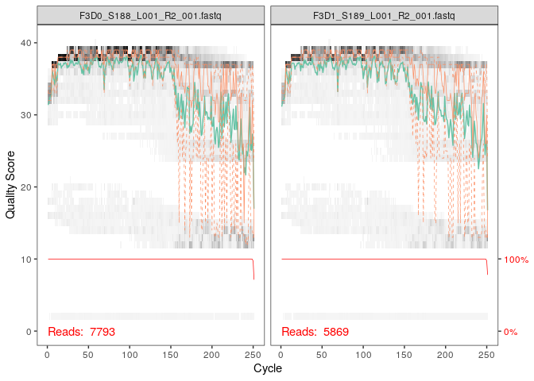

dada2-analysis
================

``` r
library(knitr)
library(markdown) 
```

\#chargement dada2package

``` r
library("dada2")
```

    ## Loading required package: Rcpp

``` r
library("ggplot2")
```

\#Définir la variable de chemin pour qu’elle pointe vers le répertoire
extrait sur du machine:

``` r
path <- "~/MiSeq_SOP" # CHANGE ME to the directory containing the fastq files after unzipping.
list.files(path)
```

    ##  [1] "F3D0_S188_L001_R1_001.fastq"   "F3D0_S188_L001_R2_001.fastq"  
    ##  [3] "F3D1_S189_L001_R1_001.fastq"   "F3D1_S189_L001_R2_001.fastq"  
    ##  [5] "F3D141_S207_L001_R1_001.fastq" "F3D141_S207_L001_R2_001.fastq"
    ##  [7] "F3D142_S208_L001_R1_001.fastq" "F3D142_S208_L001_R2_001.fastq"
    ##  [9] "F3D143_S209_L001_R1_001.fastq" "F3D143_S209_L001_R2_001.fastq"
    ## [11] "F3D144_S210_L001_R1_001.fastq" "F3D144_S210_L001_R2_001.fastq"
    ## [13] "F3D145_S211_L001_R1_001.fastq" "F3D145_S211_L001_R2_001.fastq"
    ## [15] "F3D146_S212_L001_R1_001.fastq" "F3D146_S212_L001_R2_001.fastq"
    ## [17] "F3D147_S213_L001_R1_001.fastq" "F3D147_S213_L001_R2_001.fastq"
    ## [19] "F3D148_S214_L001_R1_001.fastq" "F3D148_S214_L001_R2_001.fastq"
    ## [21] "F3D149_S215_L001_R1_001.fastq" "F3D149_S215_L001_R2_001.fastq"
    ## [23] "F3D150_S216_L001_R1_001.fastq" "F3D150_S216_L001_R2_001.fastq"
    ## [25] "F3D2_S190_L001_R1_001.fastq"   "F3D2_S190_L001_R2_001.fastq"  
    ## [27] "F3D3_S191_L001_R1_001.fastq"   "F3D3_S191_L001_R2_001.fastq"  
    ## [29] "F3D5_S193_L001_R1_001.fastq"   "F3D5_S193_L001_R2_001.fastq"  
    ## [31] "F3D6_S194_L001_R1_001.fastq"   "F3D6_S194_L001_R2_001.fastq"  
    ## [33] "F3D7_S195_L001_R1_001.fastq"   "F3D7_S195_L001_R2_001.fastq"  
    ## [35] "F3D8_S196_L001_R1_001.fastq"   "F3D8_S196_L001_R2_001.fastq"  
    ## [37] "F3D9_S197_L001_R1_001.fastq"   "F3D9_S197_L001_R2_001.fastq"  
    ## [39] "filtered"                      "HMP_MOCK.v35.fasta"           
    ## [41] "Mock_S280_L001_R1_001.fastq"   "Mock_S280_L001_R2_001.fastq"  
    ## [43] "mouse.dpw.metadata"            "mouse.time.design"            
    ## [45] "stability.batch"               "stability.files"

\#lire les noms des fichiers fastq et effectuer quelques manipulations
de chaînes pour obtenir des listes correspondantes des fichiers fastq
avant et arrière.

``` r
# Forward and reverse fastq filenames have format: SAMPLENAME_R1_001.fastq and SAMPLENAME_R2_001.fastq
fnFs <- sort(list.files(path, pattern="_R1_001.fastq", full.names = TRUE))
fnRs <- sort(list.files(path, pattern="_R2_001.fastq", full.names = TRUE))
# Extract sample names, assuming filenames have format: SAMPLENAME_XXX.fastq
sample.names <- sapply(strsplit(basename(fnFs), "_"), `[`, 1)
```

\#Visualiser les profils de qualité des lectures avant:

``` r
plotQualityProfile(fnFs[1:2])
```

<!-- -->

Dans l’image en niveaux de gris, il s’agit d’une carte thermique de la
fréquence de chaque score de qualité à chaque emplacement de base. La
ligne verte représente le score de qualité moyen pour chaque emplacement
et la ligne orange représente le quartile de la distribution du score de
qualité. La ligne rouge indique la proportion de lectures qui s’étendent
au moins à cette position (ceci est plus utile pour les autres
technologies de séquençage, car la longueur des lectures Illumina est
généralement la même, donc la ligne plate rouge). La lecture
prospective est de haute qualité. Nous recommandons généralement de
couper le dernier nucléotide pour éviter d’éventuelles erreurs mal
contrôlées. Ces profils de qualité ne recommandent pas de rognage
supplémentaire. On va tronquer le front lu à la position 240 (couper
les 10 derniers nucléotides)

\#visualiser le profil de qualité des lectures inversées

``` r
plotQualityProfile(fnRs[1:2])
```

<!-- -->

La qualité des lectures inversées est nettement moins bonne, en
particulier à la fin, ce qui est courant dans le séquençage Illumina. Ne
vous inquiétez pas trop, car DADA2 incorpore des informations de qualité
dans son modèle d’erreur, ce qui rend l’algorithme robuste aux séquences
de qualité inférieure, mais trancher lorsque la qualité moyenne
s’effondre augmentera la sensibilité de DADA2. Algorithmes avec des
mutations de séquence rares. Sur la base de ces profils, nous
tronquerons la lecture inverse à la position 160 où la distribution de
masse est suspendue.

\#Attribuez les noms de fichiers aux fichiers fastq.gz filtrés.

``` r
# Place filtered files in filtered/ subdirectory
filtFs <- file.path(path, "filtered", paste0(sample.names, "_F_filt.fastq.gz"))
filtRs <- file.path(path, "filtered", paste0(sample.names, "_R_filt.fastq.gz"))
names(filtFs) <- sample.names
names(filtRs) <- sample.names
```

les paramètres de filtrage standard: maxN=0(DADA2 ne nécessite aucun Ns)
truncQ=2, rm.phix=TRUEet maxEE=2. Le maxEEparamètre définit le nombre
maximum d ’«erreurs attendues» autorisées dans une lecture, ce qui est
un meilleur filtre que la simple moyenne des scores de qualité .

``` r
out <- filterAndTrim(fnFs, filtFs, fnRs, filtRs, truncLen=c(240,160),
              maxN=0, maxEE=c(2,2), truncQ=2, rm.phix=TRUE,
              compress=TRUE, multithread=TRUE) # On Windows set multithread=FALSE
head(out)
```

    ##                               reads.in reads.out
    ## F3D0_S188_L001_R1_001.fastq       7793      7113
    ## F3D1_S189_L001_R1_001.fastq       5869      5299
    ## F3D141_S207_L001_R1_001.fastq     5958      5463
    ## F3D142_S208_L001_R1_001.fastq     3183      2914
    ## F3D143_S209_L001_R1_001.fastq     3178      2941
    ## F3D144_S210_L001_R1_001.fastq     4827      4312

\#Apprentissage des erreurs dada2 calcul un model d’erreur à partir des
données, en alternant l’estimation des taux d’erreur et l’inférence de
la composition de l’échantillon jusqu’à ce qu’ils convergent vers une
solution cohérente conjointement.

``` r
errF <- learnErrors(filtFs, multithread=TRUE)
```

    ## 33514080 total bases in 139642 reads from 20 samples will be used for learning the error rates.

``` r
errR <- learnErrors(filtRs, multithread=TRUE)
```

    ## 22342720 total bases in 139642 reads from 20 samples will be used for learning the error rates.

\#Vérifier si rien d’autre, de visualiser les taux d’erreur estimés

``` r
plotErrors(errF, nominalQ=TRUE)
```

    ## Warning: Transformation introduced infinite values in continuous y-axis
    
    ## Warning: Transformation introduced infinite values in continuous y-axis

<!-- -->
Les points sont les taux d’erreur observés pour chaque score de qualité
consensuel. La ligne noire montre les taux d’erreur estimés après
convergence de l’algorithme d’apprentissage automatique. La ligne rouge
montre les taux d’erreur attendus selon la définition nominale du
Q-score. Ici, les taux d’erreur estimés (ligne noire) correspondent bien
aux taux observés (points), et les taux d’erreur diminuent avec une
qualité accrue comme prévu. Tout semble raisonnable et nous procédons en
toute confiance

\#Inférence d’échantillon

\#\#appliquer l’algorithme d’inférence de l’échantillon de base aux
données de séquence filtrées et découpées.

``` r
dadaFs <- dada(filtFs, err=errF, multithread=TRUE)
```

    ## Sample 1 - 7113 reads in 1979 unique sequences.
    ## Sample 2 - 5299 reads in 1639 unique sequences.
    ## Sample 3 - 5463 reads in 1477 unique sequences.
    ## Sample 4 - 2914 reads in 904 unique sequences.
    ## Sample 5 - 2941 reads in 939 unique sequences.
    ## Sample 6 - 4312 reads in 1267 unique sequences.
    ## Sample 7 - 6741 reads in 1756 unique sequences.
    ## Sample 8 - 4560 reads in 1438 unique sequences.
    ## Sample 9 - 15637 reads in 3590 unique sequences.
    ## Sample 10 - 11413 reads in 2762 unique sequences.
    ## Sample 11 - 12017 reads in 3021 unique sequences.
    ## Sample 12 - 5032 reads in 1566 unique sequences.
    ## Sample 13 - 18075 reads in 3707 unique sequences.
    ## Sample 14 - 6250 reads in 1479 unique sequences.
    ## Sample 15 - 4052 reads in 1195 unique sequences.
    ## Sample 16 - 7369 reads in 1832 unique sequences.
    ## Sample 17 - 4765 reads in 1183 unique sequences.
    ## Sample 18 - 4871 reads in 1382 unique sequences.
    ## Sample 19 - 6504 reads in 1709 unique sequences.
    ## Sample 20 - 4314 reads in 897 unique sequences.

``` r
dadaRs <- dada(filtRs, err=errR, multithread=TRUE)
```

    ## Sample 1 - 7113 reads in 1660 unique sequences.
    ## Sample 2 - 5299 reads in 1349 unique sequences.
    ## Sample 3 - 5463 reads in 1335 unique sequences.
    ## Sample 4 - 2914 reads in 853 unique sequences.
    ## Sample 5 - 2941 reads in 880 unique sequences.
    ## Sample 6 - 4312 reads in 1286 unique sequences.
    ## Sample 7 - 6741 reads in 1803 unique sequences.
    ## Sample 8 - 4560 reads in 1265 unique sequences.
    ## Sample 9 - 15637 reads in 3414 unique sequences.
    ## Sample 10 - 11413 reads in 2522 unique sequences.
    ## Sample 11 - 12017 reads in 2771 unique sequences.
    ## Sample 12 - 5032 reads in 1415 unique sequences.
    ## Sample 13 - 18075 reads in 3290 unique sequences.
    ## Sample 14 - 6250 reads in 1390 unique sequences.
    ## Sample 15 - 4052 reads in 1134 unique sequences.
    ## Sample 16 - 7369 reads in 1635 unique sequences.
    ## Sample 17 - 4765 reads in 1084 unique sequences.
    ## Sample 18 - 4871 reads in 1161 unique sequences.
    ## Sample 19 - 6504 reads in 1502 unique sequences.
    ## Sample 20 - 4314 reads in 732 unique sequences.

\#Inspecter de l’ dada-classobjet retourné

``` r
dadaFs[[1]]
```

    ## dada-class: object describing DADA2 denoising results
    ## 128 sequence variants were inferred from 1979 input unique sequences.
    ## Key parameters: OMEGA_A = 1e-40, OMEGA_C = 1e-40, BAND_SIZE = 16

algorithme DADA2 a déduit 128 vraies variantes de séquence à partir des
séquences uniques de 1979 dans le premier échantillon. L’
dada-classobjet de retour est bien plus que cela (voir
help(“dada-class”)pour quelques informations), y compris plusieurs
diagnostics sur la qualité de chaque variante de séquence débruitée,
mais cela dépasse la portée d’un didacticiel d’introduction.

\#Fusionner les lectures appariées \#Alligner les R1 et R2 en un conti

``` r
mergers <- mergePairs(dadaFs, filtFs, dadaRs, filtRs, verbose=TRUE)
```

    ## 6551 paired-reads (in 106 unique pairings) successfully merged out of 6907 (in 199 pairings) input.

    ## 5025 paired-reads (in 100 unique pairings) successfully merged out of 5188 (in 156 pairings) input.

    ## 4973 paired-reads (in 80 unique pairings) successfully merged out of 5268 (in 166 pairings) input.

    ## 2595 paired-reads (in 52 unique pairings) successfully merged out of 2756 (in 109 pairings) input.

    ## 2553 paired-reads (in 60 unique pairings) successfully merged out of 2785 (in 119 pairings) input.

    ## 3622 paired-reads (in 53 unique pairings) successfully merged out of 4103 (in 157 pairings) input.

    ## 6079 paired-reads (in 81 unique pairings) successfully merged out of 6515 (in 198 pairings) input.

    ## 3961 paired-reads (in 90 unique pairings) successfully merged out of 4384 (in 188 pairings) input.

    ## 14231 paired-reads (in 143 unique pairings) successfully merged out of 15358 (in 351 pairings) input.

    ## 10526 paired-reads (in 120 unique pairings) successfully merged out of 11166 (in 279 pairings) input.

    ## 11156 paired-reads (in 137 unique pairings) successfully merged out of 11799 (in 298 pairings) input.

    ## 4329 paired-reads (in 84 unique pairings) successfully merged out of 4788 (in 180 pairings) input.

    ## 17431 paired-reads (in 153 unique pairings) successfully merged out of 17812 (in 272 pairings) input.

    ## 5850 paired-reads (in 81 unique pairings) successfully merged out of 6095 (in 159 pairings) input.

    ## 3716 paired-reads (in 86 unique pairings) successfully merged out of 3894 (in 147 pairings) input.

    ## 6865 paired-reads (in 99 unique pairings) successfully merged out of 7193 (in 187 pairings) input.

    ## 4430 paired-reads (in 67 unique pairings) successfully merged out of 4605 (in 127 pairings) input.

    ## 4574 paired-reads (in 100 unique pairings) successfully merged out of 4736 (in 172 pairings) input.

    ## 6094 paired-reads (in 109 unique pairings) successfully merged out of 6314 (in 172 pairings) input.

    ## 4269 paired-reads (in 20 unique pairings) successfully merged out of 4281 (in 28 pairings) input.

``` r
# Inspect the merger data.frame from the first sample
head(mergers[[1]])
```

    ##                                                                                                                                                                                                                                                       sequence
    ## 1 TACGGAGGATGCGAGCGTTATCCGGATTTATTGGGTTTAAAGGGTGCGCAGGCGGAAGATCAAGTCAGCGGTAAAATTGAGAGGCTCAACCTCTTCGAGCCGTTGAAACTGGTTTTCTTGAGTGAGCGAGAAGTATGCGGAATGCGTGGTGTAGCGGTGAAATGCATAGATATCACGCAGAACTCCGATTGCGAAGGCAGCATACCGGCGCTCAACTGACGCTCATGCACGAAAGTGTGGGTATCGAACAGG
    ## 2 TACGGAGGATGCGAGCGTTATCCGGATTTATTGGGTTTAAAGGGTGCGTAGGCGGCCTGCCAAGTCAGCGGTAAAATTGCGGGGCTCAACCCCGTACAGCCGTTGAAACTGCCGGGCTCGAGTGGGCGAGAAGTATGCGGAATGCGTGGTGTAGCGGTGAAATGCATAGATATCACGCAGAACCCCGATTGCGAAGGCAGCATACCGGCGCCCTACTGACGCTGAGGCACGAAAGTGCGGGGATCAAACAGG
    ## 3 TACGGAGGATGCGAGCGTTATCCGGATTTATTGGGTTTAAAGGGTGCGTAGGCGGGCTGTTAAGTCAGCGGTCAAATGTCGGGGCTCAACCCCGGCCTGCCGTTGAAACTGGCGGCCTCGAGTGGGCGAGAAGTATGCGGAATGCGTGGTGTAGCGGTGAAATGCATAGATATCACGCAGAACTCCGATTGCGAAGGCAGCATACCGGCGCCCGACTGACGCTGAGGCACGAAAGCGTGGGTATCGAACAGG
    ## 4 TACGGAGGATGCGAGCGTTATCCGGATTTATTGGGTTTAAAGGGTGCGTAGGCGGGCTTTTAAGTCAGCGGTAAAAATTCGGGGCTCAACCCCGTCCGGCCGTTGAAACTGGGGGCCTTGAGTGGGCGAGAAGAAGGCGGAATGCGTGGTGTAGCGGTGAAATGCATAGATATCACGCAGAACCCCGATTGCGAAGGCAGCCTTCCGGCGCCCTACTGACGCTGAGGCACGAAAGTGCGGGGATCGAACAGG
    ## 5 TACGGAGGATGCGAGCGTTATCCGGATTTATTGGGTTTAAAGGGTGCGCAGGCGGACTCTCAAGTCAGCGGTCAAATCGCGGGGCTCAACCCCGTTCCGCCGTTGAAACTGGGAGCCTTGAGTGCGCGAGAAGTAGGCGGAATGCGTGGTGTAGCGGTGAAATGCATAGATATCACGCAGAACTCCGATTGCGAAGGCAGCCTACCGGCGCGCAACTGACGCTCATGCACGAAAGCGTGGGTATCGAACAGG
    ## 6 TACGGAGGATGCGAGCGTTATCCGGATTTATTGGGTTTAAAGGGTGCGTAGGCGGGATGCCAAGTCAGCGGTAAAAAAGCGGTGCTCAACGCCGTCGAGCCGTTGAAACTGGCGTTCTTGAGTGGGCGAGAAGTATGCGGAATGCGTGGTGTAGCGGTGAAATGCATAGATATCACGCAGAACTCCGATTGCGAAGGCAGCATACCGGCGCCCTACTGACGCTGAGGCACGAAAGCGTGGGTATCGAACAGG
    ##   abundance forward reverse nmatch nmismatch nindel prefer accept
    ## 1       579       1       1    148         0      0      1   TRUE
    ## 2       470       2       2    148         0      0      2   TRUE
    ## 3       449       3       4    148         0      0      1   TRUE
    ## 4       430       4       3    148         0      0      2   TRUE
    ## 5       345       5       6    148         0      0      1   TRUE
    ## 6       282       6       5    148         0      0      2   TRUE

L’ mergersobjet est une liste de data.frames de chaque échantillon.
Chacun data.framecontient le fusionné $sequence, son $abundanceet les
indices des variantes de séquence $forwardet $reversequi ont été
fusionnés. Les lectures appariées qui ne se chevauchaient pas
exactement ont été supprimées mergePairs, réduisant encore davantage la
sortie parasite.

\#construction de table d’observation(amplicon sequence variant table),
une version à plus haute résolution de la table OTU produite par des
méthodes traditionnelles.

``` r
seqtab <- makeSequenceTable(mergers)
dim(seqtab)
```

    ## [1]  20 293

``` r
# Inspect distribution of sequence lengths
table(nchar(getSequences(seqtab)))
```

    ## 
    ## 251 252 253 254 255 
    ##   1  88 196   6   2

La table de séquence est une matrixavec des lignes correspondant aux (et
nommées par) les échantillons, et des colonnes correspondant aux (et
nommées par) les variantes de séquence. Ce tableau contient 293 ASV, et
les longueurs de nos séquences fusionnées se situent toutes dans la
plage attendue pour cet amplicon V4.

\#Supprimer les chimères ou bien corrige les erreurs de substitution et
d’indel, mais les chimères restent. Heureusement, la précision des
variantes de séquence après le débruitage rend l’identification des ASV
chimériques plus simple que lorsqu’il s’agit d’OTU floues

``` r
seqtab.nochim <- removeBimeraDenovo(seqtab, method="consensus", multithread=TRUE, verbose=TRUE)
```

    ## Identified 61 bimeras out of 293 input sequences.

``` r
dim(seqtab.nochim)
```

    ## [1]  20 232

``` r
sum(seqtab.nochim)/sum(seqtab)
```

    ## [1] 0.964263

``` r
1-sum(seqtab.nochim)/sum(seqtab)
```

    ## [1] 0.03573702

3,5 % de chimeres dans (n’utiliser pas les primers attention), la
fréquence des séquences chimériques varie considérablement d’un
ensemble de données à l’autre et dépend de facteurs tels que les
procédures expérimentales et la complexité de l’échantillon. Ici, les
chimères représentent environ 21% des variantes de séquence fusionnées,
mais lorsque nous tenons compte de l’abondance de ces variantes, nous
voyons qu’elles ne représentent qu’environ 4% des lectures de séquence
fusionnée.

\#Suivre les lectures dans le pipeline : examiner le nombre de lectures
effectuées à chaque étape du pipeline:

\#resume des filtres qualite

``` r
getN <- function(x) sum(getUniques(x))
track <- cbind(out, sapply(dadaFs, getN), sapply(dadaRs, getN), sapply(mergers, getN), rowSums(seqtab.nochim))
# If processing a single sample, remove the sapply calls: e.g. replace sapply(dadaFs, getN) with getN(dadaFs)
colnames(track) <- c("input", "filtered", "denoisedF", "denoisedR", "merged", "nonchim")
rownames(track) <- sample.names
head(track)
```

    ##        input filtered denoisedF denoisedR merged nonchim
    ## F3D0    7793     7113      6996      6978   6551    6539
    ## F3D1    5869     5299      5227      5239   5025    5014
    ## F3D141  5958     5463      5339      5351   4973    4850
    ## F3D142  3183     2914      2799      2833   2595    2521
    ## F3D143  3178     2941      2822      2868   2553    2519
    ## F3D144  4827     4312      4146      4224   3622    3483

\#Attribuer une taxonomie aux variantes de séquence

\#\#charger la base de donéées de silva

``` bash
wget https://zenodo.org/record/3986799/files/silva_nr99_v138_train_set.fa.gz?
```

    ## --2020-12-03 23:29:55--  https://zenodo.org/record/3986799/files/silva_nr99_v138_train_set.fa.gz?
    ## Resolving zenodo.org (zenodo.org)... 137.138.76.77
    ## Connecting to zenodo.org (zenodo.org)|137.138.76.77|:443... connected.
    ## HTTP request sent, awaiting response... 200 OK
    ## Length: 137973851 (132M) [application/octet-stream]
    ## Saving to: ‘silva_nr99_v138_train_set.fa.gz?.1’
    ## 
    ##      0K .......... .......... .......... .......... ..........  0% 7.06M 19s
    ##     50K .......... .......... .......... .......... ..........  0% 6.76M 19s
    ##    100K .......... .......... .......... .......... ..........  0% 43.6M 14s
    ##    150K .......... .......... .......... .......... ..........  0% 12.2M 13s
    ##    200K .......... .......... .......... .......... ..........  0% 47.6M 11s
    ##    250K .......... .......... .......... .......... ..........  0% 15.9M 10s
    ##    300K .......... .......... .......... .......... ..........  0% 34.1M 10s
    ##    350K .......... .......... .......... .......... ..........  0% 35.0M 9s
    ##    400K .......... .......... .......... .......... ..........  0% 49.5M 8s
    ##    450K .......... .......... .......... .......... ..........  0% 53.4M 8s
    ##    500K .......... .......... .......... .......... ..........  0% 39.6M 7s
    ##    550K .......... .......... .......... .......... ..........  0% 55.6M 7s
    ##    600K .......... .......... .......... .......... ..........  0% 48.0M 6s
    ##    650K .......... .......... .......... .......... ..........  0% 25.3M 6s
    ##    700K .......... .......... .......... .......... ..........  0% 44.7M 6s
    ##    750K .......... .......... .......... .......... ..........  0% 51.2M 6s
    ##    800K .......... .......... .......... .......... ..........  0% 46.5M 6s
    ##    850K .......... .......... .......... .......... ..........  0% 53.3M 6s
    ##    900K .......... .......... .......... .......... ..........  0% 43.9M 5s
    ##    950K .......... .......... .......... .......... ..........  0% 56.9M 5s
    ##   1000K .......... .......... .......... .......... ..........  0% 42.4M 5s
    ##   1050K .......... .......... .......... .......... ..........  0% 37.9M 5s
    ##   1100K .......... .......... .......... .......... ..........  0% 42.8M 5s
    ##   1150K .......... .......... .......... .......... ..........  0% 41.0M 5s
    ##   1200K .......... .......... .......... .......... ..........  0% 48.7M 5s
    ##   1250K .......... .......... .......... .......... ..........  0% 44.0M 5s
    ##   1300K .......... .......... .......... .......... ..........  1% 45.5M 5s
    ##   1350K .......... .......... .......... .......... ..........  1% 52.4M 5s
    ##   1400K .......... .......... .......... .......... ..........  1% 49.9M 5s
    ##   1450K .......... .......... .......... .......... ..........  1% 45.5M 4s
    ##   1500K .......... .......... .......... .......... ..........  1% 53.9M 4s
    ##   1550K .......... .......... .......... .......... ..........  1% 55.1M 4s
    ##   1600K .......... .......... .......... .......... ..........  1% 60.9M 4s
    ##   1650K .......... .......... .......... .......... ..........  1% 56.4M 4s
    ##   1700K .......... .......... .......... .......... ..........  1% 55.6M 4s
    ##   1750K .......... .......... .......... .......... ..........  1% 50.2M 4s
    ##   1800K .......... .......... .......... .......... ..........  1% 58.2M 4s
    ##   1850K .......... .......... .......... .......... ..........  1% 54.0M 4s
    ##   1900K .......... .......... .......... .......... ..........  1% 57.8M 4s
    ##   1950K .......... .......... .......... .......... ..........  1% 46.4M 4s
    ##   2000K .......... .......... .......... .......... ..........  1% 57.8M 4s
    ##   2050K .......... .......... .......... .......... ..........  1% 48.4M 4s
    ##   2100K .......... .......... .......... .......... ..........  1% 48.2M 4s
    ##   2150K .......... .......... .......... .......... ..........  1% 49.2M 4s
    ##   2200K .......... .......... .......... .......... ..........  1% 55.7M 4s
    ##   2250K .......... .......... .......... .......... ..........  1% 54.3M 4s
    ##   2300K .......... .......... .......... .......... ..........  1% 61.1M 4s
    ##   2350K .......... .......... .......... .......... ..........  1% 61.5M 4s
    ##   2400K .......... .......... .......... .......... ..........  1% 64.1M 4s
    ##   2450K .......... .......... .......... .......... ..........  1% 62.1M 4s
    ##   2500K .......... .......... .......... .......... ..........  1% 63.4M 4s
    ##   2550K .......... .......... .......... .......... ..........  1% 51.9M 4s
    ##   2600K .......... .......... .......... .......... ..........  1% 59.0M 4s
    ##   2650K .......... .......... .......... .......... ..........  2% 65.9M 3s
    ##   2700K .......... .......... .......... .......... ..........  2% 63.9M 3s
    ##   2750K .......... .......... .......... .......... ..........  2% 73.5M 3s
    ##   2800K .......... .......... .......... .......... ..........  2% 59.5M 3s
    ##   2850K .......... .......... .......... .......... ..........  2% 54.4M 3s
    ##   2900K .......... .......... .......... .......... ..........  2% 51.4M 3s
    ##   2950K .......... .......... .......... .......... ..........  2% 64.2M 3s
    ##   3000K .......... .......... .......... .......... ..........  2% 52.9M 3s
    ##   3050K .......... .......... .......... .......... ..........  2% 62.0M 3s
    ##   3100K .......... .......... .......... .......... ..........  2% 42.2M 3s
    ##   3150K .......... .......... .......... .......... ..........  2% 77.2M 3s
    ##   3200K .......... .......... .......... .......... ..........  2% 49.3M 3s
    ##   3250K .......... .......... .......... .......... ..........  2% 70.7M 3s
    ##   3300K .......... .......... .......... .......... ..........  2% 53.9M 3s
    ##   3350K .......... .......... .......... .......... ..........  2% 76.4M 3s
    ##   3400K .......... .......... .......... .......... ..........  2% 61.5M 3s
    ##   3450K .......... .......... .......... .......... ..........  2% 66.1M 3s
    ##   3500K .......... .......... .......... .......... ..........  2% 69.1M 3s
    ##   3550K .......... .......... .......... .......... ..........  2% 73.5M 3s
    ##   3600K .......... .......... .......... .......... ..........  2% 57.1M 3s
    ##   3650K .......... .......... .......... .......... ..........  2% 67.4M 3s
    ##   3700K .......... .......... .......... .......... ..........  2% 71.3M 3s
    ##   3750K .......... .......... .......... .......... ..........  2% 84.7M 3s
    ##   3800K .......... .......... .......... .......... ..........  2% 52.6M 3s
    ##   3850K .......... .......... .......... .......... ..........  2% 75.5M 3s
    ##   3900K .......... .......... .......... .......... ..........  2% 66.4M 3s
    ##   3950K .......... .......... .......... .......... ..........  2% 59.1M 3s
    ##   4000K .......... .......... .......... .......... ..........  3% 69.0M 3s
    ##   4050K .......... .......... .......... .......... ..........  3% 81.5M 3s
    ##   4100K .......... .......... .......... .......... ..........  3% 73.0M 3s
    ##   4150K .......... .......... .......... .......... ..........  3% 79.3M 3s
    ##   4200K .......... .......... .......... .......... ..........  3% 70.9M 3s
    ##   4250K .......... .......... .......... .......... ..........  3% 68.6M 3s
    ##   4300K .......... .......... .......... .......... ..........  3% 64.7M 3s
    ##   4350K .......... .......... .......... .......... ..........  3% 65.8M 3s
    ##   4400K .......... .......... .......... .......... ..........  3% 75.2M 3s
    ##   4450K .......... .......... .......... .......... ..........  3% 81.9M 3s
    ##   4500K .......... .......... .......... .......... ..........  3% 57.6M 3s
    ##   4550K .......... .......... .......... .......... ..........  3% 70.6M 3s
    ##   4600K .......... .......... .......... .......... ..........  3% 73.0M 3s
    ##   4650K .......... .......... .......... .......... ..........  3% 84.8M 3s
    ##   4700K .......... .......... .......... .......... ..........  3% 74.1M 3s
    ##   4750K .......... .......... .......... .......... ..........  3% 82.9M 3s
    ##   4800K .......... .......... .......... .......... ..........  3% 56.6M 3s
    ##   4850K .......... .......... .......... .......... ..........  3% 78.8M 3s
    ##   4900K .......... .......... .......... .......... ..........  3% 69.8M 3s
    ##   4950K .......... .......... .......... .......... ..........  3% 79.0M 3s
    ##   5000K .......... .......... .......... .......... ..........  3% 75.0M 3s
    ##   5050K .......... .......... .......... .......... ..........  3% 56.8M 3s
    ##   5100K .......... .......... .......... .......... ..........  3% 76.0M 3s
    ##   5150K .......... .......... .......... .......... ..........  3% 63.0M 3s
    ##   5200K .......... .......... .......... .......... ..........  3% 58.6M 3s
    ##   5250K .......... .......... .......... .......... ..........  3% 85.0M 3s
    ##   5300K .......... .......... .......... .......... ..........  3% 66.1M 3s
    ##   5350K .......... .......... .......... .......... ..........  4% 69.2M 3s
    ##   5400K .......... .......... .......... .......... ..........  4% 79.6M 3s
    ##   5450K .......... .......... .......... .......... ..........  4% 73.7M 3s
    ##   5500K .......... .......... .......... .......... ..........  4% 64.9M 3s
    ##   5550K .......... .......... .......... .......... ..........  4% 81.2M 3s
    ##   5600K .......... .......... .......... .......... ..........  4% 79.7M 3s
    ##   5650K .......... .......... .......... .......... ..........  4% 76.0M 3s
    ##   5700K .......... .......... .......... .......... ..........  4% 78.6M 3s
    ##   5750K .......... .......... .......... .......... ..........  4% 94.4M 3s
    ##   5800K .......... .......... .......... .......... ..........  4% 81.6M 3s
    ##   5850K .......... .......... .......... .......... ..........  4% 80.1M 3s
    ##   5900K .......... .......... .......... .......... ..........  4% 83.4M 3s
    ##   5950K .......... .......... .......... .......... ..........  4% 74.1M 3s
    ##   6000K .......... .......... .......... .......... ..........  4% 78.5M 3s
    ##   6050K .......... .......... .......... .......... ..........  4% 97.9M 3s
    ##   6100K .......... .......... .......... .......... ..........  4% 75.6M 3s
    ##   6150K .......... .......... .......... .......... ..........  4% 89.3M 3s
    ##   6200K .......... .......... .......... .......... ..........  4% 90.6M 2s
    ##   6250K .......... .......... .......... .......... ..........  4% 71.8M 2s
    ##   6300K .......... .......... .......... .......... ..........  4% 74.8M 2s
    ##   6350K .......... .......... .......... .......... ..........  4% 74.0M 2s
    ##   6400K .......... .......... .......... .......... ..........  4% 66.1M 2s
    ##   6450K .......... .......... .......... .......... ..........  4% 80.3M 2s
    ##   6500K .......... .......... .......... .......... ..........  4% 77.2M 2s
    ##   6550K .......... .......... .......... .......... ..........  4% 87.3M 2s
    ##   6600K .......... .......... .......... .......... ..........  4% 73.3M 2s
    ##   6650K .......... .......... .......... .......... ..........  4% 83.0M 2s
    ##   6700K .......... .......... .......... .......... ..........  5% 96.7M 2s
    ##   6750K .......... .......... .......... .......... ..........  5% 69.8M 2s
    ##   6800K .......... .......... .......... .......... ..........  5% 65.9M 2s
    ##   6850K .......... .......... .......... .......... ..........  5% 91.0M 2s
    ##   6900K .......... .......... .......... .......... ..........  5% 65.7M 2s
    ##   6950K .......... .......... .......... .......... ..........  5% 75.1M 2s
    ##   7000K .......... .......... .......... .......... ..........  5% 74.3M 2s
    ##   7050K .......... .......... .......... .......... ..........  5% 78.9M 2s
    ##   7100K .......... .......... .......... .......... ..........  5% 83.9M 2s
    ##   7150K .......... .......... .......... .......... ..........  5% 85.7M 2s
    ##   7200K .......... .......... .......... .......... ..........  5% 70.0M 2s
    ##   7250K .......... .......... .......... .......... ..........  5% 89.5M 2s
    ##   7300K .......... .......... .......... .......... ..........  5% 92.3M 2s
    ##   7350K .......... .......... .......... .......... ..........  5% 73.7M 2s
    ##   7400K .......... .......... .......... .......... ..........  5% 64.6M 2s
    ##   7450K .......... .......... .......... .......... ..........  5% 99.3M 2s
    ##   7500K .......... .......... .......... .......... ..........  5% 67.0M 2s
    ##   7550K .......... .......... .......... .......... ..........  5% 87.1M 2s
    ##   7600K .......... .......... .......... .......... ..........  5% 81.1M 2s
    ##   7650K .......... .......... .......... .......... ..........  5% 67.9M 2s
    ##   7700K .......... .......... .......... .......... ..........  5% 79.4M 2s
    ##   7750K .......... .......... .......... .......... ..........  5% 73.8M 2s
    ##   7800K .......... .......... .......... .......... ..........  5% 80.9M 2s
    ##   7850K .......... .......... .......... .......... ..........  5% 76.2M 2s
    ##   7900K .......... .......... .......... .......... ..........  5% 65.8M 2s
    ##   7950K .......... .......... .......... .......... ..........  5% 66.6M 2s
    ##   8000K .......... .......... .......... .......... ..........  5% 67.6M 2s
    ##   8050K .......... .......... .......... .......... ..........  6% 68.0M 2s
    ##   8100K .......... .......... .......... .......... ..........  6% 85.6M 2s
    ##   8150K .......... .......... .......... .......... ..........  6% 62.2M 2s
    ##   8200K .......... .......... .......... .......... ..........  6% 78.9M 2s
    ##   8250K .......... .......... .......... .......... ..........  6%  102M 2s
    ##   8300K .......... .......... .......... .......... ..........  6% 66.0M 2s
    ##   8350K .......... .......... .......... .......... ..........  6% 93.6M 2s
    ##   8400K .......... .......... .......... .......... ..........  6% 78.8M 2s
    ##   8450K .......... .......... .......... .......... ..........  6% 70.1M 2s
    ##   8500K .......... .......... .......... .......... ..........  6% 86.0M 2s
    ##   8550K .......... .......... .......... .......... ..........  6% 73.1M 2s
    ##   8600K .......... .......... .......... .......... ..........  6% 76.2M 2s
    ##   8650K .......... .......... .......... .......... ..........  6% 68.6M 2s
    ##   8700K .......... .......... .......... .......... ..........  6% 75.7M 2s
    ##   8750K .......... .......... .......... .......... ..........  6% 91.0M 2s
    ##   8800K .......... .......... .......... .......... ..........  6% 70.0M 2s
    ##   8850K .......... .......... .......... .......... ..........  6% 77.0M 2s
    ##   8900K .......... .......... .......... .......... ..........  6% 73.4M 2s
    ##   8950K .......... .......... .......... .......... ..........  6% 83.2M 2s
    ##   9000K .......... .......... .......... .......... ..........  6% 87.3M 2s
    ##   9050K .......... .......... .......... .......... ..........  6% 79.4M 2s
    ##   9100K .......... .......... .......... .......... ..........  6% 79.8M 2s
    ##   9150K .......... .......... .......... .......... ..........  6% 81.7M 2s
    ##   9200K .......... .......... .......... .......... ..........  6% 73.8M 2s
    ##   9250K .......... .......... .......... .......... ..........  6% 75.9M 2s
    ##   9300K .......... .......... .......... .......... ..........  6% 77.8M 2s
    ##   9350K .......... .......... .......... .......... ..........  6% 90.2M 2s
    ##   9400K .......... .......... .......... .......... ..........  7% 66.1M 2s
    ##   9450K .......... .......... .......... .......... ..........  7% 94.6M 2s
    ##   9500K .......... .......... .......... .......... ..........  7% 84.9M 2s
    ##   9550K .......... .......... .......... .......... ..........  7% 64.6M 2s
    ##   9600K .......... .......... .......... .......... ..........  7% 79.0M 2s
    ##   9650K .......... .......... .......... .......... ..........  7% 80.8M 2s
    ##   9700K .......... .......... .......... .......... ..........  7% 88.0M 2s
    ##   9750K .......... .......... .......... .......... ..........  7% 79.7M 2s
    ##   9800K .......... .......... .......... .......... ..........  7% 74.2M 2s
    ##   9850K .......... .......... .......... .......... ..........  7% 81.3M 2s
    ##   9900K .......... .......... .......... .......... ..........  7% 78.1M 2s
    ##   9950K .......... .......... .......... .......... ..........  7% 80.6M 2s
    ##  10000K .......... .......... .......... .......... ..........  7% 75.3M 2s
    ##  10050K .......... .......... .......... .......... ..........  7% 74.6M 2s
    ##  10100K .......... .......... .......... .......... ..........  7% 64.7M 2s
    ##  10150K .......... .......... .......... .......... ..........  7% 81.2M 2s
    ##  10200K .......... .......... .......... .......... ..........  7% 73.1M 2s
    ##  10250K .......... .......... .......... .......... ..........  7% 81.8M 2s
    ##  10300K .......... .......... .......... .......... ..........  7% 69.7M 2s
    ##  10350K .......... .......... .......... .......... ..........  7% 85.5M 2s
    ##  10400K .......... .......... .......... .......... ..........  7% 75.2M 2s
    ##  10450K .......... .......... .......... .......... ..........  7% 67.9M 2s
    ##  10500K .......... .......... .......... .......... ..........  7% 70.3M 2s
    ##  10550K .......... .......... .......... .......... ..........  7% 94.0M 2s
    ##  10600K .......... .......... .......... .......... ..........  7% 70.1M 2s
    ##  10650K .......... .......... .......... .......... ..........  7% 89.4M 2s
    ##  10700K .......... .......... .......... .......... ..........  7% 68.8M 2s
    ##  10750K .......... .......... .......... .......... ..........  8% 66.7M 2s
    ##  10800K .......... .......... .......... .......... ..........  8% 79.1M 2s
    ##  10850K .......... .......... .......... .......... ..........  8% 76.9M 2s
    ##  10900K .......... .......... .......... .......... ..........  8% 70.9M 2s
    ##  10950K .......... .......... .......... .......... ..........  8% 84.1M 2s
    ##  11000K .......... .......... .......... .......... ..........  8% 71.7M 2s
    ##  11050K .......... .......... .......... .......... ..........  8% 74.0M 2s
    ##  11100K .......... .......... .......... .......... ..........  8% 85.9M 2s
    ##  11150K .......... .......... .......... .......... ..........  8% 77.1M 2s
    ##  11200K .......... .......... .......... .......... ..........  8% 77.6M 2s
    ##  11250K .......... .......... .......... .......... ..........  8%  102M 2s
    ##  11300K .......... .......... .......... .......... ..........  8% 73.0M 2s
    ##  11350K .......... .......... .......... .......... ..........  8% 76.5M 2s
    ##  11400K .......... .......... .......... .......... ..........  8% 82.5M 2s
    ##  11450K .......... .......... .......... .......... ..........  8% 74.6M 2s
    ##  11500K .......... .......... .......... .......... ..........  8% 66.4M 2s
    ##  11550K .......... .......... .......... .......... ..........  8% 84.2M 2s
    ##  11600K .......... .......... .......... .......... ..........  8% 75.1M 2s
    ##  11650K .......... .......... .......... .......... ..........  8% 68.8M 2s
    ##  11700K .......... .......... .......... .......... ..........  8% 82.8M 2s
    ##  11750K .......... .......... .......... .......... ..........  8% 76.7M 2s
    ##  11800K .......... .......... .......... .......... ..........  8% 64.7M 2s
    ##  11850K .......... .......... .......... .......... ..........  8% 83.6M 2s
    ##  11900K .......... .......... .......... .......... ..........  8% 68.5M 2s
    ##  11950K .......... .......... .......... .......... ..........  8% 68.8M 2s
    ##  12000K .......... .......... .......... .......... ..........  8% 73.6M 2s
    ##  12050K .......... .......... .......... .......... ..........  8% 80.2M 2s
    ##  12100K .......... .......... .......... .......... ..........  9% 67.1M 2s
    ##  12150K .......... .......... .......... .......... ..........  9% 88.3M 2s
    ##  12200K .......... .......... .......... .......... ..........  9% 72.0M 2s
    ##  12250K .......... .......... .......... .......... ..........  9% 82.9M 2s
    ##  12300K .......... .......... .......... .......... ..........  9% 57.9M 2s
    ##  12350K .......... .......... .......... .......... ..........  9% 89.4M 2s
    ##  12400K .......... .......... .......... .......... ..........  9% 85.0M 2s
    ##  12450K .......... .......... .......... .......... ..........  9% 89.0M 2s
    ##  12500K .......... .......... .......... .......... ..........  9% 89.9M 2s
    ##  12550K .......... .......... .......... .......... ..........  9% 84.3M 2s
    ##  12600K .......... .......... .......... .......... ..........  9% 91.9M 2s
    ##  12650K .......... .......... .......... .......... ..........  9% 82.9M 2s
    ##  12700K .......... .......... .......... .......... ..........  9% 75.5M 2s
    ##  12750K .......... .......... .......... .......... ..........  9% 93.9M 2s
    ##  12800K .......... .......... .......... .......... ..........  9% 69.8M 2s
    ##  12850K .......... .......... .......... .......... ..........  9% 75.3M 2s
    ##  12900K .......... .......... .......... .......... ..........  9% 75.9M 2s
    ##  12950K .......... .......... .......... .......... ..........  9% 75.3M 2s
    ##  13000K .......... .......... .......... .......... ..........  9% 66.2M 2s
    ##  13050K .......... .......... .......... .......... ..........  9% 94.5M 2s
    ##  13100K .......... .......... .......... .......... ..........  9% 86.5M 2s
    ##  13150K .......... .......... .......... .......... ..........  9% 52.5M 2s
    ##  13200K .......... .......... .......... .......... ..........  9% 83.8M 2s
    ##  13250K .......... .......... .......... .......... ..........  9% 94.4M 2s
    ##  13300K .......... .......... .......... .......... ..........  9% 74.7M 2s
    ##  13350K .......... .......... .......... .......... ..........  9% 91.3M 2s
    ##  13400K .......... .......... .......... .......... ..........  9% 90.2M 2s
    ##  13450K .......... .......... .......... .......... .......... 10% 80.9M 2s
    ##  13500K .......... .......... .......... .......... .......... 10% 81.1M 2s
    ##  13550K .......... .......... .......... .......... .......... 10% 87.3M 2s
    ##  13600K .......... .......... .......... .......... .......... 10% 85.7M 2s
    ##  13650K .......... .......... .......... .......... .......... 10% 88.6M 2s
    ##  13700K .......... .......... .......... .......... .......... 10% 69.8M 2s
    ##  13750K .......... .......... .......... .......... .......... 10% 87.4M 2s
    ##  13800K .......... .......... .......... .......... .......... 10% 65.9M 2s
    ##  13850K .......... .......... .......... .......... .......... 10% 73.3M 2s
    ##  13900K .......... .......... .......... .......... .......... 10% 86.1M 2s
    ##  13950K .......... .......... .......... .......... .......... 10% 79.4M 2s
    ##  14000K .......... .......... .......... .......... .......... 10% 62.4M 2s
    ##  14050K .......... .......... .......... .......... .......... 10% 78.5M 2s
    ##  14100K .......... .......... .......... .......... .......... 10% 76.2M 2s
    ##  14150K .......... .......... .......... .......... .......... 10% 85.2M 2s
    ##  14200K .......... .......... .......... .......... .......... 10% 81.0M 2s
    ##  14250K .......... .......... .......... .......... .......... 10% 97.7M 2s
    ##  14300K .......... .......... .......... .......... .......... 10% 79.7M 2s
    ##  14350K .......... .......... .......... .......... .......... 10% 80.2M 2s
    ##  14400K .......... .......... .......... .......... .......... 10% 86.9M 2s
    ##  14450K .......... .......... .......... .......... .......... 10% 89.1M 2s
    ##  14500K .......... .......... .......... .......... .......... 10% 84.6M 2s
    ##  14550K .......... .......... .......... .......... .......... 10% 96.9M 2s
    ##  14600K .......... .......... .......... .......... .......... 10% 86.4M 2s
    ##  14650K .......... .......... .......... .......... .......... 10% 87.6M 2s
    ##  14700K .......... .......... .......... .......... .......... 10% 91.0M 2s
    ##  14750K .......... .......... .......... .......... .......... 10% 88.0M 2s
    ##  14800K .......... .......... .......... .......... .......... 11% 73.6M 2s
    ##  14850K .......... .......... .......... .......... .......... 11% 91.5M 2s
    ##  14900K .......... .......... .......... .......... .......... 11% 72.9M 2s
    ##  14950K .......... .......... .......... .......... .......... 11% 84.0M 2s
    ##  15000K .......... .......... .......... .......... .......... 11% 94.0M 2s
    ##  15050K .......... .......... .......... .......... .......... 11% 94.0M 2s
    ##  15100K .......... .......... .......... .......... .......... 11% 87.6M 2s
    ##  15150K .......... .......... .......... .......... .......... 11% 78.7M 2s
    ##  15200K .......... .......... .......... .......... .......... 11% 87.2M 2s
    ##  15250K .......... .......... .......... .......... .......... 11% 68.2M 2s
    ##  15300K .......... .......... .......... .......... .......... 11% 72.8M 2s
    ##  15350K .......... .......... .......... .......... .......... 11% 68.8M 2s
    ##  15400K .......... .......... .......... .......... .......... 11% 77.9M 2s
    ##  15450K .......... .......... .......... .......... .......... 11% 81.2M 2s
    ##  15500K .......... .......... .......... .......... .......... 11% 88.8M 2s
    ##  15550K .......... .......... .......... .......... .......... 11% 81.1M 2s
    ##  15600K .......... .......... .......... .......... .......... 11% 89.2M 2s
    ##  15650K .......... .......... .......... .......... .......... 11% 95.4M 2s
    ##  15700K .......... .......... .......... .......... .......... 11% 85.0M 2s
    ##  15750K .......... .......... .......... .......... .......... 11%  102M 2s
    ##  15800K .......... .......... .......... .......... .......... 11% 70.2M 2s
    ##  15850K .......... .......... .......... .......... .......... 11% 86.2M 2s
    ##  15900K .......... .......... .......... .......... .......... 11% 72.5M 2s
    ##  15950K .......... .......... .......... .......... .......... 11% 93.2M 2s
    ##  16000K .......... .......... .......... .......... .......... 11% 74.1M 2s
    ##  16050K .......... .......... .......... .......... .......... 11% 89.3M 2s
    ##  16100K .......... .......... .......... .......... .......... 11% 89.5M 2s
    ##  16150K .......... .......... .......... .......... .......... 12% 72.5M 2s
    ##  16200K .......... .......... .......... .......... .......... 12% 90.5M 2s
    ##  16250K .......... .......... .......... .......... .......... 12% 80.9M 2s
    ##  16300K .......... .......... .......... .......... .......... 12% 84.1M 2s
    ##  16350K .......... .......... .......... .......... .......... 12%  102M 2s
    ##  16400K .......... .......... .......... .......... .......... 12% 79.4M 2s
    ##  16450K .......... .......... .......... .......... .......... 12% 68.0M 2s
    ##  16500K .......... .......... .......... .......... .......... 12% 80.0M 2s
    ##  16550K .......... .......... .......... .......... .......... 12% 76.7M 2s
    ##  16600K .......... .......... .......... .......... .......... 12% 53.5M 2s
    ##  16650K .......... .......... .......... .......... .......... 12%  101M 2s
    ##  16700K .......... .......... .......... .......... .......... 12% 74.7M 2s
    ##  16750K .......... .......... .......... .......... .......... 12% 83.6M 2s
    ##  16800K .......... .......... .......... .......... .......... 12% 77.5M 2s
    ##  16850K .......... .......... .......... .......... .......... 12% 84.6M 2s
    ##  16900K .......... .......... .......... .......... .......... 12% 69.7M 2s
    ##  16950K .......... .......... .......... .......... .......... 12% 81.0M 2s
    ##  17000K .......... .......... .......... .......... .......... 12% 72.6M 2s
    ##  17050K .......... .......... .......... .......... .......... 12% 81.0M 2s
    ##  17100K .......... .......... .......... .......... .......... 12% 72.9M 2s
    ##  17150K .......... .......... .......... .......... .......... 12% 99.6M 2s
    ##  17200K .......... .......... .......... .......... .......... 12% 67.9M 2s
    ##  17250K .......... .......... .......... .......... .......... 12% 70.3M 2s
    ##  17300K .......... .......... .......... .......... .......... 12% 73.5M 2s
    ##  17350K .......... .......... .......... .......... .......... 12% 91.0M 2s
    ##  17400K .......... .......... .......... .......... .......... 12% 86.3M 2s
    ##  17450K .......... .......... .......... .......... .......... 12%  104M 2s
    ##  17500K .......... .......... .......... .......... .......... 13% 49.0M 2s
    ##  17550K .......... .......... .......... .......... .......... 13% 78.7M 2s
    ##  17600K .......... .......... .......... .......... .......... 13% 82.8M 2s
    ##  17650K .......... .......... .......... .......... .......... 13% 80.4M 2s
    ##  17700K .......... .......... .......... .......... .......... 13% 76.2M 2s
    ##  17750K .......... .......... .......... .......... .......... 13% 81.6M 2s
    ##  17800K .......... .......... .......... .......... .......... 13% 83.9M 2s
    ##  17850K .......... .......... .......... .......... .......... 13% 71.5M 2s
    ##  17900K .......... .......... .......... .......... .......... 13% 69.9M 2s
    ##  17950K .......... .......... .......... .......... .......... 13% 82.0M 2s
    ##  18000K .......... .......... .......... .......... .......... 13% 87.1M 2s
    ##  18050K .......... .......... .......... .......... .......... 13% 90.5M 2s
    ##  18100K .......... .......... .......... .......... .......... 13% 63.8M 2s
    ##  18150K .......... .......... .......... .......... .......... 13% 70.2M 2s
    ##  18200K .......... .......... .......... .......... .......... 13% 73.0M 2s
    ##  18250K .......... .......... .......... .......... .......... 13% 83.5M 2s
    ##  18300K .......... .......... .......... .......... .......... 13% 82.8M 2s
    ##  18350K .......... .......... .......... .......... .......... 13% 73.2M 2s
    ##  18400K .......... .......... .......... .......... .......... 13% 78.5M 2s
    ##  18450K .......... .......... .......... .......... .......... 13% 69.5M 2s
    ##  18500K .......... .......... .......... .......... .......... 13% 69.2M 2s
    ##  18550K .......... .......... .......... .......... .......... 13% 78.9M 2s
    ##  18600K .......... .......... .......... .......... .......... 13% 77.7M 2s
    ##  18650K .......... .......... .......... .......... .......... 13% 72.2M 2s
    ##  18700K .......... .......... .......... .......... .......... 13% 77.0M 2s
    ##  18750K .......... .......... .......... .......... .......... 13% 78.9M 2s
    ##  18800K .......... .......... .......... .......... .......... 13% 77.6M 2s
    ##  18850K .......... .......... .......... .......... .......... 14% 71.6M 2s
    ##  18900K .......... .......... .......... .......... .......... 14% 75.9M 2s
    ##  18950K .......... .......... .......... .......... .......... 14% 63.0M 2s
    ##  19000K .......... .......... .......... .......... .......... 14% 80.0M 2s
    ##  19050K .......... .......... .......... .......... .......... 14% 63.6M 2s
    ##  19100K .......... .......... .......... .......... .......... 14% 83.9M 2s
    ##  19150K .......... .......... .......... .......... .......... 14% 68.0M 2s
    ##  19200K .......... .......... .......... .......... .......... 14% 79.4M 2s
    ##  19250K .......... .......... .......... .......... .......... 14% 68.9M 2s
    ##  19300K .......... .......... .......... .......... .......... 14% 71.0M 2s
    ##  19350K .......... .......... .......... .......... .......... 14% 86.9M 2s
    ##  19400K .......... .......... .......... .......... .......... 14% 71.9M 2s
    ##  19450K .......... .......... .......... .......... .......... 14% 82.5M 2s
    ##  19500K .......... .......... .......... .......... .......... 14% 72.7M 2s
    ##  19550K .......... .......... .......... .......... .......... 14% 78.9M 2s
    ##  19600K .......... .......... .......... .......... .......... 14% 70.1M 2s
    ##  19650K .......... .......... .......... .......... .......... 14% 63.9M 2s
    ##  19700K .......... .......... .......... .......... .......... 14% 77.8M 2s
    ##  19750K .......... .......... .......... .......... .......... 14% 95.1M 2s
    ##  19800K .......... .......... .......... .......... .......... 14% 79.3M 2s
    ##  19850K .......... .......... .......... .......... .......... 14% 93.2M 2s
    ##  19900K .......... .......... .......... .......... .......... 14% 81.1M 2s
    ##  19950K .......... .......... .......... .......... .......... 14% 84.3M 2s
    ##  20000K .......... .......... .......... .......... .......... 14% 83.3M 2s
    ##  20050K .......... .......... .......... .......... .......... 14% 96.1M 2s
    ##  20100K .......... .......... .......... .......... .......... 14% 17.6M 2s
    ##  20150K .......... .......... .......... .......... .......... 14% 62.1M 2s
    ##  20200K .......... .......... .......... .......... .......... 15% 77.3M 2s
    ##  20250K .......... .......... .......... .......... .......... 15% 87.1M 2s
    ##  20300K .......... .......... .......... .......... .......... 15% 87.8M 2s
    ##  20350K .......... .......... .......... .......... .......... 15% 97.4M 2s
    ##  20400K .......... .......... .......... .......... .......... 15% 86.2M 2s
    ##  20450K .......... .......... .......... .......... .......... 15% 94.4M 2s
    ##  20500K .......... .......... .......... .......... .......... 15% 31.8M 2s
    ##  20550K .......... .......... .......... .......... .......... 15% 69.8M 2s
    ##  20600K .......... .......... .......... .......... .......... 15% 47.6M 2s
    ##  20650K .......... .......... .......... .......... .......... 15% 64.6M 2s
    ##  20700K .......... .......... .......... .......... .......... 15% 64.9M 2s
    ##  20750K .......... .......... .......... .......... .......... 15% 90.3M 2s
    ##  20800K .......... .......... .......... .......... .......... 15% 86.5M 2s
    ##  20850K .......... .......... .......... .......... .......... 15% 70.9M 2s
    ##  20900K .......... .......... .......... .......... .......... 15% 85.4M 2s
    ##  20950K .......... .......... .......... .......... .......... 15% 72.8M 2s
    ##  21000K .......... .......... .......... .......... .......... 15% 80.8M 2s
    ##  21050K .......... .......... .......... .......... .......... 15% 94.8M 2s
    ##  21100K .......... .......... .......... .......... .......... 15% 65.0M 2s
    ##  21150K .......... .......... .......... .......... .......... 15% 90.6M 2s
    ##  21200K .......... .......... .......... .......... .......... 15% 67.6M 2s
    ##  21250K .......... .......... .......... .......... .......... 15% 13.3M 2s
    ##  21300K .......... .......... .......... .......... .......... 15% 70.8M 2s
    ##  21350K .......... .......... .......... .......... .......... 15% 94.7M 2s
    ##  21400K .......... .......... .......... .......... .......... 15% 78.1M 2s
    ##  21450K .......... .......... .......... .......... .......... 15% 90.2M 2s
    ##  21500K .......... .......... .......... .......... .......... 15% 79.8M 2s
    ##  21550K .......... .......... .......... .......... .......... 16% 82.2M 2s
    ##  21600K .......... .......... .......... .......... .......... 16% 78.6M 2s
    ##  21650K .......... .......... .......... .......... .......... 16% 79.5M 2s
    ##  21700K .......... .......... .......... .......... .......... 16% 87.3M 2s
    ##  21750K .......... .......... .......... .......... .......... 16% 89.2M 2s
    ##  21800K .......... .......... .......... .......... .......... 16% 68.5M 2s
    ##  21850K .......... .......... .......... .......... .......... 16% 93.2M 2s
    ##  21900K .......... .......... .......... .......... .......... 16% 25.7M 2s
    ##  21950K .......... .......... .......... .......... .......... 16% 35.8M 2s
    ##  22000K .......... .......... .......... .......... .......... 16% 58.3M 2s
    ##  22050K .......... .......... .......... .......... .......... 16% 85.5M 2s
    ##  22100K .......... .......... .......... .......... .......... 16% 89.7M 2s
    ##  22150K .......... .......... .......... .......... .......... 16% 84.3M 2s
    ##  22200K .......... .......... .......... .......... .......... 16% 82.6M 2s
    ##  22250K .......... .......... .......... .......... .......... 16% 91.5M 2s
    ##  22300K .......... .......... .......... .......... .......... 16% 83.3M 2s
    ##  22350K .......... .......... .......... .......... .......... 16% 75.2M 2s
    ##  22400K .......... .......... .......... .......... .......... 16% 86.0M 2s
    ##  22450K .......... .......... .......... .......... .......... 16%  101M 2s
    ##  22500K .......... .......... .......... .......... .......... 16% 80.2M 2s
    ##  22550K .......... .......... .......... .......... .......... 16% 84.8M 2s
    ##  22600K .......... .......... .......... .......... .......... 16% 81.7M 2s
    ##  22650K .......... .......... .......... .......... .......... 16% 37.7M 2s
    ##  22700K .......... .......... .......... .......... .......... 16% 36.1M 2s
    ##  22750K .......... .......... .......... .......... .......... 16% 98.9M 2s
    ##  22800K .......... .......... .......... .......... .......... 16% 67.4M 2s
    ##  22850K .......... .......... .......... .......... .......... 16% 88.0M 2s
    ##  22900K .......... .......... .......... .......... .......... 17% 77.7M 2s
    ##  22950K .......... .......... .......... .......... .......... 17% 68.9M 2s
    ##  23000K .......... .......... .......... .......... .......... 17% 67.1M 2s
    ##  23050K .......... .......... .......... .......... .......... 17%  101M 2s
    ##  23100K .......... .......... .......... .......... .......... 17% 66.9M 2s
    ##  23150K .......... .......... .......... .......... .......... 17%  100M 2s
    ##  23200K .......... .......... .......... .......... .......... 17% 38.4M 2s
    ##  23250K .......... .......... .......... .......... .......... 17% 79.4M 2s
    ##  23300K .......... .......... .......... .......... .......... 17% 81.5M 2s
    ##  23350K .......... .......... .......... .......... .......... 17% 81.6M 2s
    ##  23400K .......... .......... .......... .......... .......... 17% 65.8M 2s
    ##  23450K .......... .......... .......... .......... .......... 17% 83.6M 2s
    ##  23500K .......... .......... .......... .......... .......... 17% 77.3M 2s
    ##  23550K .......... .......... .......... .......... .......... 17% 78.4M 2s
    ##  23600K .......... .......... .......... .......... .......... 17% 76.9M 2s
    ##  23650K .......... .......... .......... .......... .......... 17% 92.3M 2s
    ##  23700K .......... .......... .......... .......... .......... 17% 30.4M 2s
    ##  23750K .......... .......... .......... .......... .......... 17% 99.9M 2s
    ##  23800K .......... .......... .......... .......... .......... 17% 74.2M 2s
    ##  23850K .......... .......... .......... .......... .......... 17% 87.4M 2s
    ##  23900K .......... .......... .......... .......... .......... 17% 68.8M 2s
    ##  23950K .......... .......... .......... .......... .......... 17% 90.7M 2s
    ##  24000K .......... .......... .......... .......... .......... 17% 71.9M 2s
    ##  24050K .......... .......... .......... .......... .......... 17% 72.2M 2s
    ##  24100K .......... .......... .......... .......... .......... 17% 63.0M 2s
    ##  24150K .......... .......... .......... .......... .......... 17% 80.9M 2s
    ##  24200K .......... .......... .......... .......... .......... 17% 73.7M 2s
    ##  24250K .......... .......... .......... .......... .......... 18% 85.5M 2s
    ##  24300K .......... .......... .......... .......... .......... 18% 77.4M 2s
    ##  24350K .......... .......... .......... .......... .......... 18% 90.1M 2s
    ##  24400K .......... .......... .......... .......... .......... 18% 60.7M 2s
    ##  24450K .......... .......... .......... .......... .......... 18% 86.9M 2s
    ##  24500K .......... .......... .......... .......... .......... 18% 88.4M 2s
    ##  24550K .......... .......... .......... .......... .......... 18% 78.5M 2s
    ##  24600K .......... .......... .......... .......... .......... 18% 78.2M 2s
    ##  24650K .......... .......... .......... .......... .......... 18% 72.0M 2s
    ##  24700K .......... .......... .......... .......... .......... 18% 75.8M 2s
    ##  24750K .......... .......... .......... .......... .......... 18% 72.8M 2s
    ##  24800K .......... .......... .......... .......... .......... 18% 68.8M 2s
    ##  24850K .......... .......... .......... .......... .......... 18% 85.5M 2s
    ##  24900K .......... .......... .......... .......... .......... 18% 80.9M 2s
    ##  24950K .......... .......... .......... .......... .......... 18% 65.8M 2s
    ##  25000K .......... .......... .......... .......... .......... 18% 71.2M 2s
    ##  25050K .......... .......... .......... .......... .......... 18% 87.1M 2s
    ##  25100K .......... .......... .......... .......... .......... 18% 80.7M 2s
    ##  25150K .......... .......... .......... .......... .......... 18% 73.3M 2s
    ##  25200K .......... .......... .......... .......... .......... 18% 70.3M 2s
    ##  25250K .......... .......... .......... .......... .......... 18% 85.6M 2s
    ##  25300K .......... .......... .......... .......... .......... 18% 69.4M 2s
    ##  25350K .......... .......... .......... .......... .......... 18% 89.4M 2s
    ##  25400K .......... .......... .......... .......... .......... 18% 70.0M 2s
    ##  25450K .......... .......... .......... .......... .......... 18% 87.0M 2s
    ##  25500K .......... .......... .......... .......... .......... 18% 78.1M 2s
    ##  25550K .......... .......... .......... .......... .......... 18% 68.7M 2s
    ##  25600K .......... .......... .......... .......... .......... 19% 78.4M 2s
    ##  25650K .......... .......... .......... .......... .......... 19% 76.6M 2s
    ##  25700K .......... .......... .......... .......... .......... 19% 75.6M 2s
    ##  25750K .......... .......... .......... .......... .......... 19% 78.7M 2s
    ##  25800K .......... .......... .......... .......... .......... 19% 83.2M 2s
    ##  25850K .......... .......... .......... .......... .......... 19% 63.3M 2s
    ##  25900K .......... .......... .......... .......... .......... 19% 74.3M 2s
    ##  25950K .......... .......... .......... .......... .......... 19% 73.4M 2s
    ##  26000K .......... .......... .......... .......... .......... 19% 83.5M 2s
    ##  26050K .......... .......... .......... .......... .......... 19% 68.1M 2s
    ##  26100K .......... .......... .......... .......... .......... 19% 86.6M 2s
    ##  26150K .......... .......... .......... .......... .......... 19% 64.1M 2s
    ##  26200K .......... .......... .......... .......... .......... 19% 73.6M 2s
    ##  26250K .......... .......... .......... .......... .......... 19% 79.5M 2s
    ##  26300K .......... .......... .......... .......... .......... 19% 83.8M 2s
    ##  26350K .......... .......... .......... .......... .......... 19% 66.4M 2s
    ##  26400K .......... .......... .......... .......... .......... 19% 89.9M 2s
    ##  26450K .......... .......... .......... .......... .......... 19% 71.5M 2s
    ##  26500K .......... .......... .......... .......... .......... 19% 78.7M 2s
    ##  26550K .......... .......... .......... .......... .......... 19% 91.2M 2s
    ##  26600K .......... .......... .......... .......... .......... 19% 73.5M 2s
    ##  26650K .......... .......... .......... .......... .......... 19% 73.8M 2s
    ##  26700K .......... .......... .......... .......... .......... 19% 91.5M 2s
    ##  26750K .......... .......... .......... .......... .......... 19% 64.9M 2s
    ##  26800K .......... .......... .......... .......... .......... 19% 82.4M 2s
    ##  26850K .......... .......... .......... .......... .......... 19% 74.9M 2s
    ##  26900K .......... .......... .......... .......... .......... 20% 58.8M 2s
    ##  26950K .......... .......... .......... .......... .......... 20% 78.7M 2s
    ##  27000K .......... .......... .......... .......... .......... 20% 79.6M 2s
    ##  27050K .......... .......... .......... .......... .......... 20% 71.7M 2s
    ##  27100K .......... .......... .......... .......... .......... 20% 68.2M 2s
    ##  27150K .......... .......... .......... .......... .......... 20% 79.5M 2s
    ##  27200K .......... .......... .......... .......... .......... 20% 60.4M 2s
    ##  27250K .......... .......... .......... .......... .......... 20% 65.4M 2s
    ##  27300K .......... .......... .......... .......... .......... 20% 76.5M 2s
    ##  27350K .......... .......... .......... .......... .......... 20% 63.2M 2s
    ##  27400K .......... .......... .......... .......... .......... 20% 84.4M 2s
    ##  27450K .......... .......... .......... .......... .......... 20% 70.1M 2s
    ##  27500K .......... .......... .......... .......... .......... 20% 67.8M 2s
    ##  27550K .......... .......... .......... .......... .......... 20% 73.0M 2s
    ##  27600K .......... .......... .......... .......... .......... 20% 84.2M 2s
    ##  27650K .......... .......... .......... .......... .......... 20% 74.2M 2s
    ##  27700K .......... .......... .......... .......... .......... 20% 69.4M 2s
    ##  27750K .......... .......... .......... .......... .......... 20% 92.8M 2s
    ##  27800K .......... .......... .......... .......... .......... 20% 66.2M 2s
    ##  27850K .......... .......... .......... .......... .......... 20% 74.5M 2s
    ##  27900K .......... .......... .......... .......... .......... 20% 80.0M 2s
    ##  27950K .......... .......... .......... .......... .......... 20% 67.2M 2s
    ##  28000K .......... .......... .......... .......... .......... 20% 80.9M 2s
    ##  28050K .......... .......... .......... .......... .......... 20% 70.1M 2s
    ##  28100K .......... .......... .......... .......... .......... 20% 68.6M 2s
    ##  28150K .......... .......... .......... .......... .......... 20% 69.3M 2s
    ##  28200K .......... .......... .......... .......... .......... 20% 80.9M 2s
    ##  28250K .......... .......... .......... .......... .......... 21% 64.6M 2s
    ##  28300K .......... .......... .......... .......... .......... 21% 71.9M 2s
    ##  28350K .......... .......... .......... .......... .......... 21% 91.9M 2s
    ##  28400K .......... .......... .......... .......... .......... 21% 68.2M 2s
    ##  28450K .......... .......... .......... .......... .......... 21% 92.0M 2s
    ##  28500K .......... .......... .......... .......... .......... 21% 71.6M 2s
    ##  28550K .......... .......... .......... .......... .......... 21% 74.3M 2s
    ##  28600K .......... .......... .......... .......... .......... 21% 78.1M 2s
    ##  28650K .......... .......... .......... .......... .......... 21% 69.6M 2s
    ##  28700K .......... .......... .......... .......... .......... 21% 86.1M 2s
    ##  28750K .......... .......... .......... .......... .......... 21% 73.7M 2s
    ##  28800K .......... .......... .......... .......... .......... 21% 73.3M 2s
    ##  28850K .......... .......... .......... .......... .......... 21% 67.7M 2s
    ##  28900K .......... .......... .......... .......... .......... 21% 76.8M 2s
    ##  28950K .......... .......... .......... .......... .......... 21% 90.3M 2s
    ##  29000K .......... .......... .......... .......... .......... 21% 40.6M 2s
    ##  29050K .......... .......... .......... .......... .......... 21% 99.9M 2s
    ##  29100K .......... .......... .......... .......... .......... 21% 98.5M 2s
    ##  29150K .......... .......... .......... .......... .......... 21% 92.8M 2s
    ##  29200K .......... .......... .......... .......... .......... 21% 83.8M 2s
    ##  29250K .......... .......... .......... .......... .......... 21%  100M 2s
    ##  29300K .......... .......... .......... .......... .......... 21%  102M 2s
    ##  29350K .......... .......... .......... .......... .......... 21%  104M 2s
    ##  29400K .......... .......... .......... .......... .......... 21% 71.6M 2s
    ##  29450K .......... .......... .......... .......... .......... 21% 88.1M 2s
    ##  29500K .......... .......... .......... .......... .......... 21% 94.6M 2s
    ##  29550K .......... .......... .......... .......... .......... 21% 95.4M 2s
    ##  29600K .......... .......... .......... .......... .......... 22% 39.4M 2s
    ##  29650K .......... .......... .......... .......... .......... 22%  101M 2s
    ##  29700K .......... .......... .......... .......... .......... 22% 92.4M 2s
    ##  29750K .......... .......... .......... .......... .......... 22% 92.0M 2s
    ##  29800K .......... .......... .......... .......... .......... 22%  100M 2s
    ##  29850K .......... .......... .......... .......... .......... 22% 69.0M 2s
    ##  29900K .......... .......... .......... .......... .......... 22% 80.6M 2s
    ##  29950K .......... .......... .......... .......... .......... 22% 70.3M 2s
    ##  30000K .......... .......... .......... .......... .......... 22% 39.6M 2s
    ##  30050K .......... .......... .......... .......... .......... 22% 91.4M 2s
    ##  30100K .......... .......... .......... .......... .......... 22% 63.2M 2s
    ##  30150K .......... .......... .......... .......... .......... 22%  103M 2s
    ##  30200K .......... .......... .......... .......... .......... 22% 67.7M 2s
    ##  30250K .......... .......... .......... .......... .......... 22% 72.0M 2s
    ##  30300K .......... .......... .......... .......... .......... 22% 57.9M 2s
    ##  30350K .......... .......... .......... .......... .......... 22% 73.6M 2s
    ##  30400K .......... .......... .......... .......... .......... 22% 57.2M 2s
    ##  30450K .......... .......... .......... .......... .......... 22%  114M 1s
    ##  30500K .......... .......... .......... .......... .......... 22% 81.4M 1s
    ##  30550K .......... .......... .......... .......... .......... 22% 41.4M 1s
    ##  30600K .......... .......... .......... .......... .......... 22%  103M 1s
    ##  30650K .......... .......... .......... .......... .......... 22% 67.5M 1s
    ##  30700K .......... .......... .......... .......... .......... 22% 59.0M 1s
    ##  30750K .......... .......... .......... .......... .......... 22% 45.6M 1s
    ##  30800K .......... .......... .......... .......... .......... 22%  104M 1s
    ##  30850K .......... .......... .......... .......... .......... 22% 62.0M 1s
    ##  30900K .......... .......... .......... .......... .......... 22% 58.6M 1s
    ##  30950K .......... .......... .......... .......... .......... 23% 91.3M 1s
    ##  31000K .......... .......... .......... .......... .......... 23% 44.8M 1s
    ##  31050K .......... .......... .......... .......... .......... 23%  106M 1s
    ##  31100K .......... .......... .......... .......... .......... 23%  101M 1s
    ##  31150K .......... .......... .......... .......... .......... 23% 77.3M 1s
    ##  31200K .......... .......... .......... .......... .......... 23% 94.0M 1s
    ##  31250K .......... .......... .......... .......... .......... 23% 82.0M 1s
    ##  31300K .......... .......... .......... .......... .......... 23% 43.4M 1s
    ##  31350K .......... .......... .......... .......... .......... 23% 65.7M 1s
    ##  31400K .......... .......... .......... .......... .......... 23%  111M 1s
    ##  31450K .......... .......... .......... .......... .......... 23%  120M 1s
    ##  31500K .......... .......... .......... .......... .......... 23% 36.2M 1s
    ##  31550K .......... .......... .......... .......... .......... 23%  102M 1s
    ##  31600K .......... .......... .......... .......... .......... 23%  107M 1s
    ##  31650K .......... .......... .......... .......... .......... 23% 58.2M 1s
    ##  31700K .......... .......... .......... .......... .......... 23% 90.4M 1s
    ##  31750K .......... .......... .......... .......... .......... 23% 20.8M 1s
    ##  31800K .......... .......... .......... .......... .......... 23%  112M 1s
    ##  31850K .......... .......... .......... .......... .......... 23% 86.4M 1s
    ##  31900K .......... .......... .......... .......... .......... 23% 79.1M 1s
    ##  31950K .......... .......... .......... .......... .......... 23% 72.9M 1s
    ##  32000K .......... .......... .......... .......... .......... 23% 90.5M 1s
    ##  32050K .......... .......... .......... .......... .......... 23% 93.9M 1s
    ##  32100K .......... .......... .......... .......... .......... 23% 57.2M 1s
    ##  32150K .......... .......... .......... .......... .......... 23% 59.7M 1s
    ##  32200K .......... .......... .......... .......... .......... 23% 80.6M 1s
    ##  32250K .......... .......... .......... .......... .......... 23% 43.5M 1s
    ##  32300K .......... .......... .......... .......... .......... 24% 93.6M 1s
    ##  32350K .......... .......... .......... .......... .......... 24% 70.6M 1s
    ##  32400K .......... .......... .......... .......... .......... 24% 84.1M 1s
    ##  32450K .......... .......... .......... .......... .......... 24% 49.3M 1s
    ##  32500K .......... .......... .......... .......... .......... 24% 69.6M 1s
    ##  32550K .......... .......... .......... .......... .......... 24%  129M 1s
    ##  32600K .......... .......... .......... .......... .......... 24%  130M 1s
    ##  32650K .......... .......... .......... .......... .......... 24% 89.8M 1s
    ##  32700K .......... .......... .......... .......... .......... 24%  122M 1s
    ##  32750K .......... .......... .......... .......... .......... 24% 61.3M 1s
    ##  32800K .......... .......... .......... .......... .......... 24% 51.5M 1s
    ##  32850K .......... .......... .......... .......... .......... 24% 81.8M 1s
    ##  32900K .......... .......... .......... .......... .......... 24%  130M 1s
    ##  32950K .......... .......... .......... .......... .......... 24%  137M 1s
    ##  33000K .......... .......... .......... .......... .......... 24% 39.6M 1s
    ##  33050K .......... .......... .......... .......... .......... 24% 59.0M 1s
    ##  33100K .......... .......... .......... .......... .......... 24% 88.3M 1s
    ##  33150K .......... .......... .......... .......... .......... 24% 80.2M 1s
    ##  33200K .......... .......... .......... .......... .......... 24% 97.9M 1s
    ##  33250K .......... .......... .......... .......... .......... 24% 52.8M 1s
    ##  33300K .......... .......... .......... .......... .......... 24%  126M 1s
    ##  33350K .......... .......... .......... .......... .......... 24%  120M 1s
    ##  33400K .......... .......... .......... .......... .......... 24% 71.0M 1s
    ##  33450K .......... .......... .......... .......... .......... 24% 72.8M 1s
    ##  33500K .......... .......... .......... .......... .......... 24% 52.1M 1s
    ##  33550K .......... .......... .......... .......... .......... 24%  134M 1s
    ##  33600K .......... .......... .......... .......... .......... 24%  121M 1s
    ##  33650K .......... .......... .......... .......... .......... 25% 70.6M 1s
    ##  33700K .......... .......... .......... .......... .......... 25% 54.0M 1s
    ##  33750K .......... .......... .......... .......... .......... 25%  104M 1s
    ##  33800K .......... .......... .......... .......... .......... 25% 65.9M 1s
    ##  33850K .......... .......... .......... .......... .......... 25% 81.1M 1s
    ##  33900K .......... .......... .......... .......... .......... 25% 79.7M 1s
    ##  33950K .......... .......... .......... .......... .......... 25% 68.4M 1s
    ##  34000K .......... .......... .......... .......... .......... 25%  131M 1s
    ##  34050K .......... .......... .......... .......... .......... 25% 70.4M 1s
    ##  34100K .......... .......... .......... .......... .......... 25% 68.2M 1s
    ##  34150K .......... .......... .......... .......... .......... 25%  102M 1s
    ##  34200K .......... .......... .......... .......... .......... 25%  134M 1s
    ##  34250K .......... .......... .......... .......... .......... 25% 50.6M 1s
    ##  34300K .......... .......... .......... .......... .......... 25%  129M 1s
    ##  34350K .......... .......... .......... .......... .......... 25% 56.5M 1s
    ##  34400K .......... .......... .......... .......... .......... 25%  138M 1s
    ##  34450K .......... .......... .......... .......... .......... 25%  109M 1s
    ##  34500K .......... .......... .......... .......... .......... 25% 73.5M 1s
    ##  34550K .......... .......... .......... .......... .......... 25% 52.3M 1s
    ##  34600K .......... .......... .......... .......... .......... 25%  121M 1s
    ##  34650K .......... .......... .......... .......... .......... 25% 51.0M 1s
    ##  34700K .......... .......... .......... .......... .......... 25%  135M 1s
    ##  34750K .......... .......... .......... .......... .......... 25% 59.6M 1s
    ##  34800K .......... .......... .......... .......... .......... 25%  128M 1s
    ##  34850K .......... .......... .......... .......... .......... 25%  139M 1s
    ##  34900K .......... .......... .......... .......... .......... 25% 88.7M 1s
    ##  34950K .......... .......... .......... .......... .......... 25% 49.6M 1s
    ##  35000K .......... .......... .......... .......... .......... 26%  135M 1s
    ##  35050K .......... .......... .......... .......... .......... 26%  120M 1s
    ##  35100K .......... .......... .......... .......... .......... 26% 52.0M 1s
    ##  35150K .......... .......... .......... .......... .......... 26%  114M 1s
    ##  35200K .......... .......... .......... .......... .......... 26% 58.8M 1s
    ##  35250K .......... .......... .......... .......... .......... 26%  159M 1s
    ##  35300K .......... .......... .......... .......... .......... 26% 83.9M 1s
    ##  35350K .......... .......... .......... .......... .......... 26% 57.6M 1s
    ##  35400K .......... .......... .......... .......... .......... 26%  117M 1s
    ##  35450K .......... .......... .......... .......... .......... 26% 74.4M 1s
    ##  35500K .......... .......... .......... .......... .......... 26% 82.1M 1s
    ##  35550K .......... .......... .......... .......... .......... 26%  167M 1s
    ##  35600K .......... .......... .......... .......... .......... 26% 51.8M 1s
    ##  35650K .......... .......... .......... .......... .......... 26% 81.9M 1s
    ##  35700K .......... .......... .......... .......... .......... 26%  135M 1s
    ##  35750K .......... .......... .......... .......... .......... 26% 59.6M 1s
    ##  35800K .......... .......... .......... .......... .......... 26%  118M 1s
    ##  35850K .......... .......... .......... .......... .......... 26%  132M 1s
    ##  35900K .......... .......... .......... .......... .......... 26% 54.0M 1s
    ##  35950K .......... .......... .......... .......... .......... 26%  139M 1s
    ##  36000K .......... .......... .......... .......... .......... 26% 75.8M 1s
    ##  36050K .......... .......... .......... .......... .......... 26% 68.5M 1s
    ##  36100K .......... .......... .......... .......... .......... 26%  101M 1s
    ##  36150K .......... .......... .......... .......... .......... 26%  138M 1s
    ##  36200K .......... .......... .......... .......... .......... 26% 65.6M 1s
    ##  36250K .......... .......... .......... .......... .......... 26%  111M 1s
    ##  36300K .......... .......... .......... .......... .......... 26% 61.7M 1s
    ##  36350K .......... .......... .......... .......... .......... 27% 87.8M 1s
    ##  36400K .......... .......... .......... .......... .......... 27% 96.4M 1s
    ##  36450K .......... .......... .......... .......... .......... 27% 74.8M 1s
    ##  36500K .......... .......... .......... .......... .......... 27%  116M 1s
    ##  36550K .......... .......... .......... .......... .......... 27% 74.9M 1s
    ##  36600K .......... .......... .......... .......... .......... 27% 92.0M 1s
    ##  36650K .......... .......... .......... .......... .......... 27%  151M 1s
    ##  36700K .......... .......... .......... .......... .......... 27% 62.2M 1s
    ##  36750K .......... .......... .......... .......... .......... 27% 74.1M 1s
    ##  36800K .......... .......... .......... .......... .......... 27%  150M 1s
    ##  36850K .......... .......... .......... .......... .......... 27% 56.3M 1s
    ##  36900K .......... .......... .......... .......... .......... 27%  121M 1s
    ##  36950K .......... .......... .......... .......... .......... 27% 65.6M 1s
    ##  37000K .......... .......... .......... .......... .......... 27%  112M 1s
    ##  37050K .......... .......... .......... .......... .......... 27% 78.7M 1s
    ##  37100K .......... .......... .......... .......... .......... 27% 68.2M 1s
    ##  37150K .......... .......... .......... .......... .......... 27% 97.5M 1s
    ##  37200K .......... .......... .......... .......... .......... 27% 56.5M 1s
    ##  37250K .......... .......... .......... .......... .......... 27%  146M 1s
    ##  37300K .......... .......... .......... .......... .......... 27% 80.7M 1s
    ##  37350K .......... .......... .......... .......... .......... 27%  123M 1s
    ##  37400K .......... .......... .......... .......... .......... 27% 88.9M 1s
    ##  37450K .......... .......... .......... .......... .......... 27%  104M 1s
    ##  37500K .......... .......... .......... .......... .......... 27%  141M 1s
    ##  37550K .......... .......... .......... .......... .......... 27%  155M 1s
    ##  37600K .......... .......... .......... .......... .......... 27% 87.3M 1s
    ##  37650K .......... .......... .......... .......... .......... 27%  114M 1s
    ##  37700K .......... .......... .......... .......... .......... 28% 63.1M 1s
    ##  37750K .......... .......... .......... .......... .......... 28% 63.3M 1s
    ##  37800K .......... .......... .......... .......... .......... 28% 77.1M 1s
    ##  37850K .......... .......... .......... .......... .......... 28% 68.3M 1s
    ##  37900K .......... .......... .......... .......... .......... 28% 59.7M 1s
    ##  37950K .......... .......... .......... .......... .......... 28%  111M 1s
    ##  38000K .......... .......... .......... .......... .......... 28% 63.4M 1s
    ##  38050K .......... .......... .......... .......... .......... 28%  101M 1s
    ##  38100K .......... .......... .......... .......... .......... 28% 63.4M 1s
    ##  38150K .......... .......... .......... .......... .......... 28% 43.8M 1s
    ##  38200K .......... .......... .......... .......... .......... 28%  115M 1s
    ##  38250K .......... .......... .......... .......... .......... 28% 65.4M 1s
    ##  38300K .......... .......... .......... .......... .......... 28%  142M 1s
    ##  38350K .......... .......... .......... .......... .......... 28% 79.0M 1s
    ##  38400K .......... .......... .......... .......... .......... 28%  133M 1s
    ##  38450K .......... .......... .......... .......... .......... 28% 84.5M 1s
    ##  38500K .......... .......... .......... .......... .......... 28% 86.3M 1s
    ##  38550K .......... .......... .......... .......... .......... 28% 69.2M 1s
    ##  38600K .......... .......... .......... .......... .......... 28%  125M 1s
    ##  38650K .......... .......... .......... .......... .......... 28% 95.8M 1s
    ##  38700K .......... .......... .......... .......... .......... 28%  137M 1s
    ##  38750K .......... .......... .......... .......... .......... 28% 94.3M 1s
    ##  38800K .......... .......... .......... .......... .......... 28%  128M 1s
    ##  38850K .......... .......... .......... .......... .......... 28%  114M 1s
    ##  38900K .......... .......... .......... .......... .......... 28% 78.8M 1s
    ##  38950K .......... .......... .......... .......... .......... 28% 90.7M 1s
    ##  39000K .......... .......... .......... .......... .......... 28%  131M 1s
    ##  39050K .......... .......... .......... .......... .......... 29%  126M 1s
    ##  39100K .......... .......... .......... .......... .......... 29% 77.2M 1s
    ##  39150K .......... .......... .......... .......... .......... 29% 78.5M 1s
    ##  39200K .......... .......... .......... .......... .......... 29% 82.6M 1s
    ##  39250K .......... .......... .......... .......... .......... 29% 46.8M 1s
    ##  39300K .......... .......... .......... .......... .......... 29%  136M 1s
    ##  39350K .......... .......... .......... .......... .......... 29%  159M 1s
    ##  39400K .......... .......... .......... .......... .......... 29% 63.7M 1s
    ##  39450K .......... .......... .......... .......... .......... 29%  148M 1s
    ##  39500K .......... .......... .......... .......... .......... 29%  115M 1s
    ##  39550K .......... .......... .......... .......... .......... 29%  121M 1s
    ##  39600K .......... .......... .......... .......... .......... 29%  140M 1s
    ##  39650K .......... .......... .......... .......... .......... 29%  147M 1s
    ##  39700K .......... .......... .......... .......... .......... 29%  129M 1s
    ##  39750K .......... .......... .......... .......... .......... 29% 92.3M 1s
    ##  39800K .......... .......... .......... .......... .......... 29%  101M 1s
    ##  39850K .......... .......... .......... .......... .......... 29% 45.0M 1s
    ##  39900K .......... .......... .......... .......... .......... 29% 55.1M 1s
    ##  39950K .......... .......... .......... .......... .......... 29%  130M 1s
    ##  40000K .......... .......... .......... .......... .......... 29%  131M 1s
    ##  40050K .......... .......... .......... .......... .......... 29%  149M 1s
    ##  40100K .......... .......... .......... .......... .......... 29%  153M 1s
    ##  40150K .......... .......... .......... .......... .......... 29%  134M 1s
    ##  40200K .......... .......... .......... .......... .......... 29%  144M 1s
    ##  40250K .......... .......... .......... .......... .......... 29%  104M 1s
    ##  40300K .......... .......... .......... .......... .......... 29%  133M 1s
    ##  40350K .......... .......... .......... .......... .......... 29%  141M 1s
    ##  40400K .......... .......... .......... .......... .......... 30%  130M 1s
    ##  40450K .......... .......... .......... .......... .......... 30%  137M 1s
    ##  40500K .......... .......... .......... .......... .......... 30% 36.0M 1s
    ##  40550K .......... .......... .......... .......... .......... 30% 74.0M 1s
    ##  40600K .......... .......... .......... .......... .......... 30%  129M 1s
    ##  40650K .......... .......... .......... .......... .......... 30%  153M 1s
    ##  40700K .......... .......... .......... .......... .......... 30%  139M 1s
    ##  40750K .......... .......... .......... .......... .......... 30%  106M 1s
    ##  40800K .......... .......... .......... .......... .......... 30% 97.8M 1s
    ##  40850K .......... .......... .......... .......... .......... 30% 93.3M 1s
    ##  40900K .......... .......... .......... .......... .......... 30% 88.5M 1s
    ##  40950K .......... .......... .......... .......... .......... 30%  101M 1s
    ##  41000K .......... .......... .......... .......... .......... 30%  131M 1s
    ##  41050K .......... .......... .......... .......... .......... 30% 73.3M 1s
    ##  41100K .......... .......... .......... .......... .......... 30% 58.7M 1s
    ##  41150K .......... .......... .......... .......... .......... 30% 93.4M 1s
    ##  41200K .......... .......... .......... .......... .......... 30% 88.9M 1s
    ##  41250K .......... .......... .......... .......... .......... 30% 98.6M 1s
    ##  41300K .......... .......... .......... .......... .......... 30%  119M 1s
    ##  41350K .......... .......... .......... .......... .......... 30%  133M 1s
    ##  41400K .......... .......... .......... .......... .......... 30% 93.0M 1s
    ##  41450K .......... .......... .......... .......... .......... 30%  158M 1s
    ##  41500K .......... .......... .......... .......... .......... 30%  134M 1s
    ##  41550K .......... .......... .......... .......... .......... 30%  136M 1s
    ##  41600K .......... .......... .......... .......... .......... 30%  149M 1s
    ##  41650K .......... .......... .......... .......... .......... 30%  134M 1s
    ##  41700K .......... .......... .......... .......... .......... 30%  135M 1s
    ##  41750K .......... .......... .......... .......... .......... 31% 5.82M 1s
    ##  41800K .......... .......... .......... .......... .......... 31% 53.3M 1s
    ##  41850K .......... .......... .......... .......... .......... 31% 38.2M 1s
    ##  41900K .......... .......... .......... .......... .......... 31% 55.4M 1s
    ##  41950K .......... .......... .......... .......... .......... 31% 22.9M 1s
    ##  42000K .......... .......... .......... .......... .......... 31% 32.9M 1s
    ##  42050K .......... .......... .......... .......... .......... 31% 49.6M 1s
    ##  42100K .......... .......... .......... .......... .......... 31% 43.6M 1s
    ##  42150K .......... .......... .......... .......... .......... 31% 55.2M 1s
    ##  42200K .......... .......... .......... .......... .......... 31% 73.0M 1s
    ##  42250K .......... .......... .......... .......... .......... 31% 55.6M 1s
    ##  42300K .......... .......... .......... .......... .......... 31% 84.9M 1s
    ##  42350K .......... .......... .......... .......... .......... 31% 41.4M 1s
    ##  42400K .......... .......... .......... .......... .......... 31% 50.8M 1s
    ##  42450K .......... .......... .......... .......... .......... 31% 37.4M 1s
    ##  42500K .......... .......... .......... .......... .......... 31% 61.5M 1s
    ##  42550K .......... .......... .......... .......... .......... 31% 88.6M 1s
    ##  42600K .......... .......... .......... .......... .......... 31% 88.0M 1s
    ##  42650K .......... .......... .......... .......... .......... 31%  102M 1s
    ##  42700K .......... .......... .......... .......... .......... 31% 90.3M 1s
    ##  42750K .......... .......... .......... .......... .......... 31% 44.1M 1s
    ##  42800K .......... .......... .......... .......... .......... 31% 99.0M 1s
    ##  42850K .......... .......... .......... .......... .......... 31% 49.2M 1s
    ##  42900K .......... .......... .......... .......... .......... 31% 28.7M 1s
    ##  42950K .......... .......... .......... .......... .......... 31%  103M 1s
    ##  43000K .......... .......... .......... .......... .......... 31% 94.2M 1s
    ##  43050K .......... .......... .......... .......... .......... 31% 23.6M 1s
    ##  43100K .......... .......... .......... .......... .......... 32%  110M 1s
    ##  43150K .......... .......... .......... .......... .......... 32% 32.6M 1s
    ##  43200K .......... .......... .......... .......... .......... 32% 55.1M 1s
    ##  43250K .......... .......... .......... .......... .......... 32% 91.3M 1s
    ##  43300K .......... .......... .......... .......... .......... 32% 59.1M 1s
    ##  43350K .......... .......... .......... .......... .......... 32%  108M 1s
    ##  43400K .......... .......... .......... .......... .......... 32% 66.1M 1s
    ##  43450K .......... .......... .......... .......... .......... 32% 99.4M 1s
    ##  43500K .......... .......... .......... .......... .......... 32%  106M 1s
    ##  43550K .......... .......... .......... .......... .......... 32%  123M 1s
    ##  43600K .......... .......... .......... .......... .......... 32%  100M 1s
    ##  43650K .......... .......... .......... .......... .......... 32%  116M 1s
    ##  43700K .......... .......... .......... .......... .......... 32%  113M 1s
    ##  43750K .......... .......... .......... .......... .......... 32%  104M 1s
    ##  43800K .......... .......... .......... .......... .......... 32% 99.2M 1s
    ##  43850K .......... .......... .......... .......... .......... 32%  121M 1s
    ##  43900K .......... .......... .......... .......... .......... 32% 51.9M 1s
    ##  43950K .......... .......... .......... .......... .......... 32% 27.4M 1s
    ##  44000K .......... .......... .......... .......... .......... 32% 93.9M 1s
    ##  44050K .......... .......... .......... .......... .......... 32% 68.9M 1s
    ##  44100K .......... .......... .......... .......... .......... 32%  106M 1s
    ##  44150K .......... .......... .......... .......... .......... 32%  108M 1s
    ##  44200K .......... .......... .......... .......... .......... 32% 89.6M 1s
    ##  44250K .......... .......... .......... .......... .......... 32%  118M 1s
    ##  44300K .......... .......... .......... .......... .......... 32% 49.1M 1s
    ##  44350K .......... .......... .......... .......... .......... 32%  115M 1s
    ##  44400K .......... .......... .......... .......... .......... 32%  103M 1s
    ##  44450K .......... .......... .......... .......... .......... 33% 90.7M 1s
    ##  44500K .......... .......... .......... .......... .......... 33% 53.1M 1s
    ##  44550K .......... .......... .......... .......... .......... 33% 93.4M 1s
    ##  44600K .......... .......... .......... .......... .......... 33% 99.9M 1s
    ##  44650K .......... .......... .......... .......... .......... 33% 24.7M 1s
    ##  44700K .......... .......... .......... .......... .......... 33% 76.3M 1s
    ##  44750K .......... .......... .......... .......... .......... 33% 69.1M 1s
    ##  44800K .......... .......... .......... .......... .......... 33%  102M 1s
    ##  44850K .......... .......... .......... .......... .......... 33%  120M 1s
    ##  44900K .......... .......... .......... .......... .......... 33% 89.2M 1s
    ##  44950K .......... .......... .......... .......... .......... 33% 37.4M 1s
    ##  45000K .......... .......... .......... .......... .......... 33%  112M 1s
    ##  45050K .......... .......... .......... .......... .......... 33% 83.3M 1s
    ##  45100K .......... .......... .......... .......... .......... 33%  108M 1s
    ##  45150K .......... .......... .......... .......... .......... 33% 86.3M 1s
    ##  45200K .......... .......... .......... .......... .......... 33% 56.0M 1s
    ##  45250K .......... .......... .......... .......... .......... 33% 51.1M 1s
    ##  45300K .......... .......... .......... .......... .......... 33% 56.0M 1s
    ##  45350K .......... .......... .......... .......... .......... 33% 92.8M 1s
    ##  45400K .......... .......... .......... .......... .......... 33% 33.1M 1s
    ##  45450K .......... .......... .......... .......... .......... 33%  113M 1s
    ##  45500K .......... .......... .......... .......... .......... 33% 72.3M 1s
    ##  45550K .......... .......... .......... .......... .......... 33% 90.0M 1s
    ##  45600K .......... .......... .......... .......... .......... 33% 56.4M 1s
    ##  45650K .......... .......... .......... .......... .......... 33% 76.6M 1s
    ##  45700K .......... .......... .......... .......... .......... 33% 66.0M 1s
    ##  45750K .......... .......... .......... .......... .......... 33% 85.1M 1s
    ##  45800K .......... .......... .......... .......... .......... 34% 78.8M 1s
    ##  45850K .......... .......... .......... .......... .......... 34%  130M 1s
    ##  45900K .......... .......... .......... .......... .......... 34% 59.4M 1s
    ##  45950K .......... .......... .......... .......... .......... 34%  113M 1s
    ##  46000K .......... .......... .......... .......... .......... 34% 65.6M 1s
    ##  46050K .......... .......... .......... .......... .......... 34% 44.2M 1s
    ##  46100K .......... .......... .......... .......... .......... 34%  128M 1s
    ##  46150K .......... .......... .......... .......... .......... 34%  130M 1s
    ##  46200K .......... .......... .......... .......... .......... 34% 72.7M 1s
    ##  46250K .......... .......... .......... .......... .......... 34% 52.5M 1s
    ##  46300K .......... .......... .......... .......... .......... 34%  115M 1s
    ##  46350K .......... .......... .......... .......... .......... 34% 79.4M 1s
    ##  46400K .......... .......... .......... .......... .......... 34%  111M 1s
    ##  46450K .......... .......... .......... .......... .......... 34% 56.3M 1s
    ##  46500K .......... .......... .......... .......... .......... 34% 89.7M 1s
    ##  46550K .......... .......... .......... .......... .......... 34% 51.5M 1s
    ##  46600K .......... .......... .......... .......... .......... 34%  115M 1s
    ##  46650K .......... .......... .......... .......... .......... 34% 52.6M 1s
    ##  46700K .......... .......... .......... .......... .......... 34% 65.9M 1s
    ##  46750K .......... .......... .......... .......... .......... 34% 99.5M 1s
    ##  46800K .......... .......... .......... .......... .......... 34%  129M 1s
    ##  46850K .......... .......... .......... .......... .......... 34% 53.0M 1s
    ##  46900K .......... .......... .......... .......... .......... 34%  123M 1s
    ##  46950K .......... .......... .......... .......... .......... 34% 90.2M 1s
    ##  47000K .......... .......... .......... .......... .......... 34% 62.0M 1s
    ##  47050K .......... .......... .......... .......... .......... 34% 88.6M 1s
    ##  47100K .......... .......... .......... .......... .......... 34% 27.5M 1s
    ##  47150K .......... .......... .......... .......... .......... 35% 56.6M 1s
    ##  47200K .......... .......... .......... .......... .......... 35%  100M 1s
    ##  47250K .......... .......... .......... .......... .......... 35% 62.3M 1s
    ##  47300K .......... .......... .......... .......... .......... 35% 49.8M 1s
    ##  47350K .......... .......... .......... .......... .......... 35% 76.2M 1s
    ##  47400K .......... .......... .......... .......... .......... 35% 95.2M 1s
    ##  47450K .......... .......... .......... .......... .......... 35%  118M 1s
    ##  47500K .......... .......... .......... .......... .......... 35% 77.7M 1s
    ##  47550K .......... .......... .......... .......... .......... 35%  131M 1s
    ##  47600K .......... .......... .......... .......... .......... 35% 44.0M 1s
    ##  47650K .......... .......... .......... .......... .......... 35% 96.6M 1s
    ##  47700K .......... .......... .......... .......... .......... 35% 88.3M 1s
    ##  47750K .......... .......... .......... .......... .......... 35%  108M 1s
    ##  47800K .......... .......... .......... .......... .......... 35% 42.6M 1s
    ##  47850K .......... .......... .......... .......... .......... 35% 52.7M 1s
    ##  47900K .......... .......... .......... .......... .......... 35%  133M 1s
    ##  47950K .......... .......... .......... .......... .......... 35% 91.6M 1s
    ##  48000K .......... .......... .......... .......... .......... 35% 78.6M 1s
    ##  48050K .......... .......... .......... .......... .......... 35% 53.3M 1s
    ##  48100K .......... .......... .......... .......... .......... 35% 91.6M 1s
    ##  48150K .......... .......... .......... .......... .......... 35%  112M 1s
    ##  48200K .......... .......... .......... .......... .......... 35% 80.7M 1s
    ##  48250K .......... .......... .......... .......... .......... 35% 68.7M 1s
    ##  48300K .......... .......... .......... .......... .......... 35% 89.3M 1s
    ##  48350K .......... .......... .......... .......... .......... 35% 55.7M 1s
    ##  48400K .......... .......... .......... .......... .......... 35%  121M 1s
    ##  48450K .......... .......... .......... .......... .......... 35%  148M 1s
    ##  48500K .......... .......... .......... .......... .......... 36%  114M 1s
    ##  48550K .......... .......... .......... .......... .......... 36% 37.6M 1s
    ##  48600K .......... .......... .......... .......... .......... 36%  130M 1s
    ##  48650K .......... .......... .......... .......... .......... 36%  151M 1s
    ##  48700K .......... .......... .......... .......... .......... 36% 65.5M 1s
    ##  48750K .......... .......... .......... .......... .......... 36% 59.2M 1s
    ##  48800K .......... .......... .......... .......... .......... 36% 54.5M 1s
    ##  48850K .......... .......... .......... .......... .......... 36%  141M 1s
    ##  48900K .......... .......... .......... .......... .......... 36%  132M 1s
    ##  48950K .......... .......... .......... .......... .......... 36% 93.2M 1s
    ##  49000K .......... .......... .......... .......... .......... 36%  113M 1s
    ##  49050K .......... .......... .......... .......... .......... 36% 52.1M 1s
    ##  49100K .......... .......... .......... .......... .......... 36%  134M 1s
    ##  49150K .......... .......... .......... .......... .......... 36%  160M 1s
    ##  49200K .......... .......... .......... .......... .......... 36% 81.4M 1s
    ##  49250K .......... .......... .......... .......... .......... 36% 51.2M 1s
    ##  49300K .......... .......... .......... .......... .......... 36%  118M 1s
    ##  49350K .......... .......... .......... .......... .......... 36% 67.1M 1s
    ##  49400K .......... .......... .......... .......... .......... 36% 78.0M 1s
    ##  49450K .......... .......... .......... .......... .......... 36%  127M 1s
    ##  49500K .......... .......... .......... .......... .......... 36% 48.4M 1s
    ##  49550K .......... .......... .......... .......... .......... 36%  139M 1s
    ##  49600K .......... .......... .......... .......... .......... 36% 91.7M 1s
    ##  49650K .......... .......... .......... .......... .......... 36% 63.1M 1s
    ##  49700K .......... .......... .......... .......... .......... 36% 72.8M 1s
    ##  49750K .......... .......... .......... .......... .......... 36%  103M 1s
    ##  49800K .......... .......... .......... .......... .......... 36% 69.7M 1s
    ##  49850K .......... .......... .......... .......... .......... 37% 95.7M 1s
    ##  49900K .......... .......... .......... .......... .......... 37%  157M 1s
    ##  49950K .......... .......... .......... .......... .......... 37% 56.6M 1s
    ##  50000K .......... .......... .......... .......... .......... 37% 67.2M 1s
    ##  50050K .......... .......... .......... .......... .......... 37%  101M 1s
    ##  50100K .......... .......... .......... .......... .......... 37% 98.2M 1s
    ##  50150K .......... .......... .......... .......... .......... 37% 72.3M 1s
    ##  50200K .......... .......... .......... .......... .......... 37% 50.8M 1s
    ##  50250K .......... .......... .......... .......... .......... 37%  146M 1s
    ##  50300K .......... .......... .......... .......... .......... 37%  140M 1s
    ##  50350K .......... .......... .......... .......... .......... 37%  129M 1s
    ##  50400K .......... .......... .......... .......... .......... 37% 78.3M 1s
    ##  50450K .......... .......... .......... .......... .......... 37%  156M 1s
    ##  50500K .......... .......... .......... .......... .......... 37% 97.1M 1s
    ##  50550K .......... .......... .......... .......... .......... 37%  151M 1s
    ##  50600K .......... .......... .......... .......... .......... 37% 86.6M 1s
    ##  50650K .......... .......... .......... .......... .......... 37%  105M 1s
    ##  50700K .......... .......... .......... .......... .......... 37%  131M 1s
    ##  50750K .......... .......... .......... .......... .......... 37%  103M 1s
    ##  50800K .......... .......... .......... .......... .......... 37% 11.6M 1s
    ##  50850K .......... .......... .......... .......... .......... 37% 57.4M 1s
    ##  50900K .......... .......... .......... .......... .......... 37% 67.9M 1s
    ##  50950K .......... .......... .......... .......... .......... 37% 93.7M 1s
    ##  51000K .......... .......... .......... .......... .......... 37% 85.7M 1s
    ##  51050K .......... .......... .......... .......... .......... 37%  170M 1s
    ##  51100K .......... .......... .......... .......... .......... 37%  133M 1s
    ##  51150K .......... .......... .......... .......... .......... 37%  100M 1s
    ##  51200K .......... .......... .......... .......... .......... 38% 72.4M 1s
    ##  51250K .......... .......... .......... .......... .......... 38% 68.2M 1s
    ##  51300K .......... .......... .......... .......... .......... 38% 82.0M 1s
    ##  51350K .......... .......... .......... .......... .......... 38% 73.8M 1s
    ##  51400K .......... .......... .......... .......... .......... 38% 89.1M 1s
    ##  51450K .......... .......... .......... .......... .......... 38%  121M 1s
    ##  51500K .......... .......... .......... .......... .......... 38%  119M 1s
    ##  51550K .......... .......... .......... .......... .......... 38% 86.8M 1s
    ##  51600K .......... .......... .......... .......... .......... 38% 82.6M 1s
    ##  51650K .......... .......... .......... .......... .......... 38%  139M 1s
    ##  51700K .......... .......... .......... .......... .......... 38%  154M 1s
    ##  51750K .......... .......... .......... .......... .......... 38% 78.4M 1s
    ##  51800K .......... .......... .......... .......... .......... 38% 85.5M 1s
    ##  51850K .......... .......... .......... .......... .......... 38%  121M 1s
    ##  51900K .......... .......... .......... .......... .......... 38% 71.0M 1s
    ##  51950K .......... .......... .......... .......... .......... 38% 71.9M 1s
    ##  52000K .......... .......... .......... .......... .......... 38% 85.7M 1s
    ##  52050K .......... .......... .......... .......... .......... 38% 96.9M 1s
    ##  52100K .......... .......... .......... .......... .......... 38%  104M 1s
    ##  52150K .......... .......... .......... .......... .......... 38% 98.9M 1s
    ##  52200K .......... .......... .......... .......... .......... 38% 89.5M 1s
    ##  52250K .......... .......... .......... .......... .......... 38% 96.4M 1s
    ##  52300K .......... .......... .......... .......... .......... 38% 88.7M 1s
    ##  52350K .......... .......... .......... .......... .......... 38%  174M 1s
    ##  52400K .......... .......... .......... .......... .......... 38% 78.2M 1s
    ##  52450K .......... .......... .......... .......... .......... 38% 73.9M 1s
    ##  52500K .......... .......... .......... .......... .......... 39%  142M 1s
    ##  52550K .......... .......... .......... .......... .......... 39% 74.4M 1s
    ##  52600K .......... .......... .......... .......... .......... 39% 81.8M 1s
    ##  52650K .......... .......... .......... .......... .......... 39%  122M 1s
    ##  52700K .......... .......... .......... .......... .......... 39% 74.1M 1s
    ##  52750K .......... .......... .......... .......... .......... 39%  148M 1s
    ##  52800K .......... .......... .......... .......... .......... 39% 76.6M 1s
    ##  52850K .......... .......... .......... .......... .......... 39% 94.5M 1s
    ##  52900K .......... .......... .......... .......... .......... 39% 54.9M 1s
    ##  52950K .......... .......... .......... .......... .......... 39%  172M 1s
    ##  53000K .......... .......... .......... .......... .......... 39% 82.5M 1s
    ##  53050K .......... .......... .......... .......... .......... 39% 92.4M 1s
    ##  53100K .......... .......... .......... .......... .......... 39%  126M 1s
    ##  53150K .......... .......... .......... .......... .......... 39% 79.7M 1s
    ##  53200K .......... .......... .......... .......... .......... 39%  146M 1s
    ##  53250K .......... .......... .......... .......... .......... 39% 71.1M 1s
    ##  53300K .......... .......... .......... .......... .......... 39% 63.3M 1s
    ##  53350K .......... .......... .......... .......... .......... 39% 60.8M 1s
    ##  53400K .......... .......... .......... .......... .......... 39% 65.0M 1s
    ##  53450K .......... .......... .......... .......... .......... 39%  131M 1s
    ##  53500K .......... .......... .......... .......... .......... 39% 40.0M 1s
    ##  53550K .......... .......... .......... .......... .......... 39%  165M 1s
    ##  53600K .......... .......... .......... .......... .......... 39% 78.8M 1s
    ##  53650K .......... .......... .......... .......... .......... 39% 54.4M 1s
    ##  53700K .......... .......... .......... .......... .......... 39%  122M 1s
    ##  53750K .......... .......... .......... .......... .......... 39% 6.39M 1s
    ##  53800K .......... .......... .......... .......... .......... 39% 14.3M 1s
    ##  53850K .......... .......... .......... .......... .......... 40%  171M 1s
    ##  53900K .......... .......... .......... .......... .......... 40%  131M 1s
    ##  53950K .......... .......... .......... .......... .......... 40%  136M 1s
    ##  54000K .......... .......... .......... .......... .......... 40% 94.4M 1s
    ##  54050K .......... .......... .......... .......... .......... 40%  103M 1s
    ##  54100K .......... .......... .......... .......... .......... 40%  140M 1s
    ##  54150K .......... .......... .......... .......... .......... 40%  100M 1s
    ##  54200K .......... .......... .......... .......... .......... 40% 31.4M 1s
    ##  54250K .......... .......... .......... .......... .......... 40% 59.8M 1s
    ##  54300K .......... .......... .......... .......... .......... 40% 75.6M 1s
    ##  54350K .......... .......... .......... .......... .......... 40% 84.5M 1s
    ##  54400K .......... .......... .......... .......... .......... 40%  138M 1s
    ##  54450K .......... .......... .......... .......... .......... 40% 22.9M 1s
    ##  54500K .......... .......... .......... .......... .......... 40% 51.6M 1s
    ##  54550K .......... .......... .......... .......... .......... 40% 44.6M 1s
    ##  54600K .......... .......... .......... .......... .......... 40%  109M 1s
    ##  54650K .......... .......... .......... .......... .......... 40%  156M 1s
    ##  54700K .......... .......... .......... .......... .......... 40%  111M 1s
    ##  54750K .......... .......... .......... .......... .......... 40%  181M 1s
    ##  54800K .......... .......... .......... .......... .......... 40% 44.1M 1s
    ##  54850K .......... .......... .......... .......... .......... 40% 95.0M 1s
    ##  54900K .......... .......... .......... .......... .......... 40% 37.2M 1s
    ##  54950K .......... .......... .......... .......... .......... 40% 44.5M 1s
    ##  55000K .......... .......... .......... .......... .......... 40% 67.3M 1s
    ##  55050K .......... .......... .......... .......... .......... 40%  167M 1s
    ##  55100K .......... .......... .......... .......... .......... 40%  140M 1s
    ##  55150K .......... .......... .......... .......... .......... 40% 8.64M 1s
    ##  55200K .......... .......... .......... .......... .......... 41% 59.6M 1s
    ##  55250K .......... .......... .......... .......... .......... 41% 35.6M 1s
    ##  55300K .......... .......... .......... .......... .......... 41%  127M 1s
    ##  55350K .......... .......... .......... .......... .......... 41% 74.3M 1s
    ##  55400K .......... .......... .......... .......... .......... 41%  131M 1s
    ##  55450K .......... .......... .......... .......... .......... 41% 13.8M 1s
    ##  55500K .......... .......... .......... .......... .......... 41%  102M 1s
    ##  55550K .......... .......... .......... .......... .......... 41%  111M 1s
    ##  55600K .......... .......... .......... .......... .......... 41% 48.3M 1s
    ##  55650K .......... .......... .......... .......... .......... 41%  167M 1s
    ##  55700K .......... .......... .......... .......... .......... 41%  114M 1s
    ##  55750K .......... .......... .......... .......... .......... 41%  147M 1s
    ##  55800K .......... .......... .......... .......... .......... 41% 37.1M 1s
    ##  55850K .......... .......... .......... .......... .......... 41% 52.2M 1s
    ##  55900K .......... .......... .......... .......... .......... 41% 32.6M 1s
    ##  55950K .......... .......... .......... .......... .......... 41% 49.8M 1s
    ##  56000K .......... .......... .......... .......... .......... 41% 52.9M 1s
    ##  56050K .......... .......... .......... .......... .......... 41% 59.8M 1s
    ##  56100K .......... .......... .......... .......... .......... 41% 35.3M 1s
    ##  56150K .......... .......... .......... .......... .......... 41% 88.6M 1s
    ##  56200K .......... .......... .......... .......... .......... 41% 43.4M 1s
    ##  56250K .......... .......... .......... .......... .......... 41% 45.8M 1s
    ##  56300K .......... .......... .......... .......... .......... 41% 48.1M 1s
    ##  56350K .......... .......... .......... .......... .......... 41% 42.8M 1s
    ##  56400K .......... .......... .......... .......... .......... 41% 77.6M 1s
    ##  56450K .......... .......... .......... .......... .......... 41%  110M 1s
    ##  56500K .......... .......... .......... .......... .......... 41% 84.9M 1s
    ##  56550K .......... .......... .......... .......... .......... 42%  114M 1s
    ##  56600K .......... .......... .......... .......... .......... 42% 65.5M 1s
    ##  56650K .......... .......... .......... .......... .......... 42% 84.9M 1s
    ##  56700K .......... .......... .......... .......... .......... 42% 92.9M 1s
    ##  56750K .......... .......... .......... .......... .......... 42% 58.8M 1s
    ##  56800K .......... .......... .......... .......... .......... 42% 82.3M 1s
    ##  56850K .......... .......... .......... .......... .......... 42%  106M 1s
    ##  56900K .......... .......... .......... .......... .......... 42% 79.2M 1s
    ##  56950K .......... .......... .......... .......... .......... 42% 75.5M 1s
    ##  57000K .......... .......... .......... .......... .......... 42% 50.7M 1s
    ##  57050K .......... .......... .......... .......... .......... 42% 57.7M 1s
    ##  57100K .......... .......... .......... .......... .......... 42% 58.7M 1s
    ##  57150K .......... .......... .......... .......... .......... 42% 38.5M 1s
    ##  57200K .......... .......... .......... .......... .......... 42% 48.1M 1s
    ##  57250K .......... .......... .......... .......... .......... 42% 36.1M 1s
    ##  57300K .......... .......... .......... .......... .......... 42% 67.0M 1s
    ##  57350K .......... .......... .......... .......... .......... 42% 90.8M 1s
    ##  57400K .......... .......... .......... .......... .......... 42% 71.4M 1s
    ##  57450K .......... .......... .......... .......... .......... 42%  102M 1s
    ##  57500K .......... .......... .......... .......... .......... 42% 60.9M 1s
    ##  57550K .......... .......... .......... .......... .......... 42% 69.6M 1s
    ##  57600K .......... .......... .......... .......... .......... 42% 23.1M 1s
    ##  57650K .......... .......... .......... .......... .......... 42%  107M 1s
    ##  57700K .......... .......... .......... .......... .......... 42% 65.7M 1s
    ##  57750K .......... .......... .......... .......... .......... 42% 64.2M 1s
    ##  57800K .......... .......... .......... .......... .......... 42% 58.1M 1s
    ##  57850K .......... .......... .......... .......... .......... 42% 48.0M 1s
    ##  57900K .......... .......... .......... .......... .......... 43% 47.4M 1s
    ##  57950K .......... .......... .......... .......... .......... 43% 50.8M 1s
    ##  58000K .......... .......... .......... .......... .......... 43% 97.8M 1s
    ##  58050K .......... .......... .......... .......... .......... 43% 53.2M 1s
    ##  58100K .......... .......... .......... .......... .......... 43% 73.3M 1s
    ##  58150K .......... .......... .......... .......... .......... 43% 78.3M 1s
    ##  58200K .......... .......... .......... .......... .......... 43% 55.6M 1s
    ##  58250K .......... .......... .......... .......... .......... 43% 43.6M 1s
    ##  58300K .......... .......... .......... .......... .......... 43% 73.0M 1s
    ##  58350K .......... .......... .......... .......... .......... 43% 36.5M 1s
    ##  58400K .......... .......... .......... .......... .......... 43% 55.0M 1s
    ##  58450K .......... .......... .......... .......... .......... 43%  107M 1s
    ##  58500K .......... .......... .......... .......... .......... 43% 70.1M 1s
    ##  58550K .......... .......... .......... .......... .......... 43% 52.1M 1s
    ##  58600K .......... .......... .......... .......... .......... 43% 60.0M 1s
    ##  58650K .......... .......... .......... .......... .......... 43% 56.8M 1s
    ##  58700K .......... .......... .......... .......... .......... 43% 47.3M 1s
    ##  58750K .......... .......... .......... .......... .......... 43%  100M 1s
    ##  58800K .......... .......... .......... .......... .......... 43% 52.4M 1s
    ##  58850K .......... .......... .......... .......... .......... 43% 93.1M 1s
    ##  58900K .......... .......... .......... .......... .......... 43%  110M 1s
    ##  58950K .......... .......... .......... .......... .......... 43%  111M 1s
    ##  59000K .......... .......... .......... .......... .......... 43% 88.0M 1s
    ##  59050K .......... .......... .......... .......... .......... 43%  114M 1s
    ##  59100K .......... .......... .......... .......... .......... 43%  105M 1s
    ##  59150K .......... .......... .......... .......... .......... 43% 73.0M 1s
    ##  59200K .......... .......... .......... .......... .......... 43% 87.0M 1s
    ##  59250K .......... .......... .......... .......... .......... 44% 58.9M 1s
    ##  59300K .......... .......... .......... .......... .......... 44% 63.2M 1s
    ##  59350K .......... .......... .......... .......... .......... 44% 56.5M 1s
    ##  59400K .......... .......... .......... .......... .......... 44% 68.2M 1s
    ##  59450K .......... .......... .......... .......... .......... 44% 92.5M 1s
    ##  59500K .......... .......... .......... .......... .......... 44%  114M 1s
    ##  59550K .......... .......... .......... .......... .......... 44% 84.5M 1s
    ##  59600K .......... .......... .......... .......... .......... 44% 53.7M 1s
    ##  59650K .......... .......... .......... .......... .......... 44%  118M 1s
    ##  59700K .......... .......... .......... .......... .......... 44%  105M 1s
    ##  59750K .......... .......... .......... .......... .......... 44%  106M 1s
    ##  59800K .......... .......... .......... .......... .......... 44%  114M 1s
    ##  59850K .......... .......... .......... .......... .......... 44% 15.2M 1s
    ##  59900K .......... .......... .......... .......... .......... 44% 29.8M 1s
    ##  59950K .......... .......... .......... .......... .......... 44% 79.3M 1s
    ##  60000K .......... .......... .......... .......... .......... 44% 23.8M 1s
    ##  60050K .......... .......... .......... .......... .......... 44% 81.8M 1s
    ##  60100K .......... .......... .......... .......... .......... 44% 57.6M 1s
    ##  60150K .......... .......... .......... .......... .......... 44% 78.6M 1s
    ##  60200K .......... .......... .......... .......... .......... 44% 71.5M 1s
    ##  60250K .......... .......... .......... .......... .......... 44% 79.0M 1s
    ##  60300K .......... .......... .......... .......... .......... 44% 79.1M 1s
    ##  60350K .......... .......... .......... .......... .......... 44% 89.2M 1s
    ##  60400K .......... .......... .......... .......... .......... 44% 78.3M 1s
    ##  60450K .......... .......... .......... .......... .......... 44% 62.8M 1s
    ##  60500K .......... .......... .......... .......... .......... 44% 58.2M 1s
    ##  60550K .......... .......... .......... .......... .......... 44% 45.3M 1s
    ##  60600K .......... .......... .......... .......... .......... 45% 48.8M 1s
    ##  60650K .......... .......... .......... .......... .......... 45% 87.0M 1s
    ##  60700K .......... .......... .......... .......... .......... 45% 72.3M 1s
    ##  60750K .......... .......... .......... .......... .......... 45% 73.6M 1s
    ##  60800K .......... .......... .......... .......... .......... 45% 81.5M 1s
    ##  60850K .......... .......... .......... .......... .......... 45% 89.5M 1s
    ##  60900K .......... .......... .......... .......... .......... 45% 27.8M 1s
    ##  60950K .......... .......... .......... .......... .......... 45% 91.8M 1s
    ##  61000K .......... .......... .......... .......... .......... 45% 63.0M 1s
    ##  61050K .......... .......... .......... .......... .......... 45% 92.0M 1s
    ##  61100K .......... .......... .......... .......... .......... 45% 60.5M 1s
    ##  61150K .......... .......... .......... .......... .......... 45% 91.3M 1s
    ##  61200K .......... .......... .......... .......... .......... 45% 79.4M 1s
    ##  61250K .......... .......... .......... .......... .......... 45% 60.3M 1s
    ##  61300K .......... .......... .......... .......... .......... 45% 76.1M 1s
    ##  61350K .......... .......... .......... .......... .......... 45% 81.8M 1s
    ##  61400K .......... .......... .......... .......... .......... 45% 78.5M 1s
    ##  61450K .......... .......... .......... .......... .......... 45% 75.2M 1s
    ##  61500K .......... .......... .......... .......... .......... 45% 83.9M 1s
    ##  61550K .......... .......... .......... .......... .......... 45% 82.7M 1s
    ##  61600K .......... .......... .......... .......... .......... 45% 70.9M 1s
    ##  61650K .......... .......... .......... .......... .......... 45% 60.9M 1s
    ##  61700K .......... .......... .......... .......... .......... 45% 74.6M 1s
    ##  61750K .......... .......... .......... .......... .......... 45% 94.8M 1s
    ##  61800K .......... .......... .......... .......... .......... 45% 80.6M 1s
    ##  61850K .......... .......... .......... .......... .......... 45% 71.7M 1s
    ##  61900K .......... .......... .......... .......... .......... 45% 76.2M 1s
    ##  61950K .......... .......... .......... .......... .......... 46% 84.1M 1s
    ##  62000K .......... .......... .......... .......... .......... 46% 75.8M 1s
    ##  62050K .......... .......... .......... .......... .......... 46% 76.4M 1s
    ##  62100K .......... .......... .......... .......... .......... 46% 74.4M 1s
    ##  62150K .......... .......... .......... .......... .......... 46%  103M 1s
    ##  62200K .......... .......... .......... .......... .......... 46% 86.0M 1s
    ##  62250K .......... .......... .......... .......... .......... 46% 72.5M 1s
    ##  62300K .......... .......... .......... .......... .......... 46% 67.6M 1s
    ##  62350K .......... .......... .......... .......... .......... 46% 96.5M 1s
    ##  62400K .......... .......... .......... .......... .......... 46% 91.1M 1s
    ##  62450K .......... .......... .......... .......... .......... 46% 96.0M 1s
    ##  62500K .......... .......... .......... .......... .......... 46% 69.4M 1s
    ##  62550K .......... .......... .......... .......... .......... 46%  117M 1s
    ##  62600K .......... .......... .......... .......... .......... 46% 75.1M 1s
    ##  62650K .......... .......... .......... .......... .......... 46% 86.0M 1s
    ##  62700K .......... .......... .......... .......... .......... 46% 66.8M 1s
    ##  62750K .......... .......... .......... .......... .......... 46% 80.9M 1s
    ##  62800K .......... .......... .......... .......... .......... 46% 78.7M 1s
    ##  62850K .......... .......... .......... .......... .......... 46%  124M 1s
    ##  62900K .......... .......... .......... .......... .......... 46% 82.4M 1s
    ##  62950K .......... .......... .......... .......... .......... 46% 80.4M 1s
    ##  63000K .......... .......... .......... .......... .......... 46% 84.9M 1s
    ##  63050K .......... .......... .......... .......... .......... 46% 44.1M 1s
    ##  63100K .......... .......... .......... .......... .......... 46% 73.7M 1s
    ##  63150K .......... .......... .......... .......... .......... 46%  131M 1s
    ##  63200K .......... .......... .......... .......... .......... 46% 77.8M 1s
    ##  63250K .......... .......... .......... .......... .......... 46% 46.5M 1s
    ##  63300K .......... .......... .......... .......... .......... 47% 43.0M 1s
    ##  63350K .......... .......... .......... .......... .......... 47%  121M 1s
    ##  63400K .......... .......... .......... .......... .......... 47%  108M 1s
    ##  63450K .......... .......... .......... .......... .......... 47%  113M 1s
    ##  63500K .......... .......... .......... .......... .......... 47% 90.7M 1s
    ##  63550K .......... .......... .......... .......... .......... 47% 29.3M 1s
    ##  63600K .......... .......... .......... .......... .......... 47% 70.9M 1s
    ##  63650K .......... .......... .......... .......... .......... 47%  127M 1s
    ##  63700K .......... .......... .......... .......... .......... 47% 28.2M 1s
    ##  63750K .......... .......... .......... .......... .......... 47%  140M 1s
    ##  63800K .......... .......... .......... .......... .......... 47%  108M 1s
    ##  63850K .......... .......... .......... .......... .......... 47%  123M 1s
    ##  63900K .......... .......... .......... .......... .......... 47% 57.1M 1s
    ##  63950K .......... .......... .......... .......... .......... 47% 94.4M 1s
    ##  64000K .......... .......... .......... .......... .......... 47% 14.5M 1s
    ##  64050K .......... .......... .......... .......... .......... 47%  104M 1s
    ##  64100K .......... .......... .......... .......... .......... 47%  107M 1s
    ##  64150K .......... .......... .......... .......... .......... 47%  123M 1s
    ##  64200K .......... .......... .......... .......... .......... 47%  106M 1s
    ##  64250K .......... .......... .......... .......... .......... 47%  118M 1s
    ##  64300K .......... .......... .......... .......... .......... 47% 91.5M 1s
    ##  64350K .......... .......... .......... .......... .......... 47% 25.0M 1s
    ##  64400K .......... .......... .......... .......... .......... 47% 40.3M 1s
    ##  64450K .......... .......... .......... .......... .......... 47% 56.4M 1s
    ##  64500K .......... .......... .......... .......... .......... 47% 19.6M 1s
    ##  64550K .......... .......... .......... .......... .......... 47% 57.9M 1s
    ##  64600K .......... .......... .......... .......... .......... 47%  109M 1s
    ##  64650K .......... .......... .......... .......... .......... 48%  143M 1s
    ##  64700K .......... .......... .......... .......... .......... 48%  117M 1s
    ##  64750K .......... .......... .......... .......... .......... 48%  130M 1s
    ##  64800K .......... .......... .......... .......... .......... 48% 21.3M 1s
    ##  64850K .......... .......... .......... .......... .......... 48% 90.2M 1s
    ##  64900K .......... .......... .......... .......... .......... 48% 93.4M 1s
    ##  64950K .......... .......... .......... .......... .......... 48%  121M 1s
    ##  65000K .......... .......... .......... .......... .......... 48%  103M 1s
    ##  65050K .......... .......... .......... .......... .......... 48% 49.6M 1s
    ##  65100K .......... .......... .......... .......... .......... 48% 14.5M 1s
    ##  65150K .......... .......... .......... .......... .......... 48% 48.5M 1s
    ##  65200K .......... .......... .......... .......... .......... 48% 38.1M 1s
    ##  65250K .......... .......... .......... .......... .......... 48% 28.9M 1s
    ##  65300K .......... .......... .......... .......... .......... 48% 47.6M 1s
    ##  65350K .......... .......... .......... .......... .......... 48% 52.6M 1s
    ##  65400K .......... .......... .......... .......... .......... 48% 79.8M 1s
    ##  65450K .......... .......... .......... .......... .......... 48% 77.2M 1s
    ##  65500K .......... .......... .......... .......... .......... 48% 51.4M 1s
    ##  65550K .......... .......... .......... .......... .......... 48% 74.6M 1s
    ##  65600K .......... .......... .......... .......... .......... 48% 48.9M 1s
    ##  65650K .......... .......... .......... .......... .......... 48% 42.4M 1s
    ##  65700K .......... .......... .......... .......... .......... 48% 65.8M 1s
    ##  65750K .......... .......... .......... .......... .......... 48% 24.2M 1s
    ##  65800K .......... .......... .......... .......... .......... 48% 61.0M 1s
    ##  65850K .......... .......... .......... .......... .......... 48% 99.4M 1s
    ##  65900K .......... .......... .......... .......... .......... 48% 44.7M 1s
    ##  65950K .......... .......... .......... .......... .......... 48% 36.4M 1s
    ##  66000K .......... .......... .......... .......... .......... 49% 43.1M 1s
    ##  66050K .......... .......... .......... .......... .......... 49% 76.3M 1s
    ##  66100K .......... .......... .......... .......... .......... 49% 66.3M 1s
    ##  66150K .......... .......... .......... .......... .......... 49% 69.9M 1s
    ##  66200K .......... .......... .......... .......... .......... 49% 47.1M 1s
    ##  66250K .......... .......... .......... .......... .......... 49% 47.1M 1s
    ##  66300K .......... .......... .......... .......... .......... 49% 95.5M 1s
    ##  66350K .......... .......... .......... .......... .......... 49%  109M 1s
    ##  66400K .......... .......... .......... .......... .......... 49% 96.9M 1s
    ##  66450K .......... .......... .......... .......... .......... 49% 52.9M 1s
    ##  66500K .......... .......... .......... .......... .......... 49%  101M 1s
    ##  66550K .......... .......... .......... .......... .......... 49%  101M 1s
    ##  66600K .......... .......... .......... .......... .......... 49% 98.4M 1s
    ##  66650K .......... .......... .......... .......... .......... 49%  119M 1s
    ##  66700K .......... .......... .......... .......... .......... 49% 84.0M 1s
    ##  66750K .......... .......... .......... .......... .......... 49% 69.9M 1s
    ##  66800K .......... .......... .......... .......... .......... 49% 67.7M 1s
    ##  66850K .......... .......... .......... .......... .......... 49% 77.8M 1s
    ##  66900K .......... .......... .......... .......... .......... 49% 31.6M 1s
    ##  66950K .......... .......... .......... .......... .......... 49% 61.4M 1s
    ##  67000K .......... .......... .......... .......... .......... 49% 58.3M 1s
    ##  67050K .......... .......... .......... .......... .......... 49% 99.1M 1s
    ##  67100K .......... .......... .......... .......... .......... 49% 55.2M 1s
    ##  67150K .......... .......... .......... .......... .......... 49% 96.2M 1s
    ##  67200K .......... .......... .......... .......... .......... 49%  106M 1s
    ##  67250K .......... .......... .......... .......... .......... 49% 98.6M 1s
    ##  67300K .......... .......... .......... .......... .......... 49%  105M 1s
    ##  67350K .......... .......... .......... .......... .......... 50% 60.2M 1s
    ##  67400K .......... .......... .......... .......... .......... 50% 53.0M 1s
    ##  67450K .......... .......... .......... .......... .......... 50% 93.9M 1s
    ##  67500K .......... .......... .......... .......... .......... 50%  114M 1s
    ##  67550K .......... .......... .......... .......... .......... 50%  128M 1s
    ##  67600K .......... .......... .......... .......... .......... 50%  107M 1s
    ##  67650K .......... .......... .......... .......... .......... 50%  118M 1s
    ##  67700K .......... .......... .......... .......... .......... 50%  121M 1s
    ##  67750K .......... .......... .......... .......... .......... 50% 46.5M 1s
    ##  67800K .......... .......... .......... .......... .......... 50%  101M 1s
    ##  67850K .......... .......... .......... .......... .......... 50% 23.6M 1s
    ##  67900K .......... .......... .......... .......... .......... 50% 70.5M 1s
    ##  67950K .......... .......... .......... .......... .......... 50% 52.7M 1s
    ##  68000K .......... .......... .......... .......... .......... 50% 98.3M 1s
    ##  68050K .......... .......... .......... .......... .......... 50%  100M 1s
    ##  68100K .......... .......... .......... .......... .......... 50%  112M 1s
    ##  68150K .......... .......... .......... .......... .......... 50%  124M 1s
    ##  68200K .......... .......... .......... .......... .......... 50% 30.2M 1s
    ##  68250K .......... .......... .......... .......... .......... 50% 33.3M 1s
    ##  68300K .......... .......... .......... .......... .......... 50%  115M 1s
    ##  68350K .......... .......... .......... .......... .......... 50% 89.7M 1s
    ##  68400K .......... .......... .......... .......... .......... 50%  110M 1s
    ##  68450K .......... .......... .......... .......... .......... 50% 63.9M 1s
    ##  68500K .......... .......... .......... .......... .......... 50% 41.9M 1s
    ##  68550K .......... .......... .......... .......... .......... 50% 73.4M 1s
    ##  68600K .......... .......... .......... .......... .......... 50% 63.9M 1s
    ##  68650K .......... .......... .......... .......... .......... 50% 49.8M 1s
    ##  68700K .......... .......... .......... .......... .......... 51% 59.4M 1s
    ##  68750K .......... .......... .......... .......... .......... 51% 45.7M 1s
    ##  68800K .......... .......... .......... .......... .......... 51%  118M 1s
    ##  68850K .......... .......... .......... .......... .......... 51%  130M 1s
    ##  68900K .......... .......... .......... .......... .......... 51% 87.5M 1s
    ##  68950K .......... .......... .......... .......... .......... 51%  114M 1s
    ##  69000K .......... .......... .......... .......... .......... 51% 15.4M 1s
    ##  69050K .......... .......... .......... .......... .......... 51%  119M 1s
    ##  69100K .......... .......... .......... .......... .......... 51%  121M 1s
    ##  69150K .......... .......... .......... .......... .......... 51%  129M 1s
    ##  69200K .......... .......... .......... .......... .......... 51%  122M 1s
    ##  69250K .......... .......... .......... .......... .......... 51% 83.9M 1s
    ##  69300K .......... .......... .......... .......... .......... 51%  110M 1s
    ##  69350K .......... .......... .......... .......... .......... 51% 29.6M 1s
    ##  69400K .......... .......... .......... .......... .......... 51% 45.5M 1s
    ##  69450K .......... .......... .......... .......... .......... 51% 34.8M 1s
    ##  69500K .......... .......... .......... .......... .......... 51% 46.4M 1s
    ##  69550K .......... .......... .......... .......... .......... 51% 52.7M 1s
    ##  69600K .......... .......... .......... .......... .......... 51% 74.8M 1s
    ##  69650K .......... .......... .......... .......... .......... 51%  130M 1s
    ##  69700K .......... .......... .......... .......... .......... 51%  132M 1s
    ##  69750K .......... .......... .......... .......... .......... 51%  106M 1s
    ##  69800K .......... .......... .......... .......... .......... 51% 28.9M 1s
    ##  69850K .......... .......... .......... .......... .......... 51% 99.8M 1s
    ##  69900K .......... .......... .......... .......... .......... 51% 63.6M 1s
    ##  69950K .......... .......... .......... .......... .......... 51% 70.7M 1s
    ##  70000K .......... .......... .......... .......... .......... 51%  121M 1s
    ##  70050K .......... .......... .......... .......... .......... 52%  116M 1s
    ##  70100K .......... .......... .......... .......... .......... 52% 27.3M 1s
    ##  70150K .......... .......... .......... .......... .......... 52%  121M 1s
    ##  70200K .......... .......... .......... .......... .......... 52% 54.9M 1s
    ##  70250K .......... .......... .......... .......... .......... 52% 44.7M 1s
    ##  70300K .......... .......... .......... .......... .......... 52%  119M 1s
    ##  70350K .......... .......... .......... .......... .......... 52% 82.5M 1s
    ##  70400K .......... .......... .......... .......... .......... 52% 73.0M 1s
    ##  70450K .......... .......... .......... .......... .......... 52% 74.0M 1s
    ##  70500K .......... .......... .......... .......... .......... 52% 4.81M 1s
    ##  70550K .......... .......... .......... .......... .......... 52%  123M 1s
    ##  70600K .......... .......... .......... .......... .......... 52%  119M 1s
    ##  70650K .......... .......... .......... .......... .......... 52%  137M 1s
    ##  70700K .......... .......... .......... .......... .......... 52%  124M 1s
    ##  70750K .......... .......... .......... .......... .......... 52%  124M 1s
    ##  70800K .......... .......... .......... .......... .......... 52%  129M 1s
    ##  70850K .......... .......... .......... .......... .......... 52%  127M 1s
    ##  70900K .......... .......... .......... .......... .......... 52%  132M 1s
    ##  70950K .......... .......... .......... .......... .......... 52%  142M 1s
    ##  71000K .......... .......... .......... .......... .......... 52% 4.88M 1s
    ##  71050K .......... .......... .......... .......... .......... 52% 35.1M 1s
    ##  71100K .......... .......... .......... .......... .......... 52% 55.0M 1s
    ##  71150K .......... .......... .......... .......... .......... 52%  121M 1s
    ##  71200K .......... .......... .......... .......... .......... 52% 29.9M 1s
    ##  71250K .......... .......... .......... .......... .......... 52%  128M 1s
    ##  71300K .......... .......... .......... .......... .......... 52% 62.1M 1s
    ##  71350K .......... .......... .......... .......... .......... 52% 46.2M 1s
    ##  71400K .......... .......... .......... .......... .......... 53%  103M 1s
    ##  71450K .......... .......... .......... .......... .......... 53% 98.6M 1s
    ##  71500K .......... .......... .......... .......... .......... 53%  125M 1s
    ##  71550K .......... .......... .......... .......... .......... 53% 83.1M 1s
    ##  71600K .......... .......... .......... .......... .......... 53% 79.5M 1s
    ##  71650K .......... .......... .......... .......... .......... 53% 89.7M 1s
    ##  71700K .......... .......... .......... .......... .......... 53% 38.0M 1s
    ##  71750K .......... .......... .......... .......... .......... 53%  137M 1s
    ##  71800K .......... .......... .......... .......... .......... 53% 52.0M 1s
    ##  71850K .......... .......... .......... .......... .......... 53%  136M 1s
    ##  71900K .......... .......... .......... .......... .......... 53%  131M 1s
    ##  71950K .......... .......... .......... .......... .......... 53%  132M 1s
    ##  72000K .......... .......... .......... .......... .......... 53% 44.2M 1s
    ##  72050K .......... .......... .......... .......... .......... 53% 52.0M 1s
    ##  72100K .......... .......... .......... .......... .......... 53% 84.7M 1s
    ##  72150K .......... .......... .......... .......... .......... 53% 28.4M 1s
    ##  72200K .......... .......... .......... .......... .......... 53% 43.2M 1s
    ##  72250K .......... .......... .......... .......... .......... 53% 38.1M 1s
    ##  72300K .......... .......... .......... .......... .......... 53% 47.5M 1s
    ##  72350K .......... .......... .......... .......... .......... 53% 96.7M 1s
    ##  72400K .......... .......... .......... .......... .......... 53%  107M 1s
    ##  72450K .......... .......... .......... .......... .......... 53% 95.9M 1s
    ##  72500K .......... .......... .......... .......... .......... 53% 22.5M 1s
    ##  72550K .......... .......... .......... .......... .......... 53% 57.2M 1s
    ##  72600K .......... .......... .......... .......... .......... 53% 32.9M 1s
    ##  72650K .......... .......... .......... .......... .......... 53% 39.6M 1s
    ##  72700K .......... .......... .......... .......... .......... 53% 32.2M 1s
    ##  72750K .......... .......... .......... .......... .......... 54% 31.3M 1s
    ##  72800K .......... .......... .......... .......... .......... 54% 51.1M 1s
    ##  72850K .......... .......... .......... .......... .......... 54% 90.2M 1s
    ##  72900K .......... .......... .......... .......... .......... 54% 48.6M 1s
    ##  72950K .......... .......... .......... .......... .......... 54% 60.9M 1s
    ##  73000K .......... .......... .......... .......... .......... 54% 43.9M 1s
    ##  73050K .......... .......... .......... .......... .......... 54% 25.0M 1s
    ##  73100K .......... .......... .......... .......... .......... 54% 60.3M 1s
    ##  73150K .......... .......... .......... .......... .......... 54% 82.2M 1s
    ##  73200K .......... .......... .......... .......... .......... 54% 83.9M 1s
    ##  73250K .......... .......... .......... .......... .......... 54% 47.1M 1s
    ##  73300K .......... .......... .......... .......... .......... 54% 51.0M 1s
    ##  73350K .......... .......... .......... .......... .......... 54% 47.2M 1s
    ##  73400K .......... .......... .......... .......... .......... 54% 64.3M 1s
    ##  73450K .......... .......... .......... .......... .......... 54% 25.0M 1s
    ##  73500K .......... .......... .......... .......... .......... 54% 78.2M 1s
    ##  73550K .......... .......... .......... .......... .......... 54% 91.4M 1s
    ##  73600K .......... .......... .......... .......... .......... 54% 58.2M 1s
    ##  73650K .......... .......... .......... .......... .......... 54% 95.3M 1s
    ##  73700K .......... .......... .......... .......... .......... 54% 90.4M 1s
    ##  73750K .......... .......... .......... .......... .......... 54% 63.4M 1s
    ##  73800K .......... .......... .......... .......... .......... 54% 97.4M 1s
    ##  73850K .......... .......... .......... .......... .......... 54%  100M 1s
    ##  73900K .......... .......... .......... .......... .......... 54% 88.6M 1s
    ##  73950K .......... .......... .......... .......... .......... 54% 91.2M 1s
    ##  74000K .......... .......... .......... .......... .......... 54% 75.4M 1s
    ##  74050K .......... .......... .......... .......... .......... 54% 89.5M 1s
    ##  74100K .......... .......... .......... .......... .......... 55% 68.8M 1s
    ##  74150K .......... .......... .......... .......... .......... 55% 96.0M 1s
    ##  74200K .......... .......... .......... .......... .......... 55% 86.9M 1s
    ##  74250K .......... .......... .......... .......... .......... 55%  106M 1s
    ##  74300K .......... .......... .......... .......... .......... 55% 90.2M 1s
    ##  74350K .......... .......... .......... .......... .......... 55% 74.9M 1s
    ##  74400K .......... .......... .......... .......... .......... 55% 89.0M 1s
    ##  74450K .......... .......... .......... .......... .......... 55% 98.0M 1s
    ##  74500K .......... .......... .......... .......... .......... 55% 70.2M 1s
    ##  74550K .......... .......... .......... .......... .......... 55% 81.5M 1s
    ##  74600K .......... .......... .......... .......... .......... 55% 84.9M 1s
    ##  74650K .......... .......... .......... .......... .......... 55% 77.2M 1s
    ##  74700K .......... .......... .......... .......... .......... 55% 95.1M 1s
    ##  74750K .......... .......... .......... .......... .......... 55% 97.0M 1s
    ##  74800K .......... .......... .......... .......... .......... 55% 88.3M 1s
    ##  74850K .......... .......... .......... .......... .......... 55% 90.3M 1s
    ##  74900K .......... .......... .......... .......... .......... 55% 92.7M 1s
    ##  74950K .......... .......... .......... .......... .......... 55% 90.9M 1s
    ##  75000K .......... .......... .......... .......... .......... 55% 95.6M 1s
    ##  75050K .......... .......... .......... .......... .......... 55%  104M 1s
    ##  75100K .......... .......... .......... .......... .......... 55% 93.3M 1s
    ##  75150K .......... .......... .......... .......... .......... 55%  116M 1s
    ##  75200K .......... .......... .......... .......... .......... 55% 9.75M 1s
    ##  75250K .......... .......... .......... .......... .......... 55% 43.2M 1s
    ##  75300K .......... .......... .......... .......... .......... 55% 63.2M 1s
    ##  75350K .......... .......... .......... .......... .......... 55%  111M 1s
    ##  75400K .......... .......... .......... .......... .......... 55% 71.1M 1s
    ##  75450K .......... .......... .......... .......... .......... 56% 97.2M 1s
    ##  75500K .......... .......... .......... .......... .......... 56% 79.4M 1s
    ##  75550K .......... .......... .......... .......... .......... 56% 85.1M 1s
    ##  75600K .......... .......... .......... .......... .......... 56% 96.5M 1s
    ##  75650K .......... .......... .......... .......... .......... 56%  112M 1s
    ##  75700K .......... .......... .......... .......... .......... 56% 91.0M 1s
    ##  75750K .......... .......... .......... .......... .......... 56% 55.3M 1s
    ##  75800K .......... .......... .......... .......... .......... 56% 51.0M 1s
    ##  75850K .......... .......... .......... .......... .......... 56% 50.4M 1s
    ##  75900K .......... .......... .......... .......... .......... 56% 95.7M 1s
    ##  75950K .......... .......... .......... .......... .......... 56%  114M 1s
    ##  76000K .......... .......... .......... .......... .......... 56% 79.5M 1s
    ##  76050K .......... .......... .......... .......... .......... 56% 97.5M 1s
    ##  76100K .......... .......... .......... .......... .......... 56% 94.0M 1s
    ##  76150K .......... .......... .......... .......... .......... 56% 57.0M 1s
    ##  76200K .......... .......... .......... .......... .......... 56% 38.1M 1s
    ##  76250K .......... .......... .......... .......... .......... 56% 87.1M 1s
    ##  76300K .......... .......... .......... .......... .......... 56% 41.2M 1s
    ##  76350K .......... .......... .......... .......... .......... 56% 87.7M 1s
    ##  76400K .......... .......... .......... .......... .......... 56% 82.0M 1s
    ##  76450K .......... .......... .......... .......... .......... 56%  101M 1s
    ##  76500K .......... .......... .......... .......... .......... 56% 83.2M 1s
    ##  76550K .......... .......... .......... .......... .......... 56%  113M 1s
    ##  76600K .......... .......... .......... .......... .......... 56% 53.0M 1s
    ##  76650K .......... .......... .......... .......... .......... 56%  103M 1s
    ##  76700K .......... .......... .......... .......... .......... 56% 76.4M 1s
    ##  76750K .......... .......... .......... .......... .......... 56% 61.2M 1s
    ##  76800K .......... .......... .......... .......... .......... 57% 76.6M 1s
    ##  76850K .......... .......... .......... .......... .......... 57% 46.8M 1s
    ##  76900K .......... .......... .......... .......... .......... 57% 76.7M 1s
    ##  76950K .......... .......... .......... .......... .......... 57% 59.2M 1s
    ##  77000K .......... .......... .......... .......... .......... 57% 87.0M 1s
    ##  77050K .......... .......... .......... .......... .......... 57% 85.6M 1s
    ##  77100K .......... .......... .......... .......... .......... 57% 97.7M 1s
    ##  77150K .......... .......... .......... .......... .......... 57% 95.4M 1s
    ##  77200K .......... .......... .......... .......... .......... 57% 54.3M 1s
    ##  77250K .......... .......... .......... .......... .......... 57% 67.8M 1s
    ##  77300K .......... .......... .......... .......... .......... 57%  113M 1s
    ##  77350K .......... .......... .......... .......... .......... 57% 9.85M 1s
    ##  77400K .......... .......... .......... .......... .......... 57% 74.8M 1s
    ##  77450K .......... .......... .......... .......... .......... 57%  123M 1s
    ##  77500K .......... .......... .......... .......... .......... 57%  111M 1s
    ##  77550K .......... .......... .......... .......... .......... 57%  107M 1s
    ##  77600K .......... .......... .......... .......... .......... 57%  100M 1s
    ##  77650K .......... .......... .......... .......... .......... 57%  125M 1s
    ##  77700K .......... .......... .......... .......... .......... 57%  116M 1s
    ##  77750K .......... .......... .......... .......... .......... 57% 29.9M 1s
    ##  77800K .......... .......... .......... .......... .......... 57% 66.8M 1s
    ##  77850K .......... .......... .......... .......... .......... 57% 59.4M 1s
    ##  77900K .......... .......... .......... .......... .......... 57%  100M 1s
    ##  77950K .......... .......... .......... .......... .......... 57% 82.2M 1s
    ##  78000K .......... .......... .......... .......... .......... 57% 98.2M 1s
    ##  78050K .......... .......... .......... .......... .......... 57%  119M 1s
    ##  78100K .......... .......... .......... .......... .......... 58%  115M 1s
    ##  78150K .......... .......... .......... .......... .......... 58% 82.2M 1s
    ##  78200K .......... .......... .......... .......... .......... 58%  104M 1s
    ##  78250K .......... .......... .......... .......... .......... 58% 36.7M 1s
    ##  78300K .......... .......... .......... .......... .......... 58% 32.5M 1s
    ##  78350K .......... .......... .......... .......... .......... 58% 54.9M 1s
    ##  78400K .......... .......... .......... .......... .......... 58% 91.2M 1s
    ##  78450K .......... .......... .......... .......... .......... 58% 71.3M 1s
    ##  78500K .......... .......... .......... .......... .......... 58%  114M 1s
    ##  78550K .......... .......... .......... .......... .......... 58%  101M 1s
    ##  78600K .......... .......... .......... .......... .......... 58%  106M 1s
    ##  78650K .......... .......... .......... .......... .......... 58%  115M 1s
    ##  78700K .......... .......... .......... .......... .......... 58%  101M 1s
    ##  78750K .......... .......... .......... .......... .......... 58%  109M 1s
    ##  78800K .......... .......... .......... .......... .......... 58%  109M 1s
    ##  78850K .......... .......... .......... .......... .......... 58% 87.7M 1s
    ##  78900K .......... .......... .......... .......... .......... 58%  102M 1s
    ##  78950K .......... .......... .......... .......... .......... 58% 50.0M 1s
    ##  79000K .......... .......... .......... .......... .......... 58% 7.53M 1s
    ##  79050K .......... .......... .......... .......... .......... 58%  148M 1s
    ##  79100K .......... .......... .......... .......... .......... 58%  165M 1s
    ##  79150K .......... .......... .......... .......... .......... 58%  167M 1s
    ##  79200K .......... .......... .......... .......... .......... 58%  186M 1s
    ##  79250K .......... .......... .......... .......... .......... 58%  193M 1s
    ##  79300K .......... .......... .......... .......... .......... 58%  133M 1s
    ##  79350K .......... .......... .......... .......... .......... 58%  176M 1s
    ##  79400K .......... .......... .......... .......... .......... 58%  176M 1s
    ##  79450K .......... .......... .......... .......... .......... 59%  135M 1s
    ##  79500K .......... .......... .......... .......... .......... 59%  123M 1s
    ##  79550K .......... .......... .......... .......... .......... 59% 37.1M 1s
    ##  79600K .......... .......... .......... .......... .......... 59% 38.3M 1s
    ##  79650K .......... .......... .......... .......... .......... 59% 82.3M 1s
    ##  79700K .......... .......... .......... .......... .......... 59% 73.6M 1s
    ##  79750K .......... .......... .......... .......... .......... 59% 67.6M 1s
    ##  79800K .......... .......... .......... .......... .......... 59% 80.3M 1s
    ##  79850K .......... .......... .......... .......... .......... 59% 80.0M 1s
    ##  79900K .......... .......... .......... .......... .......... 59% 26.7M 1s
    ##  79950K .......... .......... .......... .......... .......... 59% 59.5M 1s
    ##  80000K .......... .......... .......... .......... .......... 59% 48.5M 1s
    ##  80050K .......... .......... .......... .......... .......... 59% 45.5M 1s
    ##  80100K .......... .......... .......... .......... .......... 59% 34.1M 1s
    ##  80150K .......... .......... .......... .......... .......... 59% 51.0M 1s
    ##  80200K .......... .......... .......... .......... .......... 59% 50.8M 1s
    ##  80250K .......... .......... .......... .......... .......... 59% 59.4M 1s
    ##  80300K .......... .......... .......... .......... .......... 59% 40.9M 1s
    ##  80350K .......... .......... .......... .......... .......... 59% 81.3M 1s
    ##  80400K .......... .......... .......... .......... .......... 59% 39.3M 1s
    ##  80450K .......... .......... .......... .......... .......... 59% 45.6M 1s
    ##  80500K .......... .......... .......... .......... .......... 59% 50.0M 1s
    ##  80550K .......... .......... .......... .......... .......... 59% 36.9M 1s
    ##  80600K .......... .......... .......... .......... .......... 59% 89.8M 1s
    ##  80650K .......... .......... .......... .......... .......... 59% 60.1M 1s
    ##  80700K .......... .......... .......... .......... .......... 59% 64.4M 1s
    ##  80750K .......... .......... .......... .......... .......... 59% 43.6M 1s
    ##  80800K .......... .......... .......... .......... .......... 60% 56.8M 1s
    ##  80850K .......... .......... .......... .......... .......... 60% 64.7M 1s
    ##  80900K .......... .......... .......... .......... .......... 60% 35.0M 1s
    ##  80950K .......... .......... .......... .......... .......... 60% 77.1M 1s
    ##  81000K .......... .......... .......... .......... .......... 60% 48.5M 1s
    ##  81050K .......... .......... .......... .......... .......... 60% 48.3M 1s
    ##  81100K .......... .......... .......... .......... .......... 60% 83.7M 1s
    ##  81150K .......... .......... .......... .......... .......... 60% 48.9M 1s
    ##  81200K .......... .......... .......... .......... .......... 60% 57.2M 1s
    ##  81250K .......... .......... .......... .......... .......... 60% 48.9M 1s
    ##  81300K .......... .......... .......... .......... .......... 60% 56.4M 1s
    ##  81350K .......... .......... .......... .......... .......... 60% 60.0M 1s
    ##  81400K .......... .......... .......... .......... .......... 60% 50.8M 1s
    ##  81450K .......... .......... .......... .......... .......... 60% 49.3M 1s
    ##  81500K .......... .......... .......... .......... .......... 60% 51.5M 1s
    ##  81550K .......... .......... .......... .......... .......... 60% 52.9M 1s
    ##  81600K .......... .......... .......... .......... .......... 60% 64.1M 1s
    ##  81650K .......... .......... .......... .......... .......... 60% 65.5M 1s
    ##  81700K .......... .......... .......... .......... .......... 60% 73.8M 1s
    ##  81750K .......... .......... .......... .......... .......... 60% 49.2M 1s
    ##  81800K .......... .......... .......... .......... .......... 60%  105M 1s
    ##  81850K .......... .......... .......... .......... .......... 60% 55.6M 1s
    ##  81900K .......... .......... .......... .......... .......... 60% 63.8M 1s
    ##  81950K .......... .......... .......... .......... .......... 60% 60.4M 1s
    ##  82000K .......... .......... .......... .......... .......... 60% 72.4M 1s
    ##  82050K .......... .......... .......... .......... .......... 60% 52.7M 1s
    ##  82100K .......... .......... .......... .......... .......... 60% 16.0M 1s
    ##  82150K .......... .......... .......... .......... .......... 61%  119M 1s
    ##  82200K .......... .......... .......... .......... .......... 61% 99.7M 1s
    ##  82250K .......... .......... .......... .......... .......... 61%  143M 1s
    ##  82300K .......... .......... .......... .......... .......... 61%  136M 1s
    ##  82350K .......... .......... .......... .......... .......... 61%  125M 1s
    ##  82400K .......... .......... .......... .......... .......... 61%  125M 1s
    ##  82450K .......... .......... .......... .......... .......... 61%  147M 1s
    ##  82500K .......... .......... .......... .......... .......... 61%  137M 1s
    ##  82550K .......... .......... .......... .......... .......... 61%  123M 1s
    ##  82600K .......... .......... .......... .......... .......... 61% 66.2M 1s
    ##  82650K .......... .......... .......... .......... .......... 61% 73.9M 1s
    ##  82700K .......... .......... .......... .......... .......... 61%  139M 1s
    ##  82750K .......... .......... .......... .......... .......... 61% 90.1M 1s
    ##  82800K .......... .......... .......... .......... .......... 61%  138M 1s
    ##  82850K .......... .......... .......... .......... .......... 61%  130M 1s
    ##  82900K .......... .......... .......... .......... .......... 61%  138M 1s
    ##  82950K .......... .......... .......... .......... .......... 61%  124M 1s
    ##  83000K .......... .......... .......... .......... .......... 61%  129M 1s
    ##  83050K .......... .......... .......... .......... .......... 61%  135M 1s
    ##  83100K .......... .......... .......... .......... .......... 61%  144M 1s
    ##  83150K .......... .......... .......... .......... .......... 61%  154M 1s
    ##  83200K .......... .......... .......... .......... .......... 61%  138M 1s
    ##  83250K .......... .......... .......... .......... .......... 61%  130M 1s
    ##  83300K .......... .......... .......... .......... .......... 61% 76.8M 1s
    ##  83350K .......... .......... .......... .......... .......... 61%  134M 1s
    ##  83400K .......... .......... .......... .......... .......... 61%  146M 1s
    ##  83450K .......... .......... .......... .......... .......... 61%  137M 1s
    ##  83500K .......... .......... .......... .......... .......... 62%  143M 1s
    ##  83550K .......... .......... .......... .......... .......... 62%  142M 1s
    ##  83600K .......... .......... .......... .......... .......... 62%  140M 1s
    ##  83650K .......... .......... .......... .......... .......... 62%  150M 1s
    ##  83700K .......... .......... .......... .......... .......... 62%  159M 1s
    ##  83750K .......... .......... .......... .......... .......... 62%  159M 1s
    ##  83800K .......... .......... .......... .......... .......... 62%  147M 1s
    ##  83850K .......... .......... .......... .......... .......... 62%  146M 1s
    ##  83900K .......... .......... .......... .......... .......... 62%  145M 1s
    ##  83950K .......... .......... .......... .......... .......... 62%  136M 1s
    ##  84000K .......... .......... .......... .......... .......... 62%  129M 1s
    ##  84050K .......... .......... .......... .......... .......... 62%  139M 1s
    ##  84100K .......... .......... .......... .......... .......... 62%  143M 1s
    ##  84150K .......... .......... .......... .......... .......... 62%  138M 1s
    ##  84200K .......... .......... .......... .......... .......... 62%  141M 1s
    ##  84250K .......... .......... .......... .......... .......... 62%  159M 1s
    ##  84300K .......... .......... .......... .......... .......... 62%  113M 1s
    ##  84350K .......... .......... .......... .......... .......... 62%  157M 1s
    ##  84400K .......... .......... .......... .......... .......... 62% 27.0M 1s
    ##  84450K .......... .......... .......... .......... .......... 62% 46.1M 1s
    ##  84500K .......... .......... .......... .......... .......... 62% 60.4M 1s
    ##  84550K .......... .......... .......... .......... .......... 62%  118M 1s
    ##  84600K .......... .......... .......... .......... .......... 62%  110M 1s
    ##  84650K .......... .......... .......... .......... .......... 62%  140M 1s
    ##  84700K .......... .......... .......... .......... .......... 62% 87.0M 1s
    ##  84750K .......... .......... .......... .......... .......... 62% 45.3M 1s
    ##  84800K .......... .......... .......... .......... .......... 62% 85.8M 1s
    ##  84850K .......... .......... .......... .......... .......... 63%  159M 1s
    ##  84900K .......... .......... .......... .......... .......... 63%  115M 1s
    ##  84950K .......... .......... .......... .......... .......... 63%  136M 1s
    ##  85000K .......... .......... .......... .......... .......... 63% 73.9M 1s
    ##  85050K .......... .......... .......... .......... .......... 63% 36.1M 1s
    ##  85100K .......... .......... .......... .......... .......... 63%  153M 1s
    ##  85150K .......... .......... .......... .......... .......... 63%  130M 1s
    ##  85200K .......... .......... .......... .......... .......... 63%  155M 1s
    ##  85250K .......... .......... .......... .......... .......... 63%  136M 1s
    ##  85300K .......... .......... .......... .......... .......... 63%  143M 1s
    ##  85350K .......... .......... .......... .......... .......... 63%  114M 1s
    ##  85400K .......... .......... .......... .......... .......... 63%  118M 1s
    ##  85450K .......... .......... .......... .......... .......... 63%  118M 1s
    ##  85500K .......... .......... .......... .......... .......... 63% 78.6M 1s
    ##  85550K .......... .......... .......... .......... .......... 63% 56.5M 1s
    ##  85600K .......... .......... .......... .......... .......... 63% 55.2M 1s
    ##  85650K .......... .......... .......... .......... .......... 63% 98.3M 1s
    ##  85700K .......... .......... .......... .......... .......... 63%  121M 1s
    ##  85750K .......... .......... .......... .......... .......... 63%  125M 1s
    ##  85800K .......... .......... .......... .......... .......... 63% 77.8M 1s
    ##  85850K .......... .......... .......... .......... .......... 63% 90.7M 1s
    ##  85900K .......... .......... .......... .......... .......... 63%  111M 1s
    ##  85950K .......... .......... .......... .......... .......... 63% 54.9M 1s
    ##  86000K .......... .......... .......... .......... .......... 63%  117M 1s
    ##  86050K .......... .......... .......... .......... .......... 63%  138M 1s
    ##  86100K .......... .......... .......... .......... .......... 63%  112M 1s
    ##  86150K .......... .......... .......... .......... .......... 63%  119M 1s
    ##  86200K .......... .......... .......... .......... .......... 64% 69.1M 1s
    ##  86250K .......... .......... .......... .......... .......... 64% 78.5M 1s
    ##  86300K .......... .......... .......... .......... .......... 64%  113M 1s
    ##  86350K .......... .......... .......... .......... .......... 64% 91.9M 1s
    ##  86400K .......... .......... .......... .......... .......... 64% 91.4M 1s
    ##  86450K .......... .......... .......... .......... .......... 64%  128M 1s
    ##  86500K .......... .......... .......... .......... .......... 64% 53.1M 1s
    ##  86550K .......... .......... .......... .......... .......... 64%  140M 1s
    ##  86600K .......... .......... .......... .......... .......... 64%  134M 1s
    ##  86650K .......... .......... .......... .......... .......... 64% 22.8M 1s
    ##  86700K .......... .......... .......... .......... .......... 64%  123M 1s
    ##  86750K .......... .......... .......... .......... .......... 64%  153M 1s
    ##  86800K .......... .......... .......... .......... .......... 64%  144M 1s
    ##  86850K .......... .......... .......... .......... .......... 64% 20.1M 1s
    ##  86900K .......... .......... .......... .......... .......... 64%  104M 1s
    ##  86950K .......... .......... .......... .......... .......... 64%  131M 1s
    ##  87000K .......... .......... .......... .......... .......... 64%  153M 1s
    ##  87050K .......... .......... .......... .......... .......... 64% 60.0M 1s
    ##  87100K .......... .......... .......... .......... .......... 64% 87.2M 1s
    ##  87150K .......... .......... .......... .......... .......... 64%  128M 1s
    ##  87200K .......... .......... .......... .......... .......... 64%  134M 1s
    ##  87250K .......... .......... .......... .......... .......... 64% 19.9M 1s
    ##  87300K .......... .......... .......... .......... .......... 64%  136M 1s
    ##  87350K .......... .......... .......... .......... .......... 64%  158M 1s
    ##  87400K .......... .......... .......... .......... .......... 64%  124M 1s
    ##  87450K .......... .......... .......... .......... .......... 64%  135M 1s
    ##  87500K .......... .......... .......... .......... .......... 64%  141M 1s
    ##  87550K .......... .......... .......... .......... .......... 65%  173M 1s
    ##  87600K .......... .......... .......... .......... .......... 65% 44.2M 1s
    ##  87650K .......... .......... .......... .......... .......... 65% 27.2M 1s
    ##  87700K .......... .......... .......... .......... .......... 65%  110M 1s
    ##  87750K .......... .......... .......... .......... .......... 65% 25.6M 1s
    ##  87800K .......... .......... .......... .......... .......... 65% 91.8M 1s
    ##  87850K .......... .......... .......... .......... .......... 65%  139M 1s
    ##  87900K .......... .......... .......... .......... .......... 65%  142M 1s
    ##  87950K .......... .......... .......... .......... .......... 65%  139M 1s
    ##  88000K .......... .......... .......... .......... .......... 65%  142M 1s
    ##  88050K .......... .......... .......... .......... .......... 65%  132M 1s
    ##  88100K .......... .......... .......... .......... .......... 65% 48.7M 1s
    ##  88150K .......... .......... .......... .......... .......... 65% 42.2M 1s
    ##  88200K .......... .......... .......... .......... .......... 65% 54.5M 1s
    ##  88250K .......... .......... .......... .......... .......... 65% 25.9M 1s
    ##  88300K .......... .......... .......... .......... .......... 65% 84.4M 1s
    ##  88350K .......... .......... .......... .......... .......... 65%  150M 1s
    ##  88400K .......... .......... .......... .......... .......... 65%  104M 1s
    ##  88450K .......... .......... .......... .......... .......... 65%  165M 1s
    ##  88500K .......... .......... .......... .......... .......... 65%  144M 1s
    ##  88550K .......... .......... .......... .......... .......... 65%  139M 1s
    ##  88600K .......... .......... .......... .......... .......... 65%  136M 1s
    ##  88650K .......... .......... .......... .......... .......... 65%  136M 1s
    ##  88700K .......... .......... .......... .......... .......... 65% 37.6M 1s
    ##  88750K .......... .......... .......... .......... .......... 65% 9.73M 1s
    ##  88800K .......... .......... .......... .......... .......... 65% 94.3M 1s
    ##  88850K .......... .......... .......... .......... .......... 65%  121M 1s
    ##  88900K .......... .......... .......... .......... .......... 66%  105M 1s
    ##  88950K .......... .......... .......... .......... .......... 66%  117M 1s
    ##  89000K .......... .......... .......... .......... .......... 66%  155M 1s
    ##  89050K .......... .......... .......... .......... .......... 66%  115M 1s
    ##  89100K .......... .......... .......... .......... .......... 66%  167M 1s
    ##  89150K .......... .......... .......... .......... .......... 66% 33.3M 1s
    ##  89200K .......... .......... .......... .......... .......... 66% 90.6M 1s
    ##  89250K .......... .......... .......... .......... .......... 66% 67.9M 1s
    ##  89300K .......... .......... .......... .......... .......... 66% 88.5M 1s
    ##  89350K .......... .......... .......... .......... .......... 66%  156M 1s
    ##  89400K .......... .......... .......... .......... .......... 66%  146M 1s
    ##  89450K .......... .......... .......... .......... .......... 66% 72.5M 1s
    ##  89500K .......... .......... .......... .......... .......... 66%  148M 1s
    ##  89550K .......... .......... .......... .......... .......... 66%  124M 1s
    ##  89600K .......... .......... .......... .......... .......... 66% 73.0M 1s
    ##  89650K .......... .......... .......... .......... .......... 66% 83.3M 1s
    ##  89700K .......... .......... .......... .......... .......... 66% 68.5M 1s
    ##  89750K .......... .......... .......... .......... .......... 66% 77.4M 1s
    ##  89800K .......... .......... .......... .......... .......... 66%  136M 1s
    ##  89850K .......... .......... .......... .......... .......... 66% 24.4M 1s
    ##  89900K .......... .......... .......... .......... .......... 66%  123M 1s
    ##  89950K .......... .......... .......... .......... .......... 66%  157M 1s
    ##  90000K .......... .......... .......... .......... .......... 66%  158M 1s
    ##  90050K .......... .......... .......... .......... .......... 66%  151M 1s
    ##  90100K .......... .......... .......... .......... .......... 66% 84.0M 1s
    ##  90150K .......... .......... .......... .......... .......... 66%  129M 1s
    ##  90200K .......... .......... .......... .......... .......... 66% 72.1M 1s
    ##  90250K .......... .......... .......... .......... .......... 67% 83.5M 1s
    ##  90300K .......... .......... .......... .......... .......... 67% 59.9M 1s
    ##  90350K .......... .......... .......... .......... .......... 67% 58.3M 1s
    ##  90400K .......... .......... .......... .......... .......... 67%  111M 1s
    ##  90450K .......... .......... .......... .......... .......... 67%  121M 1s
    ##  90500K .......... .......... .......... .......... .......... 67% 18.7M 1s
    ##  90550K .......... .......... .......... .......... .......... 67% 40.3M 1s
    ##  90600K .......... .......... .......... .......... .......... 67% 78.7M 1s
    ##  90650K .......... .......... .......... .......... .......... 67%  113M 1s
    ##  90700K .......... .......... .......... .......... .......... 67% 59.8M 1s
    ##  90750K .......... .......... .......... .......... .......... 67% 48.5M 1s
    ##  90800K .......... .......... .......... .......... .......... 67%  117M 1s
    ##  90850K .......... .......... .......... .......... .......... 67%  121M 1s
    ##  90900K .......... .......... .......... .......... .......... 67% 43.7M 1s
    ##  90950K .......... .......... .......... .......... .......... 67% 59.6M 1s
    ##  91000K .......... .......... .......... .......... .......... 67% 98.0M 1s
    ##  91050K .......... .......... .......... .......... .......... 67% 83.2M 1s
    ##  91100K .......... .......... .......... .......... .......... 67% 56.7M 1s
    ##  91150K .......... .......... .......... .......... .......... 67% 59.9M 1s
    ##  91200K .......... .......... .......... .......... .......... 67%  108M 1s
    ##  91250K .......... .......... .......... .......... .......... 67% 55.2M 1s
    ##  91300K .......... .......... .......... .......... .......... 67% 44.8M 1s
    ##  91350K .......... .......... .......... .......... .......... 67%  130M 1s
    ##  91400K .......... .......... .......... .......... .......... 67%  123M 1s
    ##  91450K .......... .......... .......... .......... .......... 67% 78.4M 1s
    ##  91500K .......... .......... .......... .......... .......... 67% 68.8M 1s
    ##  91550K .......... .......... .......... .......... .......... 67% 48.4M 1s
    ##  91600K .......... .......... .......... .......... .......... 68% 72.4M 1s
    ##  91650K .......... .......... .......... .......... .......... 68% 92.4M 1s
    ##  91700K .......... .......... .......... .......... .......... 68% 49.1M 1s
    ##  91750K .......... .......... .......... .......... .......... 68% 70.5M 1s
    ##  91800K .......... .......... .......... .......... .......... 68%  106M 1s
    ##  91850K .......... .......... .......... .......... .......... 68% 49.4M 1s
    ##  91900K .......... .......... .......... .......... .......... 68% 42.0M 1s
    ##  91950K .......... .......... .......... .......... .......... 68%  142M 1s
    ##  92000K .......... .......... .......... .......... .......... 68% 72.2M 1s
    ##  92050K .......... .......... .......... .......... .......... 68% 62.8M 1s
    ##  92100K .......... .......... .......... .......... .......... 68%  116M 1s
    ##  92150K .......... .......... .......... .......... .......... 68% 51.5M 1s
    ##  92200K .......... .......... .......... .......... .......... 68%  101M 1s
    ##  92250K .......... .......... .......... .......... .......... 68% 80.4M 1s
    ##  92300K .......... .......... .......... .......... .......... 68% 57.1M 1s
    ##  92350K .......... .......... .......... .......... .......... 68%  104M 1s
    ##  92400K .......... .......... .......... .......... .......... 68% 21.7M 1s
    ##  92450K .......... .......... .......... .......... .......... 68% 77.5M 1s
    ##  92500K .......... .......... .......... .......... .......... 68% 48.3M 1s
    ##  92550K .......... .......... .......... .......... .......... 68% 87.1M 1s
    ##  92600K .......... .......... .......... .......... .......... 68% 53.2M 1s
    ##  92650K .......... .......... .......... .......... .......... 68% 54.7M 1s
    ##  92700K .......... .......... .......... .......... .......... 68% 99.1M 1s
    ##  92750K .......... .......... .......... .......... .......... 68% 54.0M 1s
    ##  92800K .......... .......... .......... .......... .......... 68% 66.8M 1s
    ##  92850K .......... .......... .......... .......... .......... 68% 78.4M 1s
    ##  92900K .......... .......... .......... .......... .......... 68% 79.0M 1s
    ##  92950K .......... .......... .......... .......... .......... 69% 84.8M 1s
    ##  93000K .......... .......... .......... .......... .......... 69% 57.0M 1s
    ##  93050K .......... .......... .......... .......... .......... 69% 59.0M 1s
    ##  93100K .......... .......... .......... .......... .......... 69% 63.4M 1s
    ##  93150K .......... .......... .......... .......... .......... 69% 84.5M 1s
    ##  93200K .......... .......... .......... .......... .......... 69% 55.9M 1s
    ##  93250K .......... .......... .......... .......... .......... 69% 69.2M 1s
    ##  93300K .......... .......... .......... .......... .......... 69% 83.8M 1s
    ##  93350K .......... .......... .......... .......... .......... 69% 65.4M 1s
    ##  93400K .......... .......... .......... .......... .......... 69% 75.3M 1s
    ##  93450K .......... .......... .......... .......... .......... 69% 57.5M 1s
    ##  93500K .......... .......... .......... .......... .......... 69%  118M 1s
    ##  93550K .......... .......... .......... .......... .......... 69% 47.7M 1s
    ##  93600K .......... .......... .......... .......... .......... 69%  109M 1s
    ##  93650K .......... .......... .......... .......... .......... 69% 69.6M 1s
    ##  93700K .......... .......... .......... .......... .......... 69% 64.5M 1s
    ##  93750K .......... .......... .......... .......... .......... 69% 91.2M 1s
    ##  93800K .......... .......... .......... .......... .......... 69% 86.9M 1s
    ##  93850K .......... .......... .......... .......... .......... 69% 58.4M 1s
    ##  93900K .......... .......... .......... .......... .......... 69%  119M 1s
    ##  93950K .......... .......... .......... .......... .......... 69% 70.2M 1s
    ##  94000K .......... .......... .......... .......... .......... 69% 78.2M 1s
    ##  94050K .......... .......... .......... .......... .......... 69% 66.5M 1s
    ##  94100K .......... .......... .......... .......... .......... 69% 88.9M 1s
    ##  94150K .......... .......... .......... .......... .......... 69% 83.7M 1s
    ##  94200K .......... .......... .......... .......... .......... 69% 92.9M 1s
    ##  94250K .......... .......... .......... .......... .......... 69% 50.1M 1s
    ##  94300K .......... .......... .......... .......... .......... 70%  113M 1s
    ##  94350K .......... .......... .......... .......... .......... 70%  145M 1s
    ##  94400K .......... .......... .......... .......... .......... 70% 51.6M 1s
    ##  94450K .......... .......... .......... .......... .......... 70%  122M 1s
    ##  94500K .......... .......... .......... .......... .......... 70% 71.5M 1s
    ##  94550K .......... .......... .......... .......... .......... 70% 61.8M 1s
    ##  94600K .......... .......... .......... .......... .......... 70%  105M 1s
    ##  94650K .......... .......... .......... .......... .......... 70% 49.2M 1s
    ##  94700K .......... .......... .......... .......... .......... 70%  129M 1s
    ##  94750K .......... .......... .......... .......... .......... 70% 70.0M 1s
    ##  94800K .......... .......... .......... .......... .......... 70% 67.1M 1s
    ##  94850K .......... .......... .......... .......... .......... 70% 88.3M 1s
    ##  94900K .......... .......... .......... .......... .......... 70% 54.7M 1s
    ##  94950K .......... .......... .......... .......... .......... 70%  121M 1s
    ##  95000K .......... .......... .......... .......... .......... 70% 62.1M 1s
    ##  95050K .......... .......... .......... .......... .......... 70% 78.7M 1s
    ##  95100K .......... .......... .......... .......... .......... 70%  119M 1s
    ##  95150K .......... .......... .......... .......... .......... 70% 47.3M 1s
    ##  95200K .......... .......... .......... .......... .......... 70% 75.4M 1s
    ##  95250K .......... .......... .......... .......... .......... 70% 71.4M 1s
    ##  95300K .......... .......... .......... .......... .......... 70% 77.5M 1s
    ##  95350K .......... .......... .......... .......... .......... 70% 59.6M 1s
    ##  95400K .......... .......... .......... .......... .......... 70%  103M 1s
    ##  95450K .......... .......... .......... .......... .......... 70% 60.7M 1s
    ##  95500K .......... .......... .......... .......... .......... 70% 87.6M 1s
    ##  95550K .......... .......... .......... .......... .......... 70% 55.4M 1s
    ##  95600K .......... .......... .......... .......... .......... 70% 70.4M 1s
    ##  95650K .......... .......... .......... .......... .......... 71% 92.6M 1s
    ##  95700K .......... .......... .......... .......... .......... 71% 60.9M 1s
    ##  95750K .......... .......... .......... .......... .......... 71% 62.3M 1s
    ##  95800K .......... .......... .......... .......... .......... 71%  101M 1s
    ##  95850K .......... .......... .......... .......... .......... 71% 72.1M 1s
    ##  95900K .......... .......... .......... .......... .......... 71% 61.5M 1s
    ##  95950K .......... .......... .......... .......... .......... 71% 85.7M 1s
    ##  96000K .......... .......... .......... .......... .......... 71% 50.6M 1s
    ##  96050K .......... .......... .......... .......... .......... 71%  100M 1s
    ##  96100K .......... .......... .......... .......... .......... 71% 58.6M 1s
    ##  96150K .......... .......... .......... .......... .......... 71% 77.0M 1s
    ##  96200K .......... .......... .......... .......... .......... 71% 74.9M 1s
    ##  96250K .......... .......... .......... .......... .......... 71% 70.0M 1s
    ##  96300K .......... .......... .......... .......... .......... 71% 68.3M 1s
    ##  96350K .......... .......... .......... .......... .......... 71% 77.8M 1s
    ##  96400K .......... .......... .......... .......... .......... 71% 74.0M 1s
    ##  96450K .......... .......... .......... .......... .......... 71% 86.8M 1s
    ##  96500K .......... .......... .......... .......... .......... 71% 53.7M 1s
    ##  96550K .......... .......... .......... .......... .......... 71%  110M 1s
    ##  96600K .......... .......... .......... .......... .......... 71% 36.3M 1s
    ##  96650K .......... .......... .......... .......... .......... 71% 48.4M 1s
    ##  96700K .......... .......... .......... .......... .......... 71% 97.5M 1s
    ##  96750K .......... .......... .......... .......... .......... 71% 58.7M 1s
    ##  96800K .......... .......... .......... .......... .......... 71% 71.6M 1s
    ##  96850K .......... .......... .......... .......... .......... 71% 84.3M 1s
    ##  96900K .......... .......... .......... .......... .......... 71% 71.2M 1s
    ##  96950K .......... .......... .......... .......... .......... 71% 78.0M 1s
    ##  97000K .......... .......... .......... .......... .......... 72% 74.3M 1s
    ##  97050K .......... .......... .......... .......... .......... 72%  126M 1s
    ##  97100K .......... .......... .......... .......... .......... 72% 73.0M 1s
    ##  97150K .......... .......... .......... .......... .......... 72% 86.7M 1s
    ##  97200K .......... .......... .......... .......... .......... 72% 65.5M 1s
    ##  97250K .......... .......... .......... .......... .......... 72% 72.6M 1s
    ##  97300K .......... .......... .......... .......... .......... 72% 61.5M 1s
    ##  97350K .......... .......... .......... .......... .......... 72% 62.5M 1s
    ##  97400K .......... .......... .......... .......... .......... 72% 64.9M 1s
    ##  97450K .......... .......... .......... .......... .......... 72%  118M 1s
    ##  97500K .......... .......... .......... .......... .......... 72% 84.8M 1s
    ##  97550K .......... .......... .......... .......... .......... 72% 70.1M 1s
    ##  97600K .......... .......... .......... .......... .......... 72% 55.2M 1s
    ##  97650K .......... .......... .......... .......... .......... 72% 99.8M 1s
    ##  97700K .......... .......... .......... .......... .......... 72% 58.1M 1s
    ##  97750K .......... .......... .......... .......... .......... 72%  140M 1s
    ##  97800K .......... .......... .......... .......... .......... 72% 74.0M 1s
    ##  97850K .......... .......... .......... .......... .......... 72% 96.3M 1s
    ##  97900K .......... .......... .......... .......... .......... 72% 71.4M 1s
    ##  97950K .......... .......... .......... .......... .......... 72% 81.5M 1s
    ##  98000K .......... .......... .......... .......... .......... 72% 76.9M 1s
    ##  98050K .......... .......... .......... .......... .......... 72% 91.8M 1s
    ##  98100K .......... .......... .......... .......... .......... 72% 80.8M 1s
    ##  98150K .......... .......... .......... .......... .......... 72% 89.4M 1s
    ##  98200K .......... .......... .......... .......... .......... 72% 73.4M 1s
    ##  98250K .......... .......... .......... .......... .......... 72% 85.9M 1s
    ##  98300K .......... .......... .......... .......... .......... 72% 68.9M 1s
    ##  98350K .......... .......... .......... .......... .......... 73% 80.3M 1s
    ##  98400K .......... .......... .......... .......... .......... 73% 64.5M 1s
    ##  98450K .......... .......... .......... .......... .......... 73% 69.7M 1s
    ##  98500K .......... .......... .......... .......... .......... 73% 91.6M 1s
    ##  98550K .......... .......... .......... .......... .......... 73% 74.7M 1s
    ##  98600K .......... .......... .......... .......... .......... 73% 84.1M 1s
    ##  98650K .......... .......... .......... .......... .......... 73%  127M 1s
    ##  98700K .......... .......... .......... .......... .......... 73%  127M 1s
    ##  98750K .......... .......... .......... .......... .......... 73%  157M 1s
    ##  98800K .......... .......... .......... .......... .......... 73%  154M 1s
    ##  98850K .......... .......... .......... .......... .......... 73%  134M 1s
    ##  98900K .......... .......... .......... .......... .......... 73% 94.9M 1s
    ##  98950K .......... .......... .......... .......... .......... 73% 94.5M 1s
    ##  99000K .......... .......... .......... .......... .......... 73% 91.1M 1s
    ##  99050K .......... .......... .......... .......... .......... 73% 77.3M 1s
    ##  99100K .......... .......... .......... .......... .......... 73% 82.4M 1s
    ##  99150K .......... .......... .......... .......... .......... 73% 62.8M 1s
    ##  99200K .......... .......... .......... .......... .......... 73% 78.5M 1s
    ##  99250K .......... .......... .......... .......... .......... 73%  140M 1s
    ##  99300K .......... .......... .......... .......... .......... 73%  150M 1s
    ##  99350K .......... .......... .......... .......... .......... 73%  158M 1s
    ##  99400K .......... .......... .......... .......... .......... 73%  145M 1s
    ##  99450K .......... .......... .......... .......... .......... 73% 83.2M 1s
    ##  99500K .......... .......... .......... .......... .......... 73%  118M 1s
    ##  99550K .......... .......... .......... .......... .......... 73% 83.5M 1s
    ##  99600K .......... .......... .......... .......... .......... 73% 96.8M 1s
    ##  99650K .......... .......... .......... .......... .......... 73%  165M 1s
    ##  99700K .......... .......... .......... .......... .......... 74%  143M 1s
    ##  99750K .......... .......... .......... .......... .......... 74%  103M 1s
    ##  99800K .......... .......... .......... .......... .......... 74%  116M 1s
    ##  99850K .......... .......... .......... .......... .......... 74% 85.7M 1s
    ##  99900K .......... .......... .......... .......... .......... 74% 50.8M 1s
    ##  99950K .......... .......... .......... .......... .......... 74%  159M 1s
    ## 100000K .......... .......... .......... .......... .......... 74% 63.9M 1s
    ## 100050K .......... .......... .......... .......... .......... 74%  142M 1s
    ## 100100K .......... .......... .......... .......... .......... 74%  143M 1s
    ## 100150K .......... .......... .......... .......... .......... 74%  164M 0s
    ## 100200K .......... .......... .......... .......... .......... 74%  151M 0s
    ## 100250K .......... .......... .......... .......... .......... 74%  150M 0s
    ## 100300K .......... .......... .......... .......... .......... 74%  145M 0s
    ## 100350K .......... .......... .......... .......... .......... 74%  142M 0s
    ## 100400K .......... .......... .......... .......... .......... 74%  149M 0s
    ## 100450K .......... .......... .......... .......... .......... 74%  160M 0s
    ## 100500K .......... .......... .......... .......... .......... 74%  156M 0s
    ## 100550K .......... .......... .......... .......... .......... 74% 36.8M 0s
    ## 100600K .......... .......... .......... .......... .......... 74%  119M 0s
    ## 100650K .......... .......... .......... .......... .......... 74% 35.4M 0s
    ## 100700K .......... .......... .......... .......... .......... 74% 99.6M 0s
    ## 100750K .......... .......... .......... .......... .......... 74% 75.4M 0s
    ## 100800K .......... .......... .......... .......... .......... 74% 27.2M 0s
    ## 100850K .......... .......... .......... .......... .......... 74%  128M 0s
    ## 100900K .......... .......... .......... .......... .......... 74%  145M 0s
    ## 100950K .......... .......... .......... .......... .......... 74% 16.2M 0s
    ## 101000K .......... .......... .......... .......... .......... 74% 77.5M 0s
    ## 101050K .......... .......... .......... .......... .......... 75%  109M 0s
    ## 101100K .......... .......... .......... .......... .......... 75% 99.7M 0s
    ## 101150K .......... .......... .......... .......... .......... 75% 85.0M 0s
    ## 101200K .......... .......... .......... .......... .......... 75%  101M 0s
    ## 101250K .......... .......... .......... .......... .......... 75%  135M 0s
    ## 101300K .......... .......... .......... .......... .......... 75%  119M 0s
    ## 101350K .......... .......... .......... .......... .......... 75%  118M 0s
    ## 101400K .......... .......... .......... .......... .......... 75% 86.7M 0s
    ## 101450K .......... .......... .......... .......... .......... 75%  119M 0s
    ## 101500K .......... .......... .......... .......... .......... 75%  120M 0s
    ## 101550K .......... .......... .......... .......... .......... 75%  134M 0s
    ## 101600K .......... .......... .......... .......... .......... 75% 23.1M 0s
    ## 101650K .......... .......... .......... .......... .......... 75% 34.0M 0s
    ## 101700K .......... .......... .......... .......... .......... 75%  121M 0s
    ## 101750K .......... .......... .......... .......... .......... 75%  115M 0s
    ## 101800K .......... .......... .......... .......... .......... 75%  103M 0s
    ## 101850K .......... .......... .......... .......... .......... 75%  132M 0s
    ## 101900K .......... .......... .......... .......... .......... 75%  116M 0s
    ## 101950K .......... .......... .......... .......... .......... 75%  113M 0s
    ## 102000K .......... .......... .......... .......... .......... 75%  136M 0s
    ## 102050K .......... .......... .......... .......... .......... 75% 39.8M 0s
    ## 102100K .......... .......... .......... .......... .......... 75% 12.9M 0s
    ## 102150K .......... .......... .......... .......... .......... 75%  127M 0s
    ## 102200K .......... .......... .......... .......... .......... 75% 89.7M 0s
    ## 102250K .......... .......... .......... .......... .......... 75% 90.4M 0s
    ## 102300K .......... .......... .......... .......... .......... 75% 91.2M 0s
    ## 102350K .......... .......... .......... .......... .......... 75%  109M 0s
    ## 102400K .......... .......... .......... .......... .......... 76% 88.9M 0s
    ## 102450K .......... .......... .......... .......... .......... 76% 26.0M 0s
    ## 102500K .......... .......... .......... .......... .......... 76%  121M 0s
    ## 102550K .......... .......... .......... .......... .......... 76%  142M 0s
    ## 102600K .......... .......... .......... .......... .......... 76% 97.7M 0s
    ## 102650K .......... .......... .......... .......... .......... 76%  152M 0s
    ## 102700K .......... .......... .......... .......... .......... 76%  123M 0s
    ## 102750K .......... .......... .......... .......... .......... 76% 55.8M 0s
    ## 102800K .......... .......... .......... .......... .......... 76% 36.6M 0s
    ## 102850K .......... .......... .......... .......... .......... 76% 31.4M 0s
    ## 102900K .......... .......... .......... .......... .......... 76% 39.1M 0s
    ## 102950K .......... .......... .......... .......... .......... 76%  103M 0s
    ## 103000K .......... .......... .......... .......... .......... 76% 92.0M 0s
    ## 103050K .......... .......... .......... .......... .......... 76% 98.5M 0s
    ## 103100K .......... .......... .......... .......... .......... 76%  102M 0s
    ## 103150K .......... .......... .......... .......... .......... 76% 26.1M 0s
    ## 103200K .......... .......... .......... .......... .......... 76% 51.6M 0s
    ## 103250K .......... .......... .......... .......... .......... 76%  144M 0s
    ## 103300K .......... .......... .......... .......... .......... 76%  123M 0s
    ## 103350K .......... .......... .......... .......... .......... 76%  108M 0s
    ## 103400K .......... .......... .......... .......... .......... 76%  113M 0s
    ## 103450K .......... .......... .......... .......... .......... 76%  147M 0s
    ## 103500K .......... .......... .......... .......... .......... 76%  125M 0s
    ## 103550K .......... .......... .......... .......... .......... 76% 85.7M 0s
    ## 103600K .......... .......... .......... .......... .......... 76% 44.4M 0s
    ## 103650K .......... .......... .......... .......... .......... 76% 75.0M 0s
    ## 103700K .......... .......... .......... .......... .......... 77% 54.2M 0s
    ## 103750K .......... .......... .......... .......... .......... 77% 93.6M 0s
    ## 103800K .......... .......... .......... .......... .......... 77% 41.2M 0s
    ## 103850K .......... .......... .......... .......... .......... 77%  148M 0s
    ## 103900K .......... .......... .......... .......... .......... 77% 81.1M 0s
    ## 103950K .......... .......... .......... .......... .......... 77%  119M 0s
    ## 104000K .......... .......... .......... .......... .......... 77% 96.3M 0s
    ## 104050K .......... .......... .......... .......... .......... 77%  138M 0s
    ## 104100K .......... .......... .......... .......... .......... 77%  112M 0s
    ## 104150K .......... .......... .......... .......... .......... 77%  149M 0s
    ## 104200K .......... .......... .......... .......... .......... 77% 63.6M 0s
    ## 104250K .......... .......... .......... .......... .......... 77%  122M 0s
    ## 104300K .......... .......... .......... .......... .......... 77% 65.8M 0s
    ## 104350K .......... .......... .......... .......... .......... 77% 42.1M 0s
    ## 104400K .......... .......... .......... .......... .......... 77% 21.7M 0s
    ## 104450K .......... .......... .......... .......... .......... 77%  128M 0s
    ## 104500K .......... .......... .......... .......... .......... 77%  118M 0s
    ## 104550K .......... .......... .......... .......... .......... 77% 37.3M 0s
    ## 104600K .......... .......... .......... .......... .......... 77% 98.8M 0s
    ## 104650K .......... .......... .......... .......... .......... 77% 93.1M 0s
    ## 104700K .......... .......... .......... .......... .......... 77%  116M 0s
    ## 104750K .......... .......... .......... .......... .......... 77%  132M 0s
    ## 104800K .......... .......... .......... .......... .......... 77% 95.8M 0s
    ## 104850K .......... .......... .......... .......... .......... 77%  151M 0s
    ## 104900K .......... .......... .......... .......... .......... 77% 95.4M 0s
    ## 104950K .......... .......... .......... .......... .......... 77%  113M 0s
    ## 105000K .......... .......... .......... .......... .......... 77%  133M 0s
    ## 105050K .......... .......... .......... .......... .......... 78%  143M 0s
    ## 105100K .......... .......... .......... .......... .......... 78%  111M 0s
    ## 105150K .......... .......... .......... .......... .......... 78%  134M 0s
    ## 105200K .......... .......... .......... .......... .......... 78%  114M 0s
    ## 105250K .......... .......... .......... .......... .......... 78%  117M 0s
    ## 105300K .......... .......... .......... .......... .......... 78% 98.2M 0s
    ## 105350K .......... .......... .......... .......... .......... 78%  133M 0s
    ## 105400K .......... .......... .......... .......... .......... 78% 89.6M 0s
    ## 105450K .......... .......... .......... .......... .......... 78% 91.2M 0s
    ## 105500K .......... .......... .......... .......... .......... 78% 86.3M 0s
    ## 105550K .......... .......... .......... .......... .......... 78% 42.2M 0s
    ## 105600K .......... .......... .......... .......... .......... 78%  125M 0s
    ## 105650K .......... .......... .......... .......... .......... 78%  162M 0s
    ## 105700K .......... .......... .......... .......... .......... 78%  128M 0s
    ## 105750K .......... .......... .......... .......... .......... 78%  153M 0s
    ## 105800K .......... .......... .......... .......... .......... 78% 71.2M 0s
    ## 105850K .......... .......... .......... .......... .......... 78% 54.8M 0s
    ## 105900K .......... .......... .......... .......... .......... 78% 87.1M 0s
    ## 105950K .......... .......... .......... .......... .......... 78% 30.5M 0s
    ## 106000K .......... .......... .......... .......... .......... 78% 37.6M 0s
    ## 106050K .......... .......... .......... .......... .......... 78%  157M 0s
    ## 106100K .......... .......... .......... .......... .......... 78%  144M 0s
    ## 106150K .......... .......... .......... .......... .......... 78%  102M 0s
    ## 106200K .......... .......... .......... .......... .......... 78%  109M 0s
    ## 106250K .......... .......... .......... .......... .......... 78%  175M 0s
    ## 106300K .......... .......... .......... .......... .......... 78%  139M 0s
    ## 106350K .......... .......... .......... .......... .......... 78%  160M 0s
    ## 106400K .......... .......... .......... .......... .......... 79%  133M 0s
    ## 106450K .......... .......... .......... .......... .......... 79%  142M 0s
    ## 106500K .......... .......... .......... .......... .......... 79% 39.4M 0s
    ## 106550K .......... .......... .......... .......... .......... 79% 43.9M 0s
    ## 106600K .......... .......... .......... .......... .......... 79% 43.1M 0s
    ## 106650K .......... .......... .......... .......... .......... 79% 73.6M 0s
    ## 106700K .......... .......... .......... .......... .......... 79% 90.6M 0s
    ## 106750K .......... .......... .......... .......... .......... 79% 94.6M 0s
    ## 106800K .......... .......... .......... .......... .......... 79% 30.0M 0s
    ## 106850K .......... .......... .......... .......... .......... 79% 50.8M 0s
    ## 106900K .......... .......... .......... .......... .......... 79%  126M 0s
    ## 106950K .......... .......... .......... .......... .......... 79%  108M 0s
    ## 107000K .......... .......... .......... .......... .......... 79% 95.8M 0s
    ## 107050K .......... .......... .......... .......... .......... 79%  122M 0s
    ## 107100K .......... .......... .......... .......... .......... 79% 84.7M 0s
    ## 107150K .......... .......... .......... .......... .......... 79%  130M 0s
    ## 107200K .......... .......... .......... .......... .......... 79%  111M 0s
    ## 107250K .......... .......... .......... .......... .......... 79%  102M 0s
    ## 107300K .......... .......... .......... .......... .......... 79%  115M 0s
    ## 107350K .......... .......... .......... .......... .......... 79% 72.4M 0s
    ## 107400K .......... .......... .......... .......... .......... 79% 51.3M 0s
    ## 107450K .......... .......... .......... .......... .......... 79%  103M 0s
    ## 107500K .......... .......... .......... .......... .......... 79% 49.1M 0s
    ## 107550K .......... .......... .......... .......... .......... 79% 98.7M 0s
    ## 107600K .......... .......... .......... .......... .......... 79%  115M 0s
    ## 107650K .......... .......... .......... .......... .......... 79%  108M 0s
    ## 107700K .......... .......... .......... .......... .......... 79%  108M 0s
    ## 107750K .......... .......... .......... .......... .......... 80%  122M 0s
    ## 107800K .......... .......... .......... .......... .......... 80%  118M 0s
    ## 107850K .......... .......... .......... .......... .......... 80% 95.6M 0s
    ## 107900K .......... .......... .......... .......... .......... 80% 48.8M 0s
    ## 107950K .......... .......... .......... .......... .......... 80% 92.8M 0s
    ## 108000K .......... .......... .......... .......... .......... 80%  111M 0s
    ## 108050K .......... .......... .......... .......... .......... 80% 92.9M 0s
    ## 108100K .......... .......... .......... .......... .......... 80%  110M 0s
    ## 108150K .......... .......... .......... .......... .......... 80% 44.8M 0s
    ## 108200K .......... .......... .......... .......... .......... 80% 81.3M 0s
    ## 108250K .......... .......... .......... .......... .......... 80% 45.6M 0s
    ## 108300K .......... .......... .......... .......... .......... 80%  102M 0s
    ## 108350K .......... .......... .......... .......... .......... 80% 99.9M 0s
    ## 108400K .......... .......... .......... .......... .......... 80%  113M 0s
    ## 108450K .......... .......... .......... .......... .......... 80%  128M 0s
    ## 108500K .......... .......... .......... .......... .......... 80% 95.8M 0s
    ## 108550K .......... .......... .......... .......... .......... 80% 66.7M 0s
    ## 108600K .......... .......... .......... .......... .......... 80% 46.6M 0s
    ## 108650K .......... .......... .......... .......... .......... 80% 96.0M 0s
    ## 108700K .......... .......... .......... .......... .......... 80%  109M 0s
    ## 108750K .......... .......... .......... .......... .......... 80% 58.4M 0s
    ## 108800K .......... .......... .......... .......... .......... 80% 65.2M 0s
    ## 108850K .......... .......... .......... .......... .......... 80% 95.4M 0s
    ## 108900K .......... .......... .......... .......... .......... 80%  120M 0s
    ## 108950K .......... .......... .......... .......... .......... 80%  124M 0s
    ## 109000K .......... .......... .......... .......... .......... 80% 50.4M 0s
    ## 109050K .......... .......... .......... .......... .......... 80%  105M 0s
    ## 109100K .......... .......... .......... .......... .......... 81%  115M 0s
    ## 109150K .......... .......... .......... .......... .......... 81%  110M 0s
    ## 109200K .......... .......... .......... .......... .......... 81% 54.0M 0s
    ## 109250K .......... .......... .......... .......... .......... 81%  101M 0s
    ## 109300K .......... .......... .......... .......... .......... 81% 31.2M 0s
    ## 109350K .......... .......... .......... .......... .......... 81%  108M 0s
    ## 109400K .......... .......... .......... .......... .......... 81%  120M 0s
    ## 109450K .......... .......... .......... .......... .......... 81% 40.1M 0s
    ## 109500K .......... .......... .......... .......... .......... 81% 72.1M 0s
    ## 109550K .......... .......... .......... .......... .......... 81%  129M 0s
    ## 109600K .......... .......... .......... .......... .......... 81%  101M 0s
    ## 109650K .......... .......... .......... .......... .......... 81%  151M 0s
    ## 109700K .......... .......... .......... .......... .......... 81%  104M 0s
    ## 109750K .......... .......... .......... .......... .......... 81% 63.1M 0s
    ## 109800K .......... .......... .......... .......... .......... 81% 80.0M 0s
    ## 109850K .......... .......... .......... .......... .......... 81%  146M 0s
    ## 109900K .......... .......... .......... .......... .......... 81% 54.3M 0s
    ## 109950K .......... .......... .......... .......... .......... 81% 59.4M 0s
    ## 110000K .......... .......... .......... .......... .......... 81%  103M 0s
    ## 110050K .......... .......... .......... .......... .......... 81%  117M 0s
    ## 110100K .......... .......... .......... .......... .......... 81%  101M 0s
    ## 110150K .......... .......... .......... .......... .......... 81% 44.6M 0s
    ## 110200K .......... .......... .......... .......... .......... 81% 90.4M 0s
    ## 110250K .......... .......... .......... .......... .......... 81%  131M 0s
    ## 110300K .......... .......... .......... .......... .......... 81%  133M 0s
    ## 110350K .......... .......... .......... .......... .......... 81% 53.5M 0s
    ## 110400K .......... .......... .......... .......... .......... 81%  103M 0s
    ## 110450K .......... .......... .......... .......... .......... 82% 81.3M 0s
    ## 110500K .......... .......... .......... .......... .......... 82% 98.1M 0s
    ## 110550K .......... .......... .......... .......... .......... 82%  168M 0s
    ## 110600K .......... .......... .......... .......... .......... 82% 89.3M 0s
    ## 110650K .......... .......... .......... .......... .......... 82% 55.5M 0s
    ## 110700K .......... .......... .......... .......... .......... 82% 87.6M 0s
    ## 110750K .......... .......... .......... .......... .......... 82%  156M 0s
    ## 110800K .......... .......... .......... .......... .......... 82% 53.7M 0s
    ## 110850K .......... .......... .......... .......... .......... 82%  151M 0s
    ## 110900K .......... .......... .......... .......... .......... 82% 66.5M 0s
    ## 110950K .......... .......... .......... .......... .......... 82%  107M 0s
    ## 111000K .......... .......... .......... .......... .......... 82%  125M 0s
    ## 111050K .......... .......... .......... .......... .......... 82%  129M 0s
    ## 111100K .......... .......... .......... .......... .......... 82% 93.3M 0s
    ## 111150K .......... .......... .......... .......... .......... 82%  135M 0s
    ## 111200K .......... .......... .......... .......... .......... 82% 72.0M 0s
    ## 111250K .......... .......... .......... .......... .......... 82%  105M 0s
    ## 111300K .......... .......... .......... .......... .......... 82% 16.0M 0s
    ## 111350K .......... .......... .......... .......... .......... 82% 32.0M 0s
    ## 111400K .......... .......... .......... .......... .......... 82% 92.0M 0s
    ## 111450K .......... .......... .......... .......... .......... 82%  116M 0s
    ## 111500K .......... .......... .......... .......... .......... 82% 83.5M 0s
    ## 111550K .......... .......... .......... .......... .......... 82% 96.6M 0s
    ## 111600K .......... .......... .......... .......... .......... 82%  110M 0s
    ## 111650K .......... .......... .......... .......... .......... 82%  111M 0s
    ## 111700K .......... .......... .......... .......... .......... 82%  131M 0s
    ## 111750K .......... .......... .......... .......... .......... 82%  153M 0s
    ## 111800K .......... .......... .......... .......... .......... 83% 48.2M 0s
    ## 111850K .......... .......... .......... .......... .......... 83%  148M 0s
    ## 111900K .......... .......... .......... .......... .......... 83% 28.3M 0s
    ## 111950K .......... .......... .......... .......... .......... 83% 81.6M 0s
    ## 112000K .......... .......... .......... .......... .......... 83% 95.0M 0s
    ## 112050K .......... .......... .......... .......... .......... 83%  146M 0s
    ## 112100K .......... .......... .......... .......... .......... 83%  132M 0s
    ## 112150K .......... .......... .......... .......... .......... 83%  127M 0s
    ## 112200K .......... .......... .......... .......... .......... 83%  136M 0s
    ## 112250K .......... .......... .......... .......... .......... 83% 27.4M 0s
    ## 112300K .......... .......... .......... .......... .......... 83% 44.6M 0s
    ## 112350K .......... .......... .......... .......... .......... 83% 42.9M 0s
    ## 112400K .......... .......... .......... .......... .......... 83% 18.9M 0s
    ## 112450K .......... .......... .......... .......... .......... 83% 82.5M 0s
    ## 112500K .......... .......... .......... .......... .......... 83%  131M 0s
    ## 112550K .......... .......... .......... .......... .......... 83%  126M 0s
    ## 112600K .......... .......... .......... .......... .......... 83% 33.8M 0s
    ## 112650K .......... .......... .......... .......... .......... 83%  102M 0s
    ## 112700K .......... .......... .......... .......... .......... 83%  104M 0s
    ## 112750K .......... .......... .......... .......... .......... 83%  155M 0s
    ## 112800K .......... .......... .......... .......... .......... 83%  101M 0s
    ## 112850K .......... .......... .......... .......... .......... 83%  135M 0s
    ## 112900K .......... .......... .......... .......... .......... 83%  123M 0s
    ## 112950K .......... .......... .......... .......... .......... 83% 88.7M 0s
    ## 113000K .......... .......... .......... .......... .......... 83% 95.3M 0s
    ## 113050K .......... .......... .......... .......... .......... 83%  154M 0s
    ## 113100K .......... .......... .......... .......... .......... 83%  110M 0s
    ## 113150K .......... .......... .......... .......... .......... 84% 71.3M 0s
    ## 113200K .......... .......... .......... .......... .......... 84% 67.2M 0s
    ## 113250K .......... .......... .......... .......... .......... 84% 83.4M 0s
    ## 113300K .......... .......... .......... .......... .......... 84%  123M 0s
    ## 113350K .......... .......... .......... .......... .......... 84%  152M 0s
    ## 113400K .......... .......... .......... .......... .......... 84% 40.0M 0s
    ## 113450K .......... .......... .......... .......... .......... 84% 88.5M 0s
    ## 113500K .......... .......... .......... .......... .......... 84%  146M 0s
    ## 113550K .......... .......... .......... .......... .......... 84% 66.2M 0s
    ## 113600K .......... .......... .......... .......... .......... 84% 87.6M 0s
    ## 113650K .......... .......... .......... .......... .......... 84%  129M 0s
    ## 113700K .......... .......... .......... .......... .......... 84% 77.1M 0s
    ## 113750K .......... .......... .......... .......... .......... 84% 91.8M 0s
    ## 113800K .......... .......... .......... .......... .......... 84%  142M 0s
    ## 113850K .......... .......... .......... .......... .......... 84% 9.87M 0s
    ## 113900K .......... .......... .......... .......... .......... 84% 24.1M 0s
    ## 113950K .......... .......... .......... .......... .......... 84%  102M 0s
    ## 114000K .......... .......... .......... .......... .......... 84%  108M 0s
    ## 114050K .......... .......... .......... .......... .......... 84%  150M 0s
    ## 114100K .......... .......... .......... .......... .......... 84%  138M 0s
    ## 114150K .......... .......... .......... .......... .......... 84%  106M 0s
    ## 114200K .......... .......... .......... .......... .......... 84%  112M 0s
    ## 114250K .......... .......... .......... .......... .......... 84%  143M 0s
    ## 114300K .......... .......... .......... .......... .......... 84%  123M 0s
    ## 114350K .......... .......... .......... .......... .......... 84% 26.3M 0s
    ## 114400K .......... .......... .......... .......... .......... 84%  100M 0s
    ## 114450K .......... .......... .......... .......... .......... 84% 69.2M 0s
    ## 114500K .......... .......... .......... .......... .......... 85% 93.3M 0s
    ## 114550K .......... .......... .......... .......... .......... 85%  103M 0s
    ## 114600K .......... .......... .......... .......... .......... 85%  103M 0s
    ## 114650K .......... .......... .......... .......... .......... 85%  120M 0s
    ## 114700K .......... .......... .......... .......... .......... 85%  142M 0s
    ## 114750K .......... .......... .......... .......... .......... 85%  128M 0s
    ## 114800K .......... .......... .......... .......... .......... 85%  123M 0s
    ## 114850K .......... .......... .......... .......... .......... 85% 41.1M 0s
    ## 114900K .......... .......... .......... .......... .......... 85% 28.2M 0s
    ## 114950K .......... .......... .......... .......... .......... 85% 26.9M 0s
    ## 115000K .......... .......... .......... .......... .......... 85% 92.7M 0s
    ## 115050K .......... .......... .......... .......... .......... 85% 58.8M 0s
    ## 115100K .......... .......... .......... .......... .......... 85%  124M 0s
    ## 115150K .......... .......... .......... .......... .......... 85% 78.8M 0s
    ## 115200K .......... .......... .......... .......... .......... 85% 22.9M 0s
    ## 115250K .......... .......... .......... .......... .......... 85%  142M 0s
    ## 115300K .......... .......... .......... .......... .......... 85%  155M 0s
    ## 115350K .......... .......... .......... .......... .......... 85% 57.5M 0s
    ## 115400K .......... .......... .......... .......... .......... 85%  108M 0s
    ## 115450K .......... .......... .......... .......... .......... 85%  135M 0s
    ## 115500K .......... .......... .......... .......... .......... 85% 90.6M 0s
    ## 115550K .......... .......... .......... .......... .......... 85%  122M 0s
    ## 115600K .......... .......... .......... .......... .......... 85%  126M 0s
    ## 115650K .......... .......... .......... .......... .......... 85% 66.5M 0s
    ## 115700K .......... .......... .......... .......... .......... 85% 69.0M 0s
    ## 115750K .......... .......... .......... .......... .......... 85% 32.4M 0s
    ## 115800K .......... .......... .......... .......... .......... 85% 80.3M 0s
    ## 115850K .......... .......... .......... .......... .......... 86%  105M 0s
    ## 115900K .......... .......... .......... .......... .......... 86%  104M 0s
    ## 115950K .......... .......... .......... .......... .......... 86% 61.8M 0s
    ## 116000K .......... .......... .......... .......... .......... 86% 53.4M 0s
    ## 116050K .......... .......... .......... .......... .......... 86% 14.1M 0s
    ## 116100K .......... .......... .......... .......... .......... 86%  109M 0s
    ## 116150K .......... .......... .......... .......... .......... 86%  102M 0s
    ## 116200K .......... .......... .......... .......... .......... 86%  120M 0s
    ## 116250K .......... .......... .......... .......... .......... 86%  143M 0s
    ## 116300K .......... .......... .......... .......... .......... 86%  128M 0s
    ## 116350K .......... .......... .......... .......... .......... 86%  136M 0s
    ## 116400K .......... .......... .......... .......... .......... 86%  139M 0s
    ## 116450K .......... .......... .......... .......... .......... 86% 33.3M 0s
    ## 116500K .......... .......... .......... .......... .......... 86%  103M 0s
    ## 116550K .......... .......... .......... .......... .......... 86% 30.9M 0s
    ## 116600K .......... .......... .......... .......... .......... 86% 92.1M 0s
    ## 116650K .......... .......... .......... .......... .......... 86% 66.0M 0s
    ## 116700K .......... .......... .......... .......... .......... 86% 95.7M 0s
    ## 116750K .......... .......... .......... .......... .......... 86%  102M 0s
    ## 116800K .......... .......... .......... .......... .......... 86%  138M 0s
    ## 116850K .......... .......... .......... .......... .......... 86% 14.1M 0s
    ## 116900K .......... .......... .......... .......... .......... 86% 19.3M 0s
    ## 116950K .......... .......... .......... .......... .......... 86%  105M 0s
    ## 117000K .......... .......... .......... .......... .......... 86%  106M 0s
    ## 117050K .......... .......... .......... .......... .......... 86% 94.7M 0s
    ## 117100K .......... .......... .......... .......... .......... 86%  121M 0s
    ## 117150K .......... .......... .......... .......... .......... 86%  133M 0s
    ## 117200K .......... .......... .......... .......... .......... 87%  141M 0s
    ## 117250K .......... .......... .......... .......... .......... 87%  123M 0s
    ## 117300K .......... .......... .......... .......... .......... 87%  144M 0s
    ## 117350K .......... .......... .......... .......... .......... 87% 75.9M 0s
    ## 117400K .......... .......... .......... .......... .......... 87%  147M 0s
    ## 117450K .......... .......... .......... .......... .......... 87%  108M 0s
    ## 117500K .......... .......... .......... .......... .......... 87% 14.1M 0s
    ## 117550K .......... .......... .......... .......... .......... 87%  107M 0s
    ## 117600K .......... .......... .......... .......... .......... 87% 52.9M 0s
    ## 117650K .......... .......... .......... .......... .......... 87% 57.1M 0s
    ## 117700K .......... .......... .......... .......... .......... 87%  117M 0s
    ## 117750K .......... .......... .......... .......... .......... 87%  131M 0s
    ## 117800K .......... .......... .......... .......... .......... 87%  128M 0s
    ## 117850K .......... .......... .......... .......... .......... 87%  110M 0s
    ## 117900K .......... .......... .......... .......... .......... 87%  144M 0s
    ## 117950K .......... .......... .......... .......... .......... 87%  126M 0s
    ## 118000K .......... .......... .......... .......... .......... 87%  133M 0s
    ## 118050K .......... .......... .......... .......... .......... 87%  104M 0s
    ## 118100K .......... .......... .......... .......... .......... 87%  101M 0s
    ## 118150K .......... .......... .......... .......... .......... 87% 57.3M 0s
    ## 118200K .......... .......... .......... .......... .......... 87% 29.3M 0s
    ## 118250K .......... .......... .......... .......... .......... 87% 27.3M 0s
    ## 118300K .......... .......... .......... .......... .......... 87%  125M 0s
    ## 118350K .......... .......... .......... .......... .......... 87%  158M 0s
    ## 118400K .......... .......... .......... .......... .......... 87% 59.6M 0s
    ## 118450K .......... .......... .......... .......... .......... 87%  126M 0s
    ## 118500K .......... .......... .......... .......... .......... 87%  105M 0s
    ## 118550K .......... .......... .......... .......... .......... 88%  151M 0s
    ## 118600K .......... .......... .......... .......... .......... 88%  154M 0s
    ## 118650K .......... .......... .......... .......... .......... 88%  136M 0s
    ## 118700K .......... .......... .......... .......... .......... 88%  118M 0s
    ## 118750K .......... .......... .......... .......... .......... 88% 63.1M 0s
    ## 118800K .......... .......... .......... .......... .......... 88%  137M 0s
    ## 118850K .......... .......... .......... .......... .......... 88%  156M 0s
    ## 118900K .......... .......... .......... .......... .......... 88%  129M 0s
    ## 118950K .......... .......... .......... .......... .......... 88% 40.3M 0s
    ## 119000K .......... .......... .......... .......... .......... 88% 47.6M 0s
    ## 119050K .......... .......... .......... .......... .......... 88%  135M 0s
    ## 119100K .......... .......... .......... .......... .......... 88%  113M 0s
    ## 119150K .......... .......... .......... .......... .......... 88%  118M 0s
    ## 119200K .......... .......... .......... .......... .......... 88%  137M 0s
    ## 119250K .......... .......... .......... .......... .......... 88% 46.6M 0s
    ## 119300K .......... .......... .......... .......... .......... 88% 91.4M 0s
    ## 119350K .......... .......... .......... .......... .......... 88% 94.1M 0s
    ## 119400K .......... .......... .......... .......... .......... 88%  116M 0s
    ## 119450K .......... .......... .......... .......... .......... 88% 32.4M 0s
    ## 119500K .......... .......... .......... .......... .......... 88%  112M 0s
    ## 119550K .......... .......... .......... .......... .......... 88%  100M 0s
    ## 119600K .......... .......... .......... .......... .......... 88%  117M 0s
    ## 119650K .......... .......... .......... .......... .......... 88%  122M 0s
    ## 119700K .......... .......... .......... .......... .......... 88% 44.3M 0s
    ## 119750K .......... .......... .......... .......... .......... 88% 91.2M 0s
    ## 119800K .......... .......... .......... .......... .......... 88%  107M 0s
    ## 119850K .......... .......... .......... .......... .......... 88% 34.5M 0s
    ## 119900K .......... .......... .......... .......... .......... 89% 90.9M 0s
    ## 119950K .......... .......... .......... .......... .......... 89% 94.9M 0s
    ## 120000K .......... .......... .......... .......... .......... 89%  144M 0s
    ## 120050K .......... .......... .......... .......... .......... 89% 78.2M 0s
    ## 120100K .......... .......... .......... .......... .......... 89% 93.0M 0s
    ## 120150K .......... .......... .......... .......... .......... 89% 71.1M 0s
    ## 120200K .......... .......... .......... .......... .......... 89% 90.8M 0s
    ## 120250K .......... .......... .......... .......... .......... 89%  119M 0s
    ## 120300K .......... .......... .......... .......... .......... 89% 45.2M 0s
    ## 120350K .......... .......... .......... .......... .......... 89% 43.1M 0s
    ## 120400K .......... .......... .......... .......... .......... 89% 76.7M 0s
    ## 120450K .......... .......... .......... .......... .......... 89% 47.6M 0s
    ## 120500K .......... .......... .......... .......... .......... 89%  105M 0s
    ## 120550K .......... .......... .......... .......... .......... 89% 72.8M 0s
    ## 120600K .......... .......... .......... .......... .......... 89% 28.7M 0s
    ## 120650K .......... .......... .......... .......... .......... 89%  162M 0s
    ## 120700K .......... .......... .......... .......... .......... 89% 31.4M 0s
    ## 120750K .......... .......... .......... .......... .......... 89%  130M 0s
    ## 120800K .......... .......... .......... .......... .......... 89%  142M 0s
    ## 120850K .......... .......... .......... .......... .......... 89%  118M 0s
    ## 120900K .......... .......... .......... .......... .......... 89%  131M 0s
    ## 120950K .......... .......... .......... .......... .......... 89% 72.7M 0s
    ## 121000K .......... .......... .......... .......... .......... 89%  112M 0s
    ## 121050K .......... .......... .......... .......... .......... 89%  144M 0s
    ## 121100K .......... .......... .......... .......... .......... 89%  124M 0s
    ## 121150K .......... .......... .......... .......... .......... 89%  124M 0s
    ## 121200K .......... .......... .......... .......... .......... 89%  114M 0s
    ## 121250K .......... .......... .......... .......... .......... 90% 17.1M 0s
    ## 121300K .......... .......... .......... .......... .......... 90% 20.2M 0s
    ## 121350K .......... .......... .......... .......... .......... 90%  141M 0s
    ## 121400K .......... .......... .......... .......... .......... 90% 39.0M 0s
    ## 121450K .......... .......... .......... .......... .......... 90%  139M 0s
    ## 121500K .......... .......... .......... .......... .......... 90%  128M 0s
    ## 121550K .......... .......... .......... .......... .......... 90%  110M 0s
    ## 121600K .......... .......... .......... .......... .......... 90%  127M 0s
    ## 121650K .......... .......... .......... .......... .......... 90%  174M 0s
    ## 121700K .......... .......... .......... .......... .......... 90% 24.6M 0s
    ## 121750K .......... .......... .......... .......... .......... 90% 30.9M 0s
    ## 121800K .......... .......... .......... .......... .......... 90% 40.0M 0s
    ## 121850K .......... .......... .......... .......... .......... 90% 24.0M 0s
    ## 121900K .......... .......... .......... .......... .......... 90% 32.9M 0s
    ## 121950K .......... .......... .......... .......... .......... 90% 68.7M 0s
    ## 122000K .......... .......... .......... .......... .......... 90%  131M 0s
    ## 122050K .......... .......... .......... .......... .......... 90%  185M 0s
    ## 122100K .......... .......... .......... .......... .......... 90%  133M 0s
    ## 122150K .......... .......... .......... .......... .......... 90%  110M 0s
    ## 122200K .......... .......... .......... .......... .......... 90%  125M 0s
    ## 122250K .......... .......... .......... .......... .......... 90% 10.2M 0s
    ## 122300K .......... .......... .......... .......... .......... 90% 87.2M 0s
    ## 122350K .......... .......... .......... .......... .......... 90%  156M 0s
    ## 122400K .......... .......... .......... .......... .......... 90%  126M 0s
    ## 122450K .......... .......... .......... .......... .......... 90%  109M 0s
    ## 122500K .......... .......... .......... .......... .......... 90%  108M 0s
    ## 122550K .......... .......... .......... .......... .......... 90%  148M 0s
    ## 122600K .......... .......... .......... .......... .......... 91%  138M 0s
    ## 122650K .......... .......... .......... .......... .......... 91%  172M 0s
    ## 122700K .......... .......... .......... .......... .......... 91% 4.35M 0s
    ## 122750K .......... .......... .......... .......... .......... 91%  115M 0s
    ## 122800K .......... .......... .......... .......... .......... 91%  133M 0s
    ## 122850K .......... .......... .......... .......... .......... 91%  180M 0s
    ## 122900K .......... .......... .......... .......... .......... 91%  122M 0s
    ## 122950K .......... .......... .......... .......... .......... 91%  159M 0s
    ## 123000K .......... .......... .......... .......... .......... 91%  127M 0s
    ## 123050K .......... .......... .......... .......... .......... 91%  159M 0s
    ## 123100K .......... .......... .......... .......... .......... 91%  155M 0s
    ## 123150K .......... .......... .......... .......... .......... 91% 23.4M 0s
    ## 123200K .......... .......... .......... .......... .......... 91%  104M 0s
    ## 123250K .......... .......... .......... .......... .......... 91% 27.1M 0s
    ## 123300K .......... .......... .......... .......... .......... 91%  106M 0s
    ## 123350K .......... .......... .......... .......... .......... 91% 38.2M 0s
    ## 123400K .......... .......... .......... .......... .......... 91% 97.1M 0s
    ## 123450K .......... .......... .......... .......... .......... 91%  124M 0s
    ## 123500K .......... .......... .......... .......... .......... 91% 93.0M 0s
    ## 123550K .......... .......... .......... .......... .......... 91%  137M 0s
    ## 123600K .......... .......... .......... .......... .......... 91%  122M 0s
    ## 123650K .......... .......... .......... .......... .......... 91%  164M 0s
    ## 123700K .......... .......... .......... .......... .......... 91%  170M 0s
    ## 123750K .......... .......... .......... .......... .......... 91%  118M 0s
    ## 123800K .......... .......... .......... .......... .......... 91%  156M 0s
    ## 123850K .......... .......... .......... .......... .......... 91% 42.1M 0s
    ## 123900K .......... .......... .......... .......... .......... 91% 59.7M 0s
    ## 123950K .......... .......... .......... .......... .......... 92%  103M 0s
    ## 124000K .......... .......... .......... .......... .......... 92%  109M 0s
    ## 124050K .......... .......... .......... .......... .......... 92% 44.0M 0s
    ## 124100K .......... .......... .......... .......... .......... 92% 20.8M 0s
    ## 124150K .......... .......... .......... .......... .......... 92%  132M 0s
    ## 124200K .......... .......... .......... .......... .......... 92%  145M 0s
    ## 124250K .......... .......... .......... .......... .......... 92%  166M 0s
    ## 124300K .......... .......... .......... .......... .......... 92%  172M 0s
    ## 124350K .......... .......... .......... .......... .......... 92%  100M 0s
    ## 124400K .......... .......... .......... .......... .......... 92%  129M 0s
    ## 124450K .......... .......... .......... .......... .......... 92%  170M 0s
    ## 124500K .......... .......... .......... .......... .......... 92% 76.8M 0s
    ## 124550K .......... .......... .......... .......... .......... 92% 16.4M 0s
    ## 124600K .......... .......... .......... .......... .......... 92%  155M 0s
    ## 124650K .......... .......... .......... .......... .......... 92% 98.5M 0s
    ## 124700K .......... .......... .......... .......... .......... 92%  125M 0s
    ## 124750K .......... .......... .......... .......... .......... 92%  118M 0s
    ## 124800K .......... .......... .......... .......... .......... 92%  120M 0s
    ## 124850K .......... .......... .......... .......... .......... 92%  158M 0s
    ## 124900K .......... .......... .......... .......... .......... 92%  118M 0s
    ## 124950K .......... .......... .......... .......... .......... 92%  169M 0s
    ## 125000K .......... .......... .......... .......... .......... 92% 28.3M 0s
    ## 125050K .......... .......... .......... .......... .......... 92%  114M 0s
    ## 125100K .......... .......... .......... .......... .......... 92% 23.2M 0s
    ## 125150K .......... .......... .......... .......... .......... 92%  165M 0s
    ## 125200K .......... .......... .......... .......... .......... 92% 42.9M 0s
    ## 125250K .......... .......... .......... .......... .......... 92%  129M 0s
    ## 125300K .......... .......... .......... .......... .......... 93%  115M 0s
    ## 125350K .......... .......... .......... .......... .......... 93%  129M 0s
    ## 125400K .......... .......... .......... .......... .......... 93%  149M 0s
    ## 125450K .......... .......... .......... .......... .......... 93%  148M 0s
    ## 125500K .......... .......... .......... .......... .......... 93%  157M 0s
    ## 125550K .......... .......... .......... .......... .......... 93%  127M 0s
    ## 125600K .......... .......... .......... .......... .......... 93%  117M 0s
    ## 125650K .......... .......... .......... .......... .......... 93% 28.5M 0s
    ## 125700K .......... .......... .......... .......... .......... 93% 39.0M 0s
    ## 125750K .......... .......... .......... .......... .......... 93% 55.2M 0s
    ## 125800K .......... .......... .......... .......... .......... 93%  109M 0s
    ## 125850K .......... .......... .......... .......... .......... 93% 62.4M 0s
    ## 125900K .......... .......... .......... .......... .......... 93%  104M 0s
    ## 125950K .......... .......... .......... .......... .......... 93%  113M 0s
    ## 126000K .......... .......... .......... .......... .......... 93% 37.7M 0s
    ## 126050K .......... .......... .......... .......... .......... 93% 76.2M 0s
    ## 126100K .......... .......... .......... .......... .......... 93%  119M 0s
    ## 126150K .......... .......... .......... .......... .......... 93%  142M 0s
    ## 126200K .......... .......... .......... .......... .......... 93%  141M 0s
    ## 126250K .......... .......... .......... .......... .......... 93% 33.8M 0s
    ## 126300K .......... .......... .......... .......... .......... 93%  125M 0s
    ## 126350K .......... .......... .......... .......... .......... 93%  142M 0s
    ## 126400K .......... .......... .......... .......... .......... 93% 96.1M 0s
    ## 126450K .......... .......... .......... .......... .......... 93%  140M 0s
    ## 126500K .......... .......... .......... .......... .......... 93% 98.9M 0s
    ## 126550K .......... .......... .......... .......... .......... 93%  113M 0s
    ## 126600K .......... .......... .......... .......... .......... 93% 29.0M 0s
    ## 126650K .......... .......... .......... .......... .......... 94%  146M 0s
    ## 126700K .......... .......... .......... .......... .......... 94% 22.1M 0s
    ## 126750K .......... .......... .......... .......... .......... 94% 12.6M 0s
    ## 126800K .......... .......... .......... .......... .......... 94%  136M 0s
    ## 126850K .......... .......... .......... .......... .......... 94%  138M 0s
    ## 126900K .......... .......... .......... .......... .......... 94%  118M 0s
    ## 126950K .......... .......... .......... .......... .......... 94%  117M 0s
    ## 127000K .......... .......... .......... .......... .......... 94%  140M 0s
    ## 127050K .......... .......... .......... .......... .......... 94%  173M 0s
    ## 127100K .......... .......... .......... .......... .......... 94%  147M 0s
    ## 127150K .......... .......... .......... .......... .......... 94%  133M 0s
    ## 127200K .......... .......... .......... .......... .......... 94%  161M 0s
    ## 127250K .......... .......... .......... .......... .......... 94% 38.6M 0s
    ## 127300K .......... .......... .......... .......... .......... 94% 23.9M 0s
    ## 127350K .......... .......... .......... .......... .......... 94% 65.7M 0s
    ## 127400K .......... .......... .......... .......... .......... 94% 50.4M 0s
    ## 127450K .......... .......... .......... .......... .......... 94% 67.7M 0s
    ## 127500K .......... .......... .......... .......... .......... 94% 59.8M 0s
    ## 127550K .......... .......... .......... .......... .......... 94%  113M 0s
    ## 127600K .......... .......... .......... .......... .......... 94% 79.7M 0s
    ## 127650K .......... .......... .......... .......... .......... 94% 91.8M 0s
    ## 127700K .......... .......... .......... .......... .......... 94% 27.8M 0s
    ## 127750K .......... .......... .......... .......... .......... 94% 84.4M 0s
    ## 127800K .......... .......... .......... .......... .......... 94% 82.5M 0s
    ## 127850K .......... .......... .......... .......... .......... 94% 64.4M 0s
    ## 127900K .......... .......... .......... .......... .......... 94% 71.4M 0s
    ## 127950K .......... .......... .......... .......... .......... 94% 71.9M 0s
    ## 128000K .......... .......... .......... .......... .......... 95% 65.5M 0s
    ## 128050K .......... .......... .......... .......... .......... 95% 74.7M 0s
    ## 128100K .......... .......... .......... .......... .......... 95% 82.8M 0s
    ## 128150K .......... .......... .......... .......... .......... 95% 98.2M 0s
    ## 128200K .......... .......... .......... .......... .......... 95% 24.6M 0s
    ## 128250K .......... .......... .......... .......... .......... 95% 81.4M 0s
    ## 128300K .......... .......... .......... .......... .......... 95% 20.5M 0s
    ## 128350K .......... .......... .......... .......... .......... 95% 88.4M 0s
    ## 128400K .......... .......... .......... .......... .......... 95% 76.2M 0s
    ## 128450K .......... .......... .......... .......... .......... 95% 91.4M 0s
    ## 128500K .......... .......... .......... .......... .......... 95% 69.7M 0s
    ## 128550K .......... .......... .......... .......... .......... 95% 60.6M 0s
    ## 128600K .......... .......... .......... .......... .......... 95% 47.2M 0s
    ## 128650K .......... .......... .......... .......... .......... 95% 96.5M 0s
    ## 128700K .......... .......... .......... .......... .......... 95% 64.8M 0s
    ## 128750K .......... .......... .......... .......... .......... 95%  102M 0s
    ## 128800K .......... .......... .......... .......... .......... 95% 70.5M 0s
    ## 128850K .......... .......... .......... .......... .......... 95% 50.6M 0s
    ## 128900K .......... .......... .......... .......... .......... 95% 76.0M 0s
    ## 128950K .......... .......... .......... .......... .......... 95% 32.3M 0s
    ## 129000K .......... .......... .......... .......... .......... 95% 87.1M 0s
    ## 129050K .......... .......... .......... .......... .......... 95%  106M 0s
    ## 129100K .......... .......... .......... .......... .......... 95% 68.9M 0s
    ## 129150K .......... .......... .......... .......... .......... 95% 59.3M 0s
    ## 129200K .......... .......... .......... .......... .......... 95% 54.6M 0s
    ## 129250K .......... .......... .......... .......... .......... 95% 95.3M 0s
    ## 129300K .......... .......... .......... .......... .......... 95% 89.4M 0s
    ## 129350K .......... .......... .......... .......... .......... 96% 84.7M 0s
    ## 129400K .......... .......... .......... .......... .......... 96% 63.4M 0s
    ## 129450K .......... .......... .......... .......... .......... 96% 72.1M 0s
    ## 129500K .......... .......... .......... .......... .......... 96% 80.0M 0s
    ## 129550K .......... .......... .......... .......... .......... 96%  100M 0s
    ## 129600K .......... .......... .......... .......... .......... 96% 88.1M 0s
    ## 129650K .......... .......... .......... .......... .......... 96%  105M 0s
    ## 129700K .......... .......... .......... .......... .......... 96% 89.9M 0s
    ## 129750K .......... .......... .......... .......... .......... 96% 79.6M 0s
    ## 129800K .......... .......... .......... .......... .......... 96% 79.8M 0s
    ## 129850K .......... .......... .......... .......... .......... 96% 66.4M 0s
    ## 129900K .......... .......... .......... .......... .......... 96% 63.3M 0s
    ## 129950K .......... .......... .......... .......... .......... 96% 46.8M 0s
    ## 130000K .......... .......... .......... .......... .......... 96% 65.2M 0s
    ## 130050K .......... .......... .......... .......... .......... 96% 88.3M 0s
    ## 130100K .......... .......... .......... .......... .......... 96% 93.1M 0s
    ## 130150K .......... .......... .......... .......... .......... 96%  118M 0s
    ## 130200K .......... .......... .......... .......... .......... 96% 94.4M 0s
    ## 130250K .......... .......... .......... .......... .......... 96%  110M 0s
    ## 130300K .......... .......... .......... .......... .......... 96% 61.8M 0s
    ## 130350K .......... .......... .......... .......... .......... 96% 55.3M 0s
    ## 130400K .......... .......... .......... .......... .......... 96% 68.8M 0s
    ## 130450K .......... .......... .......... .......... .......... 96% 56.6M 0s
    ## 130500K .......... .......... .......... .......... .......... 96% 87.6M 0s
    ## 130550K .......... .......... .......... .......... .......... 96%  110M 0s
    ## 130600K .......... .......... .......... .......... .......... 96% 54.7M 0s
    ## 130650K .......... .......... .......... .......... .......... 97% 59.1M 0s
    ## 130700K .......... .......... .......... .......... .......... 97% 89.7M 0s
    ## 130750K .......... .......... .......... .......... .......... 97%  115M 0s
    ## 130800K .......... .......... .......... .......... .......... 97% 72.9M 0s
    ## 130850K .......... .......... .......... .......... .......... 97% 93.6M 0s
    ## 130900K .......... .......... .......... .......... .......... 97% 54.6M 0s
    ## 130950K .......... .......... .......... .......... .......... 97% 77.5M 0s
    ## 131000K .......... .......... .......... .......... .......... 97% 75.6M 0s
    ## 131050K .......... .......... .......... .......... .......... 97% 79.3M 0s
    ## 131100K .......... .......... .......... .......... .......... 97% 66.4M 0s
    ## 131150K .......... .......... .......... .......... .......... 97%  110M 0s
    ## 131200K .......... .......... .......... .......... .......... 97% 74.6M 0s
    ## 131250K .......... .......... .......... .......... .......... 97%  110M 0s
    ## 131300K .......... .......... .......... .......... .......... 97% 86.1M 0s
    ## 131350K .......... .......... .......... .......... .......... 97%  119M 0s
    ## 131400K .......... .......... .......... .......... .......... 97% 94.7M 0s
    ## 131450K .......... .......... .......... .......... .......... 97% 99.4M 0s
    ## 131500K .......... .......... .......... .......... .......... 97% 82.3M 0s
    ## 131550K .......... .......... .......... .......... .......... 97% 97.5M 0s
    ## 131600K .......... .......... .......... .......... .......... 97% 75.6M 0s
    ## 131650K .......... .......... .......... .......... .......... 97%  112M 0s
    ## 131700K .......... .......... .......... .......... .......... 97% 74.8M 0s
    ## 131750K .......... .......... .......... .......... .......... 97% 50.6M 0s
    ## 131800K .......... .......... .......... .......... .......... 97% 93.0M 0s
    ## 131850K .......... .......... .......... .......... .......... 97% 49.1M 0s
    ## 131900K .......... .......... .......... .......... .......... 97% 86.2M 0s
    ## 131950K .......... .......... .......... .......... .......... 97%  137M 0s
    ## 132000K .......... .......... .......... .......... .......... 98% 89.9M 0s
    ## 132050K .......... .......... .......... .......... .......... 98% 86.3M 0s
    ## 132100K .......... .......... .......... .......... .......... 98% 48.8M 0s
    ## 132150K .......... .......... .......... .......... .......... 98%  111M 0s
    ## 132200K .......... .......... .......... .......... .......... 98%  101M 0s
    ## 132250K .......... .......... .......... .......... .......... 98%  109M 0s
    ## 132300K .......... .......... .......... .......... .......... 98% 76.9M 0s
    ## 132350K .......... .......... .......... .......... .......... 98% 87.5M 0s
    ## 132400K .......... .......... .......... .......... .......... 98% 84.7M 0s
    ## 132450K .......... .......... .......... .......... .......... 98% 88.5M 0s
    ## 132500K .......... .......... .......... .......... .......... 98%  107M 0s
    ## 132550K .......... .......... .......... .......... .......... 98% 91.6M 0s
    ## 132600K .......... .......... .......... .......... .......... 98% 62.9M 0s
    ## 132650K .......... .......... .......... .......... .......... 98% 82.7M 0s
    ## 132700K .......... .......... .......... .......... .......... 98% 43.7M 0s
    ## 132750K .......... .......... .......... .......... .......... 98% 87.2M 0s
    ## 132800K .......... .......... .......... .......... .......... 98% 95.1M 0s
    ## 132850K .......... .......... .......... .......... .......... 98% 75.5M 0s
    ## 132900K .......... .......... .......... .......... .......... 98% 70.5M 0s
    ## 132950K .......... .......... .......... .......... .......... 98%  117M 0s
    ## 133000K .......... .......... .......... .......... .......... 98% 52.9M 0s
    ## 133050K .......... .......... .......... .......... .......... 98% 78.9M 0s
    ## 133100K .......... .......... .......... .......... .......... 98% 92.1M 0s
    ## 133150K .......... .......... .......... .......... .......... 98%  121M 0s
    ## 133200K .......... .......... .......... .......... .......... 98% 56.2M 0s
    ## 133250K .......... .......... .......... .......... .......... 98% 99.0M 0s
    ## 133300K .......... .......... .......... .......... .......... 98% 46.4M 0s
    ## 133350K .......... .......... .......... .......... .......... 99% 89.7M 0s
    ## 133400K .......... .......... .......... .......... .......... 99%  111M 0s
    ## 133450K .......... .......... .......... .......... .......... 99% 46.5M 0s
    ## 133500K .......... .......... .......... .......... .......... 99% 86.1M 0s
    ## 133550K .......... .......... .......... .......... .......... 99%  102M 0s
    ## 133600K .......... .......... .......... .......... .......... 99% 98.2M 0s
    ## 133650K .......... .......... .......... .......... .......... 99%  110M 0s
    ## 133700K .......... .......... .......... .......... .......... 99% 24.8M 0s
    ## 133750K .......... .......... .......... .......... .......... 99%  127M 0s
    ## 133800K .......... .......... .......... .......... .......... 99% 24.8M 0s
    ## 133850K .......... .......... .......... .......... .......... 99%  106M 0s
    ## 133900K .......... .......... .......... .......... .......... 99%  114M 0s
    ## 133950K .......... .......... .......... .......... .......... 99%  117M 0s
    ## 134000K .......... .......... .......... .......... .......... 99%  126M 0s
    ## 134050K .......... .......... .......... .......... .......... 99%  112M 0s
    ## 134100K .......... .......... .......... .......... .......... 99%  121M 0s
    ## 134150K .......... .......... .......... .......... .......... 99% 22.4M 0s
    ## 134200K .......... .......... .......... .......... .......... 99% 31.3M 0s
    ## 134250K .......... .......... .......... .......... .......... 99% 63.3M 0s
    ## 134300K .......... .......... .......... .......... .......... 99% 46.7M 0s
    ## 134350K .......... .......... .......... .......... .......... 99% 85.6M 0s
    ## 134400K .......... .......... .......... .......... .......... 99% 80.5M 0s
    ## 134450K .......... .......... .......... .......... .......... 99%  110M 0s
    ## 134500K .......... .......... .......... .......... .......... 99%  120M 0s
    ## 134550K .......... .......... .......... .......... .......... 99% 93.8M 0s
    ## 134600K .......... .......... .......... .......... .......... 99%  109M 0s
    ## 134650K .......... .......... .......... .......... .......... 99% 86.2M 0s
    ## 134700K .......... .......... .......... ..........           100%  140M=1.9s
    ## 
    ## 2020-12-03 23:29:57 (67.9 MB/s) - ‘silva_nr99_v138_train_set.fa.gz?.1’ saved [137973851/137973851]

``` r
dadaFs[[1]]
```

    ## dada-class: object describing DADA2 denoising results
    ## 128 sequence variants were inferred from 1979 input unique sequences.
    ## Key parameters: OMEGA_A = 1e-40, OMEGA_C = 1e-40, BAND_SIZE = 16

``` r
taxa <- assignTaxonomy(seqtab.nochim, "~/silva_nr99_v138_train_set.fa.gz?", multithread=TRUE)
```

``` bash
wget https://zenodo.org/record/3986799/files/silva_species_assignment_v138.fa.gz
```

    ## --2020-12-03 23:32:37--  https://zenodo.org/record/3986799/files/silva_species_assignment_v138.fa.gz
    ## Resolving zenodo.org (zenodo.org)... 137.138.76.77
    ## Connecting to zenodo.org (zenodo.org)|137.138.76.77|:443... connected.
    ## HTTP request sent, awaiting response... 200 OK
    ## Length: 81840166 (78M) [application/octet-stream]
    ## Saving to: ‘silva_species_assignment_v138.fa.gz.1’
    ## 
    ##      0K .......... .......... .......... .......... ..........  0% 7.69M 10s
    ##     50K .......... .......... .......... .......... ..........  0% 7.36M 10s
    ##    100K .......... .......... .......... .......... ..........  0% 42.7M 8s
    ##    150K .......... .......... .......... .......... ..........  0% 14.7M 7s
    ##    200K .......... .......... .......... .......... ..........  0% 11.1M 7s
    ##    250K .......... .......... .......... .......... ..........  0% 51.9M 6s
    ##    300K .......... .......... .......... .......... ..........  0% 64.6M 5s
    ##    350K .......... .......... .......... .......... ..........  0% 74.5M 5s
    ##    400K .......... .......... .......... .......... ..........  0% 23.7M 5s
    ##    450K .......... .......... .......... .......... ..........  0% 74.0M 4s
    ##    500K .......... .......... .......... .......... ..........  0% 68.0M 4s
    ##    550K .......... .......... .......... .......... ..........  0% 71.7M 4s
    ##    600K .......... .......... .......... .......... ..........  0% 76.6M 4s
    ##    650K .......... .......... .......... .......... ..........  0% 80.2M 3s
    ##    700K .......... .......... .......... .......... ..........  0% 51.8M 3s
    ##    750K .......... .......... .......... .......... ..........  1% 29.5M 3s
    ##    800K .......... .......... .......... .......... ..........  1% 37.0M 3s
    ##    850K .......... .......... .......... .......... ..........  1% 52.2M 3s
    ##    900K .......... .......... .......... .......... ..........  1% 30.9M 3s
    ##    950K .......... .......... .......... .......... ..........  1% 50.2M 3s
    ##   1000K .......... .......... .......... .......... ..........  1% 51.9M 3s
    ##   1050K .......... .......... .......... .......... ..........  1% 74.5M 3s
    ##   1100K .......... .......... .......... .......... ..........  1% 32.0M 3s
    ##   1150K .......... .......... .......... .......... ..........  1% 91.1M 3s
    ##   1200K .......... .......... .......... .......... ..........  1% 77.5M 3s
    ##   1250K .......... .......... .......... .......... ..........  1% 76.2M 3s
    ##   1300K .......... .......... .......... .......... ..........  1% 83.7M 2s
    ##   1350K .......... .......... .......... .......... ..........  1% 80.0M 2s
    ##   1400K .......... .......... .......... .......... ..........  1% 48.8M 2s
    ##   1450K .......... .......... .......... .......... ..........  1% 64.9M 2s
    ##   1500K .......... .......... .......... .......... ..........  1% 90.3M 2s
    ##   1550K .......... .......... .......... .......... ..........  2% 72.0M 2s
    ##   1600K .......... .......... .......... .......... ..........  2% 66.2M 2s
    ##   1650K .......... .......... .......... .......... ..........  2% 85.7M 2s
    ##   1700K .......... .......... .......... .......... ..........  2% 70.3M 2s
    ##   1750K .......... .......... .......... .......... ..........  2% 83.3M 2s
    ##   1800K .......... .......... .......... .......... ..........  2% 80.0M 2s
    ##   1850K .......... .......... .......... .......... ..........  2% 57.2M 2s
    ##   1900K .......... .......... .......... .......... ..........  2% 77.4M 2s
    ##   1950K .......... .......... .......... .......... ..........  2% 83.4M 2s
    ##   2000K .......... .......... .......... .......... ..........  2% 69.5M 2s
    ##   2050K .......... .......... .......... .......... ..........  2% 78.3M 2s
    ##   2100K .......... .......... .......... .......... ..........  2% 94.9M 2s
    ##   2150K .......... .......... .......... .......... ..........  2% 96.1M 2s
    ##   2200K .......... .......... .......... .......... ..........  2% 90.7M 2s
    ##   2250K .......... .......... .......... .......... ..........  2% 93.0M 2s
    ##   2300K .......... .......... .......... .......... ..........  2% 74.2M 2s
    ##   2350K .......... .......... .......... .......... ..........  3% 88.0M 2s
    ##   2400K .......... .......... .......... .......... ..........  3% 98.0M 2s
    ##   2450K .......... .......... .......... .......... ..........  3% 95.0M 2s
    ##   2500K .......... .......... .......... .......... ..........  3%  105M 2s
    ##   2550K .......... .......... .......... .......... ..........  3% 93.1M 2s
    ##   2600K .......... .......... .......... .......... ..........  3% 75.8M 2s
    ##   2650K .......... .......... .......... .......... ..........  3% 80.8M 2s
    ##   2700K .......... .......... .......... .......... ..........  3%  101M 2s
    ##   2750K .......... .......... .......... .......... ..........  3% 97.8M 2s
    ##   2800K .......... .......... .......... .......... ..........  3% 85.9M 2s
    ##   2850K .......... .......... .......... .......... ..........  3% 94.7M 2s
    ##   2900K .......... .......... .......... .......... ..........  3% 91.7M 2s
    ##   2950K .......... .......... .......... .......... ..........  3% 75.1M 2s
    ##   3000K .......... .......... .......... .......... ..........  3%  102M 2s
    ##   3050K .......... .......... .......... .......... ..........  3% 66.9M 2s
    ##   3100K .......... .......... .......... .......... ..........  3% 92.3M 2s
    ##   3150K .......... .......... .......... .......... ..........  4% 78.9M 2s
    ##   3200K .......... .......... .......... .......... ..........  4% 73.4M 2s
    ##   3250K .......... .......... .......... .......... ..........  4% 76.0M 2s
    ##   3300K .......... .......... .......... .......... ..........  4% 91.3M 2s
    ##   3350K .......... .......... .......... .......... ..........  4% 75.2M 2s
    ##   3400K .......... .......... .......... .......... ..........  4% 76.8M 2s
    ##   3450K .......... .......... .......... .......... ..........  4% 95.9M 1s
    ##   3500K .......... .......... .......... .......... ..........  4% 96.1M 1s
    ##   3550K .......... .......... .......... .......... ..........  4% 18.7M 2s
    ##   3600K .......... .......... .......... .......... ..........  4% 12.5M 2s
    ##   3650K .......... .......... .......... .......... ..........  4% 80.8M 2s
    ##   3700K .......... .......... .......... .......... ..........  4% 89.9M 2s
    ##   3750K .......... .......... .......... .......... ..........  4% 75.2M 2s
    ##   3800K .......... .......... .......... .......... ..........  4% 93.7M 2s
    ##   3850K .......... .......... .......... .......... ..........  4% 79.9M 2s
    ##   3900K .......... .......... .......... .......... ..........  4% 48.3M 2s
    ##   3950K .......... .......... .......... .......... ..........  5% 78.6M 2s
    ##   4000K .......... .......... .......... .......... ..........  5% 90.3M 2s
    ##   4050K .......... .......... .......... .......... ..........  5% 67.4M 2s
    ##   4100K .......... .......... .......... .......... ..........  5% 53.7M 2s
    ##   4150K .......... .......... .......... .......... ..........  5% 36.4M 2s
    ##   4200K .......... .......... .......... .......... ..........  5% 43.4M 2s
    ##   4250K .......... .......... .......... .......... ..........  5% 77.8M 2s
    ##   4300K .......... .......... .......... .......... ..........  5% 24.8M 2s
    ##   4350K .......... .......... .......... .......... ..........  5% 99.1M 2s
    ##   4400K .......... .......... .......... .......... ..........  5% 41.4M 2s
    ##   4450K .......... .......... .......... .......... ..........  5% 66.8M 2s
    ##   4500K .......... .......... .......... .......... ..........  5% 95.0M 1s
    ##   4550K .......... .......... .......... .......... ..........  5%  103M 1s
    ##   4600K .......... .......... .......... .......... ..........  5%  107M 1s
    ##   4650K .......... .......... .......... .......... ..........  5% 97.7M 1s
    ##   4700K .......... .......... .......... .......... ..........  5% 92.4M 1s
    ##   4750K .......... .......... .......... .......... ..........  6% 85.6M 1s
    ##   4800K .......... .......... .......... .......... ..........  6%  104M 1s
    ##   4850K .......... .......... .......... .......... ..........  6%  106M 1s
    ##   4900K .......... .......... .......... .......... ..........  6% 98.7M 1s
    ##   4950K .......... .......... .......... .......... ..........  6% 98.5M 1s
    ##   5000K .......... .......... .......... .......... ..........  6% 95.1M 1s
    ##   5050K .......... .......... .......... .......... ..........  6%  101M 1s
    ##   5100K .......... .......... .......... .......... ..........  6% 3.34M 2s
    ##   5150K .......... .......... .......... .......... ..........  6%  129M 2s
    ##   5200K .......... .......... .......... .......... ..........  6% 32.3M 2s
    ##   5250K .......... .......... .......... .......... ..........  6% 25.1M 2s
    ##   5300K .......... .......... .......... .......... ..........  6% 89.0M 2s
    ##   5350K .......... .......... .......... .......... ..........  6% 46.0M 2s
    ##   5400K .......... .......... .......... .......... ..........  6% 29.6M 2s
    ##   5450K .......... .......... .......... .......... ..........  6% 50.7M 2s
    ##   5500K .......... .......... .......... .......... ..........  6%  106M 2s
    ##   5550K .......... .......... .......... .......... ..........  7%  119M 2s
    ##   5600K .......... .......... .......... .......... ..........  7%  106M 2s
    ##   5650K .......... .......... .......... .......... ..........  7%  128M 2s
    ##   5700K .......... .......... .......... .......... ..........  7% 94.2M 2s
    ##   5750K .......... .......... .......... .......... ..........  7% 6.01M 2s
    ##   5800K .......... .......... .......... .......... ..........  7% 82.8M 2s
    ##   5850K .......... .......... .......... .......... ..........  7% 25.5M 2s
    ##   5900K .......... .......... .......... .......... ..........  7% 34.2M 2s
    ##   5950K .......... .......... .......... .......... ..........  7% 56.9M 2s
    ##   6000K .......... .......... .......... .......... ..........  7% 59.2M 2s
    ##   6050K .......... .......... .......... .......... ..........  7% 90.4M 2s
    ##   6100K .......... .......... .......... .......... ..........  7% 29.5M 2s
    ##   6150K .......... .......... .......... .......... ..........  7% 74.0M 2s
    ##   6200K .......... .......... .......... .......... ..........  7% 24.3M 2s
    ##   6250K .......... .......... .......... .......... ..........  7%  129M 2s
    ##   6300K .......... .......... .......... .......... ..........  7%  117M 2s
    ##   6350K .......... .......... .......... .......... ..........  8% 68.6M 2s
    ##   6400K .......... .......... .......... .......... ..........  8% 27.8M 2s
    ##   6450K .......... .......... .......... .......... ..........  8% 80.6M 2s
    ##   6500K .......... .......... .......... .......... ..........  8% 37.6M 2s
    ##   6550K .......... .......... .......... .......... ..........  8%  105M 2s
    ##   6600K .......... .......... .......... .......... ..........  8% 85.5M 2s
    ##   6650K .......... .......... .......... .......... ..........  8% 42.0M 2s
    ##   6700K .......... .......... .......... .......... ..........  8% 32.3M 2s
    ##   6750K .......... .......... .......... .......... ..........  8% 41.5M 2s
    ##   6800K .......... .......... .......... .......... ..........  8% 37.5M 2s
    ##   6850K .......... .......... .......... .......... ..........  8% 64.0M 2s
    ##   6900K .......... .......... .......... .......... ..........  8% 39.6M 2s
    ##   6950K .......... .......... .......... .......... ..........  8% 86.0M 2s
    ##   7000K .......... .......... .......... .......... ..........  8% 49.7M 2s
    ##   7050K .......... .......... .......... .......... ..........  8% 47.2M 2s
    ##   7100K .......... .......... .......... .......... ..........  8% 41.7M 2s
    ##   7150K .......... .......... .......... .......... ..........  9% 46.6M 2s
    ##   7200K .......... .......... .......... .......... ..........  9% 38.8M 2s
    ##   7250K .......... .......... .......... .......... ..........  9% 41.3M 2s
    ##   7300K .......... .......... .......... .......... ..........  9% 53.0M 2s
    ##   7350K .......... .......... .......... .......... ..........  9% 58.2M 2s
    ##   7400K .......... .......... .......... .......... ..........  9% 52.0M 2s
    ##   7450K .......... .......... .......... .......... ..........  9% 50.8M 2s
    ##   7500K .......... .......... .......... .......... ..........  9% 44.4M 2s
    ##   7550K .......... .......... .......... .......... ..........  9% 48.1M 2s
    ##   7600K .......... .......... .......... .......... ..........  9% 38.6M 2s
    ##   7650K .......... .......... .......... .......... ..........  9% 54.5M 2s
    ##   7700K .......... .......... .......... .......... ..........  9% 46.5M 2s
    ##   7750K .......... .......... .......... .......... ..........  9% 35.4M 2s
    ##   7800K .......... .......... .......... .......... ..........  9% 83.9M 2s
    ##   7850K .......... .......... .......... .......... ..........  9% 83.2M 2s
    ##   7900K .......... .......... .......... .......... ..........  9% 29.1M 2s
    ##   7950K .......... .......... .......... .......... .......... 10% 92.3M 2s
    ##   8000K .......... .......... .......... .......... .......... 10% 56.3M 2s
    ##   8050K .......... .......... .......... .......... .......... 10% 55.0M 2s
    ##   8100K .......... .......... .......... .......... .......... 10% 51.5M 2s
    ##   8150K .......... .......... .......... .......... .......... 10% 36.1M 2s
    ##   8200K .......... .......... .......... .......... .......... 10% 88.2M 2s
    ##   8250K .......... .......... .......... .......... .......... 10%  111M 2s
    ##   8300K .......... .......... .......... .......... .......... 10% 55.8M 2s
    ##   8350K .......... .......... .......... .......... .......... 10% 40.8M 2s
    ##   8400K .......... .......... .......... .......... .......... 10% 50.6M 2s
    ##   8450K .......... .......... .......... .......... .......... 10% 57.4M 2s
    ##   8500K .......... .......... .......... .......... .......... 10% 57.9M 2s
    ##   8550K .......... .......... .......... .......... .......... 10% 29.6M 2s
    ##   8600K .......... .......... .......... .......... .......... 10% 53.2M 2s
    ##   8650K .......... .......... .......... .......... .......... 10% 95.4M 2s
    ##   8700K .......... .......... .......... .......... .......... 10% 38.6M 2s
    ##   8750K .......... .......... .......... .......... .......... 11% 63.7M 2s
    ##   8800K .......... .......... .......... .......... .......... 11% 45.9M 2s
    ##   8850K .......... .......... .......... .......... .......... 11% 86.0M 2s
    ##   8900K .......... .......... .......... .......... .......... 11% 95.5M 2s
    ##   8950K .......... .......... .......... .......... .......... 11%  106M 2s
    ##   9000K .......... .......... .......... .......... .......... 11% 96.6M 1s
    ##   9050K .......... .......... .......... .......... .......... 11%  104M 1s
    ##   9100K .......... .......... .......... .......... .......... 11%  105M 1s
    ##   9150K .......... .......... .......... .......... .......... 11% 99.1M 1s
    ##   9200K .......... .......... .......... .......... .......... 11%  104M 1s
    ##   9250K .......... .......... .......... .......... .......... 11%  123M 1s
    ##   9300K .......... .......... .......... .......... .......... 11% 93.5M 1s
    ##   9350K .......... .......... .......... .......... .......... 11%  127M 1s
    ##   9400K .......... .......... .......... .......... .......... 11%  113M 1s
    ##   9450K .......... .......... .......... .......... .......... 11%  104M 1s
    ##   9500K .......... .......... .......... .......... .......... 11%  108M 1s
    ##   9550K .......... .......... .......... .......... .......... 12%  126M 1s
    ##   9600K .......... .......... .......... .......... .......... 12% 39.3M 1s
    ##   9650K .......... .......... .......... .......... .......... 12% 59.1M 1s
    ##   9700K .......... .......... .......... .......... .......... 12% 74.5M 1s
    ##   9750K .......... .......... .......... .......... .......... 12% 80.9M 1s
    ##   9800K .......... .......... .......... .......... .......... 12%  101M 1s
    ##   9850K .......... .......... .......... .......... .......... 12% 69.9M 1s
    ##   9900K .......... .......... .......... .......... .......... 12% 91.3M 1s
    ##   9950K .......... .......... .......... .......... .......... 12% 50.3M 1s
    ##  10000K .......... .......... .......... .......... .......... 12%  122M 1s
    ##  10050K .......... .......... .......... .......... .......... 12% 65.3M 1s
    ##  10100K .......... .......... .......... .......... .......... 12% 74.9M 1s
    ##  10150K .......... .......... .......... .......... .......... 12% 46.0M 1s
    ##  10200K .......... .......... .......... .......... .......... 12% 54.7M 1s
    ##  10250K .......... .......... .......... .......... .......... 12% 50.2M 1s
    ##  10300K .......... .......... .......... .......... .......... 12% 59.1M 1s
    ##  10350K .......... .......... .......... .......... .......... 13% 86.3M 1s
    ##  10400K .......... .......... .......... .......... .......... 13% 78.8M 1s
    ##  10450K .......... .......... .......... .......... .......... 13% 69.7M 1s
    ##  10500K .......... .......... .......... .......... .......... 13% 47.1M 1s
    ##  10550K .......... .......... .......... .......... .......... 13% 84.3M 1s
    ##  10600K .......... .......... .......... .......... .......... 13%  107M 1s
    ##  10650K .......... .......... .......... .......... .......... 13%  102M 1s
    ##  10700K .......... .......... .......... .......... .......... 13% 81.3M 1s
    ##  10750K .......... .......... .......... .......... .......... 13% 61.3M 1s
    ##  10800K .......... .......... .......... .......... .......... 13% 50.5M 1s
    ##  10850K .......... .......... .......... .......... .......... 13% 85.6M 1s
    ##  10900K .......... .......... .......... .......... .......... 13% 92.5M 1s
    ##  10950K .......... .......... .......... .......... .......... 13% 93.1M 1s
    ##  11000K .......... .......... .......... .......... .......... 13% 55.9M 1s
    ##  11050K .......... .......... .......... .......... .......... 13% 60.1M 1s
    ##  11100K .......... .......... .......... .......... .......... 13% 63.9M 1s
    ##  11150K .......... .......... .......... .......... .......... 14%  109M 1s
    ##  11200K .......... .......... .......... .......... .......... 14% 73.2M 1s
    ##  11250K .......... .......... .......... .......... .......... 14% 71.9M 1s
    ##  11300K .......... .......... .......... .......... .......... 14% 73.0M 1s
    ##  11350K .......... .......... .......... .......... .......... 14% 56.5M 1s
    ##  11400K .......... .......... .......... .......... .......... 14% 75.0M 1s
    ##  11450K .......... .......... .......... .......... .......... 14% 72.5M 1s
    ##  11500K .......... .......... .......... .......... .......... 14% 92.4M 1s
    ##  11550K .......... .......... .......... .......... .......... 14%  162M 1s
    ##  11600K .......... .......... .......... .......... .......... 14% 82.6M 1s
    ##  11650K .......... .......... .......... .......... .......... 14% 46.5M 1s
    ##  11700K .......... .......... .......... .......... .......... 14% 55.1M 1s
    ##  11750K .......... .......... .......... .......... .......... 14% 70.9M 1s
    ##  11800K .......... .......... .......... .......... .......... 14% 93.4M 1s
    ##  11850K .......... .......... .......... .......... .......... 14% 53.8M 1s
    ##  11900K .......... .......... .......... .......... .......... 14%  130M 1s
    ##  11950K .......... .......... .......... .......... .......... 15% 41.9M 1s
    ##  12000K .......... .......... .......... .......... .......... 15% 53.4M 1s
    ##  12050K .......... .......... .......... .......... .......... 15% 73.0M 1s
    ##  12100K .......... .......... .......... .......... .......... 15%  100M 1s
    ##  12150K .......... .......... .......... .......... .......... 15% 69.4M 1s
    ##  12200K .......... .......... .......... .......... .......... 15% 41.9M 1s
    ##  12250K .......... .......... .......... .......... .......... 15% 91.4M 1s
    ##  12300K .......... .......... .......... .......... .......... 15% 96.2M 1s
    ##  12350K .......... .......... .......... .......... .......... 15%  116M 1s
    ##  12400K .......... .......... .......... .......... .......... 15% 63.8M 1s
    ##  12450K .......... .......... .......... .......... .......... 15% 53.6M 1s
    ##  12500K .......... .......... .......... .......... .......... 15% 87.3M 1s
    ##  12550K .......... .......... .......... .......... .......... 15%  118M 1s
    ##  12600K .......... .......... .......... .......... .......... 15% 90.4M 1s
    ##  12650K .......... .......... .......... .......... .......... 15% 72.9M 1s
    ##  12700K .......... .......... .......... .......... .......... 15% 72.1M 1s
    ##  12750K .......... .......... .......... .......... .......... 16% 41.0M 1s
    ##  12800K .......... .......... .......... .......... .......... 16%  101M 1s
    ##  12850K .......... .......... .......... .......... .......... 16% 91.3M 1s
    ##  12900K .......... .......... .......... .......... .......... 16% 87.8M 1s
    ##  12950K .......... .......... .......... .......... .......... 16% 46.7M 1s
    ##  13000K .......... .......... .......... .......... .......... 16%  111M 1s
    ##  13050K .......... .......... .......... .......... .......... 16%  131M 1s
    ##  13100K .......... .......... .......... .......... .......... 16% 61.6M 1s
    ##  13150K .......... .......... .......... .......... .......... 16% 84.6M 1s
    ##  13200K .......... .......... .......... .......... .......... 16%  131M 1s
    ##  13250K .......... .......... .......... .......... .......... 16%  144M 1s
    ##  13300K .......... .......... .......... .......... .......... 16% 65.1M 1s
    ##  13350K .......... .......... .......... .......... .......... 16% 63.6M 1s
    ##  13400K .......... .......... .......... .......... .......... 16% 91.4M 1s
    ##  13450K .......... .......... .......... .......... .......... 16% 92.4M 1s
    ##  13500K .......... .......... .......... .......... .......... 16% 94.7M 1s
    ##  13550K .......... .......... .......... .......... .......... 17% 59.5M 1s
    ##  13600K .......... .......... .......... .......... .......... 17% 14.7M 1s
    ##  13650K .......... .......... .......... .......... .......... 17% 52.6M 1s
    ##  13700K .......... .......... .......... .......... .......... 17%  144M 1s
    ##  13750K .......... .......... .......... .......... .......... 17% 57.5M 1s
    ##  13800K .......... .......... .......... .......... .......... 17% 96.8M 1s
    ##  13850K .......... .......... .......... .......... .......... 17%  127M 1s
    ##  13900K .......... .......... .......... .......... .......... 17% 79.6M 1s
    ##  13950K .......... .......... .......... .......... .......... 17%  100M 1s
    ##  14000K .......... .......... .......... .......... .......... 17% 78.5M 1s
    ##  14050K .......... .......... .......... .......... .......... 17% 73.6M 1s
    ##  14100K .......... .......... .......... .......... .......... 17% 98.5M 1s
    ##  14150K .......... .......... .......... .......... .......... 17% 52.9M 1s
    ##  14200K .......... .......... .......... .......... .......... 17%  135M 1s
    ##  14250K .......... .......... .......... .......... .......... 17%  141M 1s
    ##  14300K .......... .......... .......... .......... .......... 17%  134M 1s
    ##  14350K .......... .......... .......... .......... .......... 18%  132M 1s
    ##  14400K .......... .......... .......... .......... .......... 18%  143M 1s
    ##  14450K .......... .......... .......... .......... .......... 18%  132M 1s
    ##  14500K .......... .......... .......... .......... .......... 18%  122M 1s
    ##  14550K .......... .......... .......... .......... .......... 18% 81.8M 1s
    ##  14600K .......... .......... .......... .......... .......... 18%  142M 1s
    ##  14650K .......... .......... .......... .......... .......... 18%  109M 1s
    ##  14700K .......... .......... .......... .......... .......... 18%  114M 1s
    ##  14750K .......... .......... .......... .......... .......... 18%  114M 1s
    ##  14800K .......... .......... .......... .......... .......... 18% 84.4M 1s
    ##  14850K .......... .......... .......... .......... .......... 18%  111M 1s
    ##  14900K .......... .......... .......... .......... .......... 18% 81.2M 1s
    ##  14950K .......... .......... .......... .......... .......... 18% 36.1M 1s
    ##  15000K .......... .......... .......... .......... .......... 18%  138M 1s
    ##  15050K .......... .......... .......... .......... .......... 18% 97.4M 1s
    ##  15100K .......... .......... .......... .......... .......... 18% 87.3M 1s
    ##  15150K .......... .......... .......... .......... .......... 19%  102M 1s
    ##  15200K .......... .......... .......... .......... .......... 19%  113M 1s
    ##  15250K .......... .......... .......... .......... .......... 19% 70.7M 1s
    ##  15300K .......... .......... .......... .......... .......... 19% 81.0M 1s
    ##  15350K .......... .......... .......... .......... .......... 19%  166M 1s
    ##  15400K .......... .......... .......... .......... .......... 19%  153M 1s
    ##  15450K .......... .......... .......... .......... .......... 19%  100M 1s
    ##  15500K .......... .......... .......... .......... .......... 19% 96.6M 1s
    ##  15550K .......... .......... .......... .......... .......... 19% 45.3M 1s
    ##  15600K .......... .......... .......... .......... .......... 19% 91.8M 1s
    ##  15650K .......... .......... .......... .......... .......... 19%  160M 1s
    ##  15700K .......... .......... .......... .......... .......... 19%  147M 1s
    ##  15750K .......... .......... .......... .......... .......... 19%  145M 1s
    ##  15800K .......... .......... .......... .......... .......... 19%  150M 1s
    ##  15850K .......... .......... .......... .......... .......... 19%  157M 1s
    ##  15900K .......... .......... .......... .......... .......... 19%  162M 1s
    ##  15950K .......... .......... .......... .......... .......... 20%  149M 1s
    ##  16000K .......... .......... .......... .......... .......... 20%  120M 1s
    ##  16050K .......... .......... .......... .......... .......... 20% 69.7M 1s
    ##  16100K .......... .......... .......... .......... .......... 20%  150M 1s
    ##  16150K .......... .......... .......... .......... .......... 20%  104M 1s
    ##  16200K .......... .......... .......... .......... .......... 20% 80.1M 1s
    ##  16250K .......... .......... .......... .......... .......... 20%  107M 1s
    ##  16300K .......... .......... .......... .......... .......... 20%  137M 1s
    ##  16350K .......... .......... .......... .......... .......... 20% 97.8M 1s
    ##  16400K .......... .......... .......... .......... .......... 20%  103M 1s
    ##  16450K .......... .......... .......... .......... .......... 20% 88.3M 1s
    ##  16500K .......... .......... .......... .......... .......... 20% 46.1M 1s
    ##  16550K .......... .......... .......... .......... .......... 20%  109M 1s
    ##  16600K .......... .......... .......... .......... .......... 20% 91.9M 1s
    ##  16650K .......... .......... .......... .......... .......... 20% 64.1M 1s
    ##  16700K .......... .......... .......... .......... .......... 20% 88.3M 1s
    ##  16750K .......... .......... .......... .......... .......... 21% 78.8M 1s
    ##  16800K .......... .......... .......... .......... .......... 21%  142M 1s
    ##  16850K .......... .......... .......... .......... .......... 21% 91.1M 1s
    ##  16900K .......... .......... .......... .......... .......... 21%  112M 1s
    ##  16950K .......... .......... .......... .......... .......... 21%  111M 1s
    ##  17000K .......... .......... .......... .......... .......... 21% 58.5M 1s
    ##  17050K .......... .......... .......... .......... .......... 21%  140M 1s
    ##  17100K .......... .......... .......... .......... .......... 21%  105M 1s
    ##  17150K .......... .......... .......... .......... .......... 21% 67.5M 1s
    ##  17200K .......... .......... .......... .......... .......... 21% 73.9M 1s
    ##  17250K .......... .......... .......... .......... .......... 21% 71.6M 1s
    ##  17300K .......... .......... .......... .......... .......... 21% 76.8M 1s
    ##  17350K .......... .......... .......... .......... .......... 21%  181M 1s
    ##  17400K .......... .......... .......... .......... .......... 21% 53.1M 1s
    ##  17450K .......... .......... .......... .......... .......... 21%  132M 1s
    ##  17500K .......... .......... .......... .......... .......... 21%  160M 1s
    ##  17550K .......... .......... .......... .......... .......... 22%  163M 1s
    ##  17600K .......... .......... .......... .......... .......... 22%  150M 1s
    ##  17650K .......... .......... .......... .......... .......... 22%  125M 1s
    ##  17700K .......... .......... .......... .......... .......... 22%  162M 1s
    ##  17750K .......... .......... .......... .......... .......... 22% 96.8M 1s
    ##  17800K .......... .......... .......... .......... .......... 22%  156M 1s
    ##  17850K .......... .......... .......... .......... .......... 22%  102M 1s
    ##  17900K .......... .......... .......... .......... .......... 22% 98.3M 1s
    ##  17950K .......... .......... .......... .......... .......... 22%  152M 1s
    ##  18000K .......... .......... .......... .......... .......... 22% 99.2M 1s
    ##  18050K .......... .......... .......... .......... .......... 22% 59.6M 1s
    ##  18100K .......... .......... .......... .......... .......... 22% 49.0M 1s
    ##  18150K .......... .......... .......... .......... .......... 22% 95.3M 1s
    ##  18200K .......... .......... .......... .......... .......... 22% 69.7M 1s
    ##  18250K .......... .......... .......... .......... .......... 22% 88.8M 1s
    ##  18300K .......... .......... .......... .......... .......... 22%  107M 1s
    ##  18350K .......... .......... .......... .......... .......... 23% 64.7M 1s
    ##  18400K .......... .......... .......... .......... .......... 23%  106M 1s
    ##  18450K .......... .......... .......... .......... .......... 23%  177M 1s
    ##  18500K .......... .......... .......... .......... .......... 23% 71.9M 1s
    ##  18550K .......... .......... .......... .......... .......... 23%  169M 1s
    ##  18600K .......... .......... .......... .......... .......... 23% 83.1M 1s
    ##  18650K .......... .......... .......... .......... .......... 23% 86.7M 1s
    ##  18700K .......... .......... .......... .......... .......... 23% 76.3M 1s
    ##  18750K .......... .......... .......... .......... .......... 23%  107M 1s
    ##  18800K .......... .......... .......... .......... .......... 23% 52.7M 1s
    ##  18850K .......... .......... .......... .......... .......... 23%  101M 1s
    ##  18900K .......... .......... .......... .......... .......... 23%  171M 1s
    ##  18950K .......... .......... .......... .......... .......... 23%  148M 1s
    ##  19000K .......... .......... .......... .......... .......... 23%  124M 1s
    ##  19050K .......... .......... .......... .......... .......... 23%  168M 1s
    ##  19100K .......... .......... .......... .......... .......... 23%  102M 1s
    ##  19150K .......... .......... .......... .......... .......... 24%  118M 1s
    ##  19200K .......... .......... .......... .......... .......... 24%  116M 1s
    ##  19250K .......... .......... .......... .......... .......... 24% 70.3M 1s
    ##  19300K .......... .......... .......... .......... .......... 24% 90.1M 1s
    ##  19350K .......... .......... .......... .......... .......... 24% 88.9M 1s
    ##  19400K .......... .......... .......... .......... .......... 24%  120M 1s
    ##  19450K .......... .......... .......... .......... .......... 24% 60.0M 1s
    ##  19500K .......... .......... .......... .......... .......... 24%  132M 1s
    ##  19550K .......... .......... .......... .......... .......... 24% 61.3M 1s
    ##  19600K .......... .......... .......... .......... .......... 24%  144M 1s
    ##  19650K .......... .......... .......... .......... .......... 24%  173M 1s
    ##  19700K .......... .......... .......... .......... .......... 24%  164M 1s
    ##  19750K .......... .......... .......... .......... .......... 24%  159M 1s
    ##  19800K .......... .......... .......... .......... .......... 24%  160M 1s
    ##  19850K .......... .......... .......... .......... .......... 24%  153M 1s
    ##  19900K .......... .......... .......... .......... .......... 24%  147M 1s
    ##  19950K .......... .......... .......... .......... .......... 25%  158M 1s
    ##  20000K .......... .......... .......... .......... .......... 25%  166M 1s
    ##  20050K .......... .......... .......... .......... .......... 25%  163M 1s
    ##  20100K .......... .......... .......... .......... .......... 25%  152M 1s
    ##  20150K .......... .......... .......... .......... .......... 25%  153M 1s
    ##  20200K .......... .......... .......... .......... .......... 25%  154M 1s
    ##  20250K .......... .......... .......... .......... .......... 25%  168M 1s
    ##  20300K .......... .......... .......... .......... .......... 25%  163M 1s
    ##  20350K .......... .......... .......... .......... .......... 25%  167M 1s
    ##  20400K .......... .......... .......... .......... .......... 25%  151M 1s
    ##  20450K .......... .......... .......... .......... .......... 25% 1.02M 1s
    ##  20500K .......... .......... .......... .......... .......... 25% 33.9M 1s
    ##  20550K .......... .......... .......... .......... .......... 25% 62.5M 1s
    ##  20600K .......... .......... .......... .......... .......... 25% 40.9M 1s
    ##  20650K .......... .......... .......... .......... .......... 25% 32.2M 1s
    ##  20700K .......... .......... .......... .......... .......... 25% 72.8M 1s
    ##  20750K .......... .......... .......... .......... .......... 26% 85.3M 1s
    ##  20800K .......... .......... .......... .......... .......... 26% 88.7M 1s
    ##  20850K .......... .......... .......... .......... .......... 26% 99.3M 1s
    ##  20900K .......... .......... .......... .......... .......... 26% 91.9M 1s
    ##  20950K .......... .......... .......... .......... .......... 26% 89.1M 1s
    ##  21000K .......... .......... .......... .......... .......... 26% 84.1M 1s
    ##  21050K .......... .......... .......... .......... .......... 26% 48.6M 1s
    ##  21100K .......... .......... .......... .......... .......... 26% 27.4M 1s
    ##  21150K .......... .......... .......... .......... .......... 26% 59.4M 1s
    ##  21200K .......... .......... .......... .......... .......... 26% 40.4M 1s
    ##  21250K .......... .......... .......... .......... .......... 26%  107M 1s
    ##  21300K .......... .......... .......... .......... .......... 26% 20.7M 1s
    ##  21350K .......... .......... .......... .......... .......... 26% 76.1M 1s
    ##  21400K .......... .......... .......... .......... .......... 26% 36.4M 1s
    ##  21450K .......... .......... .......... .......... .......... 26% 97.3M 1s
    ##  21500K .......... .......... .......... .......... .......... 26% 96.9M 1s
    ##  21550K .......... .......... .......... .......... .......... 27% 69.1M 1s
    ##  21600K .......... .......... .......... .......... .......... 27% 88.7M 1s
    ##  21650K .......... .......... .......... .......... .......... 27% 73.3M 1s
    ##  21700K .......... .......... .......... .......... .......... 27% 51.6M 1s
    ##  21750K .......... .......... .......... .......... .......... 27% 63.6M 1s
    ##  21800K .......... .......... .......... .......... .......... 27% 42.0M 1s
    ##  21850K .......... .......... .......... .......... .......... 27% 85.0M 1s
    ##  21900K .......... .......... .......... .......... .......... 27% 33.6M 1s
    ##  21950K .......... .......... .......... .......... .......... 27% 57.5M 1s
    ##  22000K .......... .......... .......... .......... .......... 27% 61.4M 1s
    ##  22050K .......... .......... .......... .......... .......... 27%  112M 1s
    ##  22100K .......... .......... .......... .......... .......... 27% 37.9M 1s
    ##  22150K .......... .......... .......... .......... .......... 27% 90.7M 1s
    ##  22200K .......... .......... .......... .......... .......... 27% 53.2M 1s
    ##  22250K .......... .......... .......... .......... .......... 27% 64.4M 1s
    ##  22300K .......... .......... .......... .......... .......... 27% 41.4M 1s
    ##  22350K .......... .......... .......... .......... .......... 28% 49.0M 1s
    ##  22400K .......... .......... .......... .......... .......... 28% 85.1M 1s
    ##  22450K .......... .......... .......... .......... .......... 28%  123M 1s
    ##  22500K .......... .......... .......... .......... .......... 28% 42.9M 1s
    ##  22550K .......... .......... .......... .......... .......... 28% 56.5M 1s
    ##  22600K .......... .......... .......... .......... .......... 28% 46.1M 1s
    ##  22650K .......... .......... .......... .......... .......... 28% 94.7M 1s
    ##  22700K .......... .......... .......... .......... .......... 28% 55.3M 1s
    ##  22750K .......... .......... .......... .......... .......... 28% 69.6M 1s
    ##  22800K .......... .......... .......... .......... .......... 28% 55.8M 1s
    ##  22850K .......... .......... .......... .......... .......... 28% 73.7M 1s
    ##  22900K .......... .......... .......... .......... .......... 28% 40.4M 1s
    ##  22950K .......... .......... .......... .......... .......... 28%  102M 1s
    ##  23000K .......... .......... .......... .......... .......... 28% 44.6M 1s
    ##  23050K .......... .......... .......... .......... .......... 28% 51.0M 1s
    ##  23100K .......... .......... .......... .......... .......... 28%  103M 1s
    ##  23150K .......... .......... .......... .......... .......... 29% 41.5M 1s
    ##  23200K .......... .......... .......... .......... .......... 29% 92.1M 1s
    ##  23250K .......... .......... .......... .......... .......... 29%  134M 1s
    ##  23300K .......... .......... .......... .......... .......... 29%  111M 1s
    ##  23350K .......... .......... .......... .......... .......... 29% 58.3M 1s
    ##  23400K .......... .......... .......... .......... .......... 29% 52.0M 1s
    ##  23450K .......... .......... .......... .......... .......... 29% 61.6M 1s
    ##  23500K .......... .......... .......... .......... .......... 29% 56.3M 1s
    ##  23550K .......... .......... .......... .......... .......... 29%  135M 1s
    ##  23600K .......... .......... .......... .......... .......... 29% 38.8M 1s
    ##  23650K .......... .......... .......... .......... .......... 29%  105M 1s
    ##  23700K .......... .......... .......... .......... .......... 29% 64.3M 1s
    ##  23750K .......... .......... .......... .......... .......... 29% 84.0M 1s
    ##  23800K .......... .......... .......... .......... .......... 29% 60.4M 1s
    ##  23850K .......... .......... .......... .......... .......... 29% 79.2M 1s
    ##  23900K .......... .......... .......... .......... .......... 29% 51.4M 1s
    ##  23950K .......... .......... .......... .......... .......... 30% 54.0M 1s
    ##  24000K .......... .......... .......... .......... .......... 30% 38.0M 1s
    ##  24050K .......... .......... .......... .......... .......... 30%  133M 1s
    ##  24100K .......... .......... .......... .......... .......... 30% 37.8M 1s
    ##  24150K .......... .......... .......... .......... .......... 30%  130M 1s
    ##  24200K .......... .......... .......... .......... .......... 30% 44.5M 1s
    ##  24250K .......... .......... .......... .......... .......... 30% 78.3M 1s
    ##  24300K .......... .......... .......... .......... .......... 30% 68.7M 1s
    ##  24350K .......... .......... .......... .......... .......... 30% 78.9M 1s
    ##  24400K .......... .......... .......... .......... .......... 30% 52.0M 1s
    ##  24450K .......... .......... .......... .......... .......... 30%  142M 1s
    ##  24500K .......... .......... .......... .......... .......... 30% 50.4M 1s
    ##  24550K .......... .......... .......... .......... .......... 30% 61.4M 1s
    ##  24600K .......... .......... .......... .......... .......... 30% 43.8M 1s
    ##  24650K .......... .......... .......... .......... .......... 30% 56.0M 1s
    ##  24700K .......... .......... .......... .......... .......... 30% 75.2M 1s
    ##  24750K .......... .......... .......... .......... .......... 31% 55.2M 1s
    ##  24800K .......... .......... .......... .......... .......... 31%  127M 1s
    ##  24850K .......... .......... .......... .......... .......... 31% 52.9M 1s
    ##  24900K .......... .......... .......... .......... .......... 31% 76.8M 1s
    ##  24950K .......... .......... .......... .......... .......... 31% 77.2M 1s
    ##  25000K .......... .......... .......... .......... .......... 31% 63.8M 1s
    ##  25050K .......... .......... .......... .......... .......... 31% 68.0M 1s
    ##  25100K .......... .......... .......... .......... .......... 31% 59.8M 1s
    ##  25150K .......... .......... .......... .......... .......... 31%  121M 1s
    ##  25200K .......... .......... .......... .......... .......... 31%  119M 1s
    ##  25250K .......... .......... .......... .......... .......... 31%  149M 1s
    ##  25300K .......... .......... .......... .......... .......... 31% 40.1M 1s
    ##  25350K .......... .......... .......... .......... .......... 31%  102M 1s
    ##  25400K .......... .......... .......... .......... .......... 31% 80.5M 1s
    ##  25450K .......... .......... .......... .......... .......... 31% 45.2M 1s
    ##  25500K .......... .......... .......... .......... .......... 31% 87.7M 1s
    ##  25550K .......... .......... .......... .......... .......... 32% 89.1M 1s
    ##  25600K .......... .......... .......... .......... .......... 32% 47.1M 1s
    ##  25650K .......... .......... .......... .......... .......... 32% 48.9M 1s
    ##  25700K .......... .......... .......... .......... .......... 32%  136M 1s
    ##  25750K .......... .......... .......... .......... .......... 32% 67.0M 1s
    ##  25800K .......... .......... .......... .......... .......... 32% 64.8M 1s
    ##  25850K .......... .......... .......... .......... .......... 32% 75.3M 1s
    ##  25900K .......... .......... .......... .......... .......... 32%  123M 1s
    ##  25950K .......... .......... .......... .......... .......... 32% 56.1M 1s
    ##  26000K .......... .......... .......... .......... .......... 32% 87.1M 1s
    ##  26050K .......... .......... .......... .......... .......... 32% 70.1M 1s
    ##  26100K .......... .......... .......... .......... .......... 32% 71.1M 1s
    ##  26150K .......... .......... .......... .......... .......... 32% 92.9M 1s
    ##  26200K .......... .......... .......... .......... .......... 32% 83.2M 1s
    ##  26250K .......... .......... .......... .......... .......... 32% 58.7M 1s
    ##  26300K .......... .......... .......... .......... .......... 32% 94.5M 1s
    ##  26350K .......... .......... .......... .......... .......... 33% 52.0M 1s
    ##  26400K .......... .......... .......... .......... .......... 33% 74.3M 1s
    ##  26450K .......... .......... .......... .......... .......... 33% 60.2M 1s
    ##  26500K .......... .......... .......... .......... .......... 33% 80.7M 1s
    ##  26550K .......... .......... .......... .......... .......... 33%  139M 1s
    ##  26600K .......... .......... .......... .......... .......... 33% 59.9M 1s
    ##  26650K .......... .......... .......... .......... .......... 33% 70.2M 1s
    ##  26700K .......... .......... .......... .......... .......... 33%  137M 1s
    ##  26750K .......... .......... .......... .......... .......... 33% 66.0M 1s
    ##  26800K .......... .......... .......... .......... .......... 33% 69.4M 1s
    ##  26850K .......... .......... .......... .......... .......... 33% 79.6M 1s
    ##  26900K .......... .......... .......... .......... .......... 33% 63.8M 1s
    ##  26950K .......... .......... .......... .......... .......... 33%  133M 1s
    ##  27000K .......... .......... .......... .......... .......... 33% 77.2M 1s
    ##  27050K .......... .......... .......... .......... .......... 33% 82.2M 1s
    ##  27100K .......... .......... .......... .......... .......... 33% 66.7M 1s
    ##  27150K .......... .......... .......... .......... .......... 34%  144M 1s
    ##  27200K .......... .......... .......... .......... .......... 34% 79.7M 1s
    ##  27250K .......... .......... .......... .......... .......... 34% 68.3M 1s
    ##  27300K .......... .......... .......... .......... .......... 34% 85.1M 1s
    ##  27350K .......... .......... .......... .......... .......... 34% 60.1M 1s
    ##  27400K .......... .......... .......... .......... .......... 34% 27.6M 1s
    ##  27450K .......... .......... .......... .......... .......... 34% 60.6M 1s
    ##  27500K .......... .......... .......... .......... .......... 34%  154M 1s
    ##  27550K .......... .......... .......... .......... .......... 34% 84.6M 1s
    ##  27600K .......... .......... .......... .......... .......... 34% 50.7M 1s
    ##  27650K .......... .......... .......... .......... .......... 34%  120M 1s
    ##  27700K .......... .......... .......... .......... .......... 34% 95.0M 1s
    ##  27750K .......... .......... .......... .......... .......... 34% 50.6M 1s
    ##  27800K .......... .......... .......... .......... .......... 34% 43.3M 1s
    ##  27850K .......... .......... .......... .......... .......... 34%  131M 1s
    ##  27900K .......... .......... .......... .......... .......... 34% 17.3M 1s
    ##  27950K .......... .......... .......... .......... .......... 35%  152M 1s
    ##  28000K .......... .......... .......... .......... .......... 35%  133M 1s
    ##  28050K .......... .......... .......... .......... .......... 35% 83.7M 1s
    ##  28100K .......... .......... .......... .......... .......... 35%  142M 1s
    ##  28150K .......... .......... .......... .......... .......... 35%  132M 1s
    ##  28200K .......... .......... .......... .......... .......... 35%  136M 1s
    ##  28250K .......... .......... .......... .......... .......... 35%  156M 1s
    ##  28300K .......... .......... .......... .......... .......... 35%  148M 1s
    ##  28350K .......... .......... .......... .......... .......... 35%  143M 1s
    ##  28400K .......... .......... .......... .......... .......... 35%  147M 1s
    ##  28450K .......... .......... .......... .......... .......... 35% 79.7M 1s
    ##  28500K .......... .......... .......... .......... .......... 35%  148M 1s
    ##  28550K .......... .......... .......... .......... .......... 35%  149M 1s
    ##  28600K .......... .......... .......... .......... .......... 35%  151M 1s
    ##  28650K .......... .......... .......... .......... .......... 35%  131M 1s
    ##  28700K .......... .......... .......... .......... .......... 35%  154M 1s
    ##  28750K .......... .......... .......... .......... .......... 36% 51.4M 1s
    ##  28800K .......... .......... .......... .......... .......... 36%  144M 1s
    ##  28850K .......... .......... .......... .......... .......... 36%  158M 1s
    ##  28900K .......... .......... .......... .......... .......... 36%  153M 1s
    ##  28950K .......... .......... .......... .......... .......... 36% 98.5M 1s
    ##  29000K .......... .......... .......... .......... .......... 36% 94.4M 1s
    ##  29050K .......... .......... .......... .......... .......... 36%  160M 1s
    ##  29100K .......... .......... .......... .......... .......... 36%  117M 1s
    ##  29150K .......... .......... .......... .......... .......... 36% 85.9M 1s
    ##  29200K .......... .......... .......... .......... .......... 36% 78.6M 1s
    ##  29250K .......... .......... .......... .......... .......... 36% 60.8M 1s
    ##  29300K .......... .......... .......... .......... .......... 36% 51.0M 1s
    ##  29350K .......... .......... .......... .......... .......... 36%  154M 1s
    ##  29400K .......... .......... .......... .......... .......... 36% 96.6M 1s
    ##  29450K .......... .......... .......... .......... .......... 36%  124M 1s
    ##  29500K .......... .......... .......... .......... .......... 36% 64.1M 1s
    ##  29550K .......... .......... .......... .......... .......... 37% 73.3M 1s
    ##  29600K .......... .......... .......... .......... .......... 37% 81.4M 1s
    ##  29650K .......... .......... .......... .......... .......... 37%  168M 1s
    ##  29700K .......... .......... .......... .......... .......... 37%  138M 1s
    ##  29750K .......... .......... .......... .......... .......... 37% 73.4M 1s
    ##  29800K .......... .......... .......... .......... .......... 37%  148M 1s
    ##  29850K .......... .......... .......... .......... .......... 37%  168M 1s
    ##  29900K .......... .......... .......... .......... .......... 37%  104M 1s
    ##  29950K .......... .......... .......... .......... .......... 37%  127M 1s
    ##  30000K .......... .......... .......... .......... .......... 37%  162M 1s
    ##  30050K .......... .......... .......... .......... .......... 37% 87.3M 1s
    ##  30100K .......... .......... .......... .......... .......... 37% 94.1M 1s
    ##  30150K .......... .......... .......... .......... .......... 37%  157M 1s
    ##  30200K .......... .......... .......... .......... .......... 37%  140M 1s
    ##  30250K .......... .......... .......... .......... .......... 37% 9.03M 1s
    ##  30300K .......... .......... .......... .......... .......... 37% 28.2M 1s
    ##  30350K .......... .......... .......... .......... .......... 38%  152M 1s
    ##  30400K .......... .......... .......... .......... .......... 38% 90.9M 1s
    ##  30450K .......... .......... .......... .......... .......... 38%  157M 1s
    ##  30500K .......... .......... .......... .......... .......... 38% 80.3M 1s
    ##  30550K .......... .......... .......... .......... .......... 38%  175M 1s
    ##  30600K .......... .......... .......... .......... .......... 38%  150M 1s
    ##  30650K .......... .......... .......... .......... .......... 38%  170M 1s
    ##  30700K .......... .......... .......... .......... .......... 38% 92.8M 1s
    ##  30750K .......... .......... .......... .......... .......... 38%  149M 1s
    ##  30800K .......... .......... .......... .......... .......... 38% 83.4M 1s
    ##  30850K .......... .......... .......... .......... .......... 38%  170M 1s
    ##  30900K .......... .......... .......... .......... .......... 38% 84.0M 1s
    ##  30950K .......... .......... .......... .......... .......... 38%  158M 1s
    ##  31000K .......... .......... .......... .......... .......... 38% 69.5M 1s
    ##  31050K .......... .......... .......... .......... .......... 38% 69.2M 1s
    ##  31100K .......... .......... .......... .......... .......... 38%  138M 1s
    ##  31150K .......... .......... .......... .......... .......... 39% 73.3M 1s
    ##  31200K .......... .......... .......... .......... .......... 39% 45.8M 1s
    ##  31250K .......... .......... .......... .......... .......... 39%  161M 1s
    ##  31300K .......... .......... .......... .......... .......... 39%  138M 1s
    ##  31350K .......... .......... .......... .......... .......... 39% 81.4M 1s
    ##  31400K .......... .......... .......... .......... .......... 39%  130M 1s
    ##  31450K .......... .......... .......... .......... .......... 39%  131M 1s
    ##  31500K .......... .......... .......... .......... .......... 39%  140M 1s
    ##  31550K .......... .......... .......... .......... .......... 39%  172M 1s
    ##  31600K .......... .......... .......... .......... .......... 39% 94.5M 1s
    ##  31650K .......... .......... .......... .......... .......... 39% 93.5M 1s
    ##  31700K .......... .......... .......... .......... .......... 39%  140M 1s
    ##  31750K .......... .......... .......... .......... .......... 39%  105M 1s
    ##  31800K .......... .......... .......... .......... .......... 39%  112M 1s
    ##  31850K .......... .......... .......... .......... .......... 39%  102M 1s
    ##  31900K .......... .......... .......... .......... .......... 39% 92.7M 1s
    ##  31950K .......... .......... .......... .......... .......... 40%  111M 1s
    ##  32000K .......... .......... .......... .......... .......... 40%  106M 1s
    ##  32050K .......... .......... .......... .......... .......... 40%  172M 1s
    ##  32100K .......... .......... .......... .......... .......... 40%  147M 1s
    ##  32150K .......... .......... .......... .......... .......... 40% 61.9M 1s
    ##  32200K .......... .......... .......... .......... .......... 40%  135M 1s
    ##  32250K .......... .......... .......... .......... .......... 40%  138M 1s
    ##  32300K .......... .......... .......... .......... .......... 40% 56.0M 1s
    ##  32350K .......... .......... .......... .......... .......... 40%  164M 1s
    ##  32400K .......... .......... .......... .......... .......... 40% 83.8M 1s
    ##  32450K .......... .......... .......... .......... .......... 40%  164M 1s
    ##  32500K .......... .......... .......... .......... .......... 40%  143M 1s
    ##  32550K .......... .......... .......... .......... .......... 40%  151M 1s
    ##  32600K .......... .......... .......... .......... .......... 40%  100M 1s
    ##  32650K .......... .......... .......... .......... .......... 40%  126M 1s
    ##  32700K .......... .......... .......... .......... .......... 40%  112M 1s
    ##  32750K .......... .......... .......... .......... .......... 41%  117M 1s
    ##  32800K .......... .......... .......... .......... .......... 41%  120M 1s
    ##  32850K .......... .......... .......... .......... .......... 41%  111M 1s
    ##  32900K .......... .......... .......... .......... .......... 41% 90.9M 1s
    ##  32950K .......... .......... .......... .......... .......... 41%  171M 1s
    ##  33000K .......... .......... .......... .......... .......... 41%  105M 1s
    ##  33050K .......... .......... .......... .......... .......... 41% 97.3M 1s
    ##  33100K .......... .......... .......... .......... .......... 41%  105M 1s
    ##  33150K .......... .......... .......... .......... .......... 41% 44.2M 1s
    ##  33200K .......... .......... .......... .......... .......... 41%  148M 1s
    ##  33250K .......... .......... .......... .......... .......... 41%  180M 1s
    ##  33300K .......... .......... .......... .......... .......... 41%  148M 1s
    ##  33350K .......... .......... .......... .......... .......... 41% 26.7M 1s
    ##  33400K .......... .......... .......... .......... .......... 41%  151M 1s
    ##  33450K .......... .......... .......... .......... .......... 41%  117M 1s
    ##  33500K .......... .......... .......... .......... .......... 41%  148M 1s
    ##  33550K .......... .......... .......... .......... .......... 42%  187M 1s
    ##  33600K .......... .......... .......... .......... .......... 42%  143M 1s
    ##  33650K .......... .......... .......... .......... .......... 42% 70.7M 1s
    ##  33700K .......... .......... .......... .......... .......... 42%  128M 1s
    ##  33750K .......... .......... .......... .......... .......... 42%  102M 1s
    ##  33800K .......... .......... .......... .......... .......... 42% 97.5M 1s
    ##  33850K .......... .......... .......... .......... .......... 42%  166M 1s
    ##  33900K .......... .......... .......... .......... .......... 42% 84.1M 1s
    ##  33950K .......... .......... .......... .......... .......... 42% 83.6M 1s
    ##  34000K .......... .......... .......... .......... .......... 42% 95.5M 1s
    ##  34050K .......... .......... .......... .......... .......... 42% 70.0M 1s
    ##  34100K .......... .......... .......... .......... .......... 42%  140M 1s
    ##  34150K .......... .......... .......... .......... .......... 42% 29.5M 1s
    ##  34200K .......... .......... .......... .......... .......... 42% 87.0M 1s
    ##  34250K .......... .......... .......... .......... .......... 42%  101M 1s
    ##  34300K .......... .......... .......... .......... .......... 42% 57.1M 1s
    ##  34350K .......... .......... .......... .......... .......... 43% 59.7M 1s
    ##  34400K .......... .......... .......... .......... .......... 43% 71.3M 1s
    ##  34450K .......... .......... .......... .......... .......... 43% 78.8M 1s
    ##  34500K .......... .......... .......... .......... .......... 43% 79.3M 1s
    ##  34550K .......... .......... .......... .......... .......... 43% 64.2M 1s
    ##  34600K .......... .......... .......... .......... .......... 43% 71.8M 1s
    ##  34650K .......... .......... .......... .......... .......... 43% 77.3M 1s
    ##  34700K .......... .......... .......... .......... .......... 43% 67.4M 1s
    ##  34750K .......... .......... .......... .......... .......... 43% 83.8M 1s
    ##  34800K .......... .......... .......... .......... .......... 43% 90.1M 1s
    ##  34850K .......... .......... .......... .......... .......... 43% 73.6M 1s
    ##  34900K .......... .......... .......... .......... .......... 43% 56.7M 1s
    ##  34950K .......... .......... .......... .......... .......... 43% 71.9M 1s
    ##  35000K .......... .......... .......... .......... .......... 43% 67.9M 1s
    ##  35050K .......... .......... .......... .......... .......... 43% 98.9M 1s
    ##  35100K .......... .......... .......... .......... .......... 43% 84.9M 1s
    ##  35150K .......... .......... .......... .......... .......... 44% 67.4M 1s
    ##  35200K .......... .......... .......... .......... .......... 44% 64.7M 1s
    ##  35250K .......... .......... .......... .......... .......... 44% 82.3M 1s
    ##  35300K .......... .......... .......... .......... .......... 44% 87.6M 1s
    ##  35350K .......... .......... .......... .......... .......... 44% 82.3M 1s
    ##  35400K .......... .......... .......... .......... .......... 44% 80.8M 1s
    ##  35450K .......... .......... .......... .......... .......... 44% 70.0M 1s
    ##  35500K .......... .......... .......... .......... .......... 44% 58.1M 1s
    ##  35550K .......... .......... .......... .......... .......... 44% 83.0M 1s
    ##  35600K .......... .......... .......... .......... .......... 44% 87.1M 1s
    ##  35650K .......... .......... .......... .......... .......... 44% 70.7M 1s
    ##  35700K .......... .......... .......... .......... .......... 44% 71.6M 1s
    ##  35750K .......... .......... .......... .......... .......... 44% 53.2M 1s
    ##  35800K .......... .......... .......... .......... .......... 44% 92.9M 1s
    ##  35850K .......... .......... .......... .......... .......... 44%  103M 1s
    ##  35900K .......... .......... .......... .......... .......... 44% 62.3M 1s
    ##  35950K .......... .......... .......... .......... .......... 45% 66.6M 1s
    ##  36000K .......... .......... .......... .......... .......... 45% 73.2M 1s
    ##  36050K .......... .......... .......... .......... .......... 45% 77.1M 1s
    ##  36100K .......... .......... .......... .......... .......... 45% 79.1M 1s
    ##  36150K .......... .......... .......... .......... .......... 45% 69.4M 1s
    ##  36200K .......... .......... .......... .......... .......... 45% 78.6M 1s
    ##  36250K .......... .......... .......... .......... .......... 45% 91.4M 1s
    ##  36300K .......... .......... .......... .......... .......... 45% 99.2M 1s
    ##  36350K .......... .......... .......... .......... .......... 45% 77.7M 1s
    ##  36400K .......... .......... .......... .......... .......... 45% 92.4M 1s
    ##  36450K .......... .......... .......... .......... .......... 45% 82.8M 1s
    ##  36500K .......... .......... .......... .......... .......... 45% 84.0M 1s
    ##  36550K .......... .......... .......... .......... .......... 45% 99.7M 1s
    ##  36600K .......... .......... .......... .......... .......... 45% 87.3M 1s
    ##  36650K .......... .......... .......... .......... .......... 45%  110M 1s
    ##  36700K .......... .......... .......... .......... .......... 45% 93.4M 1s
    ##  36750K .......... .......... .......... .......... .......... 46% 72.9M 1s
    ##  36800K .......... .......... .......... .......... .......... 46%  104M 1s
    ##  36850K .......... .......... .......... .......... .......... 46% 93.5M 1s
    ##  36900K .......... .......... .......... .......... .......... 46% 95.3M 1s
    ##  36950K .......... .......... .......... .......... .......... 46%  103M 1s
    ##  37000K .......... .......... .......... .......... .......... 46% 83.5M 1s
    ##  37050K .......... .......... .......... .......... .......... 46% 61.5M 1s
    ##  37100K .......... .......... .......... .......... .......... 46% 92.8M 1s
    ##  37150K .......... .......... .......... .......... .......... 46% 88.4M 1s
    ##  37200K .......... .......... .......... .......... .......... 46% 68.4M 1s
    ##  37250K .......... .......... .......... .......... .......... 46% 93.5M 1s
    ##  37300K .......... .......... .......... .......... .......... 46% 73.3M 1s
    ##  37350K .......... .......... .......... .......... .......... 46% 90.1M 1s
    ##  37400K .......... .......... .......... .......... .......... 46% 95.4M 1s
    ##  37450K .......... .......... .......... .......... .......... 46% 82.7M 1s
    ##  37500K .......... .......... .......... .......... .......... 46% 77.4M 1s
    ##  37550K .......... .......... .......... .......... .......... 47% 70.3M 1s
    ##  37600K .......... .......... .......... .......... .......... 47% 76.6M 1s
    ##  37650K .......... .......... .......... .......... .......... 47% 80.6M 1s
    ##  37700K .......... .......... .......... .......... .......... 47% 79.1M 1s
    ##  37750K .......... .......... .......... .......... .......... 47%  122M 1s
    ##  37800K .......... .......... .......... .......... .......... 47% 77.1M 1s
    ##  37850K .......... .......... .......... .......... .......... 47% 89.4M 1s
    ##  37900K .......... .......... .......... .......... .......... 47% 74.5M 1s
    ##  37950K .......... .......... .......... .......... .......... 47% 87.6M 1s
    ##  38000K .......... .......... .......... .......... .......... 47% 67.8M 1s
    ##  38050K .......... .......... .......... .......... .......... 47% 97.5M 1s
    ##  38100K .......... .......... .......... .......... .......... 47% 73.3M 1s
    ##  38150K .......... .......... .......... .......... .......... 47% 78.5M 1s
    ##  38200K .......... .......... .......... .......... .......... 47% 85.8M 1s
    ##  38250K .......... .......... .......... .......... .......... 47% 95.5M 1s
    ##  38300K .......... .......... .......... .......... .......... 47% 83.1M 1s
    ##  38350K .......... .......... .......... .......... .......... 48% 85.3M 1s
    ##  38400K .......... .......... .......... .......... .......... 48% 95.3M 1s
    ##  38450K .......... .......... .......... .......... .......... 48%  111M 1s
    ##  38500K .......... .......... .......... .......... .......... 48%  128M 1s
    ##  38550K .......... .......... .......... .......... .......... 48%  132M 1s
    ##  38600K .......... .......... .......... .......... .......... 48%  133M 1s
    ##  38650K .......... .......... .......... .......... .......... 48%  148M 1s
    ##  38700K .......... .......... .......... .......... .......... 48%  119M 1s
    ##  38750K .......... .......... .......... .......... .......... 48%  129M 1s
    ##  38800K .......... .......... .......... .......... .......... 48%  114M 1s
    ##  38850K .......... .......... .......... .......... .......... 48%  133M 1s
    ##  38900K .......... .......... .......... .......... .......... 48%  141M 1s
    ##  38950K .......... .......... .......... .......... .......... 48%  122M 1s
    ##  39000K .......... .......... .......... .......... .......... 48%  168M 1s
    ##  39050K .......... .......... .......... .......... .......... 48%  179M 1s
    ##  39100K .......... .......... .......... .......... .......... 48%  105M 1s
    ##  39150K .......... .......... .......... .......... .......... 49%  125M 1s
    ##  39200K .......... .......... .......... .......... .......... 49%  118M 1s
    ##  39250K .......... .......... .......... .......... .......... 49%  128M 1s
    ##  39300K .......... .......... .......... .......... .......... 49%  122M 1s
    ##  39350K .......... .......... .......... .......... .......... 49%  116M 1s
    ##  39400K .......... .......... .......... .......... .......... 49%  123M 1s
    ##  39450K .......... .......... .......... .......... .......... 49% 97.6M 1s
    ##  39500K .......... .......... .......... .......... .......... 49%  138M 1s
    ##  39550K .......... .......... .......... .......... .......... 49%  137M 1s
    ##  39600K .......... .......... .......... .......... .......... 49%  102M 1s
    ##  39650K .......... .......... .......... .......... .......... 49%  162M 1s
    ##  39700K .......... .......... .......... .......... .......... 49%  131M 1s
    ##  39750K .......... .......... .......... .......... .......... 49% 63.6M 1s
    ##  39800K .......... .......... .......... .......... .......... 49%  139M 1s
    ##  39850K .......... .......... .......... .......... .......... 49%  137M 1s
    ##  39900K .......... .......... .......... .......... .......... 49%  151M 1s
    ##  39950K .......... .......... .......... .......... .......... 50%  159M 1s
    ##  40000K .......... .......... .......... .......... .......... 50%  137M 1s
    ##  40050K .......... .......... .......... .......... .......... 50%  161M 1s
    ##  40100K .......... .......... .......... .......... .......... 50%  149M 1s
    ##  40150K .......... .......... .......... .......... .......... 50% 84.1M 1s
    ##  40200K .......... .......... .......... .......... .......... 50%  142M 1s
    ##  40250K .......... .......... .......... .......... .......... 50%  158M 1s
    ##  40300K .......... .......... .......... .......... .......... 50%  113M 1s
    ##  40350K .......... .......... .......... .......... .......... 50%  158M 1s
    ##  40400K .......... .......... .......... .......... .......... 50%  130M 1s
    ##  40450K .......... .......... .......... .......... .......... 50%  165M 1s
    ##  40500K .......... .......... .......... .......... .......... 50%  143M 1s
    ##  40550K .......... .......... .......... .......... .......... 50%  130M 1s
    ##  40600K .......... .......... .......... .......... .......... 50%  151M 1s
    ##  40650K .......... .......... .......... .......... .......... 50%  151M 1s
    ##  40700K .......... .......... .......... .......... .......... 50%  142M 1s
    ##  40750K .......... .......... .......... .......... .......... 51%  162M 1s
    ##  40800K .......... .......... .......... .......... .......... 51%  131M 1s
    ##  40850K .......... .......... .......... .......... .......... 51%  140M 1s
    ##  40900K .......... .......... .......... .......... .......... 51%  147M 1s
    ##  40950K .......... .......... .......... .......... .......... 51%  126M 1s
    ##  41000K .......... .......... .......... .......... .......... 51%  126M 1s
    ##  41050K .......... .......... .......... .......... .......... 51%  131M 1s
    ##  41100K .......... .......... .......... .......... .......... 51%  122M 1s
    ##  41150K .......... .......... .......... .......... .......... 51%  103M 1s
    ##  41200K .......... .......... .......... .......... .......... 51%  103M 1s
    ##  41250K .......... .......... .......... .......... .......... 51%  111M 1s
    ##  41300K .......... .......... .......... .......... .......... 51%  120M 1s
    ##  41350K .......... .......... .......... .......... .......... 51%  169M 1s
    ##  41400K .......... .......... .......... .......... .......... 51%  106M 1s
    ##  41450K .......... .......... .......... .......... .......... 51% 97.4M 1s
    ##  41500K .......... .......... .......... .......... .......... 51%  129M 1s
    ##  41550K .......... .......... .......... .......... .......... 52%  145M 1s
    ##  41600K .......... .......... .......... .......... .......... 52%  123M 1s
    ##  41650K .......... .......... .......... .......... .......... 52%  135M 1s
    ##  41700K .......... .......... .......... .......... .......... 52%  123M 1s
    ##  41750K .......... .......... .......... .......... .......... 52%  144M 1s
    ##  41800K .......... .......... .......... .......... .......... 52%  115M 1s
    ##  41850K .......... .......... .......... .......... .......... 52%  140M 1s
    ##  41900K .......... .......... .......... .......... .......... 52%  138M 1s
    ##  41950K .......... .......... .......... .......... .......... 52%  113M 1s
    ##  42000K .......... .......... .......... .......... .......... 52%  105M 1s
    ##  42050K .......... .......... .......... .......... .......... 52%  116M 1s
    ##  42100K .......... .......... .......... .......... .......... 52% 88.8M 1s
    ##  42150K .......... .......... .......... .......... .......... 52%  135M 1s
    ##  42200K .......... .......... .......... .......... .......... 52%  106M 1s
    ##  42250K .......... .......... .......... .......... .......... 52%  119M 1s
    ##  42300K .......... .......... .......... .......... .......... 52%  137M 1s
    ##  42350K .......... .......... .......... .......... .......... 53%  133M 1s
    ##  42400K .......... .......... .......... .......... .......... 53%  140M 1s
    ##  42450K .......... .......... .......... .......... .......... 53%  117M 1s
    ##  42500K .......... .......... .......... .......... .......... 53%  129M 1s
    ##  42550K .......... .......... .......... .......... .......... 53%  117M 1s
    ##  42600K .......... .......... .......... .......... .......... 53%  119M 1s
    ##  42650K .......... .......... .......... .......... .......... 53%  108M 1s
    ##  42700K .......... .......... .......... .......... .......... 53%  129M 1s
    ##  42750K .......... .......... .......... .......... .......... 53%  143M 1s
    ##  42800K .......... .......... .......... .......... .......... 53%  114M 1s
    ##  42850K .......... .......... .......... .......... .......... 53%  133M 1s
    ##  42900K .......... .......... .......... .......... .......... 53%  123M 1s
    ##  42950K .......... .......... .......... .......... .......... 53% 98.4M 1s
    ##  43000K .......... .......... .......... .......... .......... 53%  122M 1s
    ##  43050K .......... .......... .......... .......... .......... 53%  137M 1s
    ##  43100K .......... .......... .......... .......... .......... 53%  106M 1s
    ##  43150K .......... .......... .......... .......... .......... 54%  142M 1s
    ##  43200K .......... .......... .......... .......... .......... 54%  116M 1s
    ##  43250K .......... .......... .......... .......... .......... 54% 32.2M 1s
    ##  43300K .......... .......... .......... .......... .......... 54% 66.8M 1s
    ##  43350K .......... .......... .......... .......... .......... 54% 73.0M 1s
    ##  43400K .......... .......... .......... .......... .......... 54% 77.9M 1s
    ##  43450K .......... .......... .......... .......... .......... 54% 79.8M 1s
    ##  43500K .......... .......... .......... .......... .......... 54% 67.4M 1s
    ##  43550K .......... .......... .......... .......... .......... 54% 96.7M 1s
    ##  43600K .......... .......... .......... .......... .......... 54% 65.0M 1s
    ##  43650K .......... .......... .......... .......... .......... 54% 91.0M 1s
    ##  43700K .......... .......... .......... .......... .......... 54% 60.2M 1s
    ##  43750K .......... .......... .......... .......... .......... 54% 68.5M 1s
    ##  43800K .......... .......... .......... .......... .......... 54% 67.7M 1s
    ##  43850K .......... .......... .......... .......... .......... 54% 86.4M 1s
    ##  43900K .......... .......... .......... .......... .......... 54% 80.3M 1s
    ##  43950K .......... .......... .......... .......... .......... 55% 88.0M 1s
    ##  44000K .......... .......... .......... .......... .......... 55% 67.5M 1s
    ##  44050K .......... .......... .......... .......... .......... 55% 76.6M 1s
    ##  44100K .......... .......... .......... .......... .......... 55% 75.3M 1s
    ##  44150K .......... .......... .......... .......... .......... 55% 86.7M 1s
    ##  44200K .......... .......... .......... .......... .......... 55% 61.4M 1s
    ##  44250K .......... .......... .......... .......... .......... 55% 86.8M 1s
    ##  44300K .......... .......... .......... .......... .......... 55% 71.9M 1s
    ##  44350K .......... .......... .......... .......... .......... 55% 74.2M 1s
    ##  44400K .......... .......... .......... .......... .......... 55% 94.7M 1s
    ##  44450K .......... .......... .......... .......... .......... 55%  110M 1s
    ##  44500K .......... .......... .......... .......... .......... 55% 93.6M 1s
    ##  44550K .......... .......... .......... .......... .......... 55%  106M 1s
    ##  44600K .......... .......... .......... .......... .......... 55% 97.3M 1s
    ##  44650K .......... .......... .......... .......... .......... 55% 96.2M 1s
    ##  44700K .......... .......... .......... .......... .......... 55% 98.2M 1s
    ##  44750K .......... .......... .......... .......... .......... 56% 65.6M 1s
    ##  44800K .......... .......... .......... .......... .......... 56% 85.4M 1s
    ##  44850K .......... .......... .......... .......... .......... 56%  106M 1s
    ##  44900K .......... .......... .......... .......... .......... 56% 86.3M 1s
    ##  44950K .......... .......... .......... .......... .......... 56%  107M 1s
    ##  45000K .......... .......... .......... .......... .......... 56% 84.1M 1s
    ##  45050K .......... .......... .......... .......... .......... 56%  107M 1s
    ##  45100K .......... .......... .......... .......... .......... 56% 93.4M 1s
    ##  45150K .......... .......... .......... .......... .......... 56%  105M 1s
    ##  45200K .......... .......... .......... .......... .......... 56% 83.7M 1s
    ##  45250K .......... .......... .......... .......... .......... 56%  108M 1s
    ##  45300K .......... .......... .......... .......... .......... 56% 70.0M 1s
    ##  45350K .......... .......... .......... .......... .......... 56%  111M 1s
    ##  45400K .......... .......... .......... .......... .......... 56% 68.9M 1s
    ##  45450K .......... .......... .......... .......... .......... 56% 98.2M 1s
    ##  45500K .......... .......... .......... .......... .......... 56% 85.6M 1s
    ##  45550K .......... .......... .......... .......... .......... 57% 77.8M 1s
    ##  45600K .......... .......... .......... .......... .......... 57% 99.1M 1s
    ##  45650K .......... .......... .......... .......... .......... 57%  104M 1s
    ##  45700K .......... .......... .......... .......... .......... 57%  103M 1s
    ##  45750K .......... .......... .......... .......... .......... 57% 98.3M 1s
    ##  45800K .......... .......... .......... .......... .......... 57% 93.7M 0s
    ##  45850K .......... .......... .......... .......... .......... 57%  108M 0s
    ##  45900K .......... .......... .......... .......... .......... 57% 98.3M 0s
    ##  45950K .......... .......... .......... .......... .......... 57% 90.7M 0s
    ##  46000K .......... .......... .......... .......... .......... 57%  111M 0s
    ##  46050K .......... .......... .......... .......... .......... 57%  116M 0s
    ##  46100K .......... .......... .......... .......... .......... 57%  106M 0s
    ##  46150K .......... .......... .......... .......... .......... 57%  133M 0s
    ##  46200K .......... .......... .......... .......... .......... 57%  105M 0s
    ##  46250K .......... .......... .......... .......... .......... 57%  111M 0s
    ##  46300K .......... .......... .......... .......... .......... 57%  107M 0s
    ##  46350K .......... .......... .......... .......... .......... 58%  138M 0s
    ##  46400K .......... .......... .......... .......... .......... 58%  104M 0s
    ##  46450K .......... .......... .......... .......... .......... 58%  131M 0s
    ##  46500K .......... .......... .......... .......... .......... 58%  110M 0s
    ##  46550K .......... .......... .......... .......... .......... 58% 98.9M 0s
    ##  46600K .......... .......... .......... .......... .......... 58%  110M 0s
    ##  46650K .......... .......... .......... .......... .......... 58%  134M 0s
    ##  46700K .......... .......... .......... .......... .......... 58%  108M 0s
    ##  46750K .......... .......... .......... .......... .......... 58%  113M 0s
    ##  46800K .......... .......... .......... .......... .......... 58%  110M 0s
    ##  46850K .......... .......... .......... .......... .......... 58%  108M 0s
    ##  46900K .......... .......... .......... .......... .......... 58%  108M 0s
    ##  46950K .......... .......... .......... .......... .......... 58%  137M 0s
    ##  47000K .......... .......... .......... .......... .......... 58% 19.7M 0s
    ##  47050K .......... .......... .......... .......... .......... 58%  115M 0s
    ##  47100K .......... .......... .......... .......... .......... 58%  101M 0s
    ##  47150K .......... .......... .......... .......... .......... 59%  114M 0s
    ##  47200K .......... .......... .......... .......... .......... 59%  108M 0s
    ##  47250K .......... .......... .......... .......... .......... 59%  138M 0s
    ##  47300K .......... .......... .......... .......... .......... 59%  116M 0s
    ##  47350K .......... .......... .......... .......... .......... 59%  136M 0s
    ##  47400K .......... .......... .......... .......... .......... 59% 45.8M 0s
    ##  47450K .......... .......... .......... .......... .......... 59% 32.3M 0s
    ##  47500K .......... .......... .......... .......... .......... 59% 40.0M 0s
    ##  47550K .......... .......... .......... .......... .......... 59% 85.0M 0s
    ##  47600K .......... .......... .......... .......... .......... 59% 74.0M 0s
    ##  47650K .......... .......... .......... .......... .......... 59% 97.6M 0s
    ##  47700K .......... .......... .......... .......... .......... 59% 30.9M 0s
    ##  47750K .......... .......... .......... .......... .......... 59% 93.6M 0s
    ##  47800K .......... .......... .......... .......... .......... 59% 85.0M 0s
    ##  47850K .......... .......... .......... .......... .......... 59%  100M 0s
    ##  47900K .......... .......... .......... .......... .......... 59% 83.3M 0s
    ##  47950K .......... .......... .......... .......... .......... 60% 87.7M 0s
    ##  48000K .......... .......... .......... .......... .......... 60% 73.6M 0s
    ##  48050K .......... .......... .......... .......... .......... 60% 73.8M 0s
    ##  48100K .......... .......... .......... .......... .......... 60% 85.4M 0s
    ##  48150K .......... .......... .......... .......... .......... 60% 87.3M 0s
    ##  48200K .......... .......... .......... .......... .......... 60% 88.9M 0s
    ##  48250K .......... .......... .......... .......... .......... 60% 87.4M 0s
    ##  48300K .......... .......... .......... .......... .......... 60% 67.5M 0s
    ##  48350K .......... .......... .......... .......... .......... 60% 88.4M 0s
    ##  48400K .......... .......... .......... .......... .......... 60% 70.8M 0s
    ##  48450K .......... .......... .......... .......... .......... 60% 97.7M 0s
    ##  48500K .......... .......... .......... .......... .......... 60% 91.3M 0s
    ##  48550K .......... .......... .......... .......... .......... 60%  106M 0s
    ##  48600K .......... .......... .......... .......... .......... 60% 55.9M 0s
    ##  48650K .......... .......... .......... .......... .......... 60% 60.8M 0s
    ##  48700K .......... .......... .......... .......... .......... 60% 45.0M 0s
    ##  48750K .......... .......... .......... .......... .......... 61% 93.5M 0s
    ##  48800K .......... .......... .......... .......... .......... 61% 86.2M 0s
    ##  48850K .......... .......... .......... .......... .......... 61% 74.0M 0s
    ##  48900K .......... .......... .......... .......... .......... 61% 78.1M 0s
    ##  48950K .......... .......... .......... .......... .......... 61%  107M 0s
    ##  49000K .......... .......... .......... .......... .......... 61% 94.8M 0s
    ##  49050K .......... .......... .......... .......... .......... 61% 83.2M 0s
    ##  49100K .......... .......... .......... .......... .......... 61%  102M 0s
    ##  49150K .......... .......... .......... .......... .......... 61% 89.0M 0s
    ##  49200K .......... .......... .......... .......... .......... 61% 93.9M 0s
    ##  49250K .......... .......... .......... .......... .......... 61% 99.8M 0s
    ##  49300K .......... .......... .......... .......... .......... 61% 86.0M 0s
    ##  49350K .......... .......... .......... .......... .......... 61% 75.7M 0s
    ##  49400K .......... .......... .......... .......... .......... 61% 75.3M 0s
    ##  49450K .......... .......... .......... .......... .......... 61% 93.3M 0s
    ##  49500K .......... .......... .......... .......... .......... 61% 87.2M 0s
    ##  49550K .......... .......... .......... .......... .......... 62% 78.2M 0s
    ##  49600K .......... .......... .......... .......... .......... 62% 96.8M 0s
    ##  49650K .......... .......... .......... .......... .......... 62% 86.0M 0s
    ##  49700K .......... .......... .......... .......... .......... 62% 93.7M 0s
    ##  49750K .......... .......... .......... .......... .......... 62% 89.7M 0s
    ##  49800K .......... .......... .......... .......... .......... 62% 98.9M 0s
    ##  49850K .......... .......... .......... .......... .......... 62%  111M 0s
    ##  49900K .......... .......... .......... .......... .......... 62% 31.3M 0s
    ##  49950K .......... .......... .......... .......... .......... 62% 79.7M 0s
    ##  50000K .......... .......... .......... .......... .......... 62% 81.2M 0s
    ##  50050K .......... .......... .......... .......... .......... 62% 87.2M 0s
    ##  50100K .......... .......... .......... .......... .......... 62% 93.7M 0s
    ##  50150K .......... .......... .......... .......... .......... 62%  107M 0s
    ##  50200K .......... .......... .......... .......... .......... 62% 95.3M 0s
    ##  50250K .......... .......... .......... .......... .......... 62%  111M 0s
    ##  50300K .......... .......... .......... .......... .......... 62% 84.5M 0s
    ##  50350K .......... .......... .......... .......... .......... 63% 94.9M 0s
    ##  50400K .......... .......... .......... .......... .......... 63% 87.1M 0s
    ##  50450K .......... .......... .......... .......... .......... 63% 36.3M 0s
    ##  50500K .......... .......... .......... .......... .......... 63% 75.5M 0s
    ##  50550K .......... .......... .......... .......... .......... 63% 81.3M 0s
    ##  50600K .......... .......... .......... .......... .......... 63% 49.0M 0s
    ##  50650K .......... .......... .......... .......... .......... 63% 72.7M 0s
    ##  50700K .......... .......... .......... .......... .......... 63% 85.4M 0s
    ##  50750K .......... .......... .......... .......... .......... 63% 60.8M 0s
    ##  50800K .......... .......... .......... .......... .......... 63% 85.1M 0s
    ##  50850K .......... .......... .......... .......... .......... 63% 74.4M 0s
    ##  50900K .......... .......... .......... .......... .......... 63% 77.8M 0s
    ##  50950K .......... .......... .......... .......... .......... 63% 57.3M 0s
    ##  51000K .......... .......... .......... .......... .......... 63% 87.1M 0s
    ##  51050K .......... .......... .......... .......... .......... 63% 53.8M 0s
    ##  51100K .......... .......... .......... .......... .......... 63% 88.9M 0s
    ##  51150K .......... .......... .......... .......... .......... 64% 90.3M 0s
    ##  51200K .......... .......... .......... .......... .......... 64% 83.1M 0s
    ##  51250K .......... .......... .......... .......... .......... 64% 65.8M 0s
    ##  51300K .......... .......... .......... .......... .......... 64% 84.8M 0s
    ##  51350K .......... .......... .......... .......... .......... 64% 75.6M 0s
    ##  51400K .......... .......... .......... .......... .......... 64% 67.1M 0s
    ##  51450K .......... .......... .......... .......... .......... 64% 74.0M 0s
    ##  51500K .......... .......... .......... .......... .......... 64% 86.9M 0s
    ##  51550K .......... .......... .......... .......... .......... 64% 61.6M 0s
    ##  51600K .......... .......... .......... .......... .......... 64% 83.1M 0s
    ##  51650K .......... .......... .......... .......... .......... 64% 88.5M 0s
    ##  51700K .......... .......... .......... .......... .......... 64% 73.3M 0s
    ##  51750K .......... .......... .......... .......... .......... 64% 74.1M 0s
    ##  51800K .......... .......... .......... .......... .......... 64% 66.1M 0s
    ##  51850K .......... .......... .......... .......... .......... 64% 60.1M 0s
    ##  51900K .......... .......... .......... .......... .......... 65% 34.1M 0s
    ##  51950K .......... .......... .......... .......... .......... 65% 95.4M 0s
    ##  52000K .......... .......... .......... .......... .......... 65% 92.2M 0s
    ##  52050K .......... .......... .......... .......... .......... 65% 80.0M 0s
    ##  52100K .......... .......... .......... .......... .......... 65% 80.9M 0s
    ##  52150K .......... .......... .......... .......... .......... 65% 78.7M 0s
    ##  52200K .......... .......... .......... .......... .......... 65% 79.9M 0s
    ##  52250K .......... .......... .......... .......... .......... 65% 82.2M 0s
    ##  52300K .......... .......... .......... .......... .......... 65% 82.4M 0s
    ##  52350K .......... .......... .......... .......... .......... 65% 87.6M 0s
    ##  52400K .......... .......... .......... .......... .......... 65% 97.7M 0s
    ##  52450K .......... .......... .......... .......... .......... 65% 68.6M 0s
    ##  52500K .......... .......... .......... .......... .......... 65% 95.7M 0s
    ##  52550K .......... .......... .......... .......... .......... 65% 89.7M 0s
    ##  52600K .......... .......... .......... .......... .......... 65% 86.8M 0s
    ##  52650K .......... .......... .......... .......... .......... 65% 75.5M 0s
    ##  52700K .......... .......... .......... .......... .......... 66% 83.2M 0s
    ##  52750K .......... .......... .......... .......... .......... 66% 75.6M 0s
    ##  52800K .......... .......... .......... .......... .......... 66% 69.8M 0s
    ##  52850K .......... .......... .......... .......... .......... 66% 93.6M 0s
    ##  52900K .......... .......... .......... .......... .......... 66% 56.9M 0s
    ##  52950K .......... .......... .......... .......... .......... 66% 91.8M 0s
    ##  53000K .......... .......... .......... .......... .......... 66% 81.3M 0s
    ##  53050K .......... .......... .......... .......... .......... 66% 97.5M 0s
    ##  53100K .......... .......... .......... .......... .......... 66% 75.8M 0s
    ##  53150K .......... .......... .......... .......... .......... 66% 96.7M 0s
    ##  53200K .......... .......... .......... .......... .......... 66% 97.9M 0s
    ##  53250K .......... .......... .......... .......... .......... 66% 91.4M 0s
    ##  53300K .......... .......... .......... .......... .......... 66% 46.5M 0s
    ##  53350K .......... .......... .......... .......... .......... 66%  106M 0s
    ##  53400K .......... .......... .......... .......... .......... 66% 94.0M 0s
    ##  53450K .......... .......... .......... .......... .......... 66%  102M 0s
    ##  53500K .......... .......... .......... .......... .......... 67% 66.9M 0s
    ##  53550K .......... .......... .......... .......... .......... 67%  101M 0s
    ##  53600K .......... .......... .......... .......... .......... 67% 90.3M 0s
    ##  53650K .......... .......... .......... .......... .......... 67% 97.7M 0s
    ##  53700K .......... .......... .......... .......... .......... 67% 83.1M 0s
    ##  53750K .......... .......... .......... .......... .......... 67%  102M 0s
    ##  53800K .......... .......... .......... .......... .......... 67% 92.4M 0s
    ##  53850K .......... .......... .......... .......... .......... 67%  116M 0s
    ##  53900K .......... .......... .......... .......... .......... 67%  107M 0s
    ##  53950K .......... .......... .......... .......... .......... 67% 28.3M 0s
    ##  54000K .......... .......... .......... .......... .......... 67% 93.1M 0s
    ##  54050K .......... .......... .......... .......... .......... 67%  102M 0s
    ##  54100K .......... .......... .......... .......... .......... 67% 88.9M 0s
    ##  54150K .......... .......... .......... .......... .......... 67%  119M 0s
    ##  54200K .......... .......... .......... .......... .......... 67%  106M 0s
    ##  54250K .......... .......... .......... .......... .......... 67%  100M 0s
    ##  54300K .......... .......... .......... .......... .......... 68% 94.1M 0s
    ##  54350K .......... .......... .......... .......... .......... 68%  110M 0s
    ##  54400K .......... .......... .......... .......... .......... 68%  101M 0s
    ##  54450K .......... .......... .......... .......... .......... 68%  126M 0s
    ##  54500K .......... .......... .......... .......... .......... 68% 94.0M 0s
    ##  54550K .......... .......... .......... .......... .......... 68% 88.9M 0s
    ##  54600K .......... .......... .......... .......... .......... 68% 93.8M 0s
    ##  54650K .......... .......... .......... .......... .......... 68% 87.6M 0s
    ##  54700K .......... .......... .......... .......... .......... 68%  102M 0s
    ##  54750K .......... .......... .......... .......... .......... 68%  133M 0s
    ##  54800K .......... .......... .......... .......... .......... 68%  100M 0s
    ##  54850K .......... .......... .......... .......... .......... 68% 87.7M 0s
    ##  54900K .......... .......... .......... .......... .......... 68%  109M 0s
    ##  54950K .......... .......... .......... .......... .......... 68%  106M 0s
    ##  55000K .......... .......... .......... .......... .......... 68% 97.2M 0s
    ##  55050K .......... .......... .......... .......... .......... 68% 43.0M 0s
    ##  55100K .......... .......... .......... .......... .......... 69%  103M 0s
    ##  55150K .......... .......... .......... .......... .......... 69% 57.5M 0s
    ##  55200K .......... .......... .......... .......... .......... 69% 62.0M 0s
    ##  55250K .......... .......... .......... .......... .......... 69%  137M 0s
    ##  55300K .......... .......... .......... .......... .......... 69% 50.1M 0s
    ##  55350K .......... .......... .......... .......... .......... 69% 93.8M 0s
    ##  55400K .......... .......... .......... .......... .......... 69% 86.6M 0s
    ##  55450K .......... .......... .......... .......... .......... 69%  118M 0s
    ##  55500K .......... .......... .......... .......... .......... 69% 98.3M 0s
    ##  55550K .......... .......... .......... .......... .......... 69%  115M 0s
    ##  55600K .......... .......... .......... .......... .......... 69% 94.7M 0s
    ##  55650K .......... .......... .......... .......... .......... 69%  126M 0s
    ##  55700K .......... .......... .......... .......... .......... 69% 68.5M 0s
    ##  55750K .......... .......... .......... .......... .......... 69% 37.9M 0s
    ##  55800K .......... .......... .......... .......... .......... 69% 40.1M 0s
    ##  55850K .......... .......... .......... .......... .......... 69%  138M 0s
    ##  55900K .......... .......... .......... .......... .......... 70% 85.1M 0s
    ##  55950K .......... .......... .......... .......... .......... 70% 99.9M 0s
    ##  56000K .......... .......... .......... .......... .......... 70%  105M 0s
    ##  56050K .......... .......... .......... .......... .......... 70% 72.9M 0s
    ##  56100K .......... .......... .......... .......... .......... 70% 79.8M 0s
    ##  56150K .......... .......... .......... .......... .......... 70%  141M 0s
    ##  56200K .......... .......... .......... .......... .......... 70% 61.1M 0s
    ##  56250K .......... .......... .......... .......... .......... 70% 59.1M 0s
    ##  56300K .......... .......... .......... .......... .......... 70% 42.3M 0s
    ##  56350K .......... .......... .......... .......... .......... 70%  109M 0s
    ##  56400K .......... .......... .......... .......... .......... 70% 55.4M 0s
    ##  56450K .......... .......... .......... .......... .......... 70% 47.2M 0s
    ##  56500K .......... .......... .......... .......... .......... 70% 35.5M 0s
    ##  56550K .......... .......... .......... .......... .......... 70%  105M 0s
    ##  56600K .......... .......... .......... .......... .......... 70%  109M 0s
    ##  56650K .......... .......... .......... .......... .......... 70%  143M 0s
    ##  56700K .......... .......... .......... .......... .......... 71%  110M 0s
    ##  56750K .......... .......... .......... .......... .......... 71%  100M 0s
    ##  56800K .......... .......... .......... .......... .......... 71% 89.9M 0s
    ##  56850K .......... .......... .......... .......... .......... 71% 83.2M 0s
    ##  56900K .......... .......... .......... .......... .......... 71% 87.1M 0s
    ##  56950K .......... .......... .......... .......... .......... 71%  139M 0s
    ##  57000K .......... .......... .......... .......... .......... 71%  108M 0s
    ##  57050K .......... .......... .......... .......... .......... 71%  131M 0s
    ##  57100K .......... .......... .......... .......... .......... 71%  106M 0s
    ##  57150K .......... .......... .......... .......... .......... 71% 61.1M 0s
    ##  57200K .......... .......... .......... .......... .......... 71% 89.9M 0s
    ##  57250K .......... .......... .......... .......... .......... 71%  109M 0s
    ##  57300K .......... .......... .......... .......... .......... 71% 38.5M 0s
    ##  57350K .......... .......... .......... .......... .......... 71% 45.0M 0s
    ##  57400K .......... .......... .......... .......... .......... 71%  104M 0s
    ##  57450K .......... .......... .......... .......... .......... 71% 12.3M 0s
    ##  57500K .......... .......... .......... .......... .......... 72% 89.1M 0s
    ##  57550K .......... .......... .......... .......... .......... 72%  143M 0s
    ##  57600K .......... .......... .......... .......... .......... 72% 97.0M 0s
    ##  57650K .......... .......... .......... .......... .......... 72%  104M 0s
    ##  57700K .......... .......... .......... .......... .......... 72%  111M 0s
    ##  57750K .......... .......... .......... .......... .......... 72% 80.0M 0s
    ##  57800K .......... .......... .......... .......... .......... 72% 95.1M 0s
    ##  57850K .......... .......... .......... .......... .......... 72% 71.7M 0s
    ##  57900K .......... .......... .......... .......... .......... 72% 73.9M 0s
    ##  57950K .......... .......... .......... .......... .......... 72%  113M 0s
    ##  58000K .......... .......... .......... .......... .......... 72%  116M 0s
    ##  58050K .......... .......... .......... .......... .......... 72%  107M 0s
    ##  58100K .......... .......... .......... .......... .......... 72% 52.9M 0s
    ##  58150K .......... .......... .......... .......... .......... 72%  126M 0s
    ##  58200K .......... .......... .......... .......... .......... 72% 89.8M 0s
    ##  58250K .......... .......... .......... .......... .......... 72%  113M 0s
    ##  58300K .......... .......... .......... .......... .......... 73% 85.1M 0s
    ##  58350K .......... .......... .......... .......... .......... 73%  107M 0s
    ##  58400K .......... .......... .......... .......... .......... 73% 54.3M 0s
    ##  58450K .......... .......... .......... .......... .......... 73% 65.2M 0s
    ##  58500K .......... .......... .......... .......... .......... 73% 52.8M 0s
    ##  58550K .......... .......... .......... .......... .......... 73% 75.5M 0s
    ##  58600K .......... .......... .......... .......... .......... 73% 54.3M 0s
    ##  58650K .......... .......... .......... .......... .......... 73% 60.1M 0s
    ##  58700K .......... .......... .......... .......... .......... 73% 66.0M 0s
    ##  58750K .......... .......... .......... .......... .......... 73% 98.7M 0s
    ##  58800K .......... .......... .......... .......... .......... 73% 76.6M 0s
    ##  58850K .......... .......... .......... .......... .......... 73% 89.8M 0s
    ##  58900K .......... .......... .......... .......... .......... 73% 57.1M 0s
    ##  58950K .......... .......... .......... .......... .......... 73% 77.2M 0s
    ##  59000K .......... .......... .......... .......... .......... 73% 89.3M 0s
    ##  59050K .......... .......... .......... .......... .......... 73%  117M 0s
    ##  59100K .......... .......... .......... .......... .......... 74% 66.9M 0s
    ##  59150K .......... .......... .......... .......... .......... 74% 96.1M 0s
    ##  59200K .......... .......... .......... .......... .......... 74% 66.2M 0s
    ##  59250K .......... .......... .......... .......... .......... 74% 94.7M 0s
    ##  59300K .......... .......... .......... .......... .......... 74% 77.5M 0s
    ##  59350K .......... .......... .......... .......... .......... 74% 88.5M 0s
    ##  59400K .......... .......... .......... .......... .......... 74% 61.5M 0s
    ##  59450K .......... .......... .......... .......... .......... 74% 87.4M 0s
    ##  59500K .......... .......... .......... .......... .......... 74% 87.9M 0s
    ##  59550K .......... .......... .......... .......... .......... 74% 40.8M 0s
    ##  59600K .......... .......... .......... .......... .......... 74% 75.0M 0s
    ##  59650K .......... .......... .......... .......... .......... 74% 76.3M 0s
    ##  59700K .......... .......... .......... .......... .......... 74% 82.8M 0s
    ##  59750K .......... .......... .......... .......... .......... 74% 83.2M 0s
    ##  59800K .......... .......... .......... .......... .......... 74% 68.6M 0s
    ##  59850K .......... .......... .......... .......... .......... 74% 74.9M 0s
    ##  59900K .......... .......... .......... .......... .......... 75% 85.9M 0s
    ##  59950K .......... .......... .......... .......... .......... 75%  110M 0s
    ##  60000K .......... .......... .......... .......... .......... 75% 79.8M 0s
    ##  60050K .......... .......... .......... .......... .......... 75% 59.9M 0s
    ##  60100K .......... .......... .......... .......... .......... 75% 67.8M 0s
    ##  60150K .......... .......... .......... .......... .......... 75% 78.6M 0s
    ##  60200K .......... .......... .......... .......... .......... 75% 66.1M 0s
    ##  60250K .......... .......... .......... .......... .......... 75% 86.7M 0s
    ##  60300K .......... .......... .......... .......... .......... 75% 76.9M 0s
    ##  60350K .......... .......... .......... .......... .......... 75% 74.9M 0s
    ##  60400K .......... .......... .......... .......... .......... 75% 77.5M 0s
    ##  60450K .......... .......... .......... .......... .......... 75% 77.2M 0s
    ##  60500K .......... .......... .......... .......... .......... 75% 63.4M 0s
    ##  60550K .......... .......... .......... .......... .......... 75%  115M 0s
    ##  60600K .......... .......... .......... .......... .......... 75% 60.2M 0s
    ##  60650K .......... .......... .......... .......... .......... 75%  103M 0s
    ##  60700K .......... .......... .......... .......... .......... 76% 40.4M 0s
    ##  60750K .......... .......... .......... .......... .......... 76% 57.1M 0s
    ##  60800K .......... .......... .......... .......... .......... 76% 97.0M 0s
    ##  60850K .......... .......... .......... .......... .......... 76%  111M 0s
    ##  60900K .......... .......... .......... .......... .......... 76% 72.1M 0s
    ##  60950K .......... .......... .......... .......... .......... 76% 94.7M 0s
    ##  61000K .......... .......... .......... .......... .......... 76% 88.4M 0s
    ##  61050K .......... .......... .......... .......... .......... 76% 71.9M 0s
    ##  61100K .......... .......... .......... .......... .......... 76% 41.0M 0s
    ##  61150K .......... .......... .......... .......... .......... 76%  150M 0s
    ##  61200K .......... .......... .......... .......... .......... 76% 75.8M 0s
    ##  61250K .......... .......... .......... .......... .......... 76%  170M 0s
    ##  61300K .......... .......... .......... .......... .......... 76%  137M 0s
    ##  61350K .......... .......... .......... .......... .......... 76% 86.3M 0s
    ##  61400K .......... .......... .......... .......... .......... 76% 93.4M 0s
    ##  61450K .......... .......... .......... .......... .......... 76%  185M 0s
    ##  61500K .......... .......... .......... .......... .......... 77%  126M 0s
    ##  61550K .......... .......... .......... .......... .......... 77%  173M 0s
    ##  61600K .......... .......... .......... .......... .......... 77% 98.5M 0s
    ##  61650K .......... .......... .......... .......... .......... 77% 71.5M 0s
    ##  61700K .......... .......... .......... .......... .......... 77% 28.4M 0s
    ##  61750K .......... .......... .......... .......... .......... 77%  115M 0s
    ##  61800K .......... .......... .......... .......... .......... 77% 30.9M 0s
    ##  61850K .......... .......... .......... .......... .......... 77%  121M 0s
    ##  61900K .......... .......... .......... .......... .......... 77%  112M 0s
    ##  61950K .......... .......... .......... .......... .......... 77%  123M 0s
    ##  62000K .......... .......... .......... .......... .......... 77% 40.1M 0s
    ##  62050K .......... .......... .......... .......... .......... 77%  133M 0s
    ##  62100K .......... .......... .......... .......... .......... 77% 97.8M 0s
    ##  62150K .......... .......... .......... .......... .......... 77%  113M 0s
    ##  62200K .......... .......... .......... .......... .......... 77% 31.4M 0s
    ##  62250K .......... .......... .......... .......... .......... 77% 61.8M 0s
    ##  62300K .......... .......... .......... .......... .......... 78%  119M 0s
    ##  62350K .......... .......... .......... .......... .......... 78% 62.0M 0s
    ##  62400K .......... .......... .......... .......... .......... 78%  126M 0s
    ##  62450K .......... .......... .......... .......... .......... 78% 52.1M 0s
    ##  62500K .......... .......... .......... .......... .......... 78% 74.9M 0s
    ##  62550K .......... .......... .......... .......... .......... 78%  136M 0s
    ##  62600K .......... .......... .......... .......... .......... 78%  115M 0s
    ##  62650K .......... .......... .......... .......... .......... 78% 44.7M 0s
    ##  62700K .......... .......... .......... .......... .......... 78% 92.6M 0s
    ##  62750K .......... .......... .......... .......... .......... 78% 40.6M 0s
    ##  62800K .......... .......... .......... .......... .......... 78% 90.1M 0s
    ##  62850K .......... .......... .......... .......... .......... 78%  165M 0s
    ##  62900K .......... .......... .......... .......... .......... 78% 43.1M 0s
    ##  62950K .......... .......... .......... .......... .......... 78% 81.0M 0s
    ##  63000K .......... .......... .......... .......... .......... 78%  104M 0s
    ##  63050K .......... .......... .......... .......... .......... 78%  133M 0s
    ##  63100K .......... .......... .......... .......... .......... 79% 95.9M 0s
    ##  63150K .......... .......... .......... .......... .......... 79% 42.8M 0s
    ##  63200K .......... .......... .......... .......... .......... 79%  122M 0s
    ##  63250K .......... .......... .......... .......... .......... 79%  121M 0s
    ##  63300K .......... .......... .......... .......... .......... 79% 81.9M 0s
    ##  63350K .......... .......... .......... .......... .......... 79% 43.6M 0s
    ##  63400K .......... .......... .......... .......... .......... 79%  109M 0s
    ##  63450K .......... .......... .......... .......... .......... 79% 64.0M 0s
    ##  63500K .......... .......... .......... .......... .......... 79%  106M 0s
    ##  63550K .......... .......... .......... .......... .......... 79%  137M 0s
    ##  63600K .......... .......... .......... .......... .......... 79% 43.2M 0s
    ##  63650K .......... .......... .......... .......... .......... 79% 89.0M 0s
    ##  63700K .......... .......... .......... .......... .......... 79% 97.0M 0s
    ##  63750K .......... .......... .......... .......... .......... 79%  146M 0s
    ##  63800K .......... .......... .......... .......... .......... 79% 42.6M 0s
    ##  63850K .......... .......... .......... .......... .......... 79%  151M 0s
    ##  63900K .......... .......... .......... .......... .......... 80% 60.2M 0s
    ##  63950K .......... .......... .......... .......... .......... 80%  121M 0s
    ##  64000K .......... .......... .......... .......... .......... 80%  120M 0s
    ##  64050K .......... .......... .......... .......... .......... 80% 52.7M 0s
    ##  64100K .......... .......... .......... .......... .......... 80% 89.0M 0s
    ##  64150K .......... .......... .......... .......... .......... 80%  117M 0s
    ##  64200K .......... .......... .......... .......... .......... 80%  132M 0s
    ##  64250K .......... .......... .......... .......... .......... 80% 45.2M 0s
    ##  64300K .......... .......... .......... .......... .......... 80%  121M 0s
    ##  64350K .......... .......... .......... .......... .......... 80% 84.1M 0s
    ##  64400K .......... .......... .......... .......... .......... 80% 39.2M 0s
    ##  64450K .......... .......... .......... .......... .......... 80%  179M 0s
    ##  64500K .......... .......... .......... .......... .......... 80%  141M 0s
    ##  64550K .......... .......... .......... .......... .......... 80%  159M 0s
    ##  64600K .......... .......... .......... .......... .......... 80% 38.5M 0s
    ##  64650K .......... .......... .......... .......... .......... 80%  140M 0s
    ##  64700K .......... .......... .......... .......... .......... 81%  153M 0s
    ##  64750K .......... .......... .......... .......... .......... 81%  128M 0s
    ##  64800K .......... .......... .......... .......... .......... 81%  116M 0s
    ##  64850K .......... .......... .......... .......... .......... 81%  109M 0s
    ##  64900K .......... .......... .......... .......... .......... 81%  110M 0s
    ##  64950K .......... .......... .......... .......... .......... 81% 71.1M 0s
    ##  65000K .......... .......... .......... .......... .......... 81%  152M 0s
    ##  65050K .......... .......... .......... .......... .......... 81%  167M 0s
    ##  65100K .......... .......... .......... .......... .......... 81% 59.6M 0s
    ##  65150K .......... .......... .......... .......... .......... 81% 86.5M 0s
    ##  65200K .......... .......... .......... .......... .......... 81% 56.4M 0s
    ##  65250K .......... .......... .......... .......... .......... 81%  160M 0s
    ##  65300K .......... .......... .......... .......... .......... 81% 56.2M 0s
    ##  65350K .......... .......... .......... .......... .......... 81%  163M 0s
    ##  65400K .......... .......... .......... .......... .......... 81% 87.8M 0s
    ##  65450K .......... .......... .......... .......... .......... 81%  150M 0s
    ##  65500K .......... .......... .......... .......... .......... 82%  107M 0s
    ##  65550K .......... .......... .......... .......... .......... 82% 70.1M 0s
    ##  65600K .......... .......... .......... .......... .......... 82%  115M 0s
    ##  65650K .......... .......... .......... .......... .......... 82% 48.5M 0s
    ##  65700K .......... .......... .......... .......... .......... 82%  114M 0s
    ##  65750K .......... .......... .......... .......... .......... 82%  114M 0s
    ##  65800K .......... .......... .......... .......... .......... 82% 73.6M 0s
    ##  65850K .......... .......... .......... .......... .......... 82% 96.1M 0s
    ##  65900K .......... .......... .......... .......... .......... 82%  129M 0s
    ##  65950K .......... .......... .......... .......... .......... 82%  125M 0s
    ##  66000K .......... .......... .......... .......... .......... 82%  111M 0s
    ##  66050K .......... .......... .......... .......... .......... 82% 23.6M 0s
    ##  66100K .......... .......... .......... .......... .......... 82%  119M 0s
    ##  66150K .......... .......... .......... .......... .......... 82%  130M 0s
    ##  66200K .......... .......... .......... .......... .......... 82% 27.4M 0s
    ##  66250K .......... .......... .......... .......... .......... 82%  123M 0s
    ##  66300K .......... .......... .......... .......... .......... 83%  140M 0s
    ##  66350K .......... .......... .......... .......... .......... 83%  156M 0s
    ##  66400K .......... .......... .......... .......... .......... 83%  144M 0s
    ##  66450K .......... .......... .......... .......... .......... 83%  148M 0s
    ##  66500K .......... .......... .......... .......... .......... 83% 62.1M 0s
    ##  66550K .......... .......... .......... .......... .......... 83% 90.2M 0s
    ##  66600K .......... .......... .......... .......... .......... 83% 62.6M 0s
    ##  66650K .......... .......... .......... .......... .......... 83% 42.8M 0s
    ##  66700K .......... .......... .......... .......... .......... 83% 90.2M 0s
    ##  66750K .......... .......... .......... .......... .......... 83% 88.7M 0s
    ##  66800K .......... .......... .......... .......... .......... 83%  106M 0s
    ##  66850K .......... .......... .......... .......... .......... 83%  134M 0s
    ##  66900K .......... .......... .......... .......... .......... 83%  107M 0s
    ##  66950K .......... .......... .......... .......... .......... 83%  141M 0s
    ##  67000K .......... .......... .......... .......... .......... 83%  132M 0s
    ##  67050K .......... .......... .......... .......... .......... 83%  116M 0s
    ##  67100K .......... .......... .......... .......... .......... 84%  145M 0s
    ##  67150K .......... .......... .......... .......... .......... 84% 77.8M 0s
    ##  67200K .......... .......... .......... .......... .......... 84% 35.6M 0s
    ##  67250K .......... .......... .......... .......... .......... 84% 43.4M 0s
    ##  67300K .......... .......... .......... .......... .......... 84% 52.0M 0s
    ##  67350K .......... .......... .......... .......... .......... 84% 54.7M 0s
    ##  67400K .......... .......... .......... .......... .......... 84%  114M 0s
    ##  67450K .......... .......... .......... .......... .......... 84%  104M 0s
    ##  67500K .......... .......... .......... .......... .......... 84% 52.4M 0s
    ##  67550K .......... .......... .......... .......... .......... 84%  123M 0s
    ##  67600K .......... .......... .......... .......... .......... 84% 96.5M 0s
    ##  67650K .......... .......... .......... .......... .......... 84% 91.5M 0s
    ##  67700K .......... .......... .......... .......... .......... 84% 53.7M 0s
    ##  67750K .......... .......... .......... .......... .......... 84% 80.9M 0s
    ##  67800K .......... .......... .......... .......... .......... 84% 34.7M 0s
    ##  67850K .......... .......... .......... .......... .......... 84%  105M 0s
    ##  67900K .......... .......... .......... .......... .......... 85% 63.2M 0s
    ##  67950K .......... .......... .......... .......... .......... 85% 31.2M 0s
    ##  68000K .......... .......... .......... .......... .......... 85%  105M 0s
    ##  68050K .......... .......... .......... .......... .......... 85%  141M 0s
    ##  68100K .......... .......... .......... .......... .......... 85%  113M 0s
    ##  68150K .......... .......... .......... .......... .......... 85%  111M 0s
    ##  68200K .......... .......... .......... .......... .......... 85% 43.1M 0s
    ##  68250K .......... .......... .......... .......... .......... 85% 65.1M 0s
    ##  68300K .......... .......... .......... .......... .......... 85%  103M 0s
    ##  68350K .......... .......... .......... .......... .......... 85%  159M 0s
    ##  68400K .......... .......... .......... .......... .......... 85% 45.3M 0s
    ##  68450K .......... .......... .......... .......... .......... 85% 58.3M 0s
    ##  68500K .......... .......... .......... .......... .......... 85% 92.6M 0s
    ##  68550K .......... .......... .......... .......... .......... 85% 74.1M 0s
    ##  68600K .......... .......... .......... .......... .......... 85%  130M 0s
    ##  68650K .......... .......... .......... .......... .......... 85%  135M 0s
    ##  68700K .......... .......... .......... .......... .......... 86% 44.4M 0s
    ##  68750K .......... .......... .......... .......... .......... 86% 96.4M 0s
    ##  68800K .......... .......... .......... .......... .......... 86%  139M 0s
    ##  68850K .......... .......... .......... .......... .......... 86% 43.4M 0s
    ##  68900K .......... .......... .......... .......... .......... 86% 93.6M 0s
    ##  68950K .......... .......... .......... .......... .......... 86%  132M 0s
    ##  69000K .......... .......... .......... .......... .......... 86%  131M 0s
    ##  69050K .......... .......... .......... .......... .......... 86% 91.8M 0s
    ##  69100K .......... .......... .......... .......... .......... 86% 39.8M 0s
    ##  69150K .......... .......... .......... .......... .......... 86%  132M 0s
    ##  69200K .......... .......... .......... .......... .......... 86% 82.0M 0s
    ##  69250K .......... .......... .......... .......... .......... 86%  119M 0s
    ##  69300K .......... .......... .......... .......... .......... 86% 37.2M 0s
    ##  69350K .......... .......... .......... .......... .......... 86% 97.7M 0s
    ##  69400K .......... .......... .......... .......... .......... 86%  115M 0s
    ##  69450K .......... .......... .......... .......... .......... 86%  169M 0s
    ##  69500K .......... .......... .......... .......... .......... 87%  111M 0s
    ##  69550K .......... .......... .......... .......... .......... 87% 40.6M 0s
    ##  69600K .......... .......... .......... .......... .......... 87%  132M 0s
    ##  69650K .......... .......... .......... .......... .......... 87% 90.5M 0s
    ##  69700K .......... .......... .......... .......... .......... 87%  125M 0s
    ##  69750K .......... .......... .......... .......... .......... 87% 67.9M 0s
    ##  69800K .......... .......... .......... .......... .......... 87% 47.0M 0s
    ##  69850K .......... .......... .......... .......... .......... 87%  110M 0s
    ##  69900K .......... .......... .......... .......... .......... 87%  154M 0s
    ##  69950K .......... .......... .......... .......... .......... 87% 49.5M 0s
    ##  70000K .......... .......... .......... .......... .......... 87%  112M 0s
    ##  70050K .......... .......... .......... .......... .......... 87%  117M 0s
    ##  70100K .......... .......... .......... .......... .......... 87% 57.5M 0s
    ##  70150K .......... .......... .......... .......... .......... 87%  132M 0s
    ##  70200K .......... .......... .......... .......... .......... 87% 91.5M 0s
    ##  70250K .......... .......... .......... .......... .......... 87% 49.2M 0s
    ##  70300K .......... .......... .......... .......... .......... 88%  121M 0s
    ##  70350K .......... .......... .......... .......... .......... 88%  155M 0s
    ##  70400K .......... .......... .......... .......... .......... 88% 43.5M 0s
    ##  70450K .......... .......... .......... .......... .......... 88%  157M 0s
    ##  70500K .......... .......... .......... .......... .......... 88% 50.7M 0s
    ##  70550K .......... .......... .......... .......... .......... 88% 86.0M 0s
    ##  70600K .......... .......... .......... .......... .......... 88%  108M 0s
    ##  70650K .......... .......... .......... .......... .......... 88%  142M 0s
    ##  70700K .......... .......... .......... .......... .......... 88% 60.0M 0s
    ##  70750K .......... .......... .......... .......... .......... 88%  131M 0s
    ##  70800K .......... .......... .......... .......... .......... 88%  161M 0s
    ##  70850K .......... .......... .......... .......... .......... 88% 52.7M 0s
    ##  70900K .......... .......... .......... .......... .......... 88% 99.8M 0s
    ##  70950K .......... .......... .......... .......... .......... 88%  145M 0s
    ##  71000K .......... .......... .......... .......... .......... 88% 51.9M 0s
    ##  71050K .......... .......... .......... .......... .......... 88% 91.2M 0s
    ##  71100K .......... .......... .......... .......... .......... 89%  139M 0s
    ##  71150K .......... .......... .......... .......... .......... 89% 69.1M 0s
    ##  71200K .......... .......... .......... .......... .......... 89%  101M 0s
    ##  71250K .......... .......... .......... .......... .......... 89% 58.0M 0s
    ##  71300K .......... .......... .......... .......... .......... 89%  108M 0s
    ##  71350K .......... .......... .......... .......... .......... 89%  130M 0s
    ##  71400K .......... .......... .......... .......... .......... 89%  136M 0s
    ##  71450K .......... .......... .......... .......... .......... 89% 51.9M 0s
    ##  71500K .......... .......... .......... .......... .......... 89% 98.5M 0s
    ##  71550K .......... .......... .......... .......... .......... 89%  174M 0s
    ##  71600K .......... .......... .......... .......... .......... 89% 59.9M 0s
    ##  71650K .......... .......... .......... .......... .......... 89%  119M 0s
    ##  71700K .......... .......... .......... .......... .......... 89% 71.5M 0s
    ##  71750K .......... .......... .......... .......... .......... 89% 91.4M 0s
    ##  71800K .......... .......... .......... .......... .......... 89% 97.9M 0s
    ##  71850K .......... .......... .......... .......... .......... 89%  161M 0s
    ##  71900K .......... .......... .......... .......... .......... 90% 81.3M 0s
    ##  71950K .......... .......... .......... .......... .......... 90% 98.4M 0s
    ##  72000K .......... .......... .......... .......... .......... 90%  154M 0s
    ##  72050K .......... .......... .......... .......... .......... 90% 70.5M 0s
    ##  72100K .......... .......... .......... .......... .......... 90%  101M 0s
    ##  72150K .......... .......... .......... .......... .......... 90% 65.8M 0s
    ##  72200K .......... .......... .......... .......... .......... 90%  127M 0s
    ##  72250K .......... .......... .......... .......... .......... 90% 86.4M 0s
    ##  72300K .......... .......... .......... .......... .......... 90%  126M 0s
    ##  72350K .......... .......... .......... .......... .......... 90% 72.0M 0s
    ##  72400K .......... .......... .......... .......... .......... 90%  123M 0s
    ##  72450K .......... .......... .......... .......... .......... 90% 9.46M 0s
    ##  72500K .......... .......... .......... .......... .......... 90%  149M 0s
    ##  72550K .......... .......... .......... .......... .......... 90%  111M 0s
    ##  72600K .......... .......... .......... .......... .......... 90%  153M 0s
    ##  72650K .......... .......... .......... .......... .......... 90%  156M 0s
    ##  72700K .......... .......... .......... .......... .......... 91%  136M 0s
    ##  72750K .......... .......... .......... .......... .......... 91%  167M 0s
    ##  72800K .......... .......... .......... .......... .......... 91%  146M 0s
    ##  72850K .......... .......... .......... .......... .......... 91% 50.9M 0s
    ##  72900K .......... .......... .......... .......... .......... 91%  128M 0s
    ##  72950K .......... .......... .......... .......... .......... 91%  129M 0s
    ##  73000K .......... .......... .......... .......... .......... 91% 40.3M 0s
    ##  73050K .......... .......... .......... .......... .......... 91% 57.3M 0s
    ##  73100K .......... .......... .......... .......... .......... 91% 78.0M 0s
    ##  73150K .......... .......... .......... .......... .......... 91%  102M 0s
    ##  73200K .......... .......... .......... .......... .......... 91%  112M 0s
    ##  73250K .......... .......... .......... .......... .......... 91%  161M 0s
    ##  73300K .......... .......... .......... .......... .......... 91% 15.2M 0s
    ##  73350K .......... .......... .......... .......... .......... 91% 23.1M 0s
    ##  73400K .......... .......... .......... .......... .......... 91% 40.2M 0s
    ##  73450K .......... .......... .......... .......... .......... 91% 80.3M 0s
    ##  73500K .......... .......... .......... .......... .......... 92% 81.8M 0s
    ##  73550K .......... .......... .......... .......... .......... 92% 83.1M 0s
    ##  73600K .......... .......... .......... .......... .......... 92% 76.5M 0s
    ##  73650K .......... .......... .......... .......... .......... 92% 92.7M 0s
    ##  73700K .......... .......... .......... .......... .......... 92% 72.7M 0s
    ##  73750K .......... .......... .......... .......... .......... 92% 68.3M 0s
    ##  73800K .......... .......... .......... .......... .......... 92% 88.2M 0s
    ##  73850K .......... .......... .......... .......... .......... 92% 85.1M 0s
    ##  73900K .......... .......... .......... .......... .......... 92% 74.2M 0s
    ##  73950K .......... .......... .......... .......... .......... 92%  107M 0s
    ##  74000K .......... .......... .......... .......... .......... 92% 62.8M 0s
    ##  74050K .......... .......... .......... .......... .......... 92% 78.6M 0s
    ##  74100K .......... .......... .......... .......... .......... 92% 76.6M 0s
    ##  74150K .......... .......... .......... .......... .......... 92% 83.9M 0s
    ##  74200K .......... .......... .......... .......... .......... 92% 88.1M 0s
    ##  74250K .......... .......... .......... .......... .......... 92% 67.5M 0s
    ##  74300K .......... .......... .......... .......... .......... 93% 81.1M 0s
    ##  74350K .......... .......... .......... .......... .......... 93% 83.2M 0s
    ##  74400K .......... .......... .......... .......... .......... 93% 65.0M 0s
    ##  74450K .......... .......... .......... .......... .......... 93% 86.9M 0s
    ##  74500K .......... .......... .......... .......... .......... 93% 92.6M 0s
    ##  74550K .......... .......... .......... .......... .......... 93%  112M 0s
    ##  74600K .......... .......... .......... .......... .......... 93% 67.5M 0s
    ##  74650K .......... .......... .......... .......... .......... 93% 74.9M 0s
    ##  74700K .......... .......... .......... .......... .......... 93% 94.1M 0s
    ##  74750K .......... .......... .......... .......... .......... 93% 79.2M 0s
    ##  74800K .......... .......... .......... .......... .......... 93% 78.2M 0s
    ##  74850K .......... .......... .......... .......... .......... 93% 99.1M 0s
    ##  74900K .......... .......... .......... .......... .......... 93% 75.2M 0s
    ##  74950K .......... .......... .......... .......... .......... 93% 78.9M 0s
    ##  75000K .......... .......... .......... .......... .......... 93% 94.8M 0s
    ##  75050K .......... .......... .......... .......... .......... 93% 88.5M 0s
    ##  75100K .......... .......... .......... .......... .......... 94% 78.8M 0s
    ##  75150K .......... .......... .......... .......... .......... 94% 81.6M 0s
    ##  75200K .......... .......... .......... .......... .......... 94%  100M 0s
    ##  75250K .......... .......... .......... .......... .......... 94% 75.2M 0s
    ##  75300K .......... .......... .......... .......... .......... 94% 87.1M 0s
    ##  75350K .......... .......... .......... .......... .......... 94% 88.3M 0s
    ##  75400K .......... .......... .......... .......... .......... 94% 86.2M 0s
    ##  75450K .......... .......... .......... .......... .......... 94% 85.0M 0s
    ##  75500K .......... .......... .......... .......... .......... 94%  102M 0s
    ##  75550K .......... .......... .......... .......... .......... 94%  100M 0s
    ##  75600K .......... .......... .......... .......... .......... 94%  112M 0s
    ##  75650K .......... .......... .......... .......... .......... 94% 95.1M 0s
    ##  75700K .......... .......... .......... .......... .......... 94% 72.6M 0s
    ##  75750K .......... .......... .......... .......... .......... 94%  121M 0s
    ##  75800K .......... .......... .......... .......... .......... 94%  107M 0s
    ##  75850K .......... .......... .......... .......... .......... 94% 80.9M 0s
    ##  75900K .......... .......... .......... .......... .......... 95% 84.2M 0s
    ##  75950K .......... .......... .......... .......... .......... 95% 92.1M 0s
    ##  76000K .......... .......... .......... .......... .......... 95% 93.0M 0s
    ##  76050K .......... .......... .......... .......... .......... 95% 96.0M 0s
    ##  76100K .......... .......... .......... .......... .......... 95% 92.9M 0s
    ##  76150K .......... .......... .......... .......... .......... 95% 82.9M 0s
    ##  76200K .......... .......... .......... .......... .......... 95% 81.9M 0s
    ##  76250K .......... .......... .......... .......... .......... 95%  105M 0s
    ##  76300K .......... .......... .......... .......... .......... 95% 93.3M 0s
    ##  76350K .......... .......... .......... .......... .......... 95%  115M 0s
    ##  76400K .......... .......... .......... .......... .......... 95%  100M 0s
    ##  76450K .......... .......... .......... .......... .......... 95% 86.2M 0s
    ##  76500K .......... .......... .......... .......... .......... 95%  119M 0s
    ##  76550K .......... .......... .......... .......... .......... 95% 64.4M 0s
    ##  76600K .......... .......... .......... .......... .......... 95% 99.5M 0s
    ##  76650K .......... .......... .......... .......... .......... 95% 34.2M 0s
    ##  76700K .......... .......... .......... .......... .......... 96% 48.1M 0s
    ##  76750K .......... .......... .......... .......... .......... 96% 41.8M 0s
    ##  76800K .......... .......... .......... .......... .......... 96% 40.1M 0s
    ##  76850K .......... .......... .......... .......... .......... 96%  131M 0s
    ##  76900K .......... .......... .......... .......... .......... 96% 59.1M 0s
    ##  76950K .......... .......... .......... .......... .......... 96% 83.1M 0s
    ##  77000K .......... .......... .......... .......... .......... 96% 86.8M 0s
    ##  77050K .......... .......... .......... .......... .......... 96%  121M 0s
    ##  77100K .......... .......... .......... .......... .......... 96%  113M 0s
    ##  77150K .......... .......... .......... .......... .......... 96%  124M 0s
    ##  77200K .......... .......... .......... .......... .......... 96% 17.2M 0s
    ##  77250K .......... .......... .......... .......... .......... 96% 89.4M 0s
    ##  77300K .......... .......... .......... .......... .......... 96% 71.1M 0s
    ##  77350K .......... .......... .......... .......... .......... 96%  133M 0s
    ##  77400K .......... .......... .......... .......... .......... 96%  108M 0s
    ##  77450K .......... .......... .......... .......... .......... 96% 73.2M 0s
    ##  77500K .......... .......... .......... .......... .......... 97% 75.2M 0s
    ##  77550K .......... .......... .......... .......... .......... 97%  105M 0s
    ##  77600K .......... .......... .......... .......... .......... 97% 98.4M 0s
    ##  77650K .......... .......... .......... .......... .......... 97%  108M 0s
    ##  77700K .......... .......... .......... .......... .......... 97%  106M 0s
    ##  77750K .......... .......... .......... .......... .......... 97%  107M 0s
    ##  77800K .......... .......... .......... .......... .......... 97% 82.6M 0s
    ##  77850K .......... .......... .......... .......... .......... 97%  106M 0s
    ##  77900K .......... .......... .......... .......... .......... 97% 88.9M 0s
    ##  77950K .......... .......... .......... .......... .......... 97%  139M 0s
    ##  78000K .......... .......... .......... .......... .......... 97% 37.5M 0s
    ##  78050K .......... .......... .......... .......... .......... 97% 81.5M 0s
    ##  78100K .......... .......... .......... .......... .......... 97% 76.7M 0s
    ##  78150K .......... .......... .......... .......... .......... 97% 96.0M 0s
    ##  78200K .......... .......... .......... .......... .......... 97% 98.4M 0s
    ##  78250K .......... .......... .......... .......... .......... 97% 46.4M 0s
    ##  78300K .......... .......... .......... .......... .......... 98% 76.5M 0s
    ##  78350K .......... .......... .......... .......... .......... 98% 78.7M 0s
    ##  78400K .......... .......... .......... .......... .......... 98%  110M 0s
    ##  78450K .......... .......... .......... .......... .......... 98% 32.3M 0s
    ##  78500K .......... .......... .......... .......... .......... 98% 89.4M 0s
    ##  78550K .......... .......... .......... .......... .......... 98% 97.9M 0s
    ##  78600K .......... .......... .......... .......... .......... 98% 93.1M 0s
    ##  78650K .......... .......... .......... .......... .......... 98%  128M 0s
    ##  78700K .......... .......... .......... .......... .......... 98% 44.2M 0s
    ##  78750K .......... .......... .......... .......... .......... 98% 82.0M 0s
    ##  78800K .......... .......... .......... .......... .......... 98% 93.9M 0s
    ##  78850K .......... .......... .......... .......... .......... 98%  142M 0s
    ##  78900K .......... .......... .......... .......... .......... 98% 41.7M 0s
    ##  78950K .......... .......... .......... .......... .......... 98% 99.0M 0s
    ##  79000K .......... .......... .......... .......... .......... 98% 80.3M 0s
    ##  79050K .......... .......... .......... .......... .......... 98% 87.7M 0s
    ##  79100K .......... .......... .......... .......... .......... 99% 98.7M 0s
    ##  79150K .......... .......... .......... .......... .......... 99% 46.7M 0s
    ##  79200K .......... .......... .......... .......... .......... 99% 38.7M 0s
    ##  79250K .......... .......... .......... .......... .......... 99%  129M 0s
    ##  79300K .......... .......... .......... .......... .......... 99% 37.5M 0s
    ##  79350K .......... .......... .......... .......... .......... 99%  109M 0s
    ##  79400K .......... .......... .......... .......... .......... 99% 90.6M 0s
    ##  79450K .......... .......... .......... .......... .......... 99%  121M 0s
    ##  79500K .......... .......... .......... .......... .......... 99%  112M 0s
    ##  79550K .......... .......... .......... .......... .......... 99%  101M 0s
    ##  79600K .......... .......... .......... .......... .......... 99% 99.2M 0s
    ##  79650K .......... .......... .......... .......... .......... 99%  107M 0s
    ##  79700K .......... .......... .......... .......... .......... 99%  101M 0s
    ##  79750K .......... .......... .......... .......... .......... 99% 95.1M 0s
    ##  79800K .......... .......... .......... .......... .......... 99%  125M 0s
    ##  79850K .......... .......... .......... .......... .......... 99%  104M 0s
    ##  79900K .......... .......... ..                              100%  103M=1.1s
    ## 
    ## 2020-12-03 23:32:39 (70.8 MB/s) - ‘silva_species_assignment_v138.fa.gz.1’ saved [81840166/81840166]

\#Inspectons les affectations taxonomiques

``` r
taxa.print <- taxa # Removing sequence rownames for display only
rownames(taxa.print) <- NULL
head(taxa.print)
```

    ##      Kingdom    Phylum         Class         Order           Family          
    ## [1,] "Bacteria" "Bacteroidota" "Bacteroidia" "Bacteroidales" "Muribaculaceae"
    ## [2,] "Bacteria" "Bacteroidota" "Bacteroidia" "Bacteroidales" "Muribaculaceae"
    ## [3,] "Bacteria" "Bacteroidota" "Bacteroidia" "Bacteroidales" "Muribaculaceae"
    ## [4,] "Bacteria" "Bacteroidota" "Bacteroidia" "Bacteroidales" "Muribaculaceae"
    ## [5,] "Bacteria" "Bacteroidota" "Bacteroidia" "Bacteroidales" "Bacteroidaceae"
    ## [6,] "Bacteria" "Bacteroidota" "Bacteroidia" "Bacteroidales" "Muribaculaceae"
    ##      Genus        
    ## [1,] NA           
    ## [2,] NA           
    ## [3,] NA           
    ## [4,] NA           
    ## [5,] "Bacteroides"
    ## [6,] NA

Sans surprise, les Bacteroidetes sont bien représentés parmi les taxons
les plus abondants dans ces échantillons fécaux. Peu d’attributions
d’espèces ont été faites, à la fois parce qu’il est souvent impossible
de faire des assignations d’espèces sans ambiguïté à partir de
sous-segments du gène 16S, et parce qu’il y a étonnamment peu de
couverture du microbiote intestinal de souris indigène dans les bases de
données de référence.

\#Évaluation de la précision de DADA2 sur la communauté fictive :

``` r
unqs.mock <- seqtab.nochim["Mock",]
unqs.mock <- sort(unqs.mock[unqs.mock>0], decreasing=TRUE) # Drop ASVs absent in the Mock
cat("DADA2 inferred", length(unqs.mock), "sample sequences present in the Mock community.\n")
```

    ## DADA2 inferred 20 sample sequences present in the Mock community.

``` r
mock.ref <- getSequences(file.path(path, "HMP_MOCK.v35.fasta"))
match.ref <- sum(sapply(names(unqs.mock), function(x) any(grepl(x, mock.ref))))
cat("Of those,", sum(match.ref), "were exact matches to the expected reference sequences.\n")
```

    ## Of those, 20 were exact matches to the expected reference sequences.

Cette fausse communauté contenait 20 souches bactériennes. DADA2 a
identifié 20 ASV qui correspondent tous exactement aux génomes de
référence des membres attendus de la communauté. Le taux d’erreur
résiduel après le pipeline DADA2 pour cet échantillon est de 0%

``` r
save.image (file = "02-dada2-analysis_space.RData")
```
