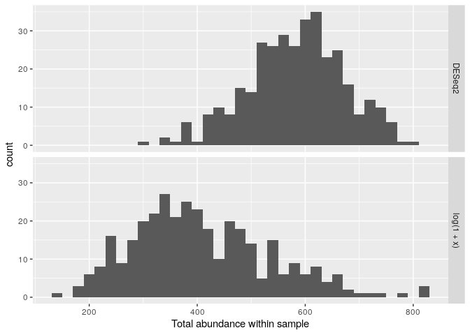

Phyloseq-state-dada
================

``` r
library(knitr)
library(markdown) 
```

\#Importer directement les tables produites par le pipeline DADA2 dans
phyloseq. Nous ajouterons également la petite quantité de métadonnées
dont nous disposons - les échantillons sont nommés par le sexe (G), le
numéro de sujet de la souris (X) et le jour après le sevrage (Y) où ils
ont été échantillonnés (par exemple GXDY).

``` r
packageVersion("phyloseq")
```

    ## [1] '1.32.0'

Le package phyloseq R est un cadre puissant pour une analyse plus
approfondie des données sur le microbiome .

``` r
BiocManager::install("Biostrings")
```

    ## Bioconductor version 3.11 (BiocManager 1.30.10), R 4.0.3 (2020-10-10)

    ## Installing package(s) 'Biostrings'

    ## Installation path not writeable, unable to update packages: codetools,
    ##   KernSmooth, nlme

le package biostring a une fonctionnalité pour la correspondance de
motifs (alignement de lecture courte) ainsi qu’une fonction d’alignement
par paires

``` r
packageVersion("Biostrings")
```

    ## [1] '2.56.0'

``` r
BiocManager::install("ggplot2")
```

    ## Bioconductor version 3.11 (BiocManager 1.30.10), R 4.0.3 (2020-10-10)

    ## Installing package(s) 'ggplot2'

    ## Installation path not writeable, unable to update packages: codetools,
    ##   KernSmooth, nlme

Le package ggplot2 est un système de création graphique déclarative,
basé sur The Grammar of Graphics . Vous fournissez les données, dites à
ggplot2 comment mapper des variables à l’esthétique, quelles primitives
graphiques utiliser et il s’occupe des détails

``` r
packageVersion("ggplot2")
```

    ## [1] '3.3.2'

\#Ca permets de voir si le package est bien installer

``` r
library("phyloseq")
```

``` r
library("Biostrings")
```

    ## Loading required package: BiocGenerics

    ## Loading required package: parallel

    ## 
    ## Attaching package: 'BiocGenerics'

    ## The following objects are masked from 'package:parallel':
    ## 
    ##     clusterApply, clusterApplyLB, clusterCall, clusterEvalQ,
    ##     clusterExport, clusterMap, parApply, parCapply, parLapply,
    ##     parLapplyLB, parRapply, parSapply, parSapplyLB

    ## The following objects are masked from 'package:stats':
    ## 
    ##     IQR, mad, sd, var, xtabs

    ## The following objects are masked from 'package:base':
    ## 
    ##     anyDuplicated, append, as.data.frame, basename, cbind, colnames,
    ##     dirname, do.call, duplicated, eval, evalq, Filter, Find, get, grep,
    ##     grepl, intersect, is.unsorted, lapply, Map, mapply, match, mget,
    ##     order, paste, pmax, pmax.int, pmin, pmin.int, Position, rank,
    ##     rbind, Reduce, rownames, sapply, setdiff, sort, table, tapply,
    ##     union, unique, unsplit, which, which.max, which.min

    ## Loading required package: S4Vectors

    ## Loading required package: stats4

    ## 
    ## Attaching package: 'S4Vectors'

    ## The following object is masked from 'package:base':
    ## 
    ##     expand.grid

    ## Loading required package: IRanges

    ## 
    ## Attaching package: 'IRanges'

    ## The following object is masked from 'package:phyloseq':
    ## 
    ##     distance

    ## Loading required package: XVector

    ## 
    ## Attaching package: 'Biostrings'

    ## The following object is masked from 'package:base':
    ## 
    ##     strsplit

``` r
library("ggplot2")
```

\#construire un échantillon simple à data.framepartir des informations
encodées dans les noms de fichiers: maintenant on regroupe tout dans un
objet phyloseq avec la commande ps (arbre phylo, table de données etc…)
exemple de l’armoire et des tiroirs. On va créer nos outils pour
l’analyse de phyloseq

\#Constriure un objet phyolseq

``` r
ps_connect <-url("https://raw.githubusercontent.com/spholmes/F1000_workflow/master/data/ps.rds")
ps = readRDS(ps_connect)
ps
```

    ## phyloseq-class experiment-level object
    ## otu_table()   OTU Table:         [ 389 taxa and 360 samples ]
    ## sample_data() Sample Data:       [ 360 samples by 14 sample variables ]
    ## tax_table()   Taxonomy Table:    [ 389 taxa by 6 taxonomic ranks ]
    ## phy_tree()    Phylogenetic Tree: [ 389 tips and 387 internal nodes ]

\#Créeation d’un tableau des nombres de lectures pour chaque phylum
présent dans l’ensemble de données. \#\# Show available ranks in the
dataset

``` r
rank_names(ps)
```

    ## [1] "Kingdom" "Phylum"  "Class"   "Order"   "Family"  "Genus"

# Create table, number of features for each phyla

``` r
table(tax_table(ps)[, "Phylum"], exclude = NULL)
```

    ## 
    ##              Actinobacteria               Bacteroidetes 
    ##                          13                          23 
    ## Candidatus_Saccharibacteria   Cyanobacteria/Chloroplast 
    ##                           1                           4 
    ##         Deinococcus-Thermus                  Firmicutes 
    ##                           1                         327 
    ##                Fusobacteria              Proteobacteria 
    ##                           1                          11 
    ##                 Tenericutes             Verrucomicrobia 
    ##                           1                           1 
    ##                        <NA> 
    ##                           6

On a quelques phylums pour lesquels une seule caractéristique a été
observée. Cela vaut peut-être la peine d’être filtré, et nous
vérifierons cela ensuite. Tout d’abord, notez que dans ce cas, six
caractéristiques ont été annotées avec un Phylum of NA. Ces
fonctionnalités sont probablement des artefacts dans un ensemble de
données comme celui-ci et doivent être supprimées.

\#garantir que les fonctionnalités avec une annotation de phylum ambiguë
sont également supprimées. Notez la flexibilité dans la définition des
chaînes qui doivent être considérées comme des annotations ambiguës.

``` r
ps <- subset_taxa(ps, !is.na(Phylum) & !Phylum %in% c("", "uncharacterized"))
```

\#Explorer la prévalence des caractéristiques dans l’ensemble de
données, que nous définirons ici comme le nombre d’échantillons dans
lesquels un taxon apparaît au moins une fois.

``` r
# Compute prevalence of each feature, store as data.frame
prevdf = apply(X = otu_table(ps),
               MARGIN = ifelse(taxa_are_rows(ps), yes = 1, no = 2),
               FUN = function(x){sum(x > 0)})
# Add taxonomy and total read counts to this data.frame
prevdf = data.frame(Prevalence = prevdf,
                    TotalAbundance = taxa_sums(ps),
                    tax_table(ps))
```

\#Calcule rles prévalences totales et moyennes des caractéristiques dans
chaque phylum pour voir est-ce qu’il y a des phylums composés
principalement de caractéristiques à faible prévalence.

``` r
plyr::ddply(prevdf, "Phylum", function(df1){cbind(mean(df1$Prevalence),sum(df1$Prevalence))})
```

    ##                         Phylum         1     2
    ## 1               Actinobacteria 120.15385  1562
    ## 2                Bacteroidetes 265.52174  6107
    ## 3  Candidatus_Saccharibacteria 280.00000   280
    ## 4    Cyanobacteria/Chloroplast  64.25000   257
    ## 5          Deinococcus-Thermus  52.00000    52
    ## 6                   Firmicutes 179.24771 58614
    ## 7                 Fusobacteria   2.00000     2
    ## 8               Proteobacteria  59.09091   650
    ## 9                  Tenericutes 234.00000   234
    ## 10             Verrucomicrobia 104.00000   104

Seulement plus de 1% des échantillons contenaient de Deinococcus-Thermus
et seulement 2 échantillons contenaient du Clostridium. Dans certains
cas, malgré cela, il peut être intéressant d’étudier ces deux portes
plus en détail (mais il peut ne pas s’agir de deux échantillons de
Fusobacteria). Cependant, aux fins de cet exemple, ils seront filtrés
hors de l’ensemble de données.

# Define phyla to filter

``` r
filterPhyla = c("Fusobacteria", "Deinococcus-Thermus")
# Filter entries with unidentified Phylum.
ps1 = subset_taxa(ps, !Phylum %in% filterPhyla)
ps1
```

    ## phyloseq-class experiment-level object
    ## otu_table()   OTU Table:         [ 381 taxa and 360 samples ]
    ## sample_data() Sample Data:       [ 360 samples by 14 sample variables ]
    ## tax_table()   Taxonomy Table:    [ 381 taxa by 6 taxonomic ranks ]
    ## phy_tree()    Phylogenetic Tree: [ 381 tips and 379 internal nodes ]

\#Filtrage de la prévalence \#\# Les étapes de filtrage précédentes sont
considérées comme supervisées.Cette prochaine étape de filtrage est
complètement non supervisée , ne reposant que sur les données de cette
expérience et sur un paramètre que nous choisirons après avoir exploré
les données.

``` r
# Subset to the remaining phyla
prevdf1 = subset(prevdf, Phylum %in% get_taxa_unique(ps1, "Phylum"))
ggplot(prevdf1, aes(TotalAbundance, Prevalence / nsamples(ps),color=Phylum)) +
  # Include a guess for parameter
  geom_hline(yintercept = 0.05, alpha = 0.5, linetype = 2) +  geom_point(size = 2, alpha = 0.7) +
  scale_x_log10() +  xlab("Total Abundance") + ylab("Prevalence [Frac. Samples]") +
  facet_wrap(~Phylum) + theme(legend.position="none")
```

<!-- -->

Chaque point de la figure est une unité de taxonomie différente.
Parcourir les données de cette manière est souvent utile pour
sélectionner les paramètres de filtre, tels que les critères de
prévalence minimale qui ont utilisés pour filtrer les données
ci-dessus. Aucune séparation naturelle n’est immédiatement évidente,
mais il semble que l’on puisse raisonnablement fixer le seuil de
prévalence à environ zéro à dix pour cent. Notez que cette sélection
n’introduit pas de biais dans l’analyse en aval de la corrélation
d’abondance de biais.

\#Utiliser cinq pour cent de tous les échantillons comme seuil de
prévalence

``` r
# Define prevalence threshold as 5% of total samples
prevalenceThreshold = 0.05 * nsamples(ps)
prevalenceThreshold
```

    ## [1] 18

``` r
# Execute prevalence filter, using `prune_taxa()` function
keepTaxa = rownames(prevdf1)[(prevdf1$Prevalence >= prevalenceThreshold)]
ps2 = prune_taxa(keepTaxa, ps)
```

\#Filtrage de la prévalence \#\#Montrer comment combiner toutes les
fonctionnalités qui descendent du même genre.

``` r
# How many genera would be present after filtering?
length(get_taxa_unique(ps2, taxonomic.rank = "Genus"))
```

    ## [1] 49

``` r
ps3 = tax_glom(ps2, "Genus", NArm = TRUE)
```

Si la taxonomie n’est pas disponible ou n’est pas fiable,
l’agglomération arborescente est une alternative «sans taxonomie»
pour combiner des caractéristiques de données correspondant à des taxons
étroitement liés. Dans ce cas, plutôt que le rang taxonomique,
l’utilisateur spécifie une hauteur d’arbre correspondant à la distance
phylogénétique entre les entités qui doivent définir leur regroupement.
Ceci est très similaire au «clustering OTU», sauf que dans de nombreux
algorithmes de clustering OTU, la distance de séquence utilisée n’a pas
la même (ou aucune) définition évolutive.

``` r
h1 = 0.4
ps4 = tip_glom(ps2, h = h1)
```

Ici, la plot\_tree()fonction de phyloseq compare les données originales
non filtrées, l’arbre après l’agglomération taxonoïque et l’arbre après
l’agglomération phylogénétique. Ceux-ci sont stockés en tant qu’objets
de tracé séparés, puis rendus ensemble dans un graphique combiné à
l’aide de gridExtra::grid.arrange.

``` r
multiPlotTitleTextSize = 15
p2tree = plot_tree(ps2, method = "treeonly",
                   ladderize = "left",
                   title = "Before Agglomeration") +
  theme(plot.title = element_text(size = multiPlotTitleTextSize))
p3tree = plot_tree(ps3, method = "treeonly",
                   ladderize = "left", title = "By Genus") +
  theme(plot.title = element_text(size = multiPlotTitleTextSize))
p4tree = plot_tree(ps4, method = "treeonly",
                   ladderize = "left", title = "By Height") +
  theme(plot.title = element_text(size = multiPlotTitleTextSize))
```

``` r
library ("gridExtra") 
```

    ## 
    ## Attaching package: 'gridExtra'

    ## The following object is masked from 'package:BiocGenerics':
    ## 
    ##     combine

``` r
grid.arrange(nrow = 1, p2tree, p3tree, p4tree)
```

<!-- -->

La figure montre l’arbre d’origine sur la gauche, la classification est
groupée au niveau du genre moyen et le cluster phylogénétique est à une
distance fixe de 0,4

\#Transformation de la valeur d’abondance \#\#définir une fonction de
tracé personnalisée plot\_abundance(),, qui utilise la fonction de
phyloseq pour définir un graphique d’abondance relative. Nous
l’utiliserons pour comparer plus facilement les différences d’échelle
et de distribution des valeurs d’abondance dans notre objet phyloseq
avant et après transformation.

``` r
plot_abundance = function(physeq,title = "",
                          Facet = "Order", Color = "Phylum"){
  # Arbitrary subset, based on Phylum, for plotting
  p1f = subset_taxa(physeq, Phylum %in% c("Firmicutes"))
  mphyseq = psmelt(p1f)
  mphyseq <- subset(mphyseq, Abundance > 0)
  ggplot(data = mphyseq, mapping = aes_string(x = "sex",y = "Abundance",
                              color = Color, fill = Color)) +
    geom_violin(fill = NA) +
    geom_point(size = 1, alpha = 0.3,
               position = position_jitter(width = 0.3)) +
    facet_wrap(facets = Facet) + scale_y_log10()+
    theme(legend.position="none")
}
```

La transformation dans ce cas convertit les dénombrements de chaque
échantillon en leurs fréquences, souvent appelées proportions ou
abondances relatives . Cette fonction est si simple qu’il est plus
facile de la définir dans l’appel de fonction à
transform\_sample\_counts().

``` r
# Transform to relative abundance. Save as new object.
ps3ra = transform_sample_counts(ps3, function(x){x / sum(x)})
```

\#Traçer les valeurs d’abondance avant et après la transformation.

``` r
plotBefore = plot_abundance(ps3,"")
plotAfter = plot_abundance(ps3ra,"")
# Combine each plot into one graphic.
grid.arrange(nrow = 2,  plotBefore, plotAfter)
```

<!-- --> Le
graphique montre une comparaison de l’abondance d’origine (en haut) et
de l’abondance relative (en bas). et on peut remarquer que apres la
transformation qu’il y’a pas une drande diffrence de valeurs d’abondance
dans les 2sexs d’hote

\#Sous-ensemble par taxonomie \#\#sous-ensembles avec la fonction, puis
spécifions un rang taxonomique plus précis à l’argument de la fonction
que nous avons définie ci-dessus.

``` r
psOrd = subset_taxa(ps3ra, Order == "Lactobacillales")
plot_abundance(psOrd, Facet = "Genus", Color = NULL)
```

<!-- -->

La figure montre l’abondance relative des bactéries classées
Lactobacillus par sexe et genre d’hôte. Ici, il est évident que dans le
graphique précédent, la distribution biomorphologique évidente de
Lactobacillus est le résultat d’un mélange de deux genres différents, et
l’abondance relative des Lactobacillus typiques est beaucoup plus grande
que celle de Streptococcus.

\#Installer quelques packages disponibles pour ces analyses
complémentaires

``` r
.cran_packages <- c( "shiny","miniUI", "caret", "pls", "e1071", "ggplot2", "randomForest", "dplyr", "ggrepel", "nlme", "devtools",
                  "reshape2", "PMA", "structSSI", "ade4",
                  "ggnetwork", "intergraph", "scales")
.github_packages <- c("jfukuyama/phyloseqGraphTest")
.bioc_packages <- c("genefilter", "impute")
# Install CRAN packages (if not already installed)
.inst <- .cran_packages %in% installed.packages()
if (any(!.inst)){
  install.packages(.cran_packages[!.inst],repos = "http://cran.rstudio.com/")
}
.inst <- .github_packages %in% installed.packages()
if (any(!.inst)){
  devtools::install_github(.github_packages[!.inst])
}
```

    ## Skipping install of 'phyloseqGraphTest' from a github remote, the SHA1 (3fb6c274) has not changed since last install.
    ##   Use `force = TRUE` to force installation

``` r
.inst <- .bioc_packages %in% installed.packages()
if(any(!.inst)){
  source("http://bioconductor.org/biocLite.R")
  biocLite(.bioc_packages[!.inst])
}
```

\#Prétraitement \#\#enregistrer également le nombre total de
dénombrements observés dans chaque échantillon et transformer données
en logarithme sous forme de transformation de stabilisation de la
variance approximative.

``` r
qplot(sample_data(ps)$age, geom = "histogram",binwidth=20) + xlab("age")
```

<!-- -->

La figure montre que la covariable d’âge appartient à trois grappes
distinctes.

``` r
qplot(log10(rowSums(otu_table(ps))),binwidth=0.2) +
  xlab("Logged counts-per-sample")
```

<!-- -->

Ces graphiques préliminaires suggèrent quelques étapes de prétraitement.
L’histogramme de la figure précédente motive la création d’une nouvelle
variable catégorielle, regroupant l’âge dans l’un des trois pics.
L’histogramme de cette figure indique que la transformation Journal (1
+ x) peut être suffisante pour normaliser les données d’abondance pour
l’analyse exploratoire. En fait, cette conversion n’est pas suffisante
à des fins de test, et lors de l’exécution de l’abondance
différentielle, nous vous recommandons d’utiliser la conversion de
stabilisation de la variance dans DESeq2 via la fonction
phyloseq\_to\_deseq2, voir le tutoriel phyloseq\_to\_deseq2 ici

# Examiner l’analyse des coordonnées principales (PCoA) avec soit la dissemblance Bray-Curtis sur la distance Unifrac pondérée

``` r
sample_data(ps)$age_binned <- cut(sample_data(ps)$age,
                          breaks = c(0, 100, 200, 400))
levels(sample_data(ps)$age_binned) <- list(Young100="(0,100]", Mid100to200="(100,200]", Old200="(200,400]")
sample_data(ps)$family_relationship=gsub(" ","",sample_data(ps)$family_relationship)
pslog <- transform_sample_counts(ps, function(x) log(1 + x))
out.wuf.log <- ordinate(pslog, method = "MDS", distance = "wunifrac")
```

    ## Warning in UniFrac(physeq, weighted = TRUE, ...): Randomly assigning root as --
    ## GCAAGCGTTGTCCGGATTTACTGGGCGTAAAGGGAGCGTAGGTGGATATTTAAGTGGGATGTGAAATACTCGGGCTTAACCTGGGTGCTGCATTCCAAACTGGATATCTAGAGTGCAGGAGAGGAAAGTAGAATTCTTAGTGTAGCGGTGAAATGCGTAGAGATTAGGAAGAATACCAGTGGCGAAGGCGACTTTCTGGACTGTAACTGACACTGAGGCTCGAAAGCGTGGGGAG
    ## -- in the phylogenetic tree in the data you provided.

``` r
evals <- out.wuf.log$values$Eigenvalues
plot_ordination(pslog, out.wuf.log, color = "age_binned") +
  labs(col = "Binned Age") +
  coord_fixed(sqrt(evals[2] / evals[1]))
```

<!-- -->

Le graphique montre que le classement sur les données d’abondance
enregistrées révèle des valeurs aberrantes. Il s’agit d’échantillons de
femelles 5 et 6 au jour 165, et d’échantillons de mâles 3, 4, 5 et 6 au
jour 175. Nous les retirerons car nous nous intéressons principalement à
la relation entre les non-valeurs aberrantes.

\#Vérifier les deux valeurs aberrantes féminines - elles ont été
reprises par le même OTU / ASV, qui a une abondance relative de plus de
90% dans chacune d’elles.

``` r
rel_abund <- t(apply(otu_table(ps), 1, function(x) x / sum(x)))
qplot(rel_abund[, 12], geom = "histogram",binwidth=0.05) +
  xlab("Relative abundance")
```

<!-- -->

\#Différentes projections d’ordination \#\#calculer les ordinations avec
ces valeurs aberrantes supprimées et étudier plus attentivement la
sortie.

``` r
outliers <- c("F5D165", "F6D165", "M3D175", "M4D175", "M5D175", "M6D175")
ps <- prune_samples(!(sample_names(ps) %in% outliers), ps)
```

\#\#supprimer les échantillons avec moins de 1000 lectures:

``` r
which(!rowSums(otu_table(ps)) > 1000)
```

    ## F5D145 M1D149   M1D9 M2D125  M2D19 M3D148 M3D149   M3D3   M3D5   M3D8 
    ##     69    185    200    204    218    243    244    252    256    260

``` r
ps <- prune_samples(rowSums(otu_table(ps)) > 1000, ps)
pslog <- transform_sample_counts(ps, function(x) log(1 + x))
```

\#\#effectuer un PCoA en utilisant la dissemblance Bray-Curtis

``` r
out.pcoa.log <- ordinate(pslog,  method = "MDS", distance = "bray")
evals <- out.pcoa.log$values[,1]
plot_ordination(pslog, out.pcoa.log, color = "age_binned",
                  shape = "family_relationship") +
  labs(col = "Binned Age", shape = "Litter")+
  coord_fixed(sqrt(evals[2] / evals[1]))
```

<!-- -->

Sur le graphe, nous voyons un effet d’âge significatif, toutes les
souris mâles et femelles et les souris de portées différentes ont le
même effet d’âge.

\#\#examiner l’analyse des coordonnées principales doubles (DPCoA)
(Pavoine, Dufour et Chessel 2004; Purdom 2010; Fukuyama et al.2012 ) ,
qui est une méthode d’ordination phylogénétique et qui fournit une
représentation biplot des échantillons et des catégories taxonomiques.
Nous voyons à nouveau que le deuxième axe correspond aux souris jeunes
vs âgées, et le biplot suggère une interprétation du deuxième axe: les
échantillons qui ont des scores plus élevés sur le deuxième axe ont
plus de taxons de Bacteroidetes et un sous-ensemble de Firmicutes.

``` r
out.dpcoa.log <- ordinate(pslog, method = "DPCoA")
evals <- out.dpcoa.log$eig
plot_ordination(pslog, out.dpcoa.log, color = "age_binned", label= "SampleID",
                  shape = "family_relationship") +
  labs(col = "Binned Age", shape = "Litter")+
  coord_fixed(sqrt(evals[2] / evals[1]))
```

<!-- -->

Sur la figure ci-dessus nous avons le premier axe qui explique 75% de la
variabilité, environ 9 fois celle du deuxième axe; cela se traduit par
la forme allongée du tracé d’ordination.

\#Regarder les résultats du PCoA avec Unifrac pondéré. Comme
précédemment, nous constatons que le deuxième axe est associé à un
effet d’âge, assez similaire au DPCoA. Cela n’est pas surprenant, car
les deux sont des méthodes d’ordination phylogénétique prenant en compte
l’abondance.

``` r
plot_ordination(pslog, out.dpcoa.log, type = "species", color = "Phylum") +
  coord_fixed(sqrt(evals[2] / evals[1]))
```

<!-- --> la
figure illustrant les taxons responsables des axes 1 et 2

``` r
out.wuf.log <- ordinate(pslog, method = "PCoA", distance ="wunifrac")
```

    ## Warning in UniFrac(physeq, weighted = TRUE, ...): Randomly assigning root as --
    ## GCGAGCGTTATCCGGAATTATTGGGCGTAAAGGGTGCGTAGATGGCATAGTAAGTCTTTTGTAAAAATGCTGGGCTCAACCCAGTAGGGCAAAAGATACTGCAAAGCTAGAGTATGACAGAGGCAAGTGGAACTACATGTGTAGCGGTAAAATGCGTAAATATATGTAAGAACACCAGTGGCGAAGGCGGCTTGCTGGGTCGATACTGACATTGAGGCACGAAAGCGTGGGGAGC
    ## -- in the phylogenetic tree in the data you provided.

``` r
evals <- out.wuf.log$values$Eigenvalues
plot_ordination(pslog, out.wuf.log, color = "age_binned",
                  shape = "family_relationship") +
  coord_fixed(sqrt(evals[2] / evals[1])) +
  labs(col = "Binned Age", shape = "Litter")
```

<!-- -->

Les positions d’échantillon produites par un PCoA utilisant Unifrac
pondéré. Cependant, lorsque nous comparons les biplots, nous voyons que
le DPCoA a donné une interprétation beaucoup plus claire du deuxième
axe, par rapport à l’Unifrac pondéré.

\#PCA sur les rangs \#\#créer une nouvelle matrice, représentant les
abondances par leurs rangs, où le microbe avec le plus petit dans un
échantillon est mappé au rang 1, au deuxième rang le plus petit 2, etc.

``` r
abund <- otu_table(pslog)
abund_ranks <- t(apply(abund, 1, rank))
```

L’utilisation naïve de ces classements pourrait rendre comparables les
différences entre les paires de microbes à faible et à forte abondance.
Dans le cas où de nombreuses bactéries sont absentes ou présentes à
l’état de traces, une différence de rang artificiellement importante
pourrait se produire (Holmes et al. 2011) pour les taxons peu abondants.
Pour éviter cela, tous les microbes dont le rang est inférieur à un
certain seuil doivent être liés à 1. Les rangs des autres microbes sont
décalés vers le bas, il n’y a donc pas de grand écart entre les rangs.

``` r
abund_ranks <- abund_ranks - 329
abund_ranks[abund_ranks < 1] <- 1
```

``` r
library(dplyr)
```

    ## 
    ## Attaching package: 'dplyr'

    ## The following object is masked from 'package:gridExtra':
    ## 
    ##     combine

    ## The following objects are masked from 'package:Biostrings':
    ## 
    ##     collapse, intersect, setdiff, setequal, union

    ## The following object is masked from 'package:XVector':
    ## 
    ##     slice

    ## The following objects are masked from 'package:IRanges':
    ## 
    ##     collapse, desc, intersect, setdiff, slice, union

    ## The following objects are masked from 'package:S4Vectors':
    ## 
    ##     first, intersect, rename, setdiff, setequal, union

    ## The following objects are masked from 'package:BiocGenerics':
    ## 
    ##     combine, intersect, setdiff, union

    ## The following objects are masked from 'package:stats':
    ## 
    ##     filter, lag

    ## The following objects are masked from 'package:base':
    ## 
    ##     intersect, setdiff, setequal, union

``` r
library(reshape2)
abund_df <- melt(abund, value.name = "abund") %>%
  left_join(melt(abund_ranks, value.name = "rank"))
```

    ## Joining, by = c("Var1", "Var2")

``` r
colnames(abund_df) <- c("sample", "seq", "abund", "rank")

abund_df <- melt(abund, value.name = "abund") %>%
  left_join(melt(abund_ranks, value.name = "rank"))
```

    ## Joining, by = c("Var1", "Var2")

``` r
colnames(abund_df) <- c("sample", "seq", "abund", "rank")

sample_ix <- sample(1:nrow(abund_df), 8)
ggplot(abund_df %>%
         filter(sample %in% abund_df$sample[sample_ix])) +
  geom_point(aes(x = abund, y = rank, col = sample),
             position = position_jitter(width = 0.2), size = 1.5) +
  labs(x = "Abundance", y = "Thresholded rank") +
  scale_color_brewer(palette = "Set2")
```

<!-- --> La
transformation est illustrée dans la figure: la corrélation entre
l’abondance et le rang de plusieurs échantillons sélectionnés au
hasard. Le numéro de l’axe Dey est le numéro fourni à la PCA.

\#Effectuer une PCA et étudier le biplot résultant, donné dans la figure
ci-dessous. Pour produire une annotation pour cette figure, nous avons
utilisé le bloc suivant.

``` r
library(ade4)
```

    ## 
    ## Attaching package: 'ade4'

    ## The following object is masked from 'package:Biostrings':
    ## 
    ##     score

    ## The following object is masked from 'package:BiocGenerics':
    ## 
    ##     score

``` r
ranks_pca <- dudi.pca(abund_ranks, scannf = F, nf = 3)
row_scores <- data.frame(li = ranks_pca$li,
                         SampleID = rownames(abund_ranks))
col_scores <- data.frame(co = ranks_pca$co,
                         seq = colnames(abund_ranks))
tax <- tax_table(ps) %>%
  data.frame(stringsAsFactors = FALSE)
tax$seq <- rownames(tax)
main_orders <- c("Clostridiales", "Bacteroidales", "Lactobacillales",
                 "Coriobacteriales")
tax$Order[!(tax$Order %in% main_orders)] <- "Other"
tax$Order <- factor(tax$Order, levels = c(main_orders, "Other"))
tax$otu_id <- seq_len(ncol(otu_table(ps)))
row_scores <- row_scores %>%
  left_join(sample_data(pslog))
```

    ## Joining, by = "SampleID"

    ## Warning in class(x) <- c(setdiff(subclass, tibble_class), tibble_class): Setting
    ## class(x) to multiple strings ("tbl_df", "tbl", ...); result will no longer be an
    ## S4 object

``` r
col_scores <- col_scores %>%
  left_join(tax)
```

    ## Joining, by = "seq"

``` r
evals_prop <- 100 * (ranks_pca$eig / sum(ranks_pca$eig))
ggplot() +
  geom_point(data = row_scores, aes(x = li.Axis1, y = li.Axis2), shape = 2) +
  geom_point(data = col_scores, aes(x = 25 * co.Comp1, y = 25 * co.Comp2, col = Order),
             size = .3, alpha = 0.6) +
  scale_color_brewer(palette = "Set2") +
  facet_grid(~ age_binned) +
  guides(col = guide_legend(override.aes = list(size = 3))) +
  labs(x = sprintf("Axis1 [%s%% variance]", round(evals_prop[1], 2)),
       y = sprintf("Axis2 [%s%% variance]", round(evals_prop[2], 2))) +
  coord_fixed(sqrt(ranks_pca$eig[2] / ranks_pca$eig[1])) +
  theme(panel.border = element_rect(color = "#787878", fill = alpha("white", 0)))
```

<!-- -->

Le résultat est similaire à l’analyse PCoA calculée sans appliquer la
transformation de classement raccourcie, augmentant ainsi notre
confiance dans l’analyse des données d’origine.

\#Pour utiliser des échantillons de données supplémentaires, il est
nécessaire de fournir un argument supplémentaire, spécifiant les
caractéristiques à prendre en compte - sinon, par défaut, toutes les
mesures sont utilisées lors de la production de l’ordination.

``` r
ps_ccpna <- ordinate(pslog, "CCA", formula = pslog ~ age_binned + family_relationship)
```

\#afin d’accéder aux positions du biplot, nous pouvons utiliser la
fonction ordinatedans phyloseq. De plus, pour faciliter l’annotation des
figures, nous joignons également les scores du site avec les données
environnementales dans la fente. .

``` r
library(ggrepel)
ps_scores <- vegan::scores(ps_ccpna)
sites <- data.frame(ps_scores$sites)
sites$SampleID <- rownames(sites)
sites <- sites %>%
  left_join(sample_data(ps))
```

    ## Joining, by = "SampleID"

    ## Warning in class(x) <- c(setdiff(subclass, tibble_class), tibble_class): Setting
    ## class(x) to multiple strings ("tbl_df", "tbl", ...); result will no longer be an
    ## S4 object

``` r
species <- data.frame(ps_scores$species)
species$otu_id <- seq_along(colnames(otu_table(ps)))
species <- species %>%
  left_join(tax)
```

    ## Joining, by = "otu_id"

``` r
evals_prop <- 100 * ps_ccpna$CCA$eig[1:2] / sum(ps_ccpna$CA$eig)
ggplot() +
  geom_point(data = sites, aes(x = CCA1, y = CCA2), shape = 2, alpha = 0.5) +
  geom_point(data = species, aes(x = CCA1, y = CCA2, col = Order), size = 0.5) +
  geom_text_repel(data = species %>% filter(CCA2 < -2),
                    aes(x = CCA1, y = CCA2, label = otu_id),
            size = 1.5, segment.size = 0.1) +
  facet_grid(. ~ family_relationship) +
  guides(col = guide_legend(override.aes = list(size = 3))) +
  labs(x = sprintf("Axis1 [%s%% variance]", round(evals_prop[1], 2)),
        y = sprintf("Axis2 [%s%% variance]", round(evals_prop[2], 2))) +
  scale_color_brewer(palette = "Set2") +
  coord_fixed(sqrt(ps_ccpna$CCA$eig[2] / ps_ccpna$CCA$eig[1])*0.45   ) +
  theme(panel.border = element_rect(color = "#787878", fill = alpha("white", 0)))
```

<!-- -->

Les scores souris et bactéries générés par CCpnA. Sur les 23 ordres
taxonomiques totaux, nous n’annotons explicitement que les quatre plus
abondants Clostridiales, Bacteroidales,
Lactobacillales,Coriobacteriales- cela rend le biplot plus facile à lire

\#Enseignement supervisé \#\# illustrer quelques méthodes
d’apprentissage supervisé qui peuvent être facilement exécutées dans
R. Diviser les données en ensembles d’apprentissage et de test, les
affectations étant effectuées à la souris plutôt que par échantillon,

``` r
library(caret)
```

    ## Loading required package: lattice

``` r
sample_data(pslog)$age2 <- cut(sample_data(pslog)$age, c(0, 100, 400))
dataMatrix <- data.frame(age = sample_data(pslog)$age2, otu_table(pslog))
# take 8 mice at random to be the training set, and the remaining 4 the test set
trainingMice <- sample(unique(sample_data(pslog)$host_subject_id), size = 8)
inTrain <- which(sample_data(pslog)$host_subject_id %in% trainingMice)
training <- dataMatrix[inTrain,]
testing <- dataMatrix[-inTrain,]
plsFit <- train(age ~ ., data = training,
                method = "pls", preProc = "center")
```

\#\#Prédire les étiquettes de classe sur l’ensemble de test en utilisant
la fonction predictet comparer à la vérité. Nous voyons que la méthode
fait un excellent travail de prédiction de l’âge.

``` r
plsClasses <- predict(plsFit, newdata = testing)
table(plsClasses, testing$age)
```

    ##            
    ## plsClasses  (0,100] (100,400]
    ##   (0,100]        63         1
    ##   (100,400]       1        43

Comme autre exemple, nous pouvons essayer des forêts aléatoires. Ceci
est exécuté exactement de la même manière que PLS, en basculant
l’argument de à. Les forêts aléatoires se comportent également bien à
la tâche de prédiction sur cet ensemble de test, bien qu’il y ait plus
de vieilles souris mal classées comme jeunes.

``` r
library(randomForest)
```

    ## randomForest 4.6-14

    ## Type rfNews() to see new features/changes/bug fixes.

    ## 
    ## Attaching package: 'randomForest'

    ## The following object is masked from 'package:dplyr':
    ## 
    ##     combine

    ## The following object is masked from 'package:gridExtra':
    ## 
    ##     combine

    ## The following object is masked from 'package:ggplot2':
    ## 
    ##     margin

    ## The following object is masked from 'package:BiocGenerics':
    ## 
    ##     combine

``` r
rfFit <- train(age ~ ., data = training, method = "rf",
               preProc = "center", proximity = TRUE)
rfClasses <- predict(rfFit, newdata = testing)
table(rfClasses, testing$age)
```

    ##            
    ## rfClasses   (0,100] (100,400]
    ##   (0,100]        64         2
    ##   (100,400]       0        42

Pour interpréter ces PLS et les résultats aléatoires de la forêt, il est
standard de produire respectivement des biplots et des graphiques de
proximité. Le code ci-dessous extrait les coordonnées et fournit des
annotations pour les points à inclure sur le biplot PLS.

\#To interpret these PLS and random forest results, it is standard to
produce biplots and proximity plots, respectively. The code below
extracts coordinates and supplies annotation for points to include on
the PLS biplot.

``` r
library(vegan)
```

    ## Loading required package: permute

    ## This is vegan 2.5-7

    ## 
    ## Attaching package: 'vegan'

    ## The following object is masked from 'package:caret':
    ## 
    ##     tolerance

``` r
library(phyloseq)
library(dplyr)
pls_biplot <- list("loadings" = loadings(plsFit$finalModel),
                   "scores" = scores(plsFit$finalModel))
class(pls_biplot$scores) <- "matrix"

pls_biplot$scores <- data.frame(sample_data(pslog)[inTrain, ],
                                pls_biplot$scores)

tax <- tax_table(ps)@.Data %>% data.frame(stringsAsFactors = FALSE)
main_orders <- c("Clostridiales", "Bacteroidales", "Lactobacillales",
                 "Coriobacteriales")
tax$Order[!(tax$Order %in% main_orders)] <- "Other"
tax$Order <- factor(tax$Order, levels = c(main_orders, "Other"))
class(pls_biplot$loadings) <- "matrix"
pls_biplot$loadings <- data.frame(tax, pls_biplot$loadings)
```

``` r
library(viridisLite)
ggplot() +
  geom_point(data = pls_biplot$scores,
             aes(x = Comp.1, y = Comp.2), shape = 2) +
  geom_point(data = pls_biplot$loadings,
             aes(x = 25 * Comp.1, y = 25 * Comp.2, col = Order),
             size = 0.3, alpha = 0.6) +
  scale_color_brewer(palette = "Set2") +
  labs(x = "Axis1", y = "Axis2", col = "Binned Age") +
  guides(col = guide_legend(override.aes = list(size = 3))) +
  facet_grid( ~ age2) +
  theme(panel.border = element_rect(color = "#787878", fill = alpha("white", 0)))
```

<!-- -->

Le graphique à deux lignes généré est illustré dans la figure. Il peut
être expliqué de la même manière que le graphique de Pareto précédent,
sauf que la variable d’âge combinée doit être explicitement citée lors
du choix de la projection. Plus précisément, le PLS identifie le
sous-espace pour distinguer les catégories dans la plus grande mesure,
et le double graphique affiche la projection d’échantillon et les
coefficients ASV par rapport au sous-espace.

``` r
rf_prox <- cmdscale(1 - rfFit$finalModel$proximity) %>%
  data.frame(sample_data(pslog)[inTrain, ])

ggplot(rf_prox) +
  geom_point(aes(x = X1, y = X2, col = age_binned),
             size = 1, alpha = 0.7) +
  scale_color_manual(values = c("#A66EB8", "#238DB5", "#748B4F")) +
  guides(col = guide_legend(override.aes = list(size = 4))) +
  labs(col = "Binned Age", x = "Axis1", y = "Axis2")
```

<!-- --> Le
double graphique résultant est présenté à la figure 17. Il peut être
expliqué de la même manière que le graphique de Pareto précédent, sauf
que la variable d’âge combinée doit être explicitement citée lors du
choix de la projection. Plus précisément, le PLS identifie le
sous-espace pour distinguer les catégories dans la plus grande mesure,
et le double graphique affiche la projection d’échantillon et les
coefficients ASV par rapport au sous-espace.

``` r
as.vector(tax_table(ps)[which.max(importance(rfFit$finalModel)), c("Family", "Genus")])
```

    ## [1] "Lachnospiraceae" "Roseburia"

``` r
impOtu <- as.vector(otu_table(pslog)[,which.max(importance(rfFit$finalModel))])
maxImpDF <- data.frame(sample_data(pslog), abund = impOtu)
ggplot(maxImpDF) +   geom_histogram(aes(x = abund)) +
  facet_grid(age2 ~ .) +
  labs(x = "Abundance of discriminative bacteria", y = "Number of samples")
```

    ## `stat_bin()` using `bins = 30`. Pick better value with `binwidth`.

<!-- -->

Afin de mieux comprendre le modèle forestier aléatoire ajusté, nous
avons identifié les micro-organismes qui ont la plus grande influence
sur la prédiction aléatoire des forêts. C’est un microorganisme de la
famille des Lachnospiracées et du genre Roseburia. La figure 19 montre
son abondance dans l’échantillon; on voit que de 0 à 100 jours, elle est
toujours très faible, et de 100 à 400 jours, elle est très élevée.

\#Analyses basées sur des graphiques \#\#Créer et tracer des graphiques:
tracer le réseau avec la coloration à la souris et la forme à la
litière.

``` r
library("phyloseqGraphTest")
library("igraph")
```

    ## 
    ## Attaching package: 'igraph'

    ## The following object is masked from 'package:vegan':
    ## 
    ##     diversity

    ## The following object is masked from 'package:permute':
    ## 
    ##     permute

    ## The following objects are masked from 'package:dplyr':
    ## 
    ##     as_data_frame, groups, union

    ## The following object is masked from 'package:Biostrings':
    ## 
    ##     union

    ## The following object is masked from 'package:IRanges':
    ## 
    ##     union

    ## The following object is masked from 'package:S4Vectors':
    ## 
    ##     union

    ## The following objects are masked from 'package:BiocGenerics':
    ## 
    ##     normalize, path, union

    ## The following objects are masked from 'package:stats':
    ## 
    ##     decompose, spectrum

    ## The following object is masked from 'package:base':
    ## 
    ##     union

``` r
library("ggnetwork")
net <- make_network(ps, max.dist=0.35)
sampledata <- data.frame(sample_data(ps))
V(net)$id <- sampledata[names(V(net)), "host_subject_id"]
V(net)$litter <- sampledata[names(V(net)), "family_relationship"]

net_graphe <- ggnetwork(net)

ggplot(net_graphe, aes(x = x, y = y, xend = xend, yend = yend), layout = "fruchtermanreingold") +
  geom_edges(color = "darkgray") +
  geom_nodes(aes(color = id, shape = litter),  size = 3 ) +
  theme(axis.text = element_blank(), axis.title = element_blank(),
        legend.key.height = unit(0.5,"line")) +
  guides(col = guide_legend(override.aes = list(size = .5)))
```

<!-- -->

Nous voyons le réseau généré sur la figure. La couleur de la figure
indique la souris échantillonnée, et la forme indique la portée de la
souris. Nous pouvons voir un ensemble d’échantillons triés par souris et
déchets.

\#Tests à deux échantillons basés sur des graphiques \#\#Arbre couvrant
minimum (MST)

``` r
gt <- graph_perm_test(ps, "family_relationship", grouping = "host_subject_id",
                      distance = "jaccard", type = "mst")
gt$pva
```

    ## [1] 0.002

``` r
library(gridExtra)
plotNet1=plot_test_network(gt) + theme(legend.text = element_text(size = 8),
        legend.title = element_text(size = 9))
plotPerm1=plot_permutations(gt)
grid.arrange(ncol = 2,  plotNet1, plotPerm1)
```

<!-- --> Le
graphe et l’histogramme de permutation obtenus à partir de l’arbre
couvrant minimal avec similitude Jaccard. La p-value de ce test est
petite et nous rejetons l’hypothèse nulle que les deux échantillons
proviennent de la même distribution. À partir du diagramme en arbre
couvrant minimum de la figure, nous pouvons voir à l’œil nu que le
nombre d’échantillons classés comme déchets est supérieur à ce que nous
avons vu par accident.afin de comparer la composition des echantillions
par rapport à la ligne des souris.

\#Voisins les plus proches

``` r
gt <- graph_perm_test(ps, "family_relationship", grouping = "host_subject_id",
                      distance = "jaccard", type = "knn", knn = 1)
```

``` r
plotNet2=plot_test_network(gt) + theme(legend.text = element_text(size = 8),
        legend.title = element_text(size = 9))
plotPerm2=plot_permutations(gt)
grid.arrange(ncol = 2,  plotNet2, plotPerm2)
```

<!-- -->

la figure donne le réseau voisin le plus proche et histogramme organisé.
On peut voir sur la figure ci-dessus que si une paire d’échantillons a
un bord entre eux dans le graphique du plus proche voisin, ils sont très
probablement dans la même plage.

\#Modélisation linéaire \#\#calculons d’abord la diversité de Shannon
associée à chaque échantillon et la joignons avec l’annotation
d’échantillon.

``` r
library("nlme")
```

    ## 
    ## Attaching package: 'nlme'

    ## The following object is masked from 'package:dplyr':
    ## 
    ##     collapse

    ## The following object is masked from 'package:Biostrings':
    ## 
    ##     collapse

    ## The following object is masked from 'package:IRanges':
    ## 
    ##     collapse

``` r
library("reshape2")
ps_alpha_div <- estimate_richness(ps, split = TRUE, measure = "Shannon")
ps_alpha_div$SampleID <- rownames(ps_alpha_div) %>%
  as.factor()
ps_samp <- sample_data(ps) %>%
  unclass() %>%
  data.frame() %>%
  left_join(ps_alpha_div, by = "SampleID") %>%
  melt(measure.vars = "Shannon",
       variable.name = "diversity_measure",
       value.name = "alpha_diversity")

# reorder's facet from lowest to highest diversity
diversity_means <- ps_samp %>%
  group_by(host_subject_id) %>%
  summarise(mean_div = mean(alpha_diversity)) %>%
  arrange(mean_div)
```

    ## `summarise()` ungrouping output (override with `.groups` argument)

``` r
ps_samp$host_subject_id <- factor(ps_samp$host_subject_id)
#                                  diversity_means$host_subject_id)
```

``` r
alpha_div_model <- lme(fixed = alpha_diversity ~ age_binned, data = ps_samp,
                       random = ~ 1 | host_subject_id)
```

``` r
new_data <- expand.grid(host_subject_id = levels(ps_samp$host_subject_id),
                        age_binned = levels(ps_samp$age_binned))
new_data$pred <- predict(alpha_div_model, newdata = new_data)
X <- model.matrix(eval(eval(alpha_div_model$call$fixed)[-2]),
                  new_data[-ncol(new_data)])
pred_var_fixed <- diag(X %*% alpha_div_model$varFix %*% t(X))
new_data$pred_var <- pred_var_fixed + alpha_div_model$sigma ^ 2
```

``` r
ggplot(ps_samp %>% left_join(new_data)) +
  geom_errorbar(aes(x = age_binned, ymin = pred - 2 * sqrt(pred_var),
                    ymax = pred + 2 * sqrt(pred_var)),
                col = "#858585", size = .1) +
  geom_point(aes(x = age_binned, y = alpha_diversity,
                 col = family_relationship), size = 0.8) +
  facet_wrap(~host_subject_id) +
  scale_y_continuous(limits = c(2.4, 4.6), breaks = seq(0, 5, .5)) +
  scale_color_brewer(palette = "Set2") +
  labs(x = "Binned Age", y = "Shannon Diversity", color = "Litter") +
  guides(col = guide_legend(override.aes = list(size = 4))) +
  theme(panel.border = element_rect(color = "#787878", fill = alpha("white", 0)),
        axis.text.x = element_text(angle = -90, size = 6),
        axis.text.y = element_text(size = 6))
```

    ## Joining, by = c("host_subject_id", "age_binned")

<!-- -->

Le but de cette analyse n’est pas de développer de nombreuses bactéries
liées aux caractéristiques de l’échantillon. Il s’agit plutôt de la
manière dont une seule mesure décrivant la structure globale de la
communauté est liée aux caractéristiques de l’échantillon. Il s’agit
d’un objectif statistique légèrement plus simple qui peut être atteint
par la modélisation linéaire. Pour cela, il existe plusieurs méthodes
dans R. Par exemple, nous utiliserons un modèle à effets mixtes pour
étudier la relation entre la diversité de la communauté microbienne de
la souris et les variables d’âge et de plage jusqu’à présent. Il a été
observé que la diversité Shannon des souris plus jeunes était
significativement plus faible, mais que différentes souris avaient une
diversité de base différente, ce qui a incité ce choix. Le modèle à
effets mixtes est le point de départ pour formaliser cette observation.

\#Hierarchical multiple testing \#\#identifier les microbes individuels
dont l’abondance est liée à des variables d’échantillons d’intérêt. Une
approche standard consiste à calculer une statistique de test pour
chaque bactérie individuellement, à mesurer son association avec les
caractéristiques de l’échantillon, puis à ajuster conjointementp-valeurs
pour garantir une limite supérieure de False Discovery Rate

``` r
library("reshape2")
library("DESeq2")
```

    ## Loading required package: GenomicRanges

    ## Loading required package: GenomeInfoDb

    ## Loading required package: SummarizedExperiment

    ## Loading required package: Biobase

    ## Welcome to Bioconductor
    ## 
    ##     Vignettes contain introductory material; view with
    ##     'browseVignettes()'. To cite Bioconductor, see
    ##     'citation("Biobase")', and for packages 'citation("pkgname")'.

    ## 
    ## Attaching package: 'Biobase'

    ## The following object is masked from 'package:phyloseq':
    ## 
    ##     sampleNames

    ## Loading required package: DelayedArray

    ## Loading required package: matrixStats

    ## 
    ## Attaching package: 'matrixStats'

    ## The following objects are masked from 'package:Biobase':
    ## 
    ##     anyMissing, rowMedians

    ## The following object is masked from 'package:dplyr':
    ## 
    ##     count

    ## 
    ## Attaching package: 'DelayedArray'

    ## The following objects are masked from 'package:matrixStats':
    ## 
    ##     colMaxs, colMins, colRanges, rowMaxs, rowMins, rowRanges

    ## The following object is masked from 'package:igraph':
    ## 
    ##     simplify

    ## The following objects are masked from 'package:base':
    ## 
    ##     aperm, apply, rowsum

``` r
#New version of DESeq2 needs special levels
sample_data(ps)$age_binned <- cut(sample_data(ps)$age,
                          breaks = c(0, 100, 200, 400))
levels(sample_data(ps)$age_binned) <- list(Young100="(0,100]", Mid100to200="(100,200]", Old200="(200,400]")
sample_data(ps)$family_relationship = gsub(" ", "", sample_data(ps)$family_relationship)
ps_dds <- phyloseq_to_deseq2(ps, design = ~ age_binned + family_relationship)
```

    ## converting counts to integer mode

    ## Warning in DESeqDataSet(se, design = design, ignoreRank): some variables in
    ## design formula are characters, converting to factors

``` r
# geometric mean, set to zero when all coordinates are zero
geo_mean_protected <- function(x) {
  if (all(x == 0)) {
    return (0)
  }
  exp(mean(log(x[x != 0])))
}

geoMeans <- apply(counts(ps_dds), 1, geo_mean_protected)
ps_dds <- estimateSizeFactors(ps_dds, geoMeans = geoMeans)
ps_dds <- estimateDispersions(ps_dds)
```

    ## gene-wise dispersion estimates

    ## mean-dispersion relationship

    ## final dispersion estimates

``` r
abund <- getVarianceStabilizedData(ps_dds)
```

``` r
short_names <- substr(rownames(abund), 1, 5)%>%
  make.names(unique = TRUE)
rownames(abund) <- short_names
```

``` r
abund_sums <- rbind(data.frame(sum = colSums(abund),
                               sample = colnames(abund),
                               type = "DESeq2"),
                    data.frame(sum = rowSums(otu_table(pslog)),
                               sample = rownames(otu_table(pslog)),
                               type = "log(1 + x)"))

ggplot(abund_sums) +
  geom_histogram(aes(x = sum), binwidth = 20) +
  facet_grid(type ~ .) +
  xlab("Total abundance within sample")
```

<!-- -->
C’est la motivation pour utiliser cette conversion, bien que pour des
dénombrements d’abondance élevés, elle soit équivalente logarithmique;
pour des abondances faibles et moyennes, elle n’écrasera pas les données
et ne donnera pas de meilleurs résultats. puissant. Le code suivant
illustre le mécanisme de calcul de la transformation de stabilisation de
la variance sur l’objet.

\#La procédure de test hiérarchique nécessite des tests univariés pour
chaque groupe taxonomique de niveau supérieur, pas seulement pour toutes
les espèces. Une fonction d’assistance,, treePValuesest disponible pour
cela; il attend une edgelist encodant les relations parent-enfant, la
première ligne spécifiant le nœud racine.

``` r
library("structSSI")
el <- phy_tree(pslog)$edge
el0 <- el
el0 <- el0[nrow(el):1, ]
el_names <- c(short_names, seq_len(phy_tree(pslog)$Nnode))
el[, 1] <- el_names[el0[, 1]]
el[, 2] <- el_names[as.numeric(el0[, 2])]
unadj_p <- treePValues(el, abund, sample_data(pslog)$age_binned)
```

\#corriger p-valeur en utilisant la procédure de test hiérarchique. Les
résultats des tests sont garantis pour contrôler plusieurs variantes de
contrôle FDR, mais à des niveaux différents; nous reportons les détails
à (Benjamini et Yekutieli 2003; Benjamini et Bogomolov 2014; Sankaran
et Holmes 2014) .

``` r
hfdr_res <- hFDR.adjust(unadj_p, el, .75)
summary(hfdr_res)
```

    ## Number of hypotheses: 764 
    ## Number of tree discoveries: 579 
    ## Estimated tree FDR: 1 
    ## Number of tip discoveries: 280 
    ## Estimated tips FDR: 1 
    ## 
    ##  hFDR adjusted p-values: 
    ##                 unadjp         adjp adj.significance
    ## GCAAG.95  1.861873e-82 3.723745e-82              ***
    ## GCAAG.70  1.131975e-75 2.263950e-75              ***
    ## GCAAG.187 5.148758e-59 1.029752e-58              ***
    ## GCAAG.251 3.519276e-50 7.038553e-50              ***
    ## GCAAG.148 1.274481e-49 2.548962e-49              ***
    ## GCAAG.30  9.925218e-49 1.985044e-48              ***
    ## GCGAG.76  1.722591e-46 3.445183e-46              ***
    ## GCAAG.167 6.249050e-43 1.249810e-42              ***
    ## 255       8.785479e-40 1.757096e-39              ***
    ## GCAAG.64  2.727610e-36 5.455219e-36              ***
    ## [only 10 most significant hypotheses shown] 
    ## --- 
    ## Signif. codes:  0 '***' 0.015 '**' 0.15 '*' 0.75 '.' 1.5 '-' 1

\#\#interactive part: not run

``` r
plot(hfdr_res, height = 5000)
```

\#En parcourant l’arbre complet, il devient clair que l’association
entre le groupe d’âge et l’abondance bactérienne n’est présente que dans
quelques groupes taxonomiques isolés, mais qu’elle est assez forte dans
ces groupes. Pour contextualiser ces résultats, nous pouvons retrouver
l’identité taxinomique des hypothèses rejetées.

``` r
tax <- tax_table(pslog)[, c("Family", "Genus")] %>%
  data.frame()
tax$seq <- short_names
```

``` r
options(digits=3)
hfdr_res@p.vals$seq <- rownames(hfdr_res@p.vals)
tax %>%
  left_join(hfdr_res@p.vals) %>%
  arrange(adjp) %>% head(10)
```

    ## Joining, by = "seq"

    ##             Family            Genus       seq   unadjp     adjp
    ## 1  Lachnospiraceae             <NA>  GCAAG.95 1.86e-82 3.72e-82
    ## 2  Lachnospiraceae        Roseburia  GCAAG.70 1.13e-75 2.26e-75
    ## 3  Lachnospiraceae Clostridium_XlVa GCAAG.187 5.15e-59 1.03e-58
    ## 4  Lachnospiraceae             <NA> GCAAG.251 3.52e-50 7.04e-50
    ## 5  Lachnospiraceae Clostridium_XlVa GCAAG.148 1.27e-49 2.55e-49
    ## 6  Lachnospiraceae             <NA>  GCAAG.30 9.93e-49 1.99e-48
    ## 7  Ruminococcaceae     Ruminococcus  GCGAG.76 1.72e-46 3.45e-46
    ## 8  Lachnospiraceae Clostridium_XlVa GCAAG.167 6.25e-43 1.25e-42
    ## 9  Lachnospiraceae        Roseburia  GCAAG.64 2.73e-36 5.46e-36
    ## 10            <NA>             <NA>   GCAAG.1 5.22e-35 1.04e-34
    ##    adj.significance
    ## 1               ***
    ## 2               ***
    ## 3               ***
    ## 4               ***
    ## 5               ***
    ## 6               ***
    ## 7               ***
    ## 8               ***
    ## 9               ***
    ## 10              ***

Il semble que les bactéries les plus fortement associées appartiennent
toutes à la famille des Lachnospiracées , ce qui est cohérent avec les
résultats aléatoires de la forêt.

\#Techniques polyvalentes

``` r
metab <- read.csv("https://raw.githubusercontent.com/spholmes/F1000_workflow/master/data/metabolites.csv",row.names = 1)
microbe_connect <-url("https://raw.githubusercontent.com/spholmes/F1000_workflow/master/data/microbe.rda")
load(microbe_connect)
microbe
```

    ## phyloseq-class experiment-level object
    ## otu_table()   OTU Table:         [ 20609 taxa and 12 samples ]
    ## tax_table()   Taxonomy Table:    [ 20609 taxa by 6 taxonomic ranks ]
    ## phy_tree()    Phylogenetic Tree: [ 20609 tips and 20607 internal nodes ]

Nous voyons que microbec’est un phyloseqobjet. Notre prétraitement
reflète celui des données de la souris. Nous filtrons d’abord les
microbes et les métabolites d’intérêt, en supprimant ceux qui sont nuls
sur de nombreux échantillons. Ensuite, nous les transformons pour
affaiblir les queues lourdes. Nous prenons également le journal des
métabolites.

\#Appliquer une CCA clairsemée. Cette méthode compare des ensembles
d’entités dans des tables de données de grande dimension, où il peut y
avoir plus d’entités mesurées que d’échantillons.

``` r
library("genefilter")
```

    ## 
    ## Attaching package: 'genefilter'

    ## The following objects are masked from 'package:matrixStats':
    ## 
    ##     rowSds, rowVars

``` r
keep_ix <- rowSums(metab == 0) <= 3
metab <- metab[keep_ix, ]
microbe <- prune_taxa(taxa_sums(microbe) > 4, microbe)
microbe <- filter_taxa(microbe, filterfun(kOverA(3, 2)), TRUE)
metab <- log(1 + metab, base = 10)
X <- otu_table(microbe)
X[X > 50] <- 50
dim(X)
```

    ## [1] 174  12

``` r
dim(metab)
```

    ## [1] 405  12

\#ppliquer une CCA clairsemée. Cette méthode compare des ensembles
d’entités dans des tables de données de grande dimension, où il peut y
avoir plus d’entités mesurées que d’échantillons

``` r
library(PMA)
cca_res <- CCA(t(X),  t(metab), penaltyx = .15, penaltyz = .15)
```

    ## 123456789101112131415

``` r
cca_res
```

    ## Call: CCA(x = t(X), z = t(metab), penaltyx = 0.15, penaltyz = 0.15)
    ## 
    ## 
    ## Num non-zeros u's:  5 
    ## Num non-zeros v's:  15 
    ## Type of x:  standard 
    ## Type of z:  standard 
    ## Penalty for x: L1 bound is  0.15 
    ## Penalty for z: L1 bound is  0.15 
    ## Cor(Xu,Zv):  0.974

\#utiliser ces 20 fonctionnalités pour compresser les informations des
deux tables sans trop de pertes. Pour relier les métabolites et OTU
récupérés aux caractéristiques des échantillons sur lesquels ils ont
été mesurés, nous les utilisons comme intrants dans un PCA ordinaire.

``` r
combined <- cbind(t(X[cca_res$u != 0, ]),
                  t(metab[cca_res$v != 0, ]))
pca_res <- dudi.pca(combined, scannf = F, nf = 3)
```

``` r
genotype <- substr(rownames(pca_res$li), 1, 2)
sample_type <- substr(rownames(pca_res$l1), 3, 4)
feature_type <- grepl("\\.", colnames(combined))
feature_type <- ifelse(feature_type, "Metabolite", "OTU")
sample_info <- data.frame(pca_res$li, genotype, sample_type)
feature_info <- data.frame(pca_res$c1,
                           feature = substr(colnames(combined), 1, 6))
```

``` r
ggplot() +  geom_point(data = sample_info,
            aes(x = Axis1, y = Axis2, col = sample_type, shape = genotype), size = 3) + 
  geom_label_repel(data = feature_info,
                   aes(x = 5.5 * CS1, y = 5.5 * CS2, label = feature, fill = feature_type),
                   size = 2, segment.size = 0.3,
                   label.padding = unit(0.1, "lines"), label.size = 0) +
  geom_point(data = feature_info,
             aes(x = 5.5 * CS1, y = 5.5 * CS2, fill = feature_type),
             size = 1, shape = 23, col = "#383838") +
  scale_color_brewer(palette = "Set2") +
  scale_fill_manual(values = c("#a6d854", "#e78ac3")) +
  guides(fill = guide_legend(override.aes = list(shape = 32, size = 0))) +
  coord_fixed(sqrt(pca_res$eig[2] / pca_res$eig[2])) +
  labs(x = sprintf("Axis1 [%s%% Variance]",
                   100 * round(pca_res$eig[1] / sum(pca_res$eig), 2)),
       y = sprintf("Axis2 [%s%% Variance]",
                   100 * round(pca_res$eig[2] / sum(pca_res$eig), 2)),
       fill = "Feature Type", col = "Sample Type")
```

<!-- -->
Triple courbe PCA générée selon les caractéristiques sélectionnées par
ACC à partir de plusieurs types de données; métabolites et OTU La figure
montre le diagramme à trois coordonnées PCA, qui montre différents types
d’échantillons et des caractéristiques multi-domaines (métabolites et
OTU). Cela vous permet de comparer les échantillons mesurés (triangles
utilisés pour l’abattage et les cercles utilisés pour les types
sauvages) et de caractériser l’impact de différentes entités (losanges
avec des étiquettes de texte). Par exemple, nous voyons que le principal
changement de données se situe entre les échantillons PD et ST, ce qui
correspond à des scénarios différents. En outre, de grandes valeurs de
15 des caractéristiques sont associées à l’état ST, tandis que de
petites valeurs pour 5 d’entre elles indiquent l’état PD. L’avantage du
criblage CCA clairsemé est maintenant clair: nous pouvons afficher la
plupart des variations entre les échantillons à l’aide d’un tracé
relativement simple, et pouvons éviter de tracer les centaines de points
supplémentaires qui seraient nécessaires pour afficher toutes les
caractéristiques.

``` r
devtools::session_info()
```

    ## ─ Session info ───────────────────────────────────────────────────────────────
    ##  setting  value                       
    ##  version  R version 4.0.3 (2020-10-10)
    ##  os       Ubuntu 20.04 LTS            
    ##  system   x86_64, linux-gnu           
    ##  ui       X11                         
    ##  language (EN)                        
    ##  collate  en_US.UTF-8                 
    ##  ctype    en_US.UTF-8                 
    ##  tz       Etc/UTC                     
    ##  date     2020-12-03                  
    ## 
    ## ─ Packages ───────────────────────────────────────────────────────────────────
    ##  package              * version    date       lib
    ##  ade4                 * 1.7-16     2020-10-28 [1]
    ##  annotate               1.66.0     2020-04-27 [1]
    ##  AnnotationDbi          1.50.3     2020-07-25 [1]
    ##  ape                    5.4-1      2020-08-13 [1]
    ##  assertthat             0.2.1      2019-03-21 [1]
    ##  Biobase              * 2.48.0     2020-04-27 [1]
    ##  BiocGenerics         * 0.34.0     2020-04-27 [1]
    ##  BiocManager            1.30.10    2019-11-16 [1]
    ##  BiocParallel           1.22.0     2020-04-27 [1]
    ##  biomformat             1.16.0     2020-04-27 [1]
    ##  Biostrings           * 2.56.0     2020-04-27 [1]
    ##  bit                    4.0.4      2020-08-04 [1]
    ##  bit64                  4.0.5      2020-08-30 [1]
    ##  bitops                 1.0-6      2013-08-17 [1]
    ##  blob                   1.2.1      2020-01-20 [1]
    ##  callr                  3.5.1      2020-10-13 [1]
    ##  caret                * 6.0-86     2020-03-20 [1]
    ##  class                  7.3-17     2020-04-26 [2]
    ##  cli                    2.2.0      2020-11-20 [1]
    ##  cluster                2.1.0      2019-06-19 [2]
    ##  codetools              0.2-16     2018-12-24 [2]
    ##  colorspace             2.0-0      2020-11-11 [1]
    ##  crayon                 1.3.4      2017-09-16 [1]
    ##  curl                   4.3        2019-12-02 [1]
    ##  data.table             1.13.2     2020-10-19 [1]
    ##  DBI                    1.1.0      2019-12-15 [1]
    ##  DelayedArray         * 0.14.1     2020-07-14 [1]
    ##  desc                   1.2.0      2018-05-01 [1]
    ##  DESeq2               * 1.28.1     2020-05-12 [1]
    ##  devtools               2.3.2      2020-09-18 [1]
    ##  digest                 0.6.27     2020-10-24 [1]
    ##  dplyr                * 1.0.2      2020-08-18 [1]
    ##  e1071                  1.7-4      2020-10-14 [1]
    ##  ellipsis               0.3.1      2020-05-15 [1]
    ##  evaluate               0.14       2019-05-28 [1]
    ##  fansi                  0.4.1      2020-01-08 [1]
    ##  farver                 2.0.3      2020-01-16 [1]
    ##  foreach                1.5.1      2020-10-15 [1]
    ##  fs                     1.5.0      2020-07-31 [1]
    ##  genefilter           * 1.70.0     2020-04-27 [1]
    ##  geneplotter            1.66.0     2020-04-27 [1]
    ##  generics               0.1.0      2020-10-31 [1]
    ##  GenomeInfoDb         * 1.24.2     2020-06-15 [1]
    ##  GenomeInfoDbData       1.2.3      2020-11-19 [1]
    ##  GenomicRanges        * 1.40.0     2020-04-27 [1]
    ##  ggnetwork            * 0.5.8      2020-02-12 [1]
    ##  ggplot2              * 3.3.2      2020-06-19 [1]
    ##  ggrepel              * 0.8.2      2020-03-08 [1]
    ##  glue                   1.4.2      2020-08-27 [1]
    ##  gower                  0.2.2      2020-06-23 [1]
    ##  gridExtra            * 2.3        2017-09-09 [1]
    ##  gtable                 0.3.0      2019-03-25 [1]
    ##  hms                    0.5.3      2020-01-08 [1]
    ##  htmltools              0.5.0      2020-06-16 [1]
    ##  igraph               * 1.2.6      2020-10-06 [1]
    ##  ipred                  0.9-9      2019-04-28 [1]
    ##  IRanges              * 2.22.2     2020-05-21 [1]
    ##  iterators              1.0.13     2020-10-15 [1]
    ##  jsonlite               1.7.1      2020-09-07 [1]
    ##  knitr                * 1.30       2020-09-22 [1]
    ##  labeling               0.4.2      2020-10-20 [1]
    ##  lattice              * 0.20-41    2020-04-02 [2]
    ##  lava                   1.6.8.1    2020-11-04 [1]
    ##  lifecycle              0.2.0      2020-03-06 [1]
    ##  locfit                 1.5-9.4    2020-03-25 [1]
    ##  lubridate              1.7.9.2    2020-11-13 [1]
    ##  magrittr               2.0.1      2020-11-17 [1]
    ##  markdown             * 1.1        2019-08-07 [1]
    ##  MASS                   7.3-53     2020-09-09 [2]
    ##  Matrix                 1.2-18     2019-11-27 [2]
    ##  matrixStats          * 0.57.0     2020-09-25 [1]
    ##  memoise                1.1.0      2017-04-21 [1]
    ##  mgcv                   1.8-33     2020-08-27 [2]
    ##  ModelMetrics           1.2.2.2    2020-03-17 [1]
    ##  multtest               2.44.0     2020-04-27 [1]
    ##  munsell                0.5.0      2018-06-12 [1]
    ##  nlme                 * 3.1-150    2020-10-24 [1]
    ##  nnet                   7.3-14     2020-04-26 [2]
    ##  permute              * 0.9-5      2019-03-12 [1]
    ##  phyloseq             * 1.32.0     2020-04-27 [1]
    ##  phyloseqGraphTest    * 0.1.0      2020-11-18 [1]
    ##  pillar                 1.4.7      2020-11-20 [1]
    ##  pkgbuild               1.1.0      2020-07-13 [1]
    ##  pkgconfig              2.0.3      2019-09-22 [1]
    ##  pkgload                1.1.0      2020-05-29 [1]
    ##  pls                    2.7-3      2020-08-07 [1]
    ##  plyr                   1.8.6      2020-03-03 [1]
    ##  PMA                  * 1.2.1      2020-02-03 [1]
    ##  prettyunits            1.1.1      2020-01-24 [1]
    ##  pROC                   1.16.2     2020-03-19 [1]
    ##  processx               3.4.5      2020-11-30 [1]
    ##  prodlim                2019.11.13 2019-11-17 [1]
    ##  progress               1.2.2      2019-05-16 [1]
    ##  ps                     1.4.0      2020-10-07 [1]
    ##  purrr                  0.3.4      2020-04-17 [1]
    ##  R6                     2.5.0      2020-10-28 [1]
    ##  randomForest         * 4.6-14     2018-03-25 [1]
    ##  RColorBrewer           1.1-2      2014-12-07 [1]
    ##  Rcpp                   1.0.5      2020-07-06 [1]
    ##  RCurl                  1.98-1.2   2020-04-18 [1]
    ##  recipes                0.1.15     2020-11-11 [1]
    ##  remotes                2.2.0      2020-07-21 [1]
    ##  reshape2             * 1.4.4      2020-04-09 [1]
    ##  rhdf5                  2.32.4     2020-10-05 [1]
    ##  Rhdf5lib               1.10.1     2020-07-09 [1]
    ##  rjson                  0.2.20     2018-06-08 [1]
    ##  rlang                  0.4.9      2020-11-26 [1]
    ##  rmarkdown              2.5        2020-10-21 [1]
    ##  rpart                  4.1-15     2019-04-12 [2]
    ##  rprojroot              2.0.2      2020-11-15 [1]
    ##  RSQLite                2.2.1      2020-09-30 [1]
    ##  S4Vectors            * 0.26.1     2020-05-16 [1]
    ##  scales                 1.1.1      2020-05-11 [1]
    ##  sessioninfo            1.1.1      2018-11-05 [1]
    ##  stringi                1.5.3      2020-09-09 [1]
    ##  stringr                1.4.0      2019-02-10 [1]
    ##  structSSI            * 1.1.1      2015-05-05 [1]
    ##  SummarizedExperiment * 1.18.2     2020-07-09 [1]
    ##  survival               3.2-7      2020-09-28 [2]
    ##  testthat               3.0.0      2020-10-31 [1]
    ##  tibble                 3.0.4      2020-10-12 [1]
    ##  tidyselect             1.1.0      2020-05-11 [1]
    ##  timeDate               3043.102   2018-02-21 [1]
    ##  usethis                1.6.3      2020-09-17 [1]
    ##  vctrs                  0.3.5      2020-11-17 [1]
    ##  vegan                * 2.5-7      2020-11-28 [1]
    ##  viridisLite          * 0.3.0      2018-02-01 [1]
    ##  withr                  2.3.0      2020-09-22 [1]
    ##  xfun                   0.19       2020-10-30 [1]
    ##  XML                    3.99-0.5   2020-07-23 [1]
    ##  xtable                 1.8-4      2019-04-21 [1]
    ##  XVector              * 0.28.0     2020-04-27 [1]
    ##  yaml                   2.2.1      2020-02-01 [1]
    ##  zlibbioc               1.34.0     2020-04-27 [1]
    ##  source                                      
    ##  RSPM (R 4.0.3)                              
    ##  Bioconductor                                
    ##  Bioconductor                                
    ##  RSPM (R 4.0.2)                              
    ##  RSPM (R 4.0.0)                              
    ##  Bioconductor                                
    ##  Bioconductor                                
    ##  RSPM (R 4.0.0)                              
    ##  Bioconductor                                
    ##  Bioconductor                                
    ##  Bioconductor                                
    ##  RSPM (R 4.0.2)                              
    ##  RSPM (R 4.0.2)                              
    ##  RSPM (R 4.0.0)                              
    ##  RSPM (R 4.0.0)                              
    ##  RSPM (R 4.0.2)                              
    ##  RSPM (R 4.0.0)                              
    ##  CRAN (R 4.0.3)                              
    ##  RSPM (R 4.0.3)                              
    ##  CRAN (R 4.0.3)                              
    ##  CRAN (R 4.0.3)                              
    ##  RSPM (R 4.0.3)                              
    ##  RSPM (R 4.0.0)                              
    ##  RSPM (R 4.0.0)                              
    ##  RSPM (R 4.0.3)                              
    ##  RSPM (R 4.0.0)                              
    ##  Bioconductor                                
    ##  RSPM (R 4.0.0)                              
    ##  Bioconductor                                
    ##  RSPM (R 4.0.2)                              
    ##  RSPM (R 4.0.3)                              
    ##  RSPM (R 4.0.2)                              
    ##  RSPM (R 4.0.2)                              
    ##  RSPM (R 4.0.0)                              
    ##  RSPM (R 4.0.0)                              
    ##  RSPM (R 4.0.0)                              
    ##  RSPM (R 4.0.0)                              
    ##  RSPM (R 4.0.2)                              
    ##  RSPM (R 4.0.2)                              
    ##  Bioconductor                                
    ##  Bioconductor                                
    ##  RSPM (R 4.0.3)                              
    ##  Bioconductor                                
    ##  Bioconductor                                
    ##  Bioconductor                                
    ##  RSPM (R 4.0.0)                              
    ##  RSPM (R 4.0.1)                              
    ##  RSPM (R 4.0.2)                              
    ##  RSPM (R 4.0.2)                              
    ##  CRAN (R 4.0.3)                              
    ##  RSPM (R 4.0.0)                              
    ##  RSPM (R 4.0.0)                              
    ##  RSPM (R 4.0.0)                              
    ##  RSPM (R 4.0.1)                              
    ##  RSPM (R 4.0.2)                              
    ##  CRAN (R 4.0.3)                              
    ##  Bioconductor                                
    ##  RSPM (R 4.0.2)                              
    ##  RSPM (R 4.0.2)                              
    ##  RSPM (R 4.0.2)                              
    ##  RSPM (R 4.0.3)                              
    ##  CRAN (R 4.0.3)                              
    ##  CRAN (R 4.0.3)                              
    ##  RSPM (R 4.0.0)                              
    ##  RSPM (R 4.0.0)                              
    ##  RSPM (R 4.0.3)                              
    ##  RSPM (R 4.0.3)                              
    ##  RSPM (R 4.0.0)                              
    ##  CRAN (R 4.0.3)                              
    ##  CRAN (R 4.0.3)                              
    ##  RSPM (R 4.0.2)                              
    ##  RSPM (R 4.0.0)                              
    ##  CRAN (R 4.0.3)                              
    ##  CRAN (R 4.0.3)                              
    ##  Bioconductor                                
    ##  RSPM (R 4.0.0)                              
    ##  RSPM (R 4.0.3)                              
    ##  CRAN (R 4.0.3)                              
    ##  RSPM (R 4.0.0)                              
    ##  Bioconductor                                
    ##  Github (jfukuyama/phyloseqGraphTest@3fb6c27)
    ##  RSPM (R 4.0.3)                              
    ##  RSPM (R 4.0.2)                              
    ##  RSPM (R 4.0.0)                              
    ##  RSPM (R 4.0.0)                              
    ##  RSPM (R 4.0.2)                              
    ##  RSPM (R 4.0.2)                              
    ##  RSPM (R 4.0.0)                              
    ##  RSPM (R 4.0.0)                              
    ##  CRAN (R 4.0.3)                              
    ##  RSPM (R 4.0.3)                              
    ##  CRAN (R 4.0.3)                              
    ##  RSPM (R 4.0.0)                              
    ##  RSPM (R 4.0.2)                              
    ##  RSPM (R 4.0.0)                              
    ##  RSPM (R 4.0.3)                              
    ##  RSPM (R 4.0.0)                              
    ##  RSPM (R 4.0.0)                              
    ##  RSPM (R 4.0.2)                              
    ##  RSPM (R 4.0.0)                              
    ##  CRAN (R 4.0.3)                              
    ##  RSPM (R 4.0.2)                              
    ##  RSPM (R 4.0.2)                              
    ##  Bioconductor                                
    ##  Bioconductor                                
    ##  RSPM (R 4.0.0)                              
    ##  RSPM (R 4.0.3)                              
    ##  RSPM (R 4.0.3)                              
    ##  CRAN (R 4.0.3)                              
    ##  RSPM (R 4.0.3)                              
    ##  RSPM (R 4.0.2)                              
    ##  Bioconductor                                
    ##  RSPM (R 4.0.0)                              
    ##  RSPM (R 4.0.0)                              
    ##  RSPM (R 4.0.2)                              
    ##  RSPM (R 4.0.0)                              
    ##  local                                       
    ##  Bioconductor                                
    ##  CRAN (R 4.0.3)                              
    ##  RSPM (R 4.0.3)                              
    ##  RSPM (R 4.0.2)                              
    ##  RSPM (R 4.0.3)                              
    ##  CRAN (R 4.0.3)                              
    ##  RSPM (R 4.0.2)                              
    ##  RSPM (R 4.0.3)                              
    ##  RSPM (R 4.0.3)                              
    ##  RSPM (R 4.0.0)                              
    ##  RSPM (R 4.0.2)                              
    ##  RSPM (R 4.0.3)                              
    ##  RSPM (R 4.0.2)                              
    ##  CRAN (R 4.0.3)                              
    ##  Bioconductor                                
    ##  RSPM (R 4.0.0)                              
    ##  Bioconductor                                
    ## 
    ## [1] /usr/local/lib/R/site-library
    ## [2] /usr/local/lib/R/library

``` r
save.image (file = "my_work_space.RData")
```

``` r
load("my_work_space.RData")
library (tidyverse)
```

    ## ── Attaching packages ─────────────────────────────────────── tidyverse 1.3.0 ──

    ## ✓ tibble  3.0.4     ✓ purrr   0.3.4
    ## ✓ tidyr   1.1.2     ✓ stringr 1.4.0
    ## ✓ readr   1.4.0     ✓ forcats 0.5.0

    ## ── Conflicts ────────────────────────────────────────── tidyverse_conflicts() ──
    ## x tibble::as_data_frame() masks igraph::as_data_frame(), dplyr::as_data_frame()
    ## x nlme::collapse()        masks dplyr::collapse(), Biostrings::collapse(), IRanges::collapse()
    ## x Biobase::combine()      masks randomForest::combine(), dplyr::combine(), gridExtra::combine(), BiocGenerics::combine()
    ## x purrr::compact()        masks XVector::compact()
    ## x purrr::compose()        masks igraph::compose()
    ## x matrixStats::count()    masks dplyr::count()
    ## x tidyr::crossing()       masks igraph::crossing()
    ## x dplyr::desc()           masks IRanges::desc()
    ## x tidyr::expand()         masks S4Vectors::expand()
    ## x dplyr::filter()         masks stats::filter()
    ## x dplyr::first()          masks S4Vectors::first()
    ## x igraph::groups()        masks dplyr::groups()
    ## x dplyr::lag()            masks stats::lag()
    ## x purrr::lift()           masks caret::lift()
    ## x randomForest::margin()  masks ggplot2::margin()
    ## x ggplot2::Position()     masks BiocGenerics::Position(), base::Position()
    ## x purrr::reduce()         masks GenomicRanges::reduce(), IRanges::reduce()
    ## x dplyr::rename()         masks S4Vectors::rename()
    ## x purrr::simplify()       masks DelayedArray::simplify(), igraph::simplify()
    ## x dplyr::slice()          masks XVector::slice(), IRanges::slice()
    ## x readr::spec()           masks genefilter::spec()
